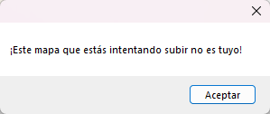

---
tags:
  - I can't submit my own beatmap!
  - beatmap submission system issues
  - ¡No puedo subir mi propio beatmap!
  - ¡No puedo subir mi propio mapa!
  - Problemas con el sistema de envío de beatmaps
---

# Cómo resolver problemas comunes del BSS

Al subir un beatmap, el **[sistema de envío de beatmaps](/wiki/Beatmapping/Beatmap_submission)** (***BSS***) puede impedir ocasionalmente que subas tu beatmap mostrando ciertas advertencias. Este artículo te ayudará a comprender estas advertencias y te guiará para solucionarlas.

## ¡El mapa que estás intentando subir no es tuyo!

::: Infobox

:::

Este es quizás el error más frecuente que ven los mappers, y suele estar causado por un parámetro mal configurado en el [archivo `.osu`](/wiki/Client/File_formats/osu_(file_format)), una caché defectuosa del envío o simplemente un cambio de nombre. Para resolver esta advertencia, sigue estos pasos:

1. Ve a la carpeta del beatmap.
   - Puedes acceder fácilmente a ella yendo a `Archivo` y luego a `Abrir la carpeta del mapa` en el [editor de beatmaps](/wiki/Client/Beatmap_editor).
2. Cierra osu!. Esto es para asegurarse de que todos los cambios se aplicarán correctamente.
3. Abre el archivo `.osu` de las dificultades con cualquier editor de texto (por ejemplo, el Bloc de notas).
4. Asegúrate de que tu nombre de usuario esté escrito correctamente en el campo `Creator`. Si no lo está, actualiza este campo con tu nombre de usuario actual.
5. Establece el campo `BeatmapID` en `0`.
6. Establece el campo `BeatmapSetID` en `-1`.
7. Asegúrate de que el nombre de la carpeta del beatmap no comience con una cadena de números. Si es así, cambia el nombre de la carpeta como corresponda.
   - Por ejemplo, `1000 - Nombre de la canción` debería renombrarse como `ABCDE - Nombre de la canción`.
8. Elimina todos los archivos de la carpeta `SubmissionCache`. De forma predeterminada, esta carpeta está oculta dentro del directorio de instalación de osu!, dentro de la carpeta `Data`.
   - [Este artículo](https://support.microsoft.com/es-es/windows/explorador-de-archivos-en-windows-ef370130-1cca-9dc5-e0df-2f7416fe1cb1) explica cómo abrir este archivo desde el explorador de archivos.
9. Vuelve a abrir osu! e intenta subir tu beatmap.

Ya deberías poder subir tu beatmap. Sin embargo, si sigues teniendo problemas, intenta seguir estos pasos:

1. Exporta el beatmap desde el editor de beatmaps yendo a `Archivo` y luego a `Exportar paquete`.
2. Sal del editor de beatmaps y elimina el beatmap en osu!.
3. Cierra osu!.
4. Ve al beatmap exportado y extrae su contenido.
   - Como alternativa, abre este archivo directamente con programas externos para archivos comprimidos, como [WinRAR](https://www.rarlab.com/) o [7-Zip](https://www.7-zip.org/).
5. Abre el archivo `.osu` de las dificultades con cualquier editor de texto (por ejemplo, el Bloc de notas).
6. Rellena el campo `Creator` con lo que quieras, pero **no** uses tu nombre de usuario.
7. Establece el campo `BeatmapID` en `0`.
8. Establece el campo `BeatmapSetID` en `-1`.
9. Una vez que hayas terminado, vuelve a empaquetar todos los archivos en un único archivo `.osz`.
10. Importa este archivo a osu! e intenta subir tu beatmap.

## Error durante la subida: Datos demasiado largos para la columna «xxx» en la fila «xx»

Esta advertencia aparece cuando una línea determinada del archivo `.osu` de alguna dificultad contiene demasiado texto, y se puede resolver siguiendo estos pasos:

1. Ve a la carpeta del beatmap.
   - Puedes acceder fácilmente a ella yendo a `Archivo` y luego a `Abrir la carpeta del mapa` en el [editor de beatmaps](/wiki/Client/Beatmap_editor).
2. Abre el archivo `.osu` de las dificultades con cualquier editor de texto. Para mayor comodidad, es recomendable usar un editor que incluya indicadores de línea (columnas), como por ejemplo, [Visual Studio Code](https://code.visualstudio.com/).
3. Ve a la línea del archivo `.osu` de la dificultad que se menciona en la advertencia.
4. Acorta el contenido de esta línea realizando los ajustes necesarios.
   - Si esta línea corresponde a los metadatos que se pueden modificar directamente a través del editor de beatmaps (por ejemplo, los nombres de las dificultades), acórtala directamente desde allí a través de la [ventana de configuración de las canciones](/wiki/Client/Beatmap_editor/Song_setup).
   - Si esta línea corresponde a un elemento externo (por ejemplo, imágenes de fondo), acorta el nombre del elemento en cuestión y actualiza esta línea como corresponda en tu editor de texto.
5. Guarda todos los cambios que hayas realizado e intenta subir tu beatmap.

Si los pasos anteriores no resuelven tu problema, o si tienes un problema completamente diferente, crea un nuevo tema en el [foro de ayuda](https://osu.ppy.sh/community/forums/5) con detalles sobre tu problema para que otros puedan ayudarte.
