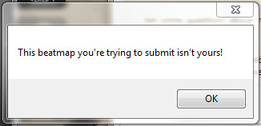

---
tags:
  - I can't submit my own beatmap!
  - beatmap submission system issues
---

# วิธีแก้ไขปัญหาที่พบบ่อยของระบบ BSS

เมื่อทำการส่ง Beatmap ระบบ **[Beatmap Submission System](/wiki/Beatmapping/Beatmap_submission)** (***BSS***) อาจระงับการอัปโหลดและแสดงคำเตือนบางอย่าง บทความนี้จะช่วยให้คุณเข้าใจคำเตือนเหล่านี้และแนะนำวิธีแก้ไขให้คุณ

## This beatmap you're trying to submit isn't yours! (Beatmap นี้ไม่ใช่ของคุณ!)

::: Infobox

:::

นี่อาจเป็นปัญหาที่เหล่า Mapper พบเจอบ่อยที่สุด ซึ่งมักเกิดจากการตั้งค่าพารามิเตอร์ใน [ไฟล์ .osu](/wiki/Client/File_formats/osu_(file_format)) ไม่ถูกต้อง, แคชการส่งข้อมูลผิดพลาด หรือแค่การเปลี่ยนชื่อผู้ใช้งาน หากต้องการแก้ไขคำเตือนนี้ ให้ทำตามขั้นตอนดังนี้:

1. ไปที่โฟลเดอร์ของ Beatmap นั้นๆ
   - คุณสามารถไปที่นั่นได้อย่างง่ายดายโดยคลิกที่ `File` แล้วเลือก `Open Song Folder` ใน [Beatmap Editor](/wiki/Client/Beatmap_editor)
2. ปิดเกม osu! เพื่อให้แน่ใจว่าการเปลี่ยนแปลงทั้งหมดจะถูกนำไปใช้ได้อย่างถูกต้อง
3. เปิดไฟล์ระดับความยาก (ไฟล์นามสกุล `.osu`) ด้วยโปรแกรมแก้ไขข้อความ (เช่น Notepad)
4. ตรวจสอบให้แน่ใจว่าชื่อผู้ใช้งานของคุณเขียนไว้อย่างถูกต้องในช่อง `Creator` หากไม่ถูกต้อง ให้แก้ไขเป็นชื่อปัจจุบันของคุณ
5. ตั้งค่าช่อง `BeatmapID` ให้เป็น `0`
6. ตั้งค่าช่อง `BeatmapSetID` ให้เป็น `-1`
7. ตรวจสอบให้แน่ใจว่าชื่อโฟลเดอร์ของ Beatmap ไม่ได้ขึ้นต้นด้วยชุดตัวเลข หากมีตัวเลขให้นำออกหรือเปลี่ยนชื่อโฟลเดอร์ใหม่
   - ตัวอย่างเช่น `1000 - Song Name` ควรเปลี่ยนชื่อเป็น `ABCDE - Song Name` เป็นต้น
8. ลบไฟล์ทั้งหมดในโฟลเดอร์ `SubmissionCache` โดยปกติโฟลเดอร์นี้จะถูกซ่อนอยู่ในไดเรกทอรี `Data` ของตำแหน่งที่คุณติดตั้ง osu!
   - [บทความนี้](https://support.microsoft.com/en-au/windows/file-explorer-in-windows-ef370130-1cca-9dc5-e0df-2f7416fe1cb1) จะอธิบายวิธีเปิดไฟล์ที่ถูกซ่อนจาก File Explorer
9. เปิด osu! อีกครั้งและลองอัปโหลด Beatmap ของคุณ

ตอนนี้คุณควรจะส่ง Beatmap ได้แล้ว แต่หากยังพบปัญหาอยู่ ให้ลองทำตามขั้นตอนเหล่านี้เพิ่มเติม:

1. ทำการ Export Beatmap จากใน Editor โดยไปที่ `File` แล้วเลือก `Export Package`
2. ออกจาก Editor และลบ Beatmap นั้นทิ้งในเกม osu!
3. ปิดเกม osu!
4. ไปที่ไฟล์ Beatmap ที่ Export ออกมาแล้วทำการแตกไฟล์ (Extract)
   - หรือเปิดไฟล์โดยตรงโดยใช้โปรแกรมจัดการไฟล์บีบอัด เช่น [WinRAR](https://www.rarlab.com/) หรือ [7-Zip](https://www.7-zip.org/)
5. เปิดไฟล์ระดับความยาก (ไฟล์นามสกุล `.osu`) ด้วยโปรแกรมแก้ไขข้อความ
6. ใส่ชื่ออะไรก็ได้ลงในช่อง `Creator` แต่**ห้าม**ใช้ชื่อผู้ใช้งานของคุณ
7. ตั้งค่าช่อง `BeatmapID` ให้เป็น `0`
8. ตั้งค่าช่อง `BeatmapSetID` ให้เป็น `-1`
9. เมื่อเสร็จแล้ว ให้รวมไฟล์ทั้งหมดกลับเป็นไฟล์นามสกุล `.osz` เพียงไฟล์เดียว
10. นำไฟล์นี้เข้าสู่ osu! (Import) และลองอัปโหลด Beatmap ของคุณอีกครั้ง

## Error during upload: Data too long for column "xxx" at row "xx"

คำเตือนนี้เกิดขึ้นเมื่อบรรทัดบางบรรทัดในไฟล์ `.osu` มีข้อความยาวเกินไป สามารถแก้ไขได้ตามขั้นตอนดังนี้:

1. ไปที่โฟลเดอร์ของ Beatmap
   - เข้าไปได้ง่ายๆ โดยไปที่ `File` และ `Open Song Folder` ใน [Beatmap Editor](/wiki/Client/Beatmap_editor)
2. เปิดไฟล์ระดับความยาก (`.osu`) ด้วยโปรแกรมแก้ไขข้อความ เพื่อความสะดวกแนะนำให้ใช้โปรแกรมที่มีตัวบ่งชี้หมายเลขบรรทัด เช่น [Visual Studio Code](https://code.visualstudio.com/)
3. ไปที่บรรทัดในไฟล์ที่ระบุไว้ในคำเตือน
4. ย่อเนื้อหาในบรรทัดนั้นให้สั้นลงตามความเหมาะสม
   - หากบรรทัดนั้นเกี่ยวกับ Metadata ที่สามารถแก้ไขได้ใน Editor (เช่น ชื่อระดับความยาก) ให้ไปแก้ให้สั้นลงโดยตรงผ่านหน้าต่าง `Song Setup`
   - หากบรรทัดนั้นเกี่ยวกับไฟล์ภายนอก (เช่น ชื่อภาพพื้นหลัง) ให้เปลี่ยนชื่อไฟล์นั้นให้สั้นลงและอัปเดตชื่อในไฟล์ข้อความให้ตรงกัน
5. บันทึกการเปลี่ยนแปลงทั้งหมดและลองอัปโหลด Beatmap ของคุณอีกครั้ง

หากขั้นตอนข้างต้นยังไม่สามารถแก้ปัญหาได้ หรือหากคุณพบปัญหาอื่นที่ต่างออกไป โปรดสร้างกระทู้ใหม่ใน [Help forum](https://osu.ppy.sh/community/forums/5) พร้อมรายละเอียดของปัญหาเพื่อให้ผู้อื่นสามารถช่วยเหลือคุณได้