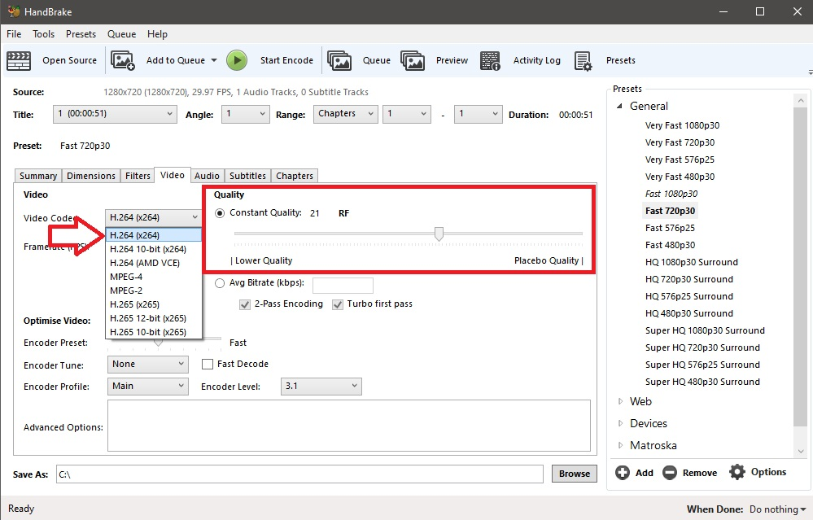

<!-- TODO: outdated because a lot of the tools mentioned here are dated and there are better alternatives -->

# File compression guide

*This article was adapted from [a forum thread by ziin](https://osu.ppy.sh/community/forums/topics/60002).*

Each osu! beatmapset has a file size limit dictated by its beatmaps' total lengths. This guide will help you to get your beatmap under that limit.

There are 2 types of compression. **Lossy** and **Lossless** compression.

- **Lossless** implies that the quality never degrades and can be repeatedly compressed or decompressed.
- **Lossy** is a much more powerful form of compression which sacrifices quality for space/processor demand.

## Video

Videos are usually where people go wrong. There are thousands of video codecs out there, and *believe it or not, YouTube is usually a terrible place to get videos*.

H.264 is a very good codec to use but like most video codecs, it is lossy. So do not re-encode multiple times, but encode from the high resolution source.

### Step-By-Step Guide

#### Removing audio from video

This section will show you how to remove audio from videos using [Handbrake](https://handbrake.fr/) to reduce the file size of the video file.

1. Open Handbrake and import your video file. You can drag and drop your file into Handbrake or manually import by clicking the File option.

2. Select Audio and remove any audio tracks in the video file. Do the same for any subtitles by going into the Subtiltes tab and removing any entries.

#### Encoding Video

This section will show you how to compress the video in the file.

1. Set the preset to "Fast 720p30".

2. Go into the Video tab and select the video codec as "H.264 (X264)" and change the Constant Quality to something around 20 or 25. Smaller values mean smaller files but you will lose quality. Higher values on the other hand create bigger files but have higher quality.

3. Change the Framerate to 30.

4. To resize the image of the video file, go to Dimensions and change the Width to "1280" and change the Height to "720".

5. Lasty, pick the file you want to save your result to, then click Start Encode.

## Audio

The audio bitrate determines a lot about the size of the audio file. Anything above 192kbps or under 128kbps is not allowed. You can use [Audacity](https://www.audacityteam.org/) to change the bitrate of your audio files.

1. Import the audio file into Audacity.

2. Export the audio as MP3. Change the export options to help compress your file. Use Preset and select the Quality as "Medium, 145-185 kbps". If you want, you can enter in the metadata in the next dialog. If you don't want to, just click OK.

