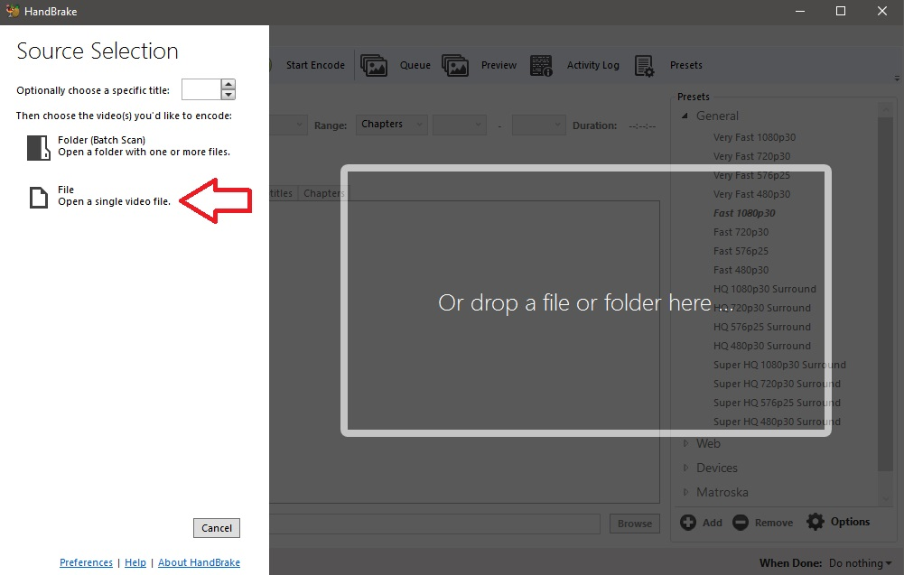
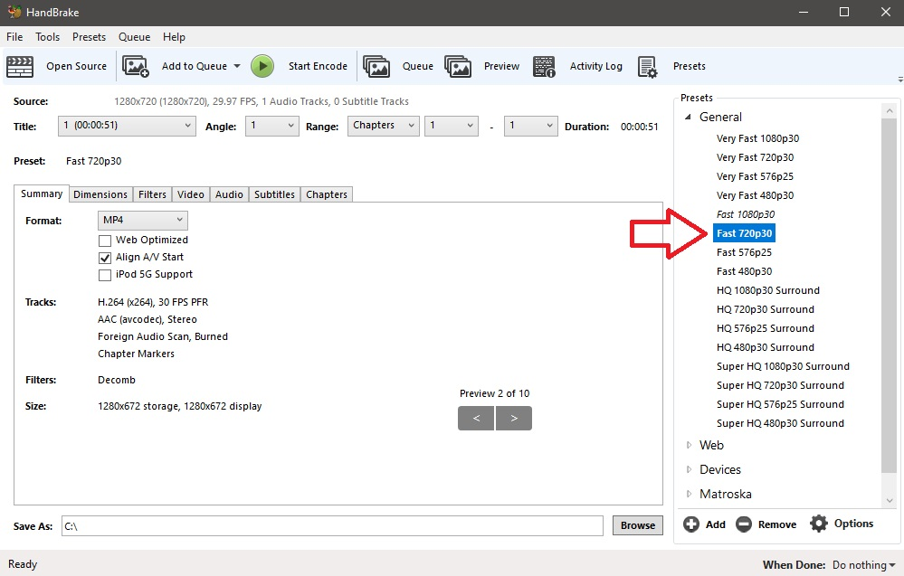
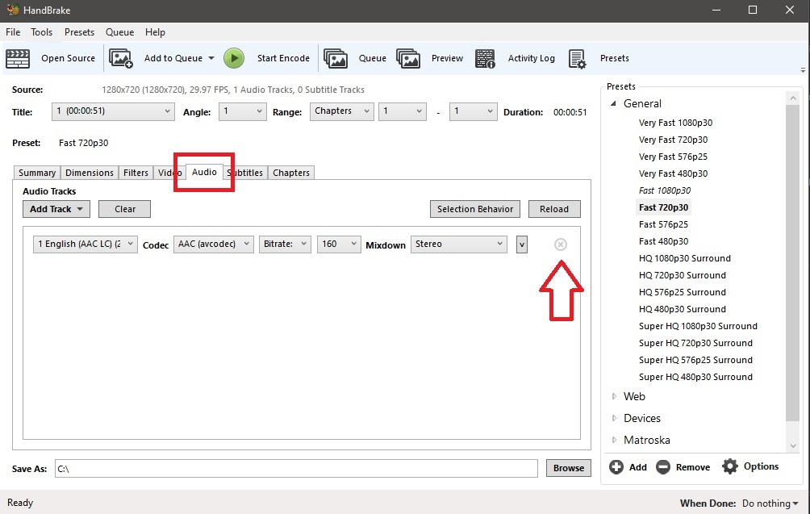
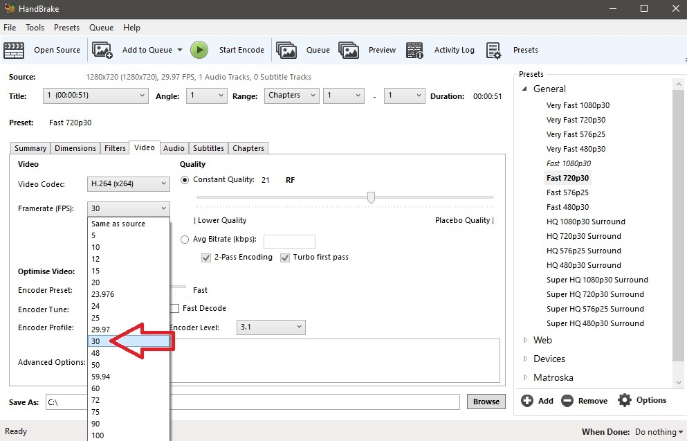
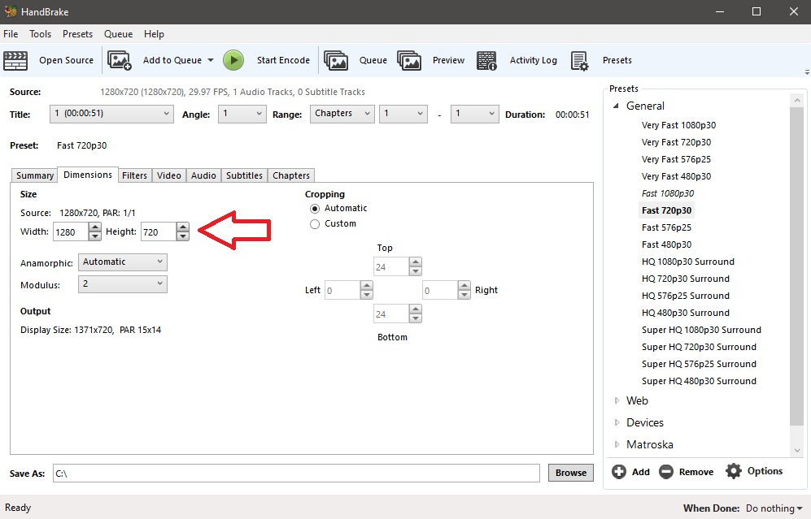
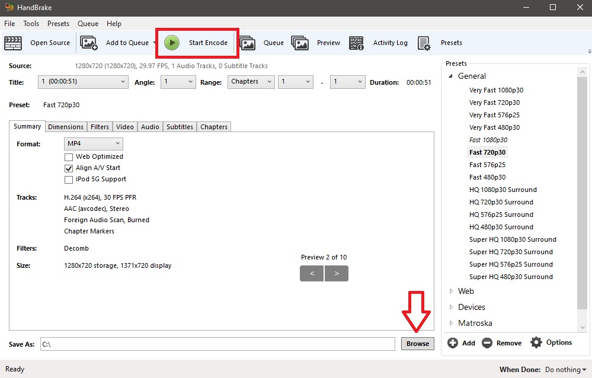
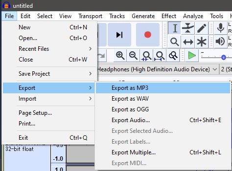
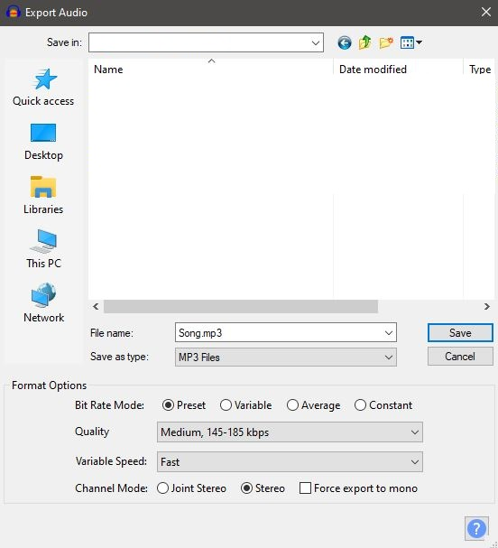

# Compressing files

Each beatmap has a file size limit dictated by its total length. This guide will help you to get your beatmap under that limit.

There are 2 types of compression. **Lossy** and **Lossless** compression.

- **Lossless** implies that the quality never degrades and can be repeatedly compressed or decompressed.
- **Lossy** is a much more powerful form of compression which sacrifices quality for space/processor demand.

## Video

Videos are usually where people go wrong. There are thousands of video codecs out there, and *believe it or not, YouTube is usually a terrible place to get videos*.

H.264 is a good codec to use but like most video codecs, it is lossy. This means you want to avoid re-encoding the video multiple times, but instead encode from the high resolution source once.

### Using Handbrake

This section will show you how to remove audio from videos using [Handbrake](https://handbrake.fr/) to reduce the file size of the video file.

1. Open Handbrake and import your video file. You can drag and drop your file into Handbrake or manually import by clicking the `File` option.

2. Select the `Fast 720p30` preset.

3. Select the `Audio` tab and remove all audio tracks. Do the same for any subtitles by going into the `Subtitles` tab and removing all entries.

4. Go into the `Video` tab and set the video codec as `H.264 (X264)`. Change the `Constant Quality` to between 20–25. Smaller values will produce smaller file sizes at the cost of the video's quality.

5. Set the framerate to `30`.

6. To resize the image of the video file, go to the `Dimensions` tab and change the width to `1280` and change the height to `720`.

7. Lastly, pick the file location you want to save your result to, then click `Start Encode`.

## Audio

The audio bitrate determines a lot about the size of the audio file. You can use [Audacity](https://www.audacityteam.org/) to change the bitrate of your audio files.

The [Ranking Criteria](/wiki/Ranking_Criteria#audio) has a rule noting that anything above 192kbps is not allowed. In addition to this, anything under 128kbps is usually considered to be low quality.

1. Import the audio file into Audacity.

2. Export the audio as MP3.

3. Change the export options to help compress your file. Use `Preset` and select the quality as `Medium, 145-185 kbps`. If you want, you can enter in the metadata in the next dialog. When ready, click `OK`.

