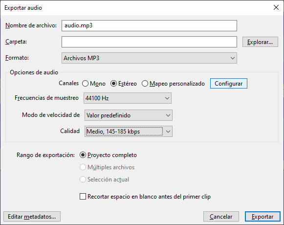

# Compresión de archivos

Cada beatmap tiene un [límite para el tamaño de archivo](/wiki/Beatmapping/Beatmap_submission#limitaciones) dictado por su longitud total, y cualquier contenido de [vídeo](/wiki/Ranking_criteria#vídeo-y-fondo) y [audio](/wiki/Ranking_criteria#audio) debe cumplir los requisitos de formato, resolución y tasa de bits.

Esta guía te ayudará a que tu beatmap no supere ese límite y cumpla esos requisitos.

## Introducción

Hay 2 tipos de compresión, **sin pérdida** y **con pérdida**:

- La compresión **sin pérdida** implica que la calidad nunca se degrada y, por lo tanto, se puede comprimir y descomprimir repetidamente
- La compresión **con pérdida** usa ciertas técnicas poderosas para reducir en gran medida el tamaño del archivo a expensas de la calidad

El proceso de conversión entre formatos de audio y vídeo, para reducir el tamaño del archivo, la tasa media de bits o la resolución, se denomina **recodificación** o **transcodificación**. La recodificación de un audio o vídeo ya comprimidos con pérdida puede dar lugar a distintos grados de reducción de la calidad, en función de los ajustes usados.

Por ese motivo, se debe evitar la recodificación, excepto si el archivo de audio o vídeo original es cualquiera de los siguientes:

- Tamaño de archivo demasiado grande
- Resolución o tasa de bits demasiado alta
- Codificado en un formato incompatible

En caso de que sea necesario volver a codificar, se sugiere usar el archivo fuente de mayor calidad disponible; es decir, con la resolución y/o tasa de bits más alta.

## Vídeo

**osu! es compatible con vídeos codificados en formato H.264 con la extensión de archivo `.mp4`.** Otros formatos, como H.265, VP9 y AV1, y extensiones de archivo como `.mkv` y `.mov`, no son compatibles por el momento.

**Los [criterios de clasificación](/wiki/Ranking_criteria#vídeo-y-fondo) especifican una resolución de vídeo máxima de 1280x720 píxeles.**

### Usar Handbrake

Para empezar, descarga e instala [Handbrake](https://handbrake.fr/), luego sigue estos pasos:

1. Abre Handbrake e importa tu archivo de vídeo de cualquiera de las siguientes formas:
   - Arrastra y suelta el archivo en Handbrake.
   - Haciendo clic en la opción `Archivo`, luego seleccionando el archivo a importar.


2. Selecciona el preajuste `Fast 720p30`.


3. Selecciona la pestaña `Audio` y elimina todas las pistas de audio. Haz lo mismo con los subtítulos entrando en la pestaña `Subtítulos` y eliminando todas las opciones.


4. Ve a la pestaña `Vídeo` y usa la siguiente configuración:
   - Establece `Codificador de vídeo` en `H.264 (x264)` para codificar en formato H.264 usando el codificador x264
   - Establece `Fotogramas (FPS)` en `Same as source` con `Velocidad de fotogramas constante` seleccionado
   - Establece un valor entre 20 y 25 para `Calidad constante`. Un valor más pequeño dará como resultado archivos más grandes y de mayor calidad
5. Dependiendo del tiempo que estés dispuesto a dedicar a la codificación, cambia `Preajuste de codificador` en `Opciones de codificador` (se recomienda `Veryslow`). Los preajustes más lentos dan como resultado una mejor calidad de vídeo y también pueden reducir el tamaño del archivo de vídeo.
   - No uses el preajuste `Placebo`, ya que tarda mucho más en codificar que `Veryslow` a cambio de muy poca mejora en la calidad o el tamaño del archivo.


6. Para cambiar el tamaño de la imagen del archivo de vídeo, ve a la pestaña `Dimensiones` y cambia la anchura a `1280` y la altura a `720`.


7. Por último, elige la ubicación en la que quieres guardar el resultado y haz clic en `Iniciar codificación`.


### Usar FFmpeg

FFmpeg es un programa que se usa a través de una [interfaz de línea de comandos](https://es.wikipedia.org/wiki/Interfaz_de_línea_de_comandos), lo que significa que no tiene ninguna interfaz gráfica por sí mismo. Si bien esto puede parecer intimidante, FFmpeg puede ofrecer más flexibilidad que otras herramientas, por ejemplo cuando se integra en un script.

Para instalar FFmpeg en Windows, [descarga FFmpeg](https://ffmpeg.org/download.html) y añade su directorio a tu variable de entorno `PATH`. En macOS, también puedes instalarlo usando el administrador de paquetes [brew](https://brew.sh/). En Linux, la mayoría de las distribuciones de Linux ya proporcionan o preinstalan FFmpeg de forma predeterminada (si no, investiga sobre la distribución que usas para obtener más información).

Para usar FFmpeg para recodificar un archivo de vídeo, abre un terminal y pega el siguiente comando, cambiando los valores según sea necesario:

```
ffmpeg -i input -c:v libx264 -crf 20 -preset veryslow -vf scale=-1:720 -an -sn -map_metadata -1 -map_chapters -1 output.mp4
```

- `-i input`: Tu archivo fuente. Si el nombre del archivo contiene espacios, ponlo entre comillas dobles (`"`)
- `-c:v libx264`: Especifica que el vídeo debe codificarse usando el codificador x264, lo que producirá un vídeo en formato H.264
- `-crf 20`: La calidad de compresión, donde los valores más bajos dan mejor calidad a costa de archivos más grandes y viceversa. El rango recomendado es alrededor de 20-25
- `-preset veryslow`: Especifica un preajuste de codificación, con valores recomendados que van de `ultrafast` a `veryslow`. Los preajustes más lentos permiten al codificador ofrecerte mayor calidad con la misma tasa de bits, o menor tasa de bits con la misma calidad. Puedes encontrar más información sobre los preajustes disponibles en [el sitio web oficial de FFmpeg](https://trac.ffmpeg.org/wiki/Encode/H.264#Preset)
- `-vf scale=-1:720`: Reduce la escala del vídeo a una altura de 720 píxeles. El `-1` permite a FFmpeg determinar automáticamente el ancho del nuevo vídeo según la relación de aspecto de la fuente
- `-an -sn`: Elimina el audio y los subtítulos si están presentes
- `-map_metadata -1 -map_chapters -1`: Elimina los metadatos y los capítulos si están presentes
- `output.mp4`: Tu archivo de salida. Si el nombre del archivo contiene espacios, ponlo entre comillas dobles (`"`)

## Audio

**El audio codificado en formatos MP3 u OGG (Vorbis) es compatible con las extensiones de archivo `.mp3` y `.ogg`, respectivamente.** Por el momento, no son compatibles otros formatos (excepto los archivos de audio con extensión `.wav` para los hitsounds).

En general, OGG (Vorbis) ofrece una mejor calidad que MP3 para una tasa de bits determinada.

**Los [criterios de clasificación](/wiki/Ranking_criteria#audio) especifican que la tasa de bits media debe estar entre 192kbps y 128kbps.** Como referencia, las canciones de los [artistas destacados](/wiki/People/Featured_Artists) incluidas en las plantillas están codificadas con una tasa de bits constante de 192kbps.

### Usar Audacity

*Véase: [Guía de edición de audio](/wiki/Guides/Audio_editing#audacity)*

Para empezar, descarga e instala [Audacity](https://www.audacityteam.org/), luego sigue estos pasos:

1. Abre Audacity e importa el archivo de audio a Audacity.


2. Exporta el audio en formato MP3 u OGG.



3. Cambia las opciones de exportación para comprimir tu archivo, dependiendo del formato seleccionado:
   - Para MP3, usa `Valor predefinido` y selecciona `Medio, 145-185 kbps` para la calidad
   - Para OGG (Vorbis), mantén el control deslizante de `Calidad` en `5`, que es el valor predeterminado
4. Selecciona la ubicación de destino y haz clic en `Guardar`. En la esquina inferior izquierda puedes introducir los metadatos del archivo de audio.


5. Una vez introducidos los metadatos, que se pueden dejar en blanco si se desea, haz clic en `Aceptar` para iniciar la recodificación.

### Usar FFmpeg

*Para obtener instrucciones sobre la instalación de FFmpeg, véase: [Vídeo/Usar FFmpeg](#usar-ffmpeg)*

Después de instalar FFmpeg, abre un terminal y usa uno de los siguientes comandos.

Para codificar en formato MP3, pega el siguiente comando en tu terminal y cambia estos valores según sea necesario:

```
ffmpeg -i input -c:a libmp3lame -q:a 4 -vn -sn -map_metadata -1 -map_chapters -1 output.mp3
```

- `-i input`: Tu archivo fuente. Si el nombre del archivo contiene espacios, ponlo entre comillas dobles (`"`)
- `-c:a libmp3lame`: Especifica que el audio debe codificarse usando el codificador LAME MP3
- `-q:a 4`: Usa el mismo rango de tasa de bits variable que en el ejemplo de Audacity, **donde un número menor significa una mayor tasa de bits**. Si quieres una tasa de bits constante, usa, por ejemplo, `-b:a 128k` para una tasa constante de 128kbps
- `-vn -sn`: Elimina el vídeo y los subtítulos si están presentes
- `-map_metadata -1 -map_chapters -1`: Elimina los metadatos y los capítulos si están presentes
- `output.mp3`: Tu archivo de salida. Si el nombre del archivo contiene espacios, ponlo entre comillas dobles (`"`)

Para codificar en formato OGG (Vorbis), pega el siguiente comando en tu terminal y cambia estos valores según sea necesario:

```
ffmpeg -i input -c:a libvorbis -q:a 5 -vn -sn -map_metadata -1 -map_chapters -1 output.ogg
```

- `-i input`: Tu archivo fuente. Si el nombre del archivo contiene espacios, ponlo entre comillas dobles (`"`)
- `-c:a libvorbis`: Especifica que el audio debe codificarse usando el codificador libvorbis
- `-q:a 5`: Usa el mismo rango de tasa de bits variable que en el ejemplo de Audacity, **donde un número más alto significa una mayor tasa de bits**. Si quieres una tasa de bits constante, usa, por ejemplo, `-b:a 128k` para una tasa constante de 128kbps
- `-vn -sn`: Elimina el vídeo y los subtítulos si están presentes
- `-map_metadata -1 -map_chapters -1`: Elimina los metadatos y los capítulos si están presentes
- `output.ogg`: Tu archivo de salida. Si el nombre del archivo contiene espacios, ponlo entre comillas dobles (`"`)

## Verificación

Se recomienda comprobar la información técnica de los archivos de audio y vídeo recodificados para confirmar que cumplen tus expectativas.

### Usar MediaInfo

[MediaInfo](https://mediaarea.net/en/MediaInfo) es muy fácil de usar. Después de instalarlo, abre el archivo con MediaInfo y aparecerá la información técnica sobre ese archivo.

1. Haz clic con el botón derecho en cualquier archivo y selecciona MediaInfo en el menú contextual, o usa `Archivo` -> `Abrir` -> `Archivo` en MediaInfo.
2. Cambia la vista de `Básico` a `Árbol`, `Texto`, o `HTML`. La vista `Básico` predeterminada solo muestra una serie condensada de información.

Campos relevantes para los archivos de vídeo:

- `Formato` y `Formato/Info`, que deben ser `AVC` y `Advanced Video Codec`, respectivamente
- `Ancho`, que debe ser igual o inferior a `1280 píxeles`
- `Alto`, que debe ser igual o inferior a `720 píxeles`
- `Modo de velocidad de fotogramas`, que debe ser `Constante`

Campos relevantes para los archivos de audio:

- `Tasa de bits general`, que debe estar entre 192 kbps y 128 kbps, como se especifica en los criterios de clasificación
- Para MP3, asegúrate de buscar:
  - `Formato`, que debe ser `MPEG Audio`
  - `Formato de la versión`, que debe ser `Version 1`
  - `Formato del perfil`, que debe ser `Layer 3`
- Para OGG (Vorbis), asegúrate de buscar:
  - `Formato`, que debe ser `OGG` y `Vorbis`

Si todo parece correcto y el tamaño del archivo es lo suficientemente pequeño, entonces puedes poner el archivo de audio o vídeo recodificado en tu beatmap.
