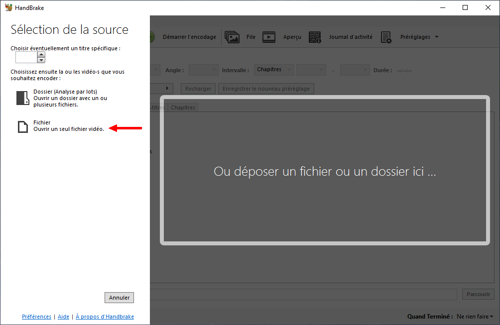
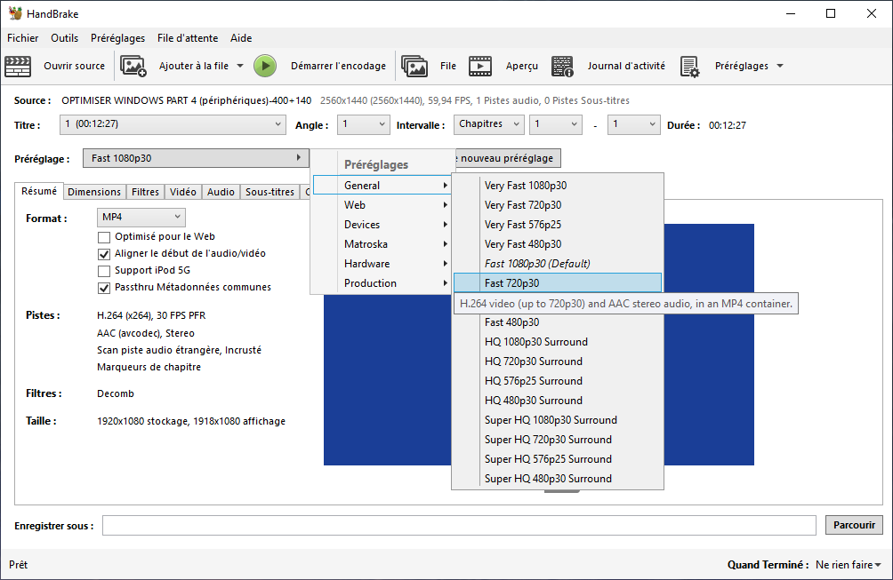
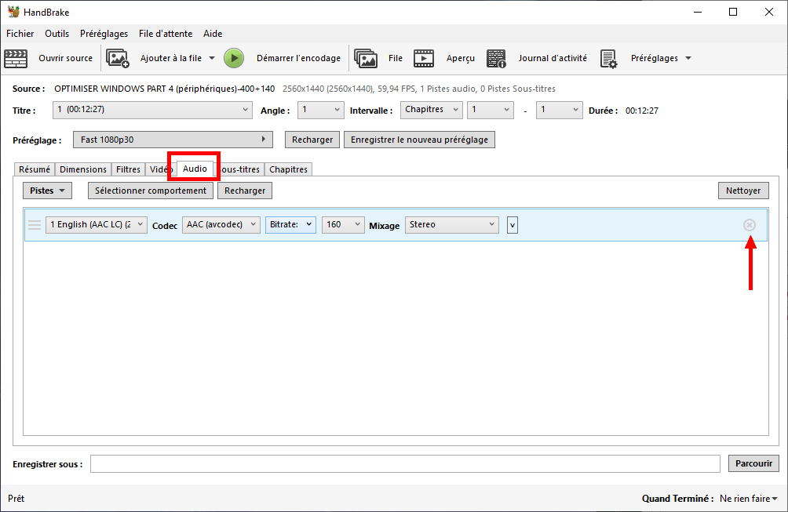
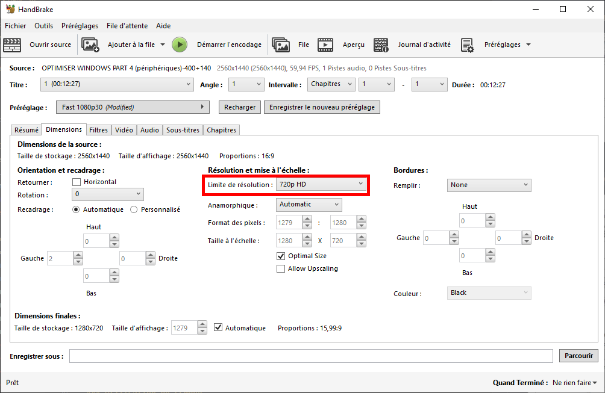
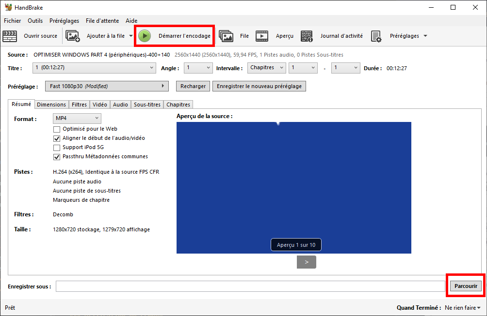
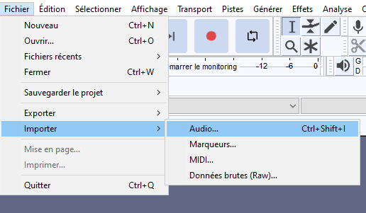
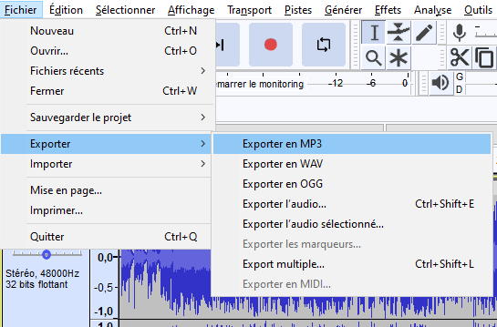
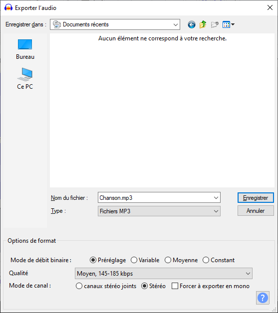

# Compression des fichiers

Chaque beatmap a une [limite de taille de fichier](/wiki/Beatmapping/Beatmap_submission#limites) déterminée par sa longueur totale, et tout contenu [vidéo](/wiki/Ranking_criteria#vidéo-et-arrière-plan) et [audio](/wiki/Ranking_criteria#audio) doit respecter les exigences en matière de format, de résolution et de débit binaire.

Ce guide vous aidera à faire passer votre beatmap en dessous de cette limite et à répondre à ces exigences.

## Introduction

Il existe deux types de compression, **sans perte** et **avec perte** :

- **La compression sans perte** implique que la qualité ne se dégrade jamais et qu'elle peut donc être compressée et décompressée à plusieurs reprises.
- **La compression avec perte** utilise certaines techniques puissantes pour réduire considérablement la taille des fichiers au détriment de la qualité.

Le processus de conversion entre les formats audio et vidéo, pour réduire la taille du fichier, le débit moyen ou la résolution, est appelé **réencodage** ou **transcodage**. Le réencodage d'un fichier audio ou vidéo déjà compressé avec perte à l'aide de la compression avec perte peut entraîner une réduction supplémentaire de la qualité plus ou moins importante, en fonction des paramètres utilisés.

Pour cette raison, le réencodage doit être évité, sauf si le fichier audio ou vidéo d'origine présente l'une des caractéristiques suivantes :

- Fichier trop volumineux
- Résolution ou débit binaire moyen trop élevé
- Encodée dans un format incompatible

Si un réencodage est nécessaire, il est conseillé d'utiliser le fichier source de la plus haute qualité disponible, c'est-à-dire avec la résolution et/ou le débit binaire les plus élevés.

## Vidéo

**osu! prend en charge les vidéos encodées au format H.264 avec l'extension de fichier `.mp4`.** D'autres formats, tels que H.265, VP9 et AV1, et des extensions de fichier telles que `.mkv` et `.mov`, ne sont pas pris en charge actuellement.

**Les [critères de classement](/wiki/Ranking_criteria#vidéo-et-arrière-plan) spécifient une résolution vidéo maximale de 1280x720 pixels.**

### Utilisation de Handbrake

Pour commencer, téléchargez et installez [Handbrake](https://handbrake.fr/), puis suivez les étapes suivantes :

1. Ouvrez Handbrake, puis importez votre fichier vidéo de l'une des manières suivantes :
   - Glisser-déposer le fichier dans Handbrake, ou
   - Cliquez sur l'option `Fichier`, puis sélectionnez le fichier à importer.



2. Sélectionnez le préréglage `Fast 720p30`.



3. Sélectionnez l'onglet `Audio` et supprimez toutes les pistes audio. Faites de même pour les sous-titres en allant dans l'onglet `Sous-titres` et en supprimant toutes les entrées.



4. Allez dans l'onglet `Vidéo` et utilisez les paramètres suivants :
   - `Encodeur vidéo` défini sur `H.264 (x264)` pour encoder au format H.264 à l'aide de l'encodeur x264
   - `Framerate (FPS)` défini sur `Same as source` avec `Framerate constant` sélectionné
   - `Qualité constante` défini sur une valeur comprise entre 20 et 25. Une valeur plus faible permet d'obtenir des fichiers plus volumineux et de meilleure qualité.
5. En fonction du temps que vous êtes prêt à consacrer à l'encodage, changez le `Préréglage de l'encodeur` sous `Options de l'encodeur` (`Veryslow` est recommandé). Les préréglages plus lents permettent d'obtenir une meilleure qualité vidéo et peuvent également réduire la taille du fichier vidéo.
   - N'utilisez pas le preset `Placebo`, car il prend beaucoup plus de temps à encoder que `Veryslow` pour une très faible amélioration de la qualité ou de la taille du fichier.


6. Pour redimensionner l'image du fichier vidéo, allez dans l'onglet `Dimensions` et changez la largeur à `1280` et la hauteur à `720`.



7. Enfin, choisissez l'emplacement où vous souhaitez enregistrer votre résultat, puis cliquez sur `Démarrer l'encodage`.



### Utilisation de FFmpeg

FFmpeg est un programme utilisé à travers une [interface de ligne de commande (ILC)](https://fr.wikipedia.org/wiki/Interface_en_ligne_de_commande), ce qui signifie qu'il n'a pas d'interface graphique. Bien que cela puisse sembler intimidant, FFmpeg peut offrir plus de flexibilité que d'autres outils, par exemple lorsqu'il est intégré à un script.

Pour installer FFmpeg sous Windows, [télécharger FFmpeg](https://ffmpeg.org/download.html) et ajoutez son répertoire à votre variable d'environnement `PATH`. Sur macOS, vous pouvez également l'installer en utilisant le gestionnaire de paquets [brew](https://brew.sh/fr/). Sous Linux, la plupart des distributions Linux fournissent ou pré-installent FFmpeg par défaut (si ce n'est pas le cas, faites des recherches sur la distribution que vous utilisez pour plus d'informations).

Pour utiliser FFmpeg afin de réencoder un fichier vidéo, ouvrez un terminal et collez la commande suivante, en modifiant les valeurs si nécessaire :

```
ffmpeg -i input -c:v libx264 -crf 20 -preset veryslow -vf scale=-1:720 -an -sn -map_metadata -1 -map_chapters -1 output.mp4
```

- `-i input` :  Votre fichier source. Si le nom du fichier contient des espaces, mettez-le entre guillemets (`"`).
- `-c:v libx264` : Indique que la vidéo doit être encodée à l'aide de l'encodeur x264, ce qui produit une vidéo au format H.264.
- `-crf 20` : La qualité de la compression, où des valeurs plus faibles donnent une meilleure qualité au dépend de fichiers plus grands et vice versa. La plage recommandée est d'environ 20-25.
- `-preset veryslow` : Spécifie un préréglage d'encodage, avec des valeurs recommandées allant de `ultrafast` à `veryslow`. Les préréglages plus lents permettent à l'encodeur de vous donner une meilleure qualité pour le même débit, ou un débit plus faible pour la même qualité. Vous trouverez plus d'informations sur les préréglages disponibles sur le [site officiel de FFmpeg](https://trac.ffmpeg.org/wiki/Encode/H.264#Preset).
- `-vf scale=-1:720` : Réduit l'échelle de la vidéo à une hauteur de 720 pixels. Le `-1` permet à FFmpeg de déterminer automatiquement la largeur de la nouvelle vidéo en se basant sur le format de la source.
- `-an -sn` : Supprime le son et les sous-titres s'ils sont présents.
- `-map_metadata -1 -map_chapters -1` : Supprime les métadonnées et les chapitres s'ils sont présents.
- `output.mp4` : Votre fichier de sortie. Si le nom du fichier contient des espaces, mettez-le entre guillemets (`"`).

## Audio

**Les fichiers audio encodés au format MP3 ou OGG (Vorbis) sont pris en charge avec les extensions de fichier `.mp3` et `.ogg`, respectivement.** Les autres formats ne sont actuellement pas pris en charge (à l'exception des fichiers audio portant l'extension `.wav` pour les hitsounds).

En général, le OGG (Vorbis) offre une meilleure qualité que le MP3 pour un débit binaire donné.

**Les [critères de classement](/wiki/Ranking_criteria#audio) précisent que le débit moyen doit être compris entre 192kbps et 128kbps.** À titre de référence, les chansons des [Featured Artists](/wiki/People/Featured_Artists) incluses dans les modèles de beatmap sont encodées avec un débit constant de 192 kbps.

### Utilisation de Audacity

*Voir également : [Guide d'édition audio](/wiki/Guides/Audio_editing#audacity)*

Pour commencer, téléchargez et installez [Audacity](https://www.audacityteam.org/), puis suivez les étapes suivantes :

1. Ouvrez Audacity, puis importez le fichier audio.



2. Exporter l'audio au format MP3 ou OGG.



3. Modifiez les options d'exportation pour compresser votre fichier, en fonction du format sélectionné :
   - Pour les MP3, utilisez `Préréglage` et sélectionnez la qualité `Moyen, 145-185 kbps`.
   - Pour OGG (Vorbis), conserver le curseur `Qualité` sur `5`, qui est la valeur par défaut.
4. Sélectionnez l'emplacement de sortie et cliquez sur `Enregistrer`, et une nouvelle boîte de dialogue apparaîtra pour vous permettre d'entrer les métadonnées audio.



5. Une fois les métadonnées saisies, qui peuvent être laissées vides si vous le souhaitez, cliquez sur `OK` pour commencer le réencodage.

*Note : Cliquer sur `Annuler` dans la boîte de dialogue des métadonnées interrompt le processus de réencodage.*

### Utilisation de FFmpeg

*Pour des instructions sur l'installation de FFmpeg, consultez : [Vidéo/Utilisation de FFmpeg](/wiki/Guides/Compressing_files#utilisation-de-ffmpeg)*

Après avoir installé FFmpeg, ouvrez un terminal, puis utilisez l'une des commandes suivantes.

Pour encoder au format MP3, collez la commande suivante dans votre terminal et modifiez ces valeurs si nécessaire :

```
ffmpeg -i input -c:a libmp3lame -q:a 4 -vn -sn -map_metadata -1 -map_chapters -1 output.mp3
```

- `-i input` : Votre fichier source. Si le nom du fichier contient des espaces, mettez-le entre guillemets (`"`).
- `-c:a libmp3lame` : Spécifie que l'audio doit être encodé à l'aide de l'encodeur LAME MP3.
- `-q:a 4` : Utilise la même plage de débit variable que dans l'exemple d'Audacity, **où un nombre inférieur signifie un débit plus élevé.** Si vous voulez un débit constant, vous devez utiliser par exemple `-b:a 128k` pour un débit constant de 128kbps.
- `-vn -sn` : Supprime la vidéo et les sous-titres s'ils sont présents.
- `-map_metadata -1 -map_chapters -1` : Supprime les métadonnées et les chapitres s'ils sont présents.
- `output.mp3` : Votre fichier de sortie. Si le nom du fichier contient des espaces, mettez-le entre guillemets (`"`).

Pour encoder au format OGG (Vorbis), collez la commande suivante dans votre terminal et modifiez ces valeurs si nécessaire :

```
ffmpeg -i input -c:a libvorbis -q:a 5 -vn -sn -map_metadata -1 -map_chapters -1 output.ogg
```

- `-i input` : Votre fichier source. Si le nom du fichier contient des espaces, mettez-le entre guillemets (`"`).
- `-c:a libvorbis` : Spécifie que l'audio doit être encodé en utilisant l'encodeur libvorbis.
- `-q:a 5` : Utilise la même plage de débit variable que dans l'exemple d'Audacity, **où un nombre inférieur signifie un débit plus élevé.** Si vous voulez un débit constant, vous devez utiliser par exemple `-b:a 128k` pour un débit constant de 128kbps.
- `-vn -sn` : Supprime la vidéo et les sous-titres s'ils sont présents.
- `-map_metadata -1 -map_chapters -1` : Supprime les métadonnées et les chapitres s'ils sont présents.
- `output.ogg` : Votre fichier de sortie. Si le nom du fichier contient des espaces, mettez-le entre guillemets (`"`).

## Vérification

Il est recommandé de vérifier les informations techniques des fichiers audio et vidéo réencoder pour s'assurer qu'ils répondent à vos attentes.

### Utilisation de MediaInfo

[MediaInfo](https://mediaarea.net/fr/MediaInfo) est très facile à utiliser. Après l'installation, ouvrez le fichier avec MediaInfo et les informations techniques concernant ce fichier apparaîtront.

1. Faites un clic droit sur n'importe quel fichier et sélectionnez MediaInfo dans le menu contextuel, ou utilisez `Fichier` -> `Ouvrir` -> `Fichier` dans MediaInfo.
2. Changez la vue de `Basique` à `Arbre`, `Texte`, ou `HTML`. La vue `Basique` par défaut n'affiche qu'une série condensée d'informations.

Champs utiles pour les fichiers vidéo :

- `Format` et `Format/Info`, qui doivent être respectivement `AVC` et `Advanced Video Codec`.
- `Largeur`, qui doit être inférieure ou égale à `1280 pixels`.
- `Hauteur`, qui doit être inférieure ou égale à `720 pixels`.
- `Type d'images/s`, qui doit être `Constant`.

Champs utiles pour les fichiers audio :

- `Débit global moyen`, qui doit être compris entre `192kbps` et `128kbps`, comme spécifié dans les critères de classement.
- Pour le MP3, veillez à vérifier
  - `Format`, qui doit être `MPEG Audio`.
  - `Profil du format` qui doit être `Version 1`.
  - `Paramètres du format` qui doit être `Layer 3`.
- Pour OGG (Vorbis), veillez à vérifier :
  - `Format`, qui doit être à la fois `OGG` et `Vorbis`.

Si tout semble correct et que la taille du fichier est suffisamment petite, vous pouvez placer le fichier audio ou vidéo réencodé dans votre beatmap.
