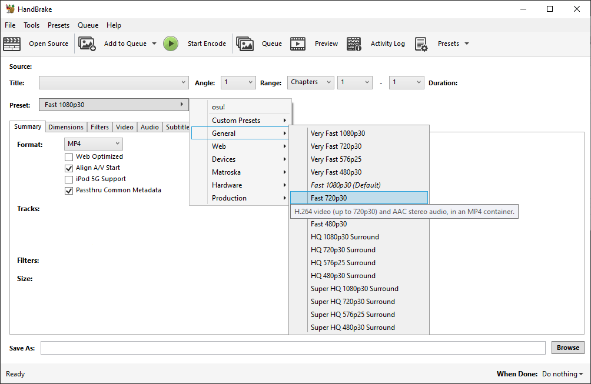
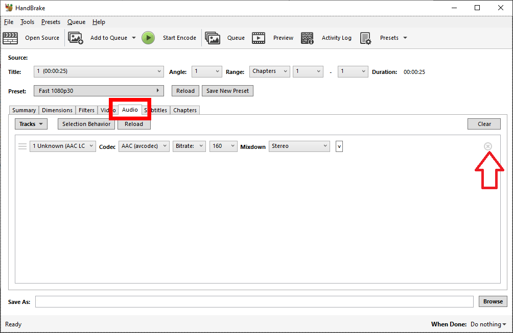
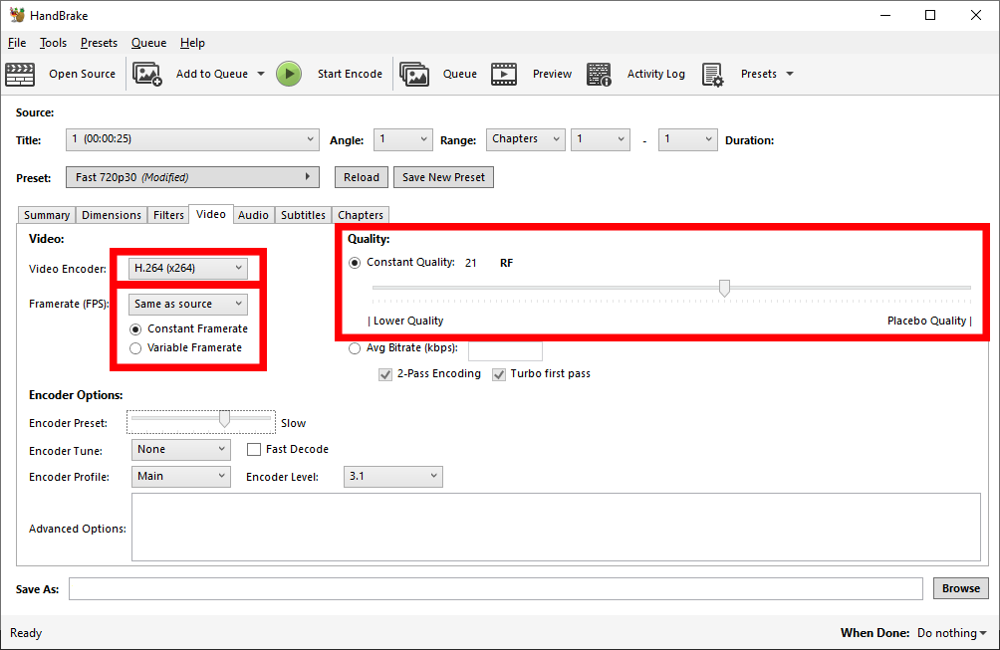
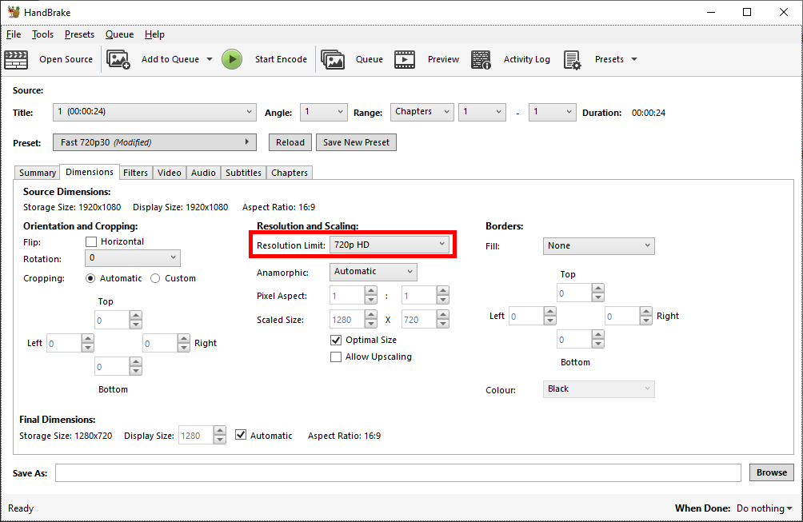
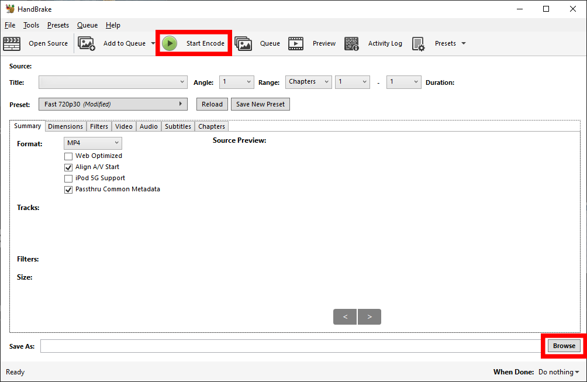
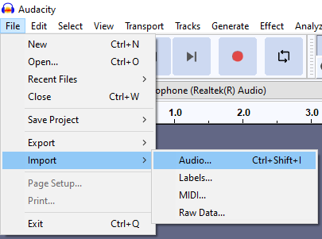
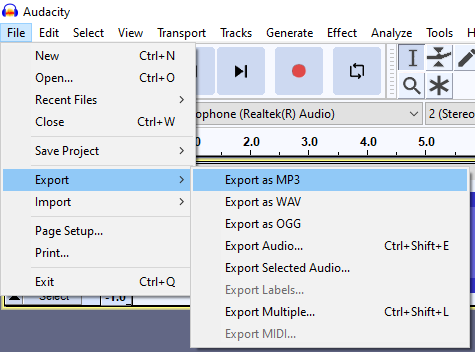
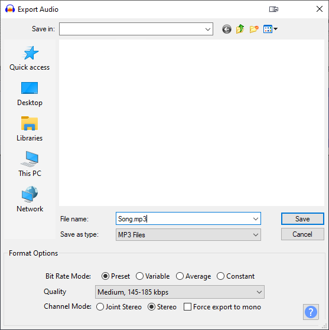

# Сжатие файлов

Каждый битмап имеет ограничение на размер файла, определяемое ее общей длиной. Это руководство поможет вам получить битмап размером ниже этого предела.

Существует 2 типа сжатия: **с потерями (Lossy)** и **без потерь (Lossless)**

- **Lossless** подразумевает, что качество никогда не ухудшается и может многократно сжиматься или разжиматься.
- **Lossy** - это гораздо более мощная форма сжатия, которая жертвует качеством ради места на диске/ресурсов процессора.

## Видео

Чаще всего люди ошибаются именно с этим типом файлов. Существуют тысячи видеокодеков, и *хотите верьте, хотите нет, но YouTube — это ужасное место для получения видео*.

H.264 — хороший кодек для использования, но, как и большинство видеокодеков, он имеет потери. Это означает, что вы хотите избежать повторного кодирования видео несколько раз, и вместо этого кодируете из источника с высоким разрешением один раз.

### Использование Handbrake

В этом разделе показано, как удалить звук из видео с помощью [Handbrake](https://handbrake.fr/), чтобы уменьшить размер видеофайла.

1. Откройте Handbrake и импортируйте видеофайл. Вы можете перетащить файл в Handbrake или импортировать его вручную, щелкнув параметр `File`.


2. Выберите пресет `Fast 720p30`.



3. Выберите вкладку `Audio` и удалите все звуковые дорожки. Сделайте то же самое и для субтитров, перейдя на вкладку `Subtitles` и удалив все записи.



4. Перейдите на вкладку `Video` и убедитесь, что видеокодек установлен как `H.264 (X264)`. Измените `Constant Quality` (постоянное качество) на 20–25. Меньшие значения будут давать файлы большего размера, но с более высоким качеством видео.
5. Если вы готовы потратить больше времени на кодирование, измените `Encoder Preset` в разделе `Encoder Options`. Более медленные предустановки обеспечивают лучшее качество видео, а также могут уменьшить размер видеофайла, но не опускаются до уровня плацебо, поскольку для очень небольшого улучшения качества требуется гораздо больше времени, чем для `VerySlow`. Выберите частоту кадров такой же, как у источника, и поставьте для нее постоянную частоту кадров.



6. Чтобы изменить размер изображения видеофайла, перейдите на вкладку `Dimensions` и измените ширину на `1280` и высоту на `720`.



7. Наконец, выберите расположение файла, в котором вы хотите сохранить результат, затем нажмите `Start Encode`.



### Использование FFmpeg

В этом разделе показано, как можно использовать [FFmpeg](https://ffmpeg.org/) для уменьшения размера видеофайла. FFmpeg — это программа, используемая через [интерфейс командной строки (CLI)](https://en.wikipedia.org/wiki/Command-line_interface), что означает, что она сама по себе не имеет [графического пользовательского интерфейса (GUI)](https://en.wikipedia.org/wiki/Graphical_user_interface). Хотя это может показаться пугающим, FFmpeg может предложить большую гибкость, чем другие инструменты, например, возможность перекодировать несколько видеофайлов быстрее и проще.

Если вы работаете в Windows, сначала [загрузите FFmpeg](https://ffmpeg.org/download.html) и добавьте его каталог в переменную среды `PATH`. В MacOS вы также можете установить его с помощью [brew](https://brew.sh/). В большинстве дистрибутивов Linux уже установлен FFmpeg, но его часто можно легко установить с помощью соответствующих менеджеров пакетов.

Откройте терминал и вставьте следующую команду, изменив значения по мере необходимости:

```
ffmpeg -i input -c:v libx264 -crf 20 -preset slower -an -sn -map_metadata -1 -map_chapters -1 -vf scale=-1:720 output.mp4
```

- `-i input`: Ваш исходный файл. Если имя файла содержит пробелы, заключите его в двойные кавычки. (`"`).
- `-c:v libx264`: Укажите, что видео должно быть закодировано с помощью кодировщика x264, создающего видео в формате H.264..
- `-crf 20`: Качество сжатия, где более низкие значения дают лучшее качество за счет размера файлов и наоборот. Рекомендуемый диапазон составляет около 20-25.
- `-preset slower`: Укажите предустановку кодирования с рекомендуемыми значениями в диапазоне от `ultrafast` до `veryslow`. Более медленные предустановки позволяют кодировщику обеспечить более высокое качество для того же битрейта или более низкий битрейт для того же качества. Дополнительную информацию о доступных пресетах можно найти на [официальном сайте FFmpeg](https://trac.ffmpeg.org/wiki/Encode/H.264#Preset).
- `-an -sn`: Удаление звука и субтитров, если они присутствуют.
- `-map_metadata -1 -map_chapters -1`: Удалите метаданные и главы, если они присутствуют.
- `-vf scale=-1:720`: Уменьшение масштаба видео до высоты 720 пикселей. Значение `-1` позволяет FFmpeg автоматически определять ширину нового видео на основе соотношения сторон источника.
- `output.mp4`: Ваш выходной файл. Если имя файла содержит пробелы, заключите его в двойные кавычки. (`"`).

## Аудио

Битрейт аудио во многом определяет размер аудиофайла. Вы можете использовать [Audacity](https://www.audacityteam.org/) для изменения битрейта ваших аудиофайлов.

В [Критериях ранкинга](/wiki/Ranking_criteria#аудио) есть правило, отмечающее, что аудио со средним битрейтом выше 192 кбит/с не допускается. Кроме того, все, что ниже 128 кбит/с, обычно считается низким качеством.

### Использование Audacity

1. Импортируйте аудиофайл в Audacity.



2. Нажмите на `File` - `Export` - `Export as MP3`



3. Измените параметры экспорта, чтобы упростить сжатие файла. Нажмите на `Preset` и выберите качество `Medium, 145-185 kbps`. При желании вы можете ввести метаданные в следующем диалоговом окне. Когда будете готовы, нажмите `OK`.



### Использование FFmpeg

Вставьте следующую команду в свой терминал и измените значения по мере необходимости:

```
ffmpeg -i input -c:a libmp3lame -q:a 4 -vn -sn -map_metadata -1 -map_chapters -1 output.mp3
```

- `-i input`: Ваш исходный файл. Если имя файла содержит пробелы, заключите его в двойные кавычки. (`"`).
- `-c:a libmp3lame`: Укажите, что звук должен быть закодирован с помощью кодировщика LAME MP3.
- `-q:a 4`: Используйте тот же диапазон переменного битрейта, что и в примере с Audacity, где меньшее число означает более высокий битрейт. Если вам нужен постоянный битрейт, вы должны вместо этого использовать, например, `-b:a 128k` для постоянного битрейта 128 кбит/с.
- `-vn -sn`: Удалите видео и субтитры, если они присутствуют.
- `-map_metadata -1 -map_chapters -1`: Удалите метаданные и главы, если они присутствуют.
- `output.mp3`: Ваш выходной файл. Если имя файла содержит пробелы, заключите его в двойные кавычки (`"`).
