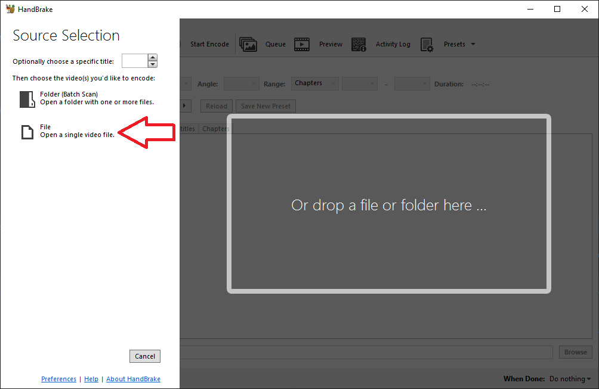
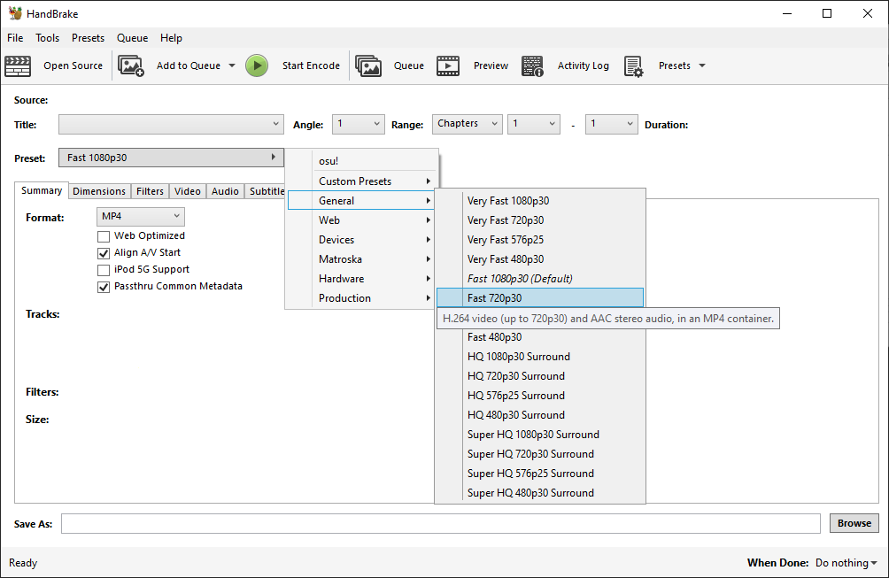
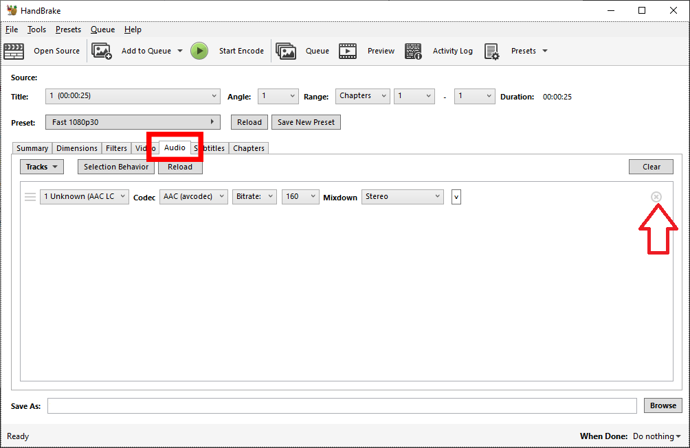
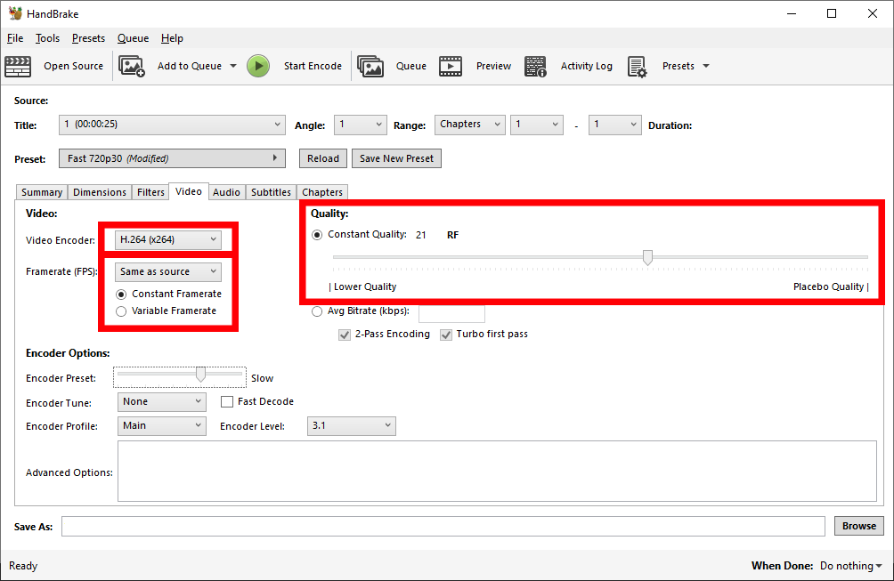
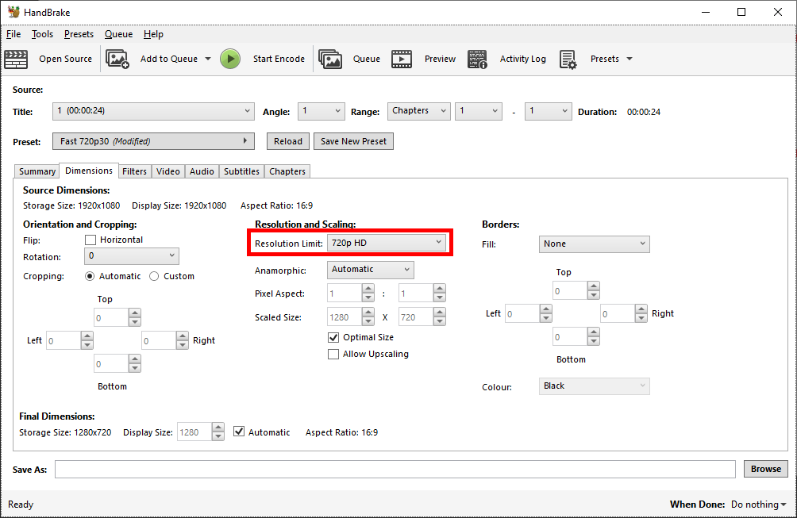
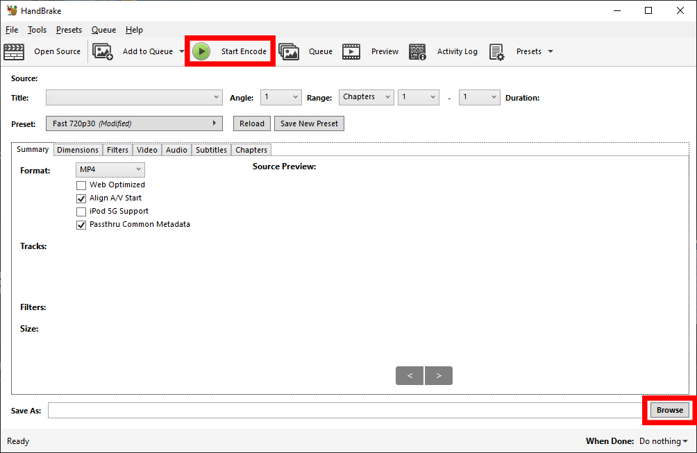
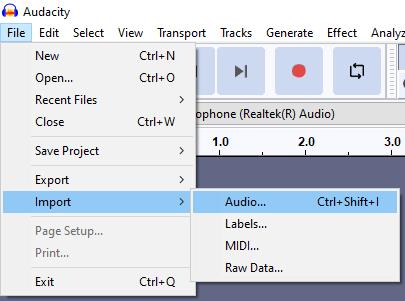
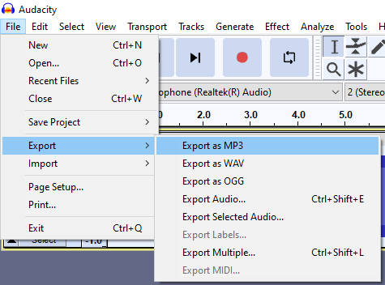
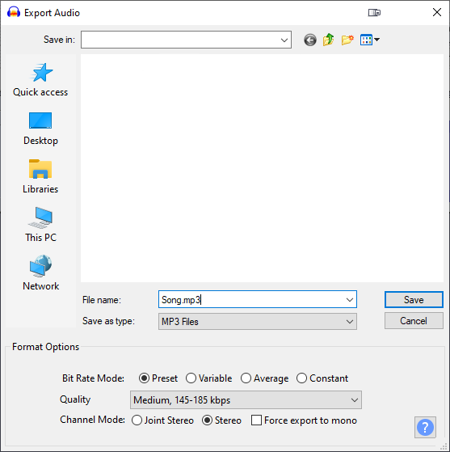

# Сжатие файлов

У каждой карты есть [ограничение на размер](/wiki/Beatmapping/Beatmap_submission#ограничения), которое зависит от её длины, а [видео](/wiki/Ranking_criteria#видео-и-фон) и [аудио](/wiki/Ranking_criteria#аудио) должны подходить под требования по формату, разрешению и битрейту.

Данное руководство поможет уложиться в ограничения и соблюсти все требования.

## Введение

Сжатие бывает двух видов: **без потерь** и **с потерями**.

- **Сжатие без потерь** не ухудшает качество, поэтому файл можно сжимать и разжимать сколько угодно раз.
- **Сжатие с потерями** позволяет сильно уменьшить размер файла, но качество при этом страдает.

Перевод аудио или видео из одного формата в другой (чтобы уменьшить размер файла, битрейт или разрешение) называется **перекодированием**. Если перекодировать с потерями то, что уже и так было сжато с потерями, качество упадёт ещё сильнее (насколько именно, зависит от настроек).

Перекодировать файл стоит только в том случае, если он:

- Слишком много весит;
- Имеет слишком высокое разрешение или битрейт;
- Закодирован в неподдерживаемом формате.

Если без перекодирования не обойтись, начните с поиска исходника самого высокого качества, т.е. с наибольшим разрешением и битрейтом.

## Видео

**osu! поддерживает только видео в формате H.264 с расширением `.mp4`.** Остальные форматы (H.265, VP9, AV1) и расширения (`.mkv`, `.mov`) не поддерживаются.

**Согласно [критериям ранкинга](/wiki/Ranking_criteria#видео-и-фон), разрешение видео не должно превышать 1280x720 пикселей.**

### Использование Handbrake

Скачайте и установите [Handbrake](https://handbrake.fr/), а затем выполните следующие шаги:

1. Откройте Handbrake и импортируйте видеофайл одним из двух способов:
   - Перетащите файл в окно Handbrake.
   - Нажмите на `File` и выберите нужный файл.



2. Выберите пресет `Fast 720p30`.



3. Выберите вкладку `Audio` и удалите все звуковые дорожки. Сделайте то же самое и для субтитров, перейдя на вкладку `Subtitles` и удалив все записи.



4. Перейдите на вкладку `Video` и выставьте следующие настройки:
   - `Video Encoder`: `H.264 (x264)`, чтобы кодировать в H.264 с помощью кодировщика x264.
   - `Framerate (FPS)`: `Same as source`, а также включите `Constant Framerate`.
   - `Constant Quality`: значение от 20 до 25. Чем меньше значение, тем больше файл и выше качество.
5. В зависимости от того, сколько времени вы готовы потратить на кодирование, поменяйте `Encoder Preset` в разделе `Encoder Options` (рекомендуется `Veryslow`). Чем медленнее пресет, тем лучше качество видео и, возможно, тем меньше будет итоговый размер файла.
   - Пресет `Placebo` использовать не надо, поскольку он кодирует намного дольше `Veryslow`, а качество и размер при этом почти не меняются.



6. Чтобы изменить разрешение видео, перейдите на вкладку `Dimensions` и поменяйте ширину на `1280`, а высоту — на `720`.



7. Наконец, выберите папку, куда сохранить результат, и нажмите `Start Encode`.



### Использование FFmpeg

FFmpeg — это программа, работающая через [интерфейс командной строки](https://ru.wikipedia.org/wiki/Интерфейс_командной_строки), то есть своего окна у неё нет. Выглядит это устрашающе, но зато FFmpeg гибче остальных инструментов (например, его удобно встраивать в скрипты).

Чтобы установить FFmpeg в Windows, [скачайте его](https://ffmpeg.org/download.html) и добавьте папку с программой в переменную среды `PATH`. В macOS его можно установить через пакетный менеджер [brew](https://brew.sh/). В большинстве дистрибутивов Linux FFmpeg либо уже установлен, либо есть в репозиториях — подробности см. в документации к своему дистрибутиву.

Чтобы перекодировать видеофайл, откройте терминал и вставьте туда следующую команду, поменяв значения параметров при необходимости:

```
ffmpeg -i input -c:v libx264 -crf 20 -preset veryslow -vf scale=-1:720 -an -sn -map_metadata -1 -map_chapters -1 output.mp4
```

- `-i input`: исходный файл. Если в пути к нему есть пробелы, оберните весь путь в двойные кавычки (`"`).
- `-c:v libx264`: кодировать видео с помощью кодировщика x264, т.е. в формат H.264.
- `-crf 20`: качество сжатия. Чем ниже значение, тем лучше качество и больше файл, и наоборот. Рекомендуемый диапазон — от 20 до 25.
- `-preset veryslow`: пресет кодирования, рекомендуемые значения — от `ultrafast` до `veryslow`. Чем медленнее пресет, тем лучше качество при том же битрейте (или ниже битрейт при том же качестве). Подробнее о пресетах см. [официальный сайт FFmpeg](https://trac.ffmpeg.org/wiki/Encode/H.264#Preset)
- `-vf scale=-1:720`: уменьшить высоту видео до 720 пикселей. Значение `-1` позволяет FFmpeg самому подобрать ширину, исходя из соотношения сторон исходника.
- `-an -sn`: убрать звук и субтитры, если они есть.
- `-map_metadata -1 -map_chapters -1`: убрать метаданные и главы (chapters), если они есть.
- `output.mp4`: итоговый файл. Если в пути к нему есть пробелы, оберните весь путь в двойные кавычки (`"`).

## Аудио

**Поддерживается аудио в форматах MP3 и OGG (Vorbis), т.е. с расширениями `.mp3` и `.ogg` соответственно.** Остальные форматы не поддерживаются (кроме файлов `.wav`, которые можно использовать для хитсаундов).

Как правило, при одном и том же битрейте OGG (Vorbis) звучит лучше MP3.

**Согласно [критериям ранкинга](/wiki/Ranking_criteria#аудио), средний битрейт должен быть от 128 до 192 кбит/с для MP3 и от 128 до 208 кбит/с для OGG (Vorbis).** Для сравнения: песни [лицензированных исполнителей](/wiki/People/Featured_Artists), которые идут в комплекте с шаблонами карт, закодированы в MP3 с постоянным битрейтом 192 кбит/с.

### Использование Audacity

::: alert-note
**См. также:** [Руководство по редактированию аудио](/wiki/Guides/Audio_editing#audacity)
:::

Скачайте и установите [Audacity](https://www.audacityteam.org/), а затем выполните следующие шаги:

1. Откройте Audacity и импортируйте в него аудиофайл.



2. Экспортируйте аудио в MP3 или OGG.



3. Поменяйте настройки экспорта, чтобы сжать файл:
   - Для MP3 поставьте постоянный битрейт (`Constant`) и качество `192 kbps`.
   - Для OGG (Vorbis) выставьте слайдер `Quality` на `6`: это даст средний битрейт 192 кбит/с.
4. Выберите, куда сохранить файл, и нажмите `Save`. После этого появится окно для ввода метаданных.



5. Заполните метаданные (их можно оставить и пустыми) и нажмите `OK`, чтобы начать перекодирование.

::: alert-notice
**Внимание**
Если в окне метаданных нажать `Cancel`, то перекодирование не начнётся.
:::

### Использование FFmpeg

::: alert-note
**Примечание:** о том, как установить FFmpeg, см. в разделе про [видео](#использование-ffmpeg).
:::

Установив FFmpeg, откройте терминал и воспользуйтесь одной из команд ниже.

Чтобы закодировать аудио в MP3, вставьте в терминал команду ниже, поменяв значения параметров при необходимости:

```
ffmpeg -i input -c:a libmp3lame -b:a 192k -vn -sn -map_metadata -1 -map_chapters -1 output.mp3
```

- `-i input`: исходный файл. Если в пути к нему есть пробелы, оберните весь путь в двойные кавычки (`"`).
- `-c:a libmp3lame`: кодировать звук с помощью кодировщика LAME MP3.
- `-b:a 192k`: постоянный битрейт 192 кбит/с. Если нужен переменный битрейт, вместо этого используйте, например, `-q:a 2`: это даст в среднем те же 192 кбит/с (чем меньше число, тем выше битрейт).
- `-vn -sn`: убрать видео и субтитры, если они есть.
- `-map_metadata -1 -map_chapters -1`: убрать метаданные и главы, если они есть.
- `output.mp3`: итоговый файл. Если в пути к нему есть пробелы, оберните весь путь в двойные кавычки (`"`).

Чтобы закодировать аудио в OGG (Vorbis), вставьте в терминал команду ниже, поменяв значения параметров при необходимости:

```
ffmpeg -i input -c:a libvorbis -q:a 6 -vn -sn -map_metadata -1 -map_chapters -1 output.ogg
```

- `-i input`: исходный файл. Если в пути к нему есть пробелы, оберните весь путь в двойные кавычки (`"`).
- `-c:a libvorbis`: кодировать звук с помощью кодировщика libvorbis.
- `-q:a 6`: тот же переменный битрейт, что и в примере с Audacity (здесь чем больше число, тем выше битрейт). Если нужен постоянный битрейт, вместо этого используйте, например, `-b:a 192k`: это даст постоянные 192 кбит/с.
- `-vn -sn`: убрать видео и субтитры, если они есть.
- `-map_metadata -1 -map_chapters -1`: убрать метаданные и главы, если они есть
- `output.ogg`: итоговый файл. Если в пути к нему есть пробелы, оберните весь путь в двойные кавычки (`"`).

## Проверка

Перекодированные аудио- и видеофайлы лучше проверить и убедиться, что с ними всё в порядке.

### Использование MediaInfo

Пользоваться [MediaInfo](https://mediaarea.net/en/MediaInfo) очень просто: установите программу, откройте в ней файл, и вам будет видна вся техническая информация.

1. Нажмите на файл правой кнопкой мыши и выберите в контекстном меню MediaInfo, либо откройте файл через `File` -> `Open` -> `Open file(s)...` в самой программе.
2. Переключите вид с `Basic` на `Tree`, `Text` или `HTML`. В режиме `Basic` показывается только самое основное.

Что смотреть у видеофайлов:

- `Format` и `Format/Info` должны быть `AVC` и `Advanced Video Codec` соответственно.
- `Width`: не больше `1280 pixels`.
- `Height`: не больше `720 pixels`.
- `Frame rate mode` должен быть `Constant`.

Что смотреть у аудиофайлов:

- `Overall bitrate` должен быть от `128kbps` до `192kbps`, как того требуют критерии ранкинга.
- Для MP3:
  - `Format` должен быть `MPEG Audio`.
  - `Format profile` должен быть `Version 1`.
  - `Format settings` должен быть `Layer 3`.
- Для OGG (Vorbis):
  - `Format` должен быть `OGG` и `Vorbis`.

Если всё верно и файл достаточно мало весит, его можно смело добавлять в карту.
