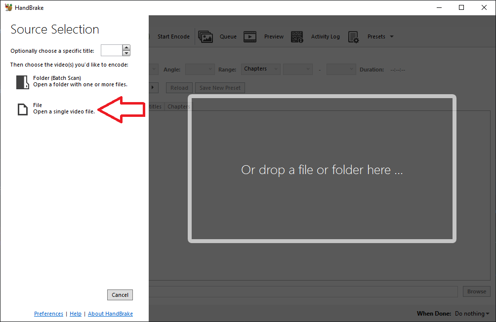
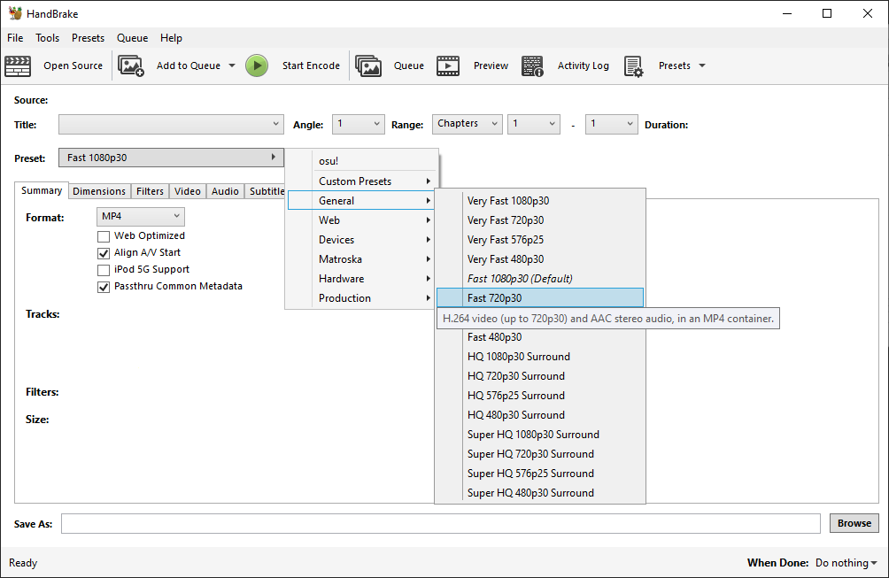
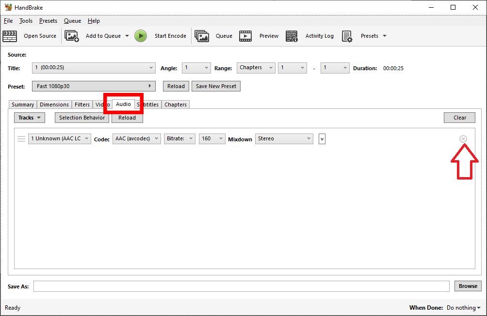
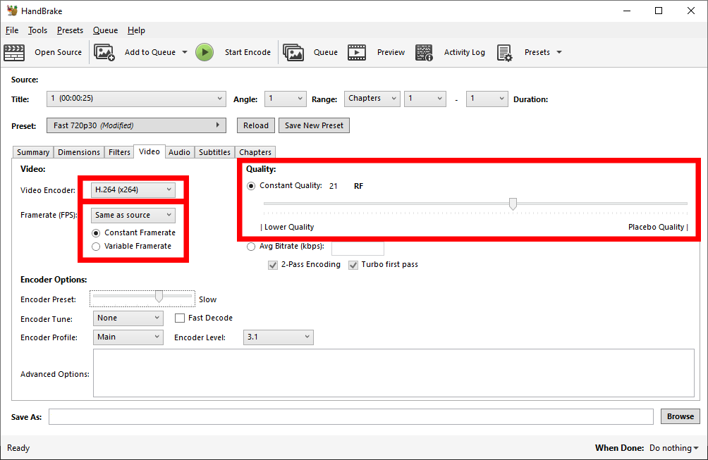
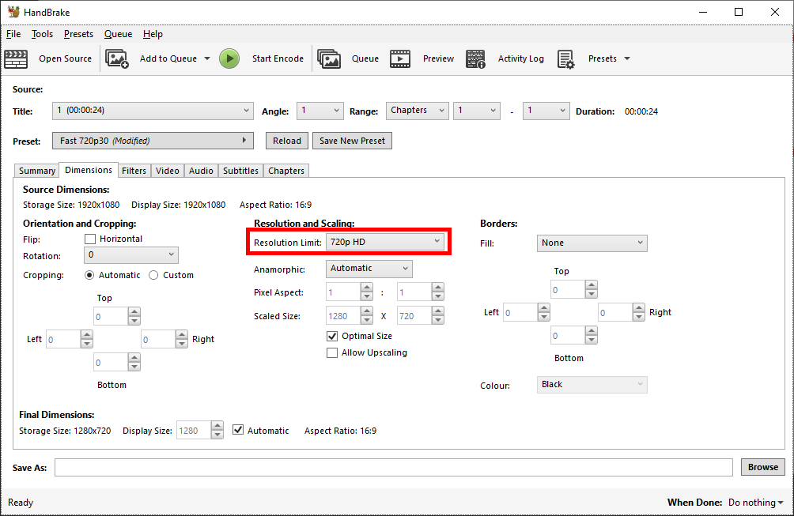
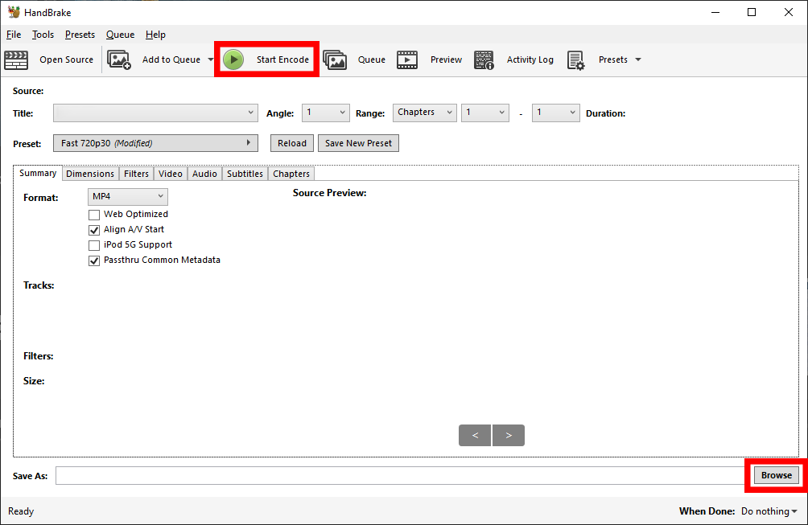
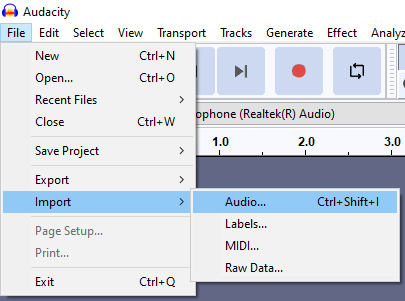
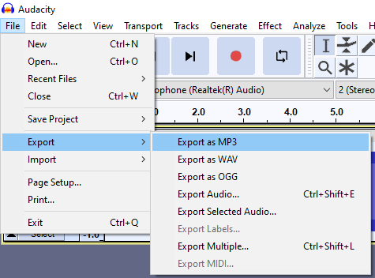
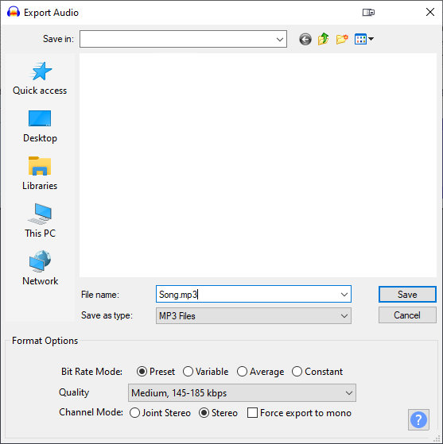

# การบีบอัดไฟล์ (Compressing files)

Beatmap แต่ละชุดมี [ข้อจำกัดด้านขนาดไฟล์](/wiki/Beatmapping/Beatmap_submission#limitations) ที่กำหนดโดยความยาวรวมของแผนที่นั้นๆ และเนื้อหา [วิดีโอ](/wiki/Ranking_criteria#video-and-background) รวมถึง [เสียง](/wiki/Ranking_criteria#audio) ใดๆ จะต้องเป็นไปตามข้อกำหนดด้านรูปแบบ, ความละเอียด และบิตเรต

คู่มือนี้จะช่วยให้คุณทำให้ Beatmap ของคุณมีขนาดไม่เกินขีดจำกัดและตรงตามข้อกำหนดดังกล่าว

## บทนำ (Introduction)

การบีบอัดข้อมูลมี 2 ประเภท คือ **lossless** และ **lossy**:

- การบีบอัดแบบ **Lossless** หมายความว่าคุณภาพจะไม่ลดลงเลย ดังนั้นจึงสามารถบีบอัดและคลายไฟล์ซ้ำได้เรื่อยๆ
- การบีบอัดแบบ **Lossy** จะใช้เทคนิคที่มีประสิทธิภาพบางอย่างเพื่อลดขนาดไฟล์ลงอย่างมากโดยต้องแลกกับคุณภาพที่ลดลง

กระบวนการแปลงระหว่างรูปแบบเสียงและวิดีโอ เพื่อลดขนาดไฟล์, บิตเรตเฉลี่ย หรือความละเอียด เรียกว่า **re-encoding** หรือ **transcoding** การ Re-encoding ไฟล์เสียงหรือวิดีโอที่ถูกบีบอัดแบบ lossy อยู่แล้วซ้ำอีกครั้งด้วยการบีบอัดแบบ lossy อาจส่งผลให้คุณภาพลดลงเพิ่มเติมในระดับต่างๆ ขึ้นอยู่กับการตั้งค่าที่ใช้

ด้วยเหตุผลดังกล่าว ควรหลีกเลี่ยงการ re-encoding ยกเว้นในกรณีที่ไฟล์เสียงหรือวิดีโอต้นฉบับเป็นอย่างใดอย่างหนึ่งดังต่อไปนี้:

- มีขนาดไฟล์ใหญ่เกินไป
- มีความละเอียดหรือบิตเรตเฉลี่ยสูงเกินไป
- ถูกเข้ารหัสในรูปแบบที่ไม่รองรับ

ในกรณีที่จำเป็นต้องทำการ re-encoding แนะนำให้ใช้ไฟล์ต้นฉบับที่มีคุณภาพสูงที่สุดเท่าที่มีอยู่ เช่น ไฟล์ที่มีความละเอียด และ/หรือ บิตเรตสูงสุด

## วิดีโอ (Video)

**osu! รองรับวิดีโอที่เข้ารหัสในรูปแบบ H.264 ด้วยนามสกุลไฟล์ `.mp4`** ส่วนรูปแบบอื่นๆ เช่น H.265, VP9 และ AV1 รวมถึงนามสกุลไฟล์เช่น `.mkv` และ `.mov` ในปัจจุบันยังไม่รองรับ

**[เกณฑ์การจัดอันดับ (Ranking criteria)](/wiki/Ranking_criteria#video-and-background) ระบุความละเอียดวิดีโอสูงสุดไว้ที่ 1280x720 พิกเซล**

### การใช้ Handbrake

ในขั้นตอนแรก ให้ดาวน์โหลดและติดตั้ง [Handbrake](https://handbrake.fr/) จากนั้นทำตามขั้นตอนเหล่านี้:

1. เปิด Handbrake แล้วนำเข้าไฟล์วิดีโอของคุณโดยวิธีใดวิธีหนึ่ง:
   - ลากและวางไฟล์ลงใน Handbrake หรือ
   - คลิกที่ตัวเลือก `File` จากนั้นเลือกไฟล์ที่จะนำเข้า



2. เลือก Preset เป็น `Fast 720p30`



3. เลือกแถบ `Audio` และนำแทร็กเสียงออกทั้งหมด ทำเช่นเดียวกันสำหรับคำบรรยาย (Subtitles) โดยไปที่แถบ `Subtitles` และนำรายการออกทั้งหมด



4. ไปที่แถบ `Video` และใช้การตั้งค่าดังต่อไปนี้:
   - `Video Encoder` ตั้งเป็น `H.264 (x264)` เพื่อเข้ารหัสในรูปแบบ H.264 โดยใช้ x264 encoder
   - `Framerate (FPS)` ตั้งเป็น `Same as source` โดยเลือกแบบ `Constant Framerate`
   - `Constant Quality` ตั้งค่าเป็นค่าระหว่าง 20 ถึง 25 ค่าที่น้อยกว่าจะส่งผลให้ไฟล์มีขนาดใหญ่ขึ้นและคุณภาพสูงขึ้น
5. เปลี่ยน `Encoder Preset` ภายใต้ `Encoder Options` ขึ้นอยู่กับว่าคุณยินดีที่จะใช้เวลาในการเข้ารหัสนานแค่ไหน (แนะนำให้ใช้ `Veryslow`) Preset ที่ช้ากว่าจะส่งผลให้คุณภาพวิดีโอดีขึ้นและอาจช่วยลดขนาดไฟล์วิดีโอลงด้วย
   - อย่าใช้ Preset แบบ `Placebo` เนื่องจากใช้เวลาในการเข้ารหัสนานกว่า `Veryslow` มาก โดยที่คุณภาพหรือขนาดไฟล์แทบจะไม่พัฒนาขึ้นเลย



6. ในการปรับขนาดภาพของไฟล์วิดีโอ ให้ไปที่แถบ `Dimensions` และเปลี่ยน width เป็น `1280` และ height เป็น `720`



7. สุดท้าย เลือกตำแหน่งที่คุณต้องการบันทึกผลลัพธ์ จากนั้นคลิก `Start Encode`



### การใช้ FFmpeg

FFmpeg เป็นโปรแกรมที่ใช้งานผ่าน [command-line interface (CLI)](https://en.wikipedia.org/wiki/Command-line_interface) ซึ่งหมายความว่ามันไม่มีส่วนประสานงานกราฟิก (GUI) ในตัวเอง แม้ว่าสิ่งนี้อาจดูน่าหวั่นใจ แต่ FFmpeg สามารถมอบความยืดหยุ่นได้มากกว่าเครื่องมืออื่นๆ เช่น เมื่อนำไปรวมเข้ากับสคริปต์

ในการติดตั้ง FFmpeg บน Windows ให้ [ดาวน์โหลด FFmpeg](https://ffmpeg.org/download.html) และเพิ่มไดเรกทอรีของมันลงใน `PATH` environment variable ของคุณ สำหรับบน macOS คุณสามารถติดตั้งได้โดยใช้ [brew](https://brew.sh/) package manager ส่วนบน Linux ส่วนใหญ่จะมี FFmpeg มาให้หรือติดตั้งไว้ให้ล่วงหน้าเป็นปกติอยู่แล้ว (หากไม่มี ให้ศึกษาข้อมูลเพิ่มเติมเกี่ยวกับการแจกจ่าย (distribution) ที่คุณใช้งาน)

ในการใช้ FFmpeg เพื่อ re-encode ไฟล์วิดีโอ ให้เปิด terminal และวางคำสั่งต่อไปนี้ โดยเปลี่ยนค่าตามความจำเป็น:

```
ffmpeg -i input -c:v libx264 -crf 20 -preset veryslow -vf scale=-1:720 -an -sn -map_metadata -1 -map_chapters -1 output.mp4
```

- `-i input`: ไฟล์ต้นฉบับของคุณ หากชื่อไฟล์มีช่องว่าง ให้ครอบด้วยเครื่องหมายอัญประกาศคู่ (`"`)
- `-c:v libx264`: ระบุว่าวิดีโอควรถูกเข้ารหัสโดยใช้ x264 encoder เพื่อผลิตวิดีโอในรูปแบบ H.264
- `-crf 20`: คุณภาพการบีบอัด โดยค่าที่ต่ำกว่าจะให้คุณภาพที่ดีกว่าแต่แลกกับไฟล์ที่มีขนาดใหญ่ขึ้น และในทางกลับกัน ช่วงที่แนะนำคือประมาณ 20-25
- `-preset veryslow`: ระบุ encoding preset โดยค่าที่แนะนำมีตั้งแต่ `ultrafast` ไปจนถึง `veryslow` Preset ที่ช้ากว่าจะช่วยให้ตัวเข้ารหัสมอบคุณภาพที่สูงกว่าสำหรับบิตเรตที่เท่ากัน หรือบิตเรตที่ต่ำกว่าสำหรับคุณภาพที่เท่ากัน สามารถหาข้อมูลเพิ่มเติมเกี่ยวกับ Preset ที่มีอยู่ได้ที่ [เว็บไซต์ทางการของ FFmpeg](https://trac.ffmpeg.org/wiki/Encode/H.264#Preset)
- `-vf scale=-1:720`: ลดขนาดวิดีโอให้มีความสูงเป็น 720 พิกเซล โดย `-1` จะช่วยให้ FFmpeg กำหนดความกว้างของวิดีโอใหม่โดยอัตโนมัติตามอัตราส่วนภาพ (aspect ratio) ของต้นฉบับ
- `-an -sn`: นำเสียงและคำบรรยายออกหากมี
- `-map_metadata -1 -map_chapters -1`: นำ metadata และบท (chapters) ออกหากมี
- `output.mp4`: ไฟล์ผลลัพธ์ของคุณ หากชื่อไฟล์มีช่องว่าง ให้ครอบด้วยเครื่องหมายอัญประกาศคู่ (`"`)

## เสียง (Audio)

**รองรับเสียงที่เข้ารหัสในรูปแบบ MP3 หรือ OGG (Vorbis) พร้อมนามสกุลไฟล์ `.mp3` และ `.ogg` ตามลำดับ** ในปัจจุบันยังไม่รองรับรูปแบบอื่นๆ (ยกเว้นเสียงนามสกุล `.wav` สำหรับ hitsounds)

โดยทั่วไป OGG (Vorbis) จะให้คุณภาพที่ดีกว่า MP3 สำหรับบิตเรตที่กำหนดไว้เท่ากัน

**[เกณฑ์การจัดอันดับ (Ranking criteria)](/wiki/Ranking_criteria#audio) ระบุว่าบิตเรตเฉลี่ยต้องอยู่ระหว่าง 192kbps ถึง 128kbps สำหรับรูปแบบ MP3 และระหว่าง 208kbps ถึง 128kbps สำหรับรูปแบบ OGG (Vorbis)** สำหรับการอ้างอิง เพลงของ [Featured Artists](/wiki/People/Featured_Artists) ที่รวมอยู่ในเทมเพลต beatmap จะถูกเข้ารหัสเป็น MP3 ด้วยบิตเรตคงที่ 192kbps

### การใช้ Audacity

*ดูเพิ่มเติมที่: [คู่มือการตัดต่อเสียง (Audio editing guide)](/wiki/Guides/Audio_editing#audacity)*

ในขั้นตอนแรก ให้ดาวน์โหลดและติดตั้ง [Audacity](https://www.audacityteam.org/) จากนั้นทำตามขั้นตอนเหล่านี้:

1. เปิด Audacity แล้วนำเข้าไฟล์เสียงเข้าสู่ Audacity



2. ส่งออกเสียง (Export) เป็น MP3 หรือ OGG



3. เปลี่ยนตัวเลือกการส่งออกเพื่อบีบอัดไฟล์ของคุณ ขึ้นอยู่กับรูปแบบที่เลือก:
   - สำหรับ MP3 ให้เปลี่ยน bit rate mode เป็น `Constant` และเลือกคุณภาพที่ `192 kbps`
   - สำหรับ OGG (Vorbis) ให้ปรับแถบเลื่อน `Quality` ไปที่ `6` ซึ่งจะตั้งค่าบิตเรตเฉลี่ยเป็น 192 kbps
4. เลือกตำแหน่งไฟล์ผลลัพธ์และคลิก `Save` จากนั้นจะมีหน้าต่างใหม่ปรากฏขึ้นเพื่อให้คุณป้อน metadata ของเสียง



5. เมื่อป้อน metadata เสร็จสิ้น ซึ่งสามารถปล่อยว่างไว้ได้หากต้องการ ให้คลิก `OK` เพื่อเริ่มการ re-encoding

*หมายเหตุ: การคลิก `Cancel` ในหน้าต่าง metadata จะเป็นการยกเลิกกระบวนการ re-encoding*

### การใช้ FFmpeg

*สำหรับคำแนะนำในการติดตั้ง FFmpeg โปรดดู: [Video/การใช้ FFmpeg](/wiki/Guides/Compressing_files#using-ffmpeg)*

หลังจากติดตั้ง FFmpeg ให้เปิด terminal แล้วใช้คำสั่งใดคำสั่งหนึ่งด้านล่าง

ในการเข้ารหัสในรูปแบบ MP3 ให้วางคำสั่งต่อไปนี้ลงใน terminal ของคุณและเปลี่ยนค่าตามความจำเป็น:

```
ffmpeg -i input -c:a libmp3lame -b:a 192k -vn -sn -map_metadata -1 -map_chapters -1 output.mp3
```

- `-i input`: ไฟล์ต้นฉบับของคุณ หากชื่อไฟล์มีช่องว่าง ให้ครอบด้วยเครื่องหมายอัญประกาศคู่ (`"`)
- `-c:a libmp3lame`: ระบุว่าเสียงควรถูกเข้ารหัสโดยใช้ LAME MP3 encoder
- `-b:a 192k`: ตั้งค่าบิตเรตให้เป็นค่าคงที่ 192kbps หากคุณต้องการบิตเรตแบบแปรผัน (variable bit rate) คุณจะต้องใช้ตัวอย่างเช่น `-q:a 2` แทน เพื่อให้ได้ค่าเฉลี่ยประมาณ 192 kbps (ตัวเลขที่น้อยกว่าหมายถึงบิตเรตที่สูงกว่า)
- `-vn -sn`: นำวิดีโอและคำบรรยายออกหากมี
- `-map_metadata -1 -map_chapters -1`: นำ metadata และบทออกหากมี
- `output.mp3`: ไฟล์ผลลัพธ์ของคุณ หากชื่อไฟล์มีช่องว่าง ให้ครอบด้วยเครื่องหมายอัญประกาศคู่ (`"`)

ในการเข้ารหัสในรูปแบบ OGG (Vorbis) ให้วางคำสั่งต่อไปนี้ลงใน terminal ของคุณและเปลี่ยนค่าตามความจำเป็น:

```
ffmpeg -i input -c:a libvorbis -q:a 6 -vn -sn -map_metadata -1 -map_chapters -1 output.ogg
```

- `-i input`: ไฟล์ต้นฉบับของคุณ หากชื่อไฟล์มีช่องว่าง ให้ครอบด้วยเครื่องหมายอัญประกาศคู่ (`"`)
- `-c:a libvorbis`: ระบุว่าเสียงควรถูกเข้ารหัสโดยใช้ libvorbis encoder
- `-q:a 6`: ใช้ช่วงบิตเรตแบบแปรผันเหมือนกับตัวอย่าง Audacity (ซึ่งตัวเลขที่สูงกว่าหมายถึงบิตเรตที่สูงกว่า) หากคุณต้องการบิตเรตคงที่ คุณจะต้องใช้ตัวอย่างเช่น `-b:a 192k` แทน เพื่อให้ได้บิตเรตคงที่ 192kbps
- `-vn -sn`: นำวิดีโอและคำบรรยายออกหากมี
- `-map_metadata -1 -map_chapters -1`: นำ metadata และบทออกหากมี
- `output.ogg`: ไฟล์ผลลัพธ์ของคุณ หากชื่อไฟล์มีช่องว่าง ให้ครอบด้วยเครื่องหมายอัญประกาศคู่ (`"`)

## การตรวจสอบ (Verification)

ขอแนะนำให้ตรวจสอบข้อมูลทางเทคนิคของไฟล์เสียงและวิดีโอที่ re-encode แล้ว เพื่อยืนยันว่าตรงตามความต้องการของคุณ

### การใช้ MediaInfo

[MediaInfo](https://mediaarea.net/en/MediaInfo) นั้นใช้งานง่ายมาก หลังจากติดตั้งแล้ว ให้เปิดไฟล์ด้วย MediaInfo แล้วข้อมูลทางเทคนิคเกี่ยวกับไฟล์นั้นจะปรากฏขึ้น

1. คลิกขวาที่ไฟล์ใดก็ได้แล้วเลือก MediaInfo จาก context menu หรือใช้ `File` -> `Open` -> `Open file(s)...` ในโปรแกรม MediaInfo
2. เปลี่ยนมุมมองจาก `Basic` เป็น `Tree`, `Text` หรือ `HTML` มุมมองเริ่มต้นแบบ `Basic` จะแสดงเฉพาะข้อมูลสรุปที่รวบรัดเท่านั้น

ฟิลด์ที่เกี่ยวข้องสำหรับไฟล์วิดีโอ:

- `Format` และ `Format/Info` จะต้องเป็น `AVC` และ `Advanced Video Codec` ตามลำดับ
- `Width` จะต้องอยู่ที่หรือต่ำกว่า `1280 pixels`
- `Height` จะต้องอยู่ที่หรือต่ำกว่า `720 pixels`
- `Frame rate mode` จะต้องเป็นแบบ `Constant`

ฟิลด์ที่เกี่ยวข้องสำหรับไฟล์เสียง:

- `Overall bitrate` จะต้องอยู่ระหว่าง `192kbps` และ `128kbps` ตามที่ระบุไว้ในเกณฑ์การจัดอันดับ
- สำหรับ MP3 ให้ตรวจสอบรายการต่อไปนี้:
  - `Format` จะต้องเป็น `MPEG Audio`
  - `Format profile` จะต้องเป็น `Version 1`
  - `Format settings` จะต้องเป็น `Layer 3`
- สำหรับ OGG (Vorbis) ให้ตรวจสอบรายการต่อไปนี้:
  - `Format` จะต้องเป็นทั้ง `OGG` และ `Vorbis`

หากทุกอย่างดูถูกต้องและขนาดไฟล์เล็กพอแล้ว คุณสามารถนำไฟล์เสียงหรือวิดีโอที่ re-encode แล้วใส่ลงใน beatmap ของคุณได้