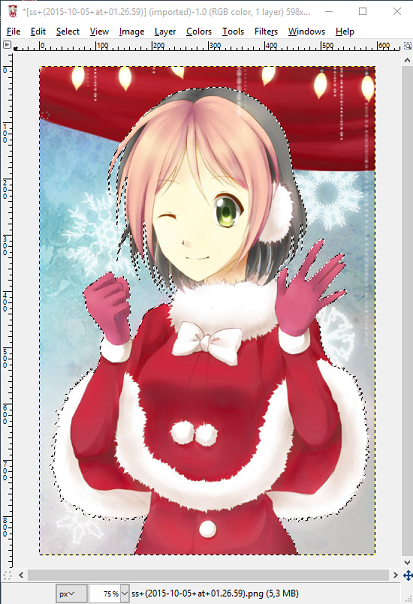

# Comment recadrer des images avec des arrière-plans complexes

## Étape \#1

Tout d'abord, vous devez choisir une image. Nous allons vous la présenter sur cette image que vous pouvez voir. Nous allons vous montrer comment le faire en utilisant GIMP. (Pour cette méthode, nous avons besoin d'un outil de sélection libre, le Lasso).

## Étape \#2

Maintenant, sélectionnez le point que vous voulez pour commencer à sélectionner votre personnage. Ce n'est pas si difficile, il suffit de placer des nœuds le long du contour de votre personnage. Plus vous placerez de notes, plus votre coupe sera précise.

## Étape \#3

Maintenant, continuez jusqu'à ce que vous sélectionniez complètement le contour de votre personnage. Ignorez pour l'instant les cheveux de l'arrière-plan.

## Étape \#4

Si vous avez terminé votre sélection principale, nous pouvons maintenant nous occuper de l'arrière-plan qui a été sélectionné en même temps que notre personnage. Continuez à utiliser votre outil Lasso, mais changez son mode pour "Soustraire de la sélection actuelle", c'est-à-dire supprimer la sélection. Et maintenant, faites la même chose qu'au début pour désélectionner tout l'arrière-plan qui se trouvait entre les cheveux, les jambes, etc.

## Étape \#5

Il ne reste plus qu'une chose à faire, couper notre personnage de l'image et le coller dans une nouvelle ou inverser votre sélection (CTRL + I) et supprimer l'arrière-plan.

## Finition

C'est fini. Ce n'est pas très beau, surtout les pointes des cheveux, mais c'est seulement parce que nous n'avons pas été très précis en le faisant.

Cela peut prendre un peu de temps, mais l'effet final est vraiment bon.

