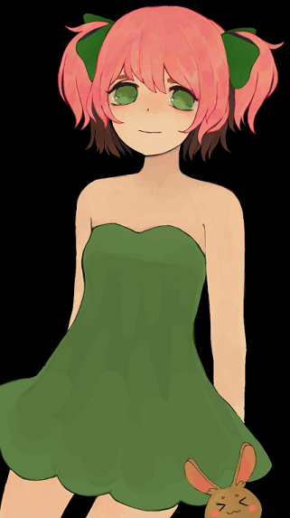
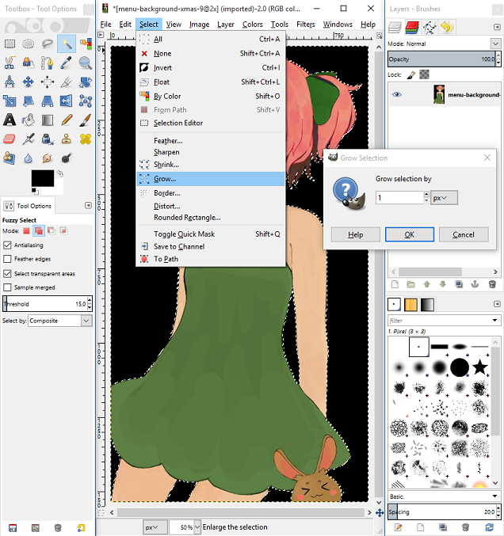

# Как удалить простой фон на картинке

Итак, я покажу вам быстрый способ, как удалить одноцветный фон. Как и в предыдущем уроке, здесь я использую GIMP и такую вот картинку, которую вы видите.

## Шаг \#1

Выберите инструмент `Волшебная палочка` в `Добавить к текущему режиму выделения` (это поможет выбрать сразу несколько частей) и выберите все пробелы фона, которые вам не нужны.

## Шаг \#2

Теперь, когда мы выбрали фон, нам нужно увеличить выделение на 1 пиксель. Нажмите `Del`, чтобы удалить выбранный фон.

## Шаг \#3

Пришло время использовать наш фильтр, чтобы сделать удаленный фон прозрачным.

## Шаг \#4

К сожалению, после этого все еще будут черные пробелы, в основном в местах с острым углом. Выберите инструмент Лассо и выделите эти некрасивые места. Нажмите `Ctrl` + `F`, чтобы повторить удаление цвета.

## Конец

После удаления всех остатков ваша картинка должна быть готова.

Этот метод работает только с одним цветным фоном, но с его помощью вы сможете легко и быстро удалить фон.

