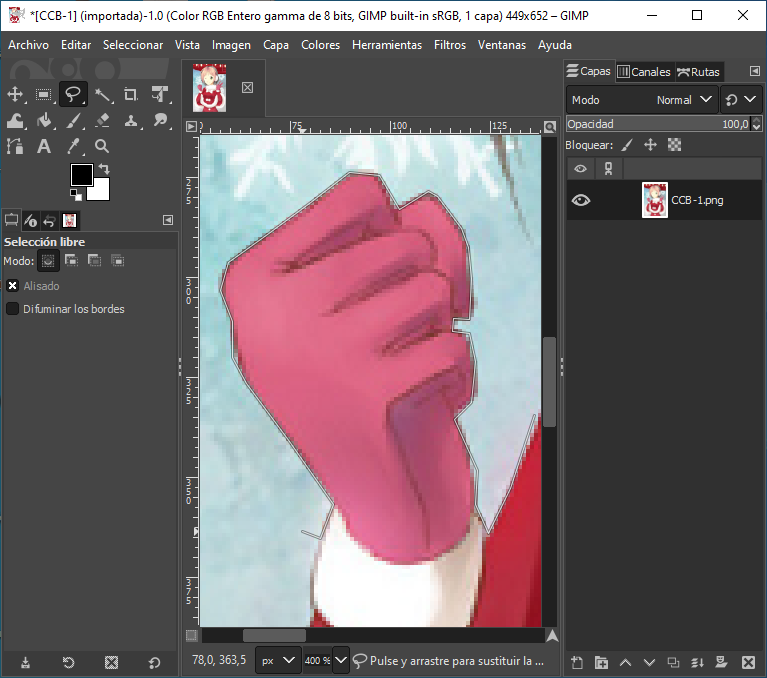
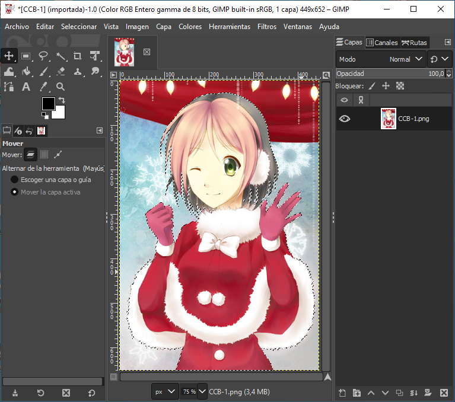
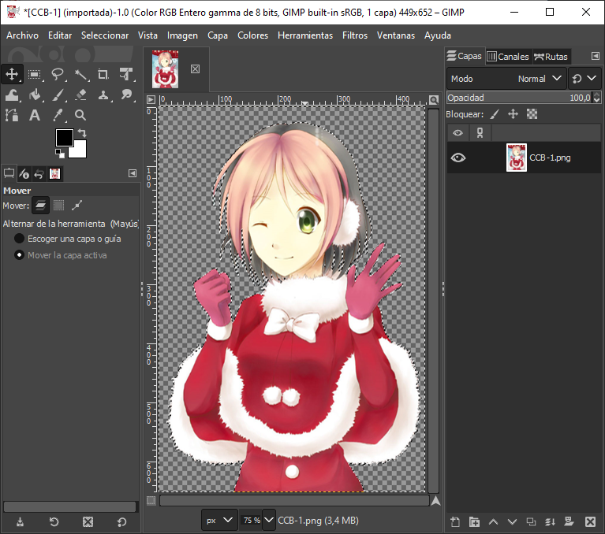

# Cómo cortar imágenes con fondos complejos

## Paso 1

Lo primero que debes hacer es seleccionar una imagen. A continuación te la presento en esta foto que puedes ver. Mostraré cómo hacer esto usando GIMP (no debería haber muchos problemas con otros programas). Para este método necesitamos la herramienta de selección libre, también conocida como Lazo.

## Paso 2

Ahora, selecciona cualquier punto en el que quieras comenzar a seleccionar tu personaje. No es tan difícil, simplemente coloca nodos junto con el contorno de tu personaje. Cuanto más cerca se coloquen, más preciso será el corte.

## Paso 3

Ahora, continúa hasta que selecciones completamente el contorno de tu personaje. Ignora por ahora cualquier pelo de fondo.

## Paso 4

Si has terminado tu selección principal, ahora podemos ocuparnos de cualquier fondo que haya sido seleccionado junto con nuestro personaje. Continúa usando la herramienta lazo, pero cambia su modo a «Extraer de la selección actual», es decir, eliminar la selección. Y ahora haz lo mismo que al principio al deseleccionar cualquier fondo que estuviera entre el pelo, piernas, etc.

## Paso 5

Solo queda una cosa por hacer, cortar nuestro personaje de la imagen y pegarlo en una nueva o invertir la selección (CTRL + I) y borrar el fondo.

## Resultado

Está terminado. No quedó muy bien, sobre todo en las puntas, pero es porque no fui muy preciso al hacerlo.

Puede llevar un poco de tiempo, pero el efecto final es bastante bueno.

