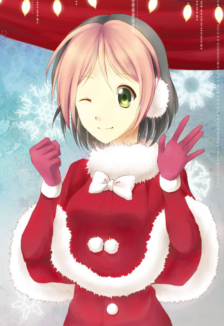
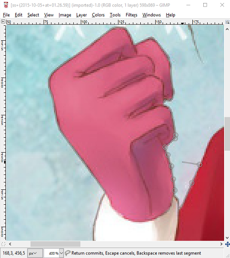
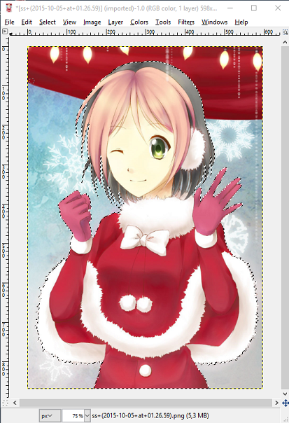
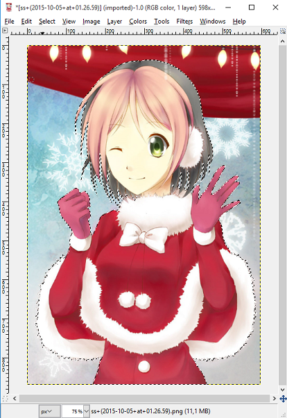
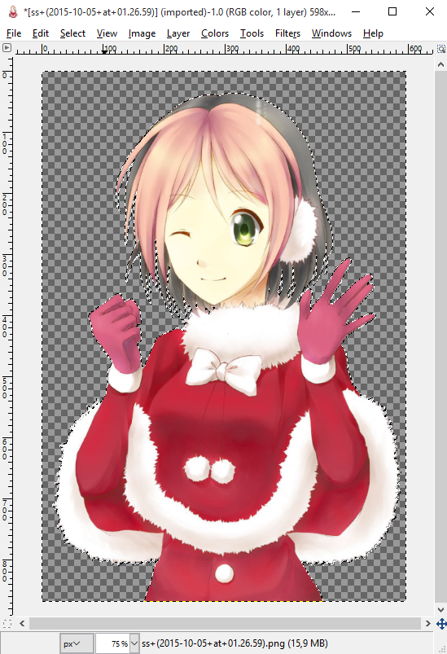
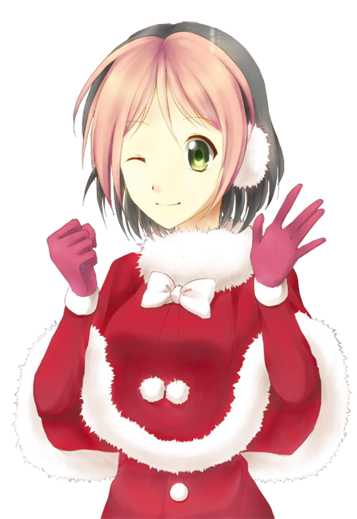

# Как удалить сложный фон на картинке

## Шаг \#1

Первым делом нужно выбрать картинку. В качества примера я использую картинку, которую вы можете видеть. Я покажу, как это сделать с помощью GIMP (не волнуйтесь, с другими программами особых проблем возникнуть не должно). Для этого метода нам понадобится бесплатный инструмент выбора, также известный как Lasso.

## Шаг \#2

Теперь выберите любую точку, с которой вы хотите начать выборку своего персонажа. Это не так сложно, просто разместите узлы по контуру вашего персонажа. Чем ближе размещение нот - тем точнее будет ваша резка.

## Шаг \#3

Теперь продолжайте, пока полностью не выберете контур своего персонажа. На данный момент игнорируйте фоновые волосы.

## Шаг \#4

Если вы закончили свою основную выборку, теперь мы можем позаботиться о любом фоне, который был выбран вместе с нашим персонажем. Продолжайте использовать свой инструмент лассо, но измените его режим на «Вычитание из текущего выделения», то есть удаление из выделенного. А теперь сделайте так же, как и в начале, отмените выбор любого фона, который был между волосами, ногами и т. д.

## Шаг \#5

Осталось сделать только одно, вырезать нашего персонажа из картинки и вставить на новый слой или инвертировать выделение (CTRL + I) и удалить фон.

## Конец

Готово. Выглядит не очень красиво, особенно кончики волос, но это только потому, что я не был так точен, когда делал это.

Это может занять немного времени, но конечный результат действительно стоит того.

