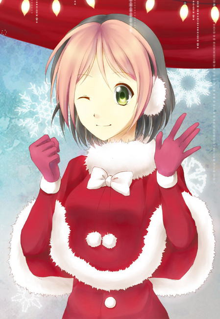
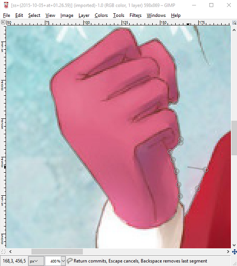
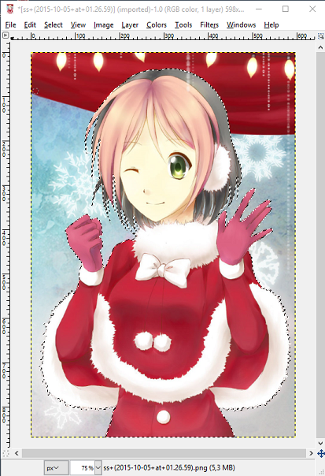
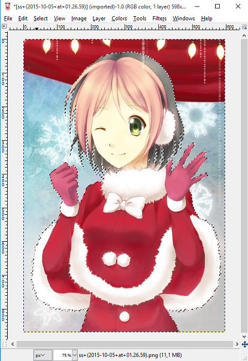
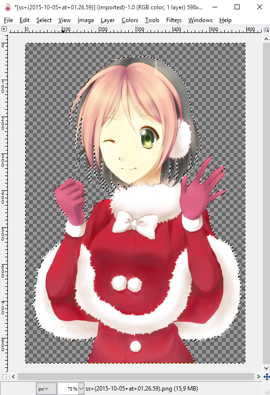
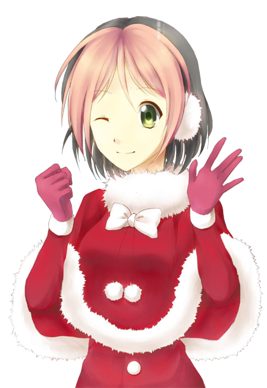

# วิธีตัดภาพพื้นหลังที่มีความซับซ้อน (How to crop images with complex backgrounds)

## ขั้นตอนที่ 1 (Step #1)

สิ่งแรกที่คุณต้องทำคือเลือกรูปภาพ ผมจะสาธิตโดยใช้รูปภาพที่คุณเห็นอยู่นี้ และจะแสดงวิธีการทำโดยใช้โปรแกรม GIMP (โปรแกรมอื่นๆ ก็ไม่น่าจะมีปัญหาอะไรมากนัก) สำหรับวิธีนี้เราจำเป็นต้องใช้เครื่องมือ Free Select tool หรือที่รู้จักกันในชื่อ Lasso

## ขั้นตอนที่ 2 (Step #2)

คราวนี้ ให้เลือกจุดใดก็ได้ที่คุณต้องการเริ่มเลือกตัวละครของคุณ มันไม่ได้ยากขนาดนั้น แค่วางจุด (Nodes) ไปตามเส้นขอบของตัวละคร ยิ่งคุณวางจุดให้ถี่มากเท่าไหร่ การตัดภาพก็จะยิ่งมีความแม่นยำมากขึ้นเท่านั้น

## ขั้นตอนที่ 3 (Step #3)

จากนั้น ให้ทำต่อไปเรื่อยๆ จนกว่าคุณจะเลือกเส้นขอบรอบตัวละครได้ครบทั้งหมด สำหรับตอนนี้ให้มองข้ามส่วนที่เป็นเส้นผมที่ติดพื้นหลังไปก่อน

## ขั้นตอนที่ 4 (Step #4)

เมื่อคุณเลือกส่วนหลักเสร็จแล้ว คราวนี้เรามาจัดการกับพื้นหลังที่ถูกเลือกติดมาพร้อมกับตัวละครของเรากัน ให้ใช้เครื่องมือ Lasso ต่อไป แต่ให้เปลี่ยนโหมดการทำงานเป็น "Subtract from current selection" หรือโหมดการลบส่วนที่เลือก (Deselect) จากนั้นให้ทำแบบเดียวกับตอนเริ่มต้น คือการลบส่วนที่เป็นพื้นหลังที่อยู่ระหว่างเส้นผม, ขา และส่วนอื่นๆ ออก

## ขั้นตอนที่ 5 (Step #5)

เหลือสิ่งสุดท้ายที่ต้องทำ คือการตัดตัวละครของเราออกจากรูปภาพเดิมแล้วนำไปวางในรูปภาพใหม่ หรือจะใช้วิธีสลับส่วนที่เลือก (Invert selection โดยกด CTRL + I) แล้วกดลบพื้นหลังทิ้งไปก็ได้เช่นกัน

## เสร็จสิ้น (Finish)

เสร็จเรียบร้อยแล้วครับ มันอาจจะดูไม่เนียนมากนักโดยเฉพาะตรงปลายเส้นผม แต่นั่นเป็นเพราะผมไม่ได้ใช้ความละเอียดมากนักในขณะที่ทำตัวอย่างนี้

วิธีนี้อาจต้องใช้เวลาสักเล็กน้อย แต่ผลลัพธ์ที่ได้ออกมาถือว่าดีจริงๆ ครับ

