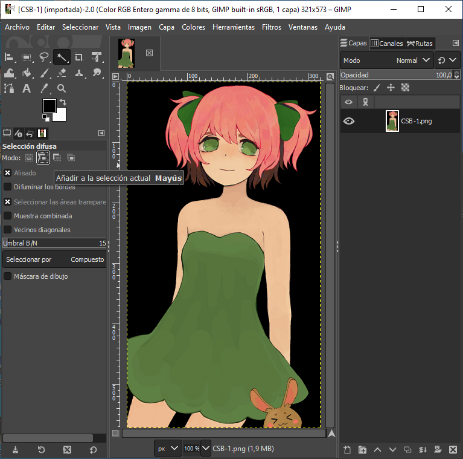
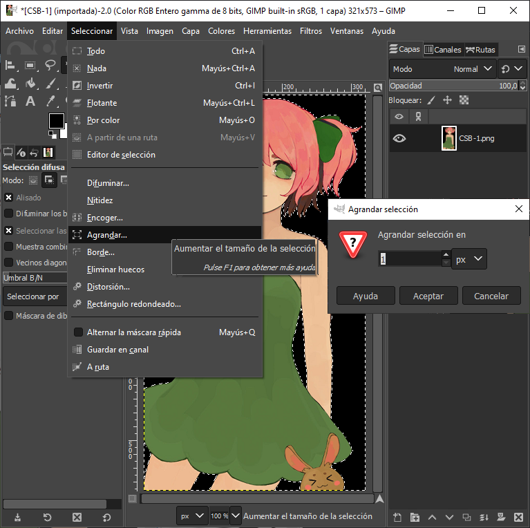
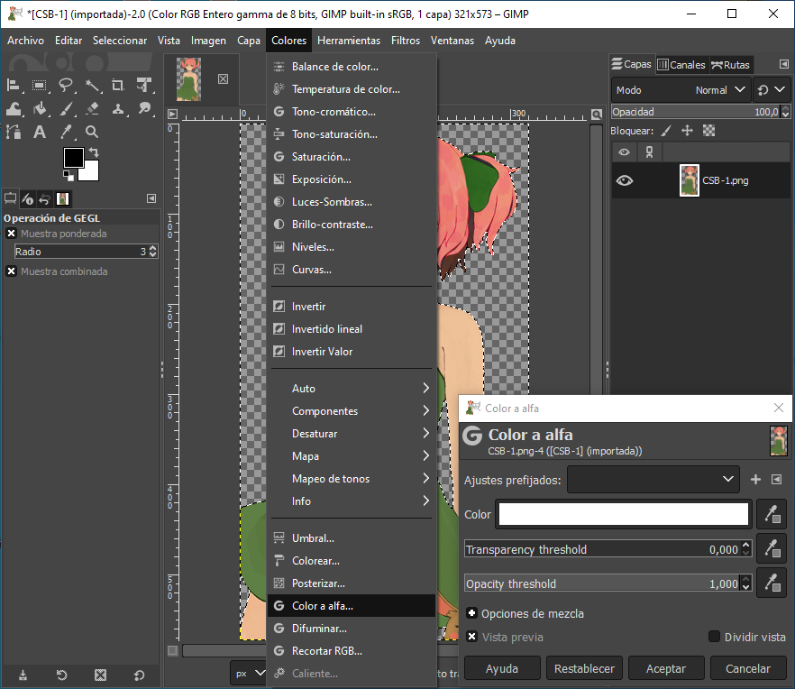
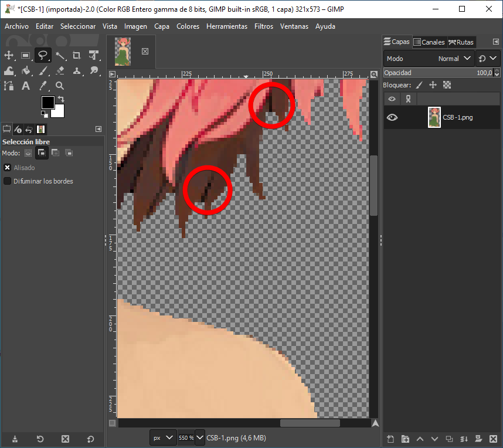

# Cómo cortar imágenes con fondos simples

A continuación, te mostraré una forma rápida de eliminar fondos de un color. Al igual que en el tutorial anterior, aquí también estoy usando GIMP y la imagen que se puede ver.

## Paso 1

Selecciona la herramienta de selección difusa en «Añadir a la selección actual» (esto te ayudará a seleccionar pocas partes a la vez) y selecciona todos los espacios en blanco del fondo que no quieras.

## Paso 2

Ahora que hemos seleccionado el fondo, necesitamos ampliar la selección en 1 píxel. Presiona `Suprimir` para eliminar el fondo seleccionado.

## Paso 3

Es hora de usar nuestro filtro para hacer transparente el fondo eliminado.

## Paso 4

Lamentablemente, después de esto todavía quedarán algunos espacios negros. Sobre todo en lugares con ángulos cerrados. Elige la herramienta Lazo y selecciona con ella estos lugares feos. Presiona `Ctrl` + `F` para repetir la eliminación del color.

## Resultado

Después de eliminar cualquier trozo sobrante, tu imagen debería estar lista.

Este método sólo funciona con un fondo de color, pero con él puedes eliminar el fondo fácil y rápidamente.

