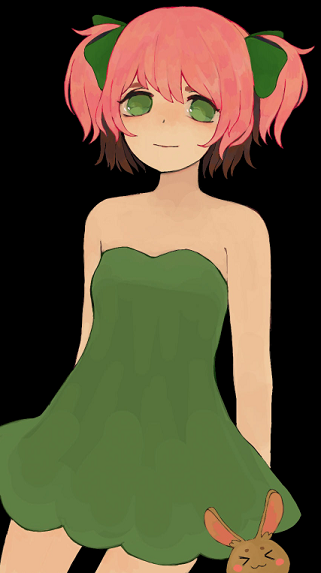
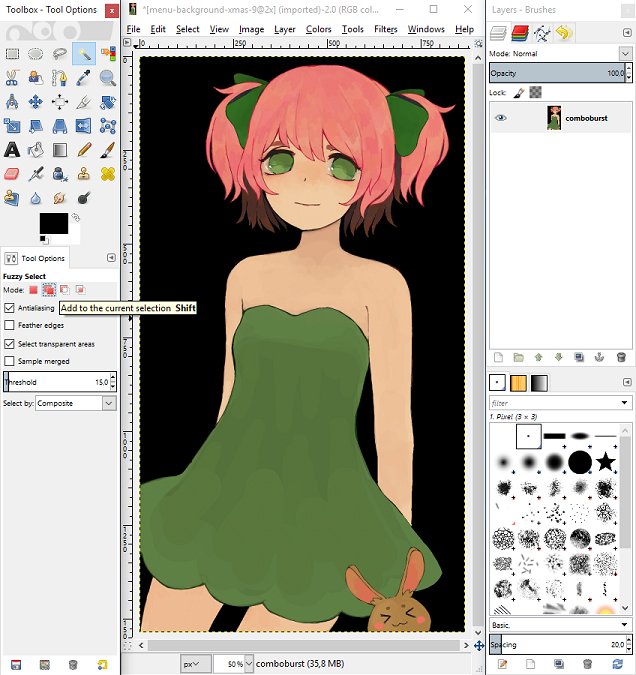
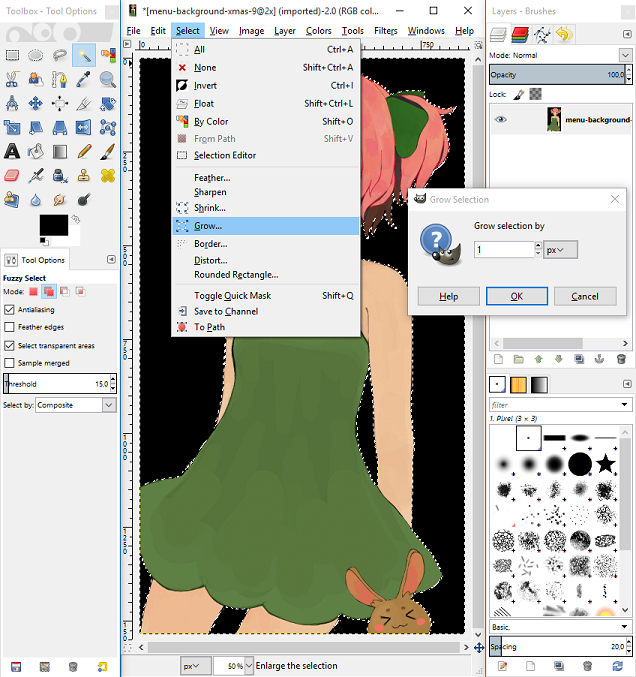
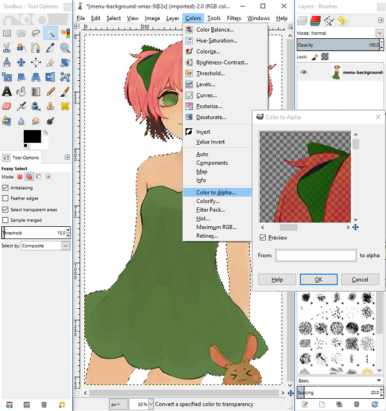
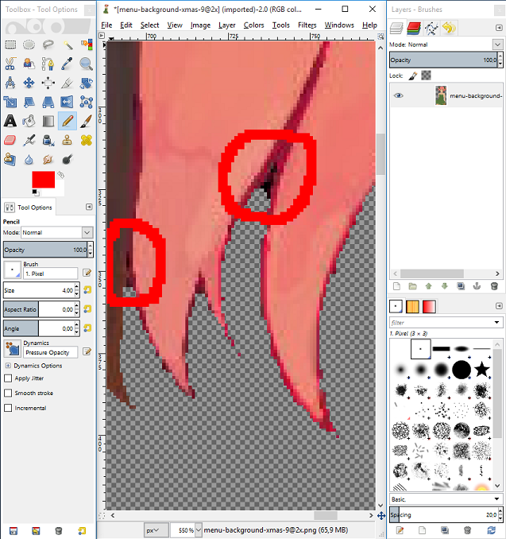
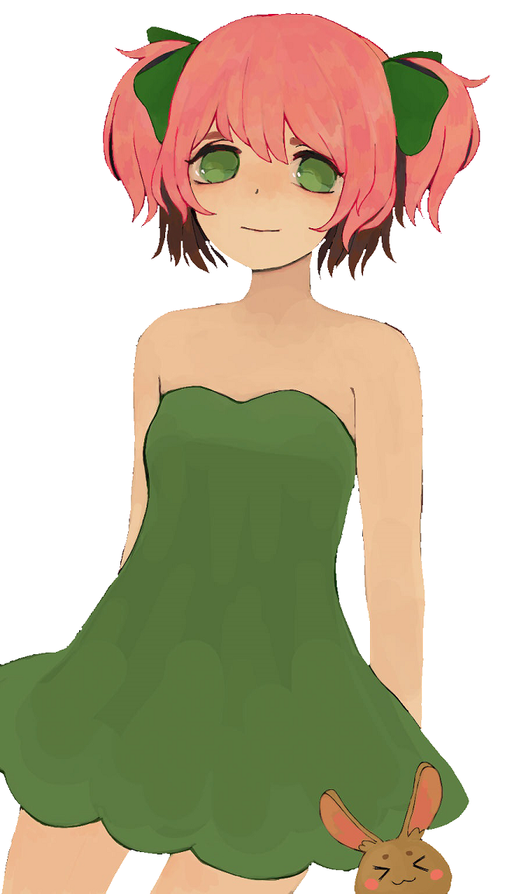

# วิธีตัดภาพพื้นหลังแบบเรียบง่าย (How to crop images with simple backgrounds)

เอาล่ะ ผมจะแสดงวิธีที่รวดเร็วในการลบพื้นหลังที่เป็นสีพื้น (สีเดียว) เช่นเดียวกับบทเรียนก่อนหน้านี้ ผมจะใช้โปรแกรม GIMP และรูปภาพที่คุณเห็นอยู่นี้ครับ

## ขั้นตอนที่ 1 (Step #1)

เลือกเครื่องมือ Magic Wand tool (หรือ Fuzzy Select) ในโหมด "Add to current selection" (โหมดนี้จะช่วยให้เลือกหลายส่วนพร้อมกันได้) จากนั้นให้คลิกเลือกพื้นที่สีขาวของพื้นหลังทั้งหมดที่คุณไม่ต้องการ

## ขั้นตอนที่ 2 (Step #2)

ตอนนี้เราได้เลือกส่วนพื้นหลังไว้แล้ว เราจำเป็นต้องขยายขอบเขตการเลือก (Enlarge selection) ออกไปอีก 1 พิกเซล (1px) จากนั้นกดปุ่ม Del เพื่อลบพื้นหลังที่เลือกไว้ออกไป

## ขั้นตอนที่ 3 (Step #3)

ถึงเวลาใช้ฟิลเตอร์ของเราเพื่อให้พื้นหลังที่ลบออกไปนั้นกลายเป็นแบบโปร่งใส (Transparent)

## ขั้นตอนที่ 4 (Step #4)

น่าเสียดายที่หลังจากทำขั้นตอนที่ผ่านมาแล้ว อาจจะยังเหลือพื้นที่สีดำตกค้างอยู่บ้าง โดยเฉพาะในจุดที่เป็นมุมแหลม ให้เลือกเครื่องมือ Lasso tool แล้วใช้มันเลือกพื้นที่ที่ดูไม่สวยงามเหล่านั้น จากนั้นกด `Ctrl` + `F` เพื่อทำซ้ำขั้นตอนการลบสี

## เสร็จสิ้น (Finish)

หลังจากลบส่วนที่ตกค้างออกหมดแล้ว รูปภาพของคุณก็น่าจะพร้อมใช้งานแล้วครับ

วิธีนี้ใช้ได้เฉพาะกับพื้นหลังที่เป็นสีพื้นสีเดียวเท่านั้น แต่มันช่วยให้คุณลบพื้นหลังออกได้อย่างง่ายดายและรวดเร็วมากครับ

