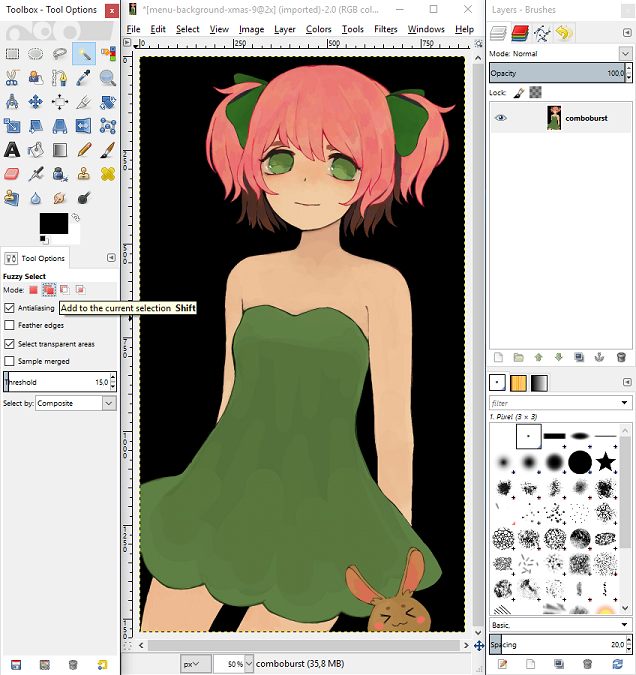

# Basit arkaplanlara sahip görseller nasıl kırpılır

Şimdi, sizlere tek renkli arkaplanları silmenin çabuk bir yolunu göstereceğim. Önceki öğretici gibi burada da GIMP ve aşağıda görebildiğiniz görseli kullanacağım.

## Adım \#1

Sihirli değnek aletini "Seçime ekle" modunda seçin (bu birden fazla parçayı tek seferde seçmenize yardımcı olacak) ve arkaplanın istemediğiniz her boş kısmını seçin.

## Adım \#2

Şimdi, arkaplanı seçtiğimize göre, seçimimizi 1px büyütmemiz gerekiyor. Seçili arkaplanı silmek için Del tuşuna basın.

## Adım \#3

Silinmiş arkaplanı şeffaf yapmak için filtremizi kullanma zamanı.

## Adım \#4

Ne yazık ki, bu adımdan sonra hala biraz daha siyah nokta kalacak. Çoğunlukla dar açılı noktalarda. Bu çirkin noktaları Kement aleti ile seçin. Rengi tekrar tekrar silmek için `Ctrl` + `F` tuşlarına basın.

## Bitiş

Geride kalan tüm artıkları temizledikten sonra, görseliniz hazır olmalı.

Bu yöntem yalnızca tek renkli arkaplanlarda çalışır, ancak bununla kolaylıkla ve hızla arkaplanı silebilirsiniz.

