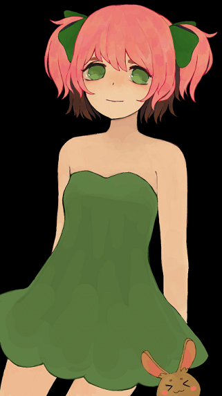
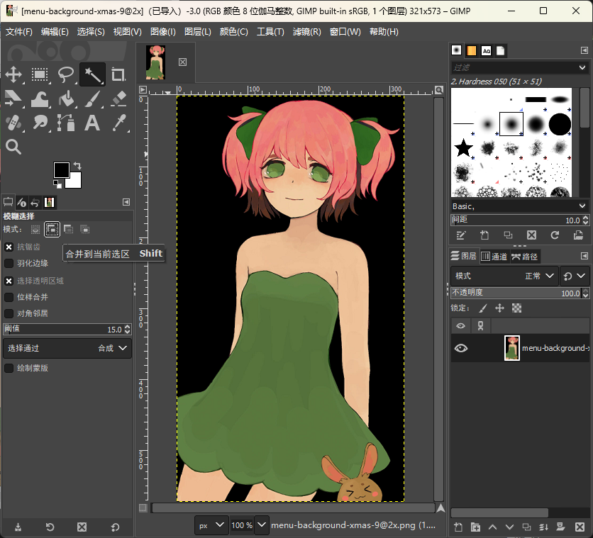
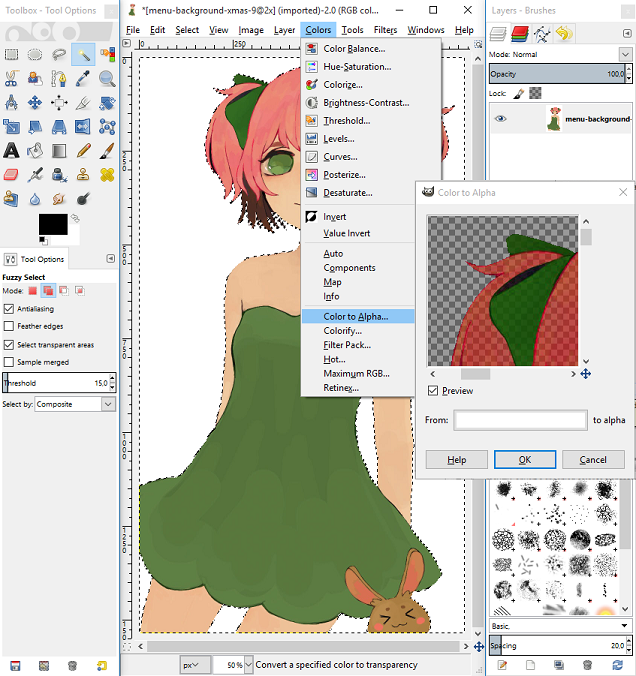
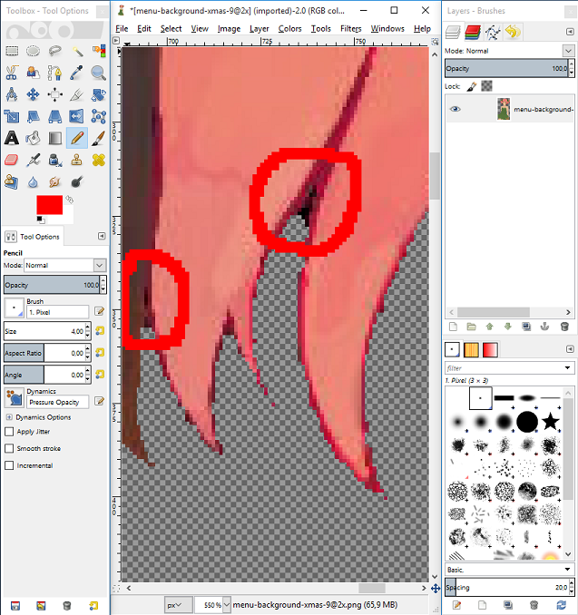
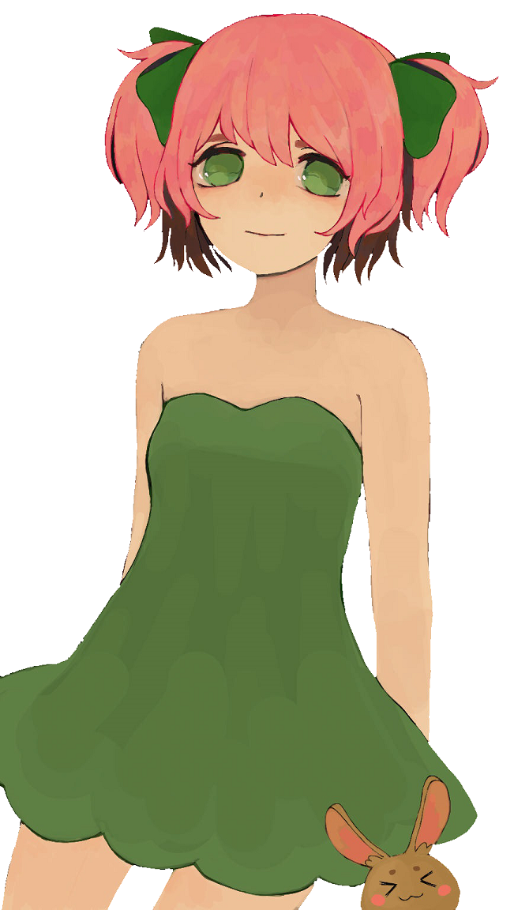

# 如何裁切简单背景的图片

那么，我会展示一种快速去除单色背景的方法。和上一篇教程一样，我还是用 GIMP，图片如你所见。

## 步骤 \#1

选择模糊选择工具中的“合并到当前选区”模式（有助于一次选中多个部分），然后选中所有不想要的空白背景部分。

## 步骤 \#2

现在我们已经选中背景了，需要将选区扩大 1px。按 Del 键删除所选背景。

## 步骤 \#3

现在用颜色过滤器，将删除的背景变成透明。

## 步骤 \#4

遗憾的是，这样做之后仍会有一些黑色区域，大多在角度尖锐处。用“自由选区工具”选中这些难看的地方。按下 `Ctrl` + `F` 反复去除颜色。

## 结束

删除剩下的背景后，图片应该可以使用了。

这种方法只对单色背景有效，但你可以用它简单快速地去除背景。

