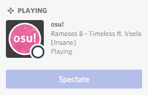
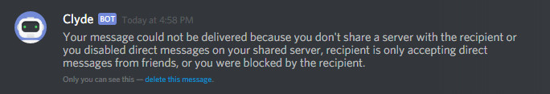

# Discord Rich Presence

Since 2017-10-31, Discord Rich Presence has now made its way to stable!

## What does this mean?

This means that you can now advertise and join osu! multiplayer games from inside Discord servers, see what your friends are playing on osu!, and even ask to join games currently in progress! You can also spectate people who you share servers with.

## How does it work?

- **Update the game by opening the game client first!** This new fancy Discord business only works with the special Halloween version of the game and any newer builds going forward - it will **not** work at all if you do not do this.
- Make sure Discord detects osu! as a registered game on your system — it generally does this by default, so you shouldn't need to worry about it. You can check this in the `App Settings` -> `Games` section of the Discord options menu.
- Turn on the `Display currently running game as status message` option in the `Games` tab. This is not needed to join games that are advertised by others, but it is needed to advertise your own.
- Start any game of multiplayer, head on over to your local Discord haunt and click this icon . It may take a few seconds to appear if you've only just started a game.

Here's a [video of it](https://assets.ppy.sh/media/halloween-2017/themoon.mp4) in action.

If you make a room with a password, people that use your invite don't need to enter anything. Private games at the click of a button with no fuss!

## Joining games

You can also click on the Discord profiles of anyone you share a server with who is playing osu!, and see what they're up to at a glance. If you're friends with them on Discord, you can even ask to join their current multiplayer match.

## Spectating games

This button will automagically change to allow you to spectate people who are playing maps currently as well, so never miss out on your friends failing the same song repeatedly again!

## Known issues

If you send Discord Rich Presence invites too often, you may be temporarily faced with an error from Discord that looks like this:

This is perfectly normal and more misleading on Discord's part than anything else. Wait a few minutes, and you should be fine to send invitations again.
