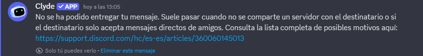

# Discord Rich Presence

Desde el 31 de octubre de 2017, Discord Rich Presence ha llegado a la versión stable.

## ¿Qué significa esto?

Esto significa que ahora puedes anunciar y unirte a partidas multijugador de osu! desde los propios servidores de Discord, ver a qué están jugando tus amigos en osu! e incluso pedir unirte a partidas en curso. También puedes observar a las personas con las que compartes servidores.

## ¿Cómo funciona?

- **¡Actualiza el juego abriendo primero el cliente del juego!** Esta nueva función de Discord solo funciona con la versión especial de Halloween del juego y con las versiones posteriores; si no lo haces, **no** funcionará en absoluto.
- Asegúrate de que Discord detecta osu! como juego registrado en tu sistema; suele hacerlo de forma predeterminada, por lo que no deberías tener que preocuparte. Puedes comprobarlo en la sección `Ajustes de actividad` -> `Juegos registrados` del menú de opciones de Discord.
- Activa la opción `Comparte tus actividades detectadas con los demás` en la pestaña `Privacidad de la actividad`. Esto no es necesario para unirse a juegos promocionados por otros, pero sí para promocionar los tuyos.
- Inicia cualquier partida multijugador, dirígete a tu Discord local y haz clic en este icono [el botón verde brillante delante del signo más](img/shiny-green-button.jpg). Es posible que tarde unos segundos en aparecer si acabas de empezar un juego.

Aquí hay un [vídeo de esto](https://assets.ppy.sh/media/halloween-2017/themoon.mp4) en acción.

Si creas una sala con contraseña, las personas que usen tu invitación no tendrán que introducir nada. ¡Partidas privadas con solo pulsar un botón y sin complicaciones!

## Unirse a un partida

También puedes hacer clic en los perfiles de Discord de cualquier persona con la que compartas un servidor y que esté jugando a osu!, y ver qué están haciendo de un vistazo. Si eres amigo de ellos en Discord, incluso puedes pedirles unirte a su partida multijugador actual.

## Observar partidas

Este botón cambiará automáticamente para permitirte ver también a gente que esté jugando mapas en ese momento, ¡así que no vuelvas a perderte a tus amigos fallando la misma canción repetidamente!

## Problemas conocidos

Si envías invitaciones de Discord Rich Presence con demasiada frecuencia, es posible que te encuentres temporalmente con un error de Discord parecido a este:

Esto es perfectamente normal y más engañoso por parte de Discord que otra cosa. Espera unos minutos y podrás volver a enviar invitaciones.
