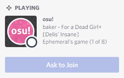
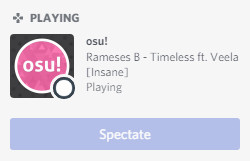
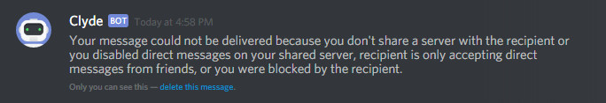

# Discord Rich Presence

ตั้งแต่วันที่ 31-10-2017 ฟีเจอร์ Discord Rich Presence ได้เข้าสู่เวอร์ชัน Stable เรียบร้อยแล้ว!

## สิ่งนี้หมายความว่าอย่างไร?

นั่นหมายความว่าตอนนี้คุณสามารถโฆษณาและเข้าร่วมเกม Multiplayer ของ osu! ได้จากภายในเซิร์ฟเวอร์ Discord, ดูว่าเพื่อนของคุณกำลังเล่นเพลงอะไรอยู่ใน osu! และแม้กระทั่งขอเข้าร่วมเกมที่กำลังดำเนินการอยู่ได้ทันที! นอกจากนี้คุณยังสามารถ Spectate (รับชม) คนที่อยู่ในเซิร์ฟเวอร์เดียวกับคุณได้อีกด้วย

## มันทำงานอย่างไร?

- **อัปเดตเกมโดยเปิดตัวเกมก่อน!** ฟีเจอร์ใหม่ของ Discord นี้จะใช้งานได้กับเวอร์ชันพิเศษ Halloween เป็นต้นไปเท่านั้น - มันจะ**ไม่**ทำงานเลยหากคุณไม่ได้อัปเดตเกม
- ตรวจสอบให้แน่ใจว่า Discord ตรวจพบ osu! เป็นเกมที่ลงทะเบียนไว้ในระบบของคุณ — โดยปกติแล้วระบบจะทำให้อัตโนมัติ ดังนั้นคุณไม่จำเป็นต้องกังวล คุณสามารถตรวจสอบได้ในส่วน `App Settings` -> `Registered Games` ในเมนูตัวเลือกของ Discord
- เปิดตัวเลือก `Display currently running game as a status message` ในแถบ `Activity Privacy` (หรือ `Games`) สิ่งนี้ไม่จำเป็นสำหรับการเข้าร่วมเกมที่คนอื่นชวน แต่จำเป็นสำหรับการโฆษณาห้องเล่นของคุณเอง
- เริ่มเกมในโหมด Multiplayer จากนั้นไปที่ Discord แล้วคลิกไอคอนนี้  ซึ่งอาจใช้เวลาสองสามวินาทีกว่าจะปรากฏขึ้นหลังจากคุณเริ่มเกม

นี่คือ [วิดีโอตัวอย่าง](https://assets.ppy.sh/media/halloween-2017/themoon.mp4) การทำงานของมันครับ

หากคุณสร้างห้องที่มีรหัสผ่าน คนที่กดคำชวนของคุณไม่จำเป็นต้องกรอกรหัสใดๆ ทั้งสิ้น! เข้าเล่นเกมส่วนตัวได้เพียงคลิกปุ่มเดียวโดยไม่มีขั้นตอนยุ่งยาก!

## การเข้าร่วมเกม (Joining games)

คุณยังสามารถคลิกที่โปรไฟล์ Discord ของใครก็ตามที่อยู่ในเซิร์ฟเวอร์เดียวกับคุณที่กำลังเล่น osu! อยู่ และดูว่าพวกเขากำลังทำอะไรได้ทันที หากคุณเป็นเพื่อนกับพวกเขาใน Discord คุณยังสามารถขอเข้าร่วมการแข่งขัน Multiplayer ของพวกเขาได้อีกด้วย

## การรับชมเกม (Spectating games)

ปุ่มนี้จะเปลี่ยนเป็นปุ่มที่อนุญาตให้คุณ Spectate คนที่กำลังเล่นแผนที่อยู่ได้โดยอัตโนมัติ ดังนั้นคุณจะไม่พลาดโอกาสที่จะเห็นเพื่อนของคุณเล่นพลาดในเพลงเดิมซ้ำแล้วซ้ำเล่าอีกต่อไป!

## ปัญหาที่ทราบ (Known issues)

หากคุณส่งคำเชิญ Discord Rich Presence บ่อยเกินไป คุณอาจพบข้อผิดพลาดจาก Discord ชั่วคราวซึ่งหน้าตาเป็นแบบนี้:

นี่เป็นเรื่องปกติและเป็นข้อความที่ค่อนข้างทำให้เข้าใจผิดจากทาง Discord ให้รอสักครู่แล้วคุณจะสามารถส่งคำเชิญได้อีกครั้งครับ