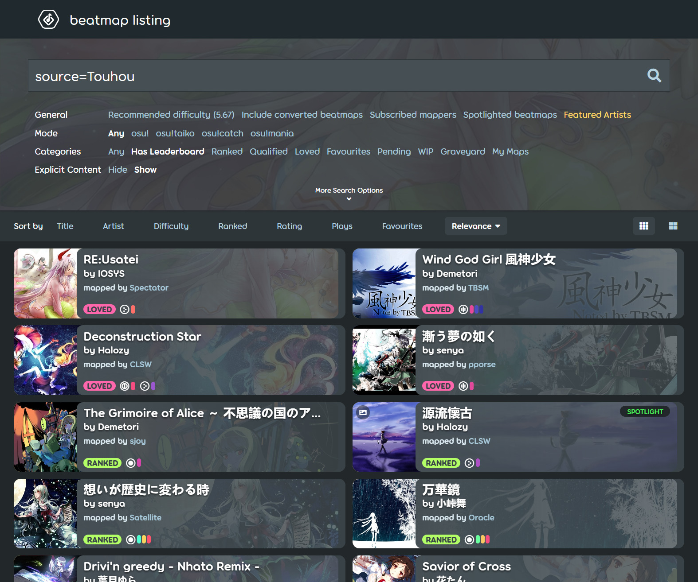

---
tags:
  - Metadata
  - tag
  - tags
---

# Finding Metadata

Metadata is data that defines and describes the characteristics of other data, and sometimes provides extra information.[^metadata] In the context of a [beatmap](/wiki/Beatmap), metadata includes elements such as the song's title, artist, source media, the beatmap's creator, guest mappers and more. These attributes help to describe the beatmap and its associated content. osu! provides a variety of metadata fields including `Title`, `Beatmap Creator` and `Tags`, which allow beatmaps to be effectively organized and discovered.

Finding accurate metadata for your beatmap is, in essence, a process of [SEO](https://en.wikipedia.org/wiki/Search_engine_optimization) (Search Engine Optimization). The more precise and descriptive your metadata is, the easier it becomes for players to find your beatmap. Metadata keywords can be used as filters in [song select](/wiki/Client/Interface#song-select) as well as on the website's [beatmap listing](https://osu.ppy.sh/beatmapsets) page via full-text search. Moreover, well-researched and detailed metadata increases the likelihood that your beatmap will attract modders, nominators, and ultimately progress through the ranking process more smoothly. Therefore, compiling accurate metadata is essential to ensure your beatmap reaches the right audience and receives the attention it deserves.

## General Principles

Due to its SEO-oriented nature, the process of finding and compiling metadata for your beatmap follows several key principles:

- **Accuracy**: Prioritize official sources. Album liner notes, official music videos, and the artist's official website are typically the most reliable references for confirming a song's title and artist name. Check [Primary metadata source](/wiki/Beatmap/Primary_metadata_source) for more details.
- **Consistency**: Take a look at metadata from other beatmaps of the same song or by the same artist. Adopt these conventions where appropriate. This helps maintain a coherent database and enables players to find related beatmaps more easily in a single search.
- **Symmetry**: The discovery process mirrors the search process. The keywords that led you to the song's metadata are likely the same terms players will use to find your beatmap. You can leverage this by incorporating those keywords into your metadata tags.
- **Relevance**: Focus on the most pertinent keywords players are likely to search for. For example, if your beatmap is a cover of a well-known song, consider including the original artist in the tags.

## Starting Off

First, you need to gather some basic information about the song. You may have discovered a track on platforms like [YouTube](https://www.youtube.com) or [SoundCloud](https://soundcloud.com) and obtained the MP3 from there. More often than not, you already know which song you want to map, or you've come across something interesting while browsing.

If you don't recognize the song, you can try identifying it using a music recognition app such as [Shazam](https://www.shazam.com) or [SoundHound](https://music.soundhound.com/soundhound). These tools can identify songs based on a short audio sample. If the song is recognized, the app will provide you with the title, artist and sometimes even album information.

If the song remains unidentified, try searching using any lyrics you remember or by describing its characteristics (e.g., genre, mood, instrumentation) in a search engine. This approach can sometimes lead you to forums, music communities, or social media threads where others have successfully identified the track. Alternatively, you can upload a recording to platforms like [Reddit's r/NameThatSong](https://www.reddit.com/r/NameThatSong/) or [WatZatSong](https://www.watzatsong.com), where music enthusiasts can help identify it for you.

If you've successfully identified the song or already know what you're looking for, the next step is to dig deeper and find accurate metadata through targeted searching.

## Searching Stage

Basically speaking, finding metadata is a process of searching for the song's information on the internet. You can start with general-purpose search engines like [Google](https://www.google.com), [Bing](https://www.bing.com) or [Yandex](https://yandex.com) to locate official titles, artists and other relevant details.

When searching, try using the specific keywords you already know, such as a lyric snippet, a presumed song title, the artist's name or any other unique identifiers. For music that isn't too obscure, top search results will typically lead you to official release pages or major streaming sources.

Please note that finding metadata is often an iterative process rather than a single search. The following tips can help you refine your approach and increase the chances of finding accurate information:

- **Vary your keyword combinations**: If your initial search doesn't yield the desired results, try different combinations of keywords or explore related search terms. For example, if you know the song is from a particular anime, game, or film, include that title in your search query to narrow down the results.
- **Follow the trail**: One source can often lead you to another, more authoritative source. A streaming platform page might link to the artist's official website or social media, which can provide more comprehensive and reliable metadata.
- **Build on what you find**: Use information uncovered in one search as keywords for the next. For example, if your initial search reveals the song's album name but not the artist, use that album name as a new keyword to find the artist. Each piece of discovered information becomes a tool to uncover the next.

## Common Sources

Once you've located potential sources, it's best to consult authoritative references to ensure accuracy. Below is a list of reliable options, categorized by their function:

1. Official & Primary Sources

These are the most reliable sources, as the information comes directly from the artist or rights holder.

- **Album Liner Notes & Digital Booklets:** For physical or digital album purchases, the included liner notes are the definitive source.
- **Artist's Official Website & Social Media:** Artists often post release details, track listings and clarify information about different versions or remixes themselves. This is also crucial for identifying the original context of a song (e.g., a commercial, a web series) when it's not tied to a major game, anime or film. Official Websites can usually be found through a simple search, while social media platforms like [Twitter](https://twitter.com), [Instagram](https://instagram.com), and [Facebook](https://facebook.com) may offer direct insights from artists or their management.
- **Official Music Videos & Lyric Videos:** These usually contain accurate metadata in their descriptions, and the video itself can confirm the song's title and artist. Common platforms for such content include [YouTube](https://www.youtube.com) and [Niconico](https://nicovideo.jp).

2. Official Digital Distribution Platforms

Metadata from these platforms is supplied directly by record labels and distributors, making it highly reliable for standard commercial releases.

- **Global/English:**
  - [**Bandcamp**](https://bandcamp.com): Excellent for independent artists, niche genres, and often includes detailed info directly from the creator. Since artists have direct control over their Bandcamp pages, information found here is often as authoritative as their official website.
  - [**SoundCloud**](https://soundcloud.com): A platform for independent artists and remixes. Many artists use SoundCloud to upload demos, alternate versions, or tracks that may not receive a commercial release. Official artist accounts can be treated as primary sources.

- **Regional Specialists:**
  - *For Japanese Music:* [**Ototoy**](https://ototoy.jp) (ideal for independent, doujin, anime, and Hi-Res music), [**Mora**](http://mora.jp).
  - *For Korean Music:* [**Melon**](https://melon.com), [**Genie**](https://genie.co.kr), [**Bugs**](https://bugs.co.kr) (the dominant local platforms).

3. Music Services & Streaming Platforms

These platforms are widely used and can provide a quick reference for popular music. However, they may not always have the most accurate metadata, especially for niche genres or non-mainstream releases. Always cross-reference with official sources when using these platforms.

- [**Spotify**](https://open.spotify.com): A major global streaming service with a vast catalog.
- [**YouTube Music**](https://music.youtube.com): Similar to Spotify in terms of reliability; often includes user-uploaded content alongside official releases.
- [**iTunes**](https://music.apple.com) / [**Apple Music**](https://music.apple.com): iTunes functions as a digital store (purchase-based), while Apple Music is a streaming service. Cross-referencing with other sources is still recommended.
- [**Amazon Music**](https://music.amazon.com): A major global storefront and streaming platform.

4. Music Metadata & Community Databases

These platforms are built specifically for collecting and organizing release information. They are invaluable for cross-referencing and finding details for non-mainstream music.

- [**MusicBrainz**](https://musicbrainz.org): An open encyclopedia of music metadata. It's highly structured and aims to be a definitive authority.
- [**Discogs**](https://www.discogs.com): A comprehensive crowdsourced database of physical and digital releases. Excellent for finding various editions, label details, and catalog numbers.
- [**VGMdb**](https://vgmdb.net): A specialized database dedicated to video game and anime music. It is the go-to source for soundtracks and related works. Creating a free account on VGMdb also allows you to access user-submitted scans of CD booklets, obi strips, and disc faces, providing a level of detail that approaches the physical product itself.

5. Other Ranked Beatmaps

Checking the metadata of already ranked maps for the same song can be a useful shortcut. However, always verify the information against one of the official sources listed above to ensure its accuracy.

## Practical Tips for Navigating Foreign Language Sites

When searching for metadata, you will often encounter websites in languages you do not understand. This can be intimidating, but there are several simple techniques to navigate these pages effectively without knowing the language.

### Use Your Browser's Find Function

The `Ctrl+F` (or `Cmd+F` on Mac) shortcut is your best friend. Once you land on a page, use it to search for keywords related to your song, for example:

- song title in its original language.
- common terms like "CD", "Music", "Tracklist", or "Discography". These words are often written in English even on sites in other languages.
- any known information such as the artist's name, or album name.

### Look for Visual Cues in URLs

Before clicking any link, hover over it and look at the URL displayed in your browser's status bar (usually at the bottom left). Even if the link text might be in a language you don't understand, the URL often contains recognizable English words like "music", "goods", "discography", "cd", or "product". This can guide you to the right section of the site without needing to read the text.

### Use Catalogue Numbers for Direct Access

Once you have identified a specific album or single, look for its **catalogue number**. This is a unique identifier assigned by the record label (e.g., "SRCL-8641~2" for a Sony Music release). Catalogue numbers can usually be found on databases like [VGMdb](https://vgmdb.net), [Discogs](https://www.discogs.com), or [MusicBrainz](https://musicbrainz.org).

Searching for this number directly (especially when combined with the label name) will often take you straight to the official product page on the label's or distributor's website, bypassing the need to navigate through menus in a foreign language.

## Source & Tags

To recap, the `Source` field should contain The original media the song was produced for, or the media it is most commonly associated with. This is often a game, anime, film, TV series, commercial or web series. If the song is a standalone single or not tied to any particular media, this field can be left blank. With all the information you've gathered, you should be able to fill out the `Source` field with confidence. If the song is associated with a specific media, make sure to use the official title of that media as it appears in your primary source.

`Tags` are a set of keywords that further describe the beatmap. This can include:

- Musical information: genres, instruments, mood (e.g., rock, piano, emotional)
- Contextual information: related characters or series names, album name, remix information
- Beatmap-specific information: difficulty characteristics, guest mapper usernames, contest names
- Additional credits: any artists not mentioned in the Artist field (e.g., featured vocalists, composers, remixers)

and more. The `Tags` field is crucial for helping players discover your beatmap through search and filtering, so it's important to include relevant, accurate, consistent and complete tags based on the information you've gathered.

### Specific topics

There are some specific topics that require special attention when filling out `Source` and `Tags` fields. The most well-known example is Touhou music (both original songs and doujin works). Here is a [Touhou Meta Checklist](https://docs.google.com/spreadsheets/d/e/2PACX-1vSFppuvmorrCF0N90IXbI4fXYiGJEamAc1UAD3CYrsNstsMLd_KA4Pnqc3MdsQo1NkXrT26Yfeclijz/pubhtml?gid=532301260&single=true) which reflects community consensus on tagging conventions for Touhou-themed beatmaps. For other types of music, you can refer to the metadata of already ranked beatmaps for similar songs or by the same artist to get an idea of what tags are commonly used.<!--Source fields of Touhou music also require specific format.-->

## Adhering to the Ranking Criteria

Please note that all metadata must comply with the detailed provisions outlined in the [Ranking Criteria](/wiki/Ranking_criteria) during the [beatmap ranking procedure](/wiki/Beatmap_ranking_procedure). The [Metadata section](/wiki/Ranking_criteria/Metadata) of the Ranking Criteria provides specific rules and guidelines, particularly for handling different versions of songs, various languages, character sets, and special symbols. It also covers edge cases such as situations where romanisations of the song's title and artist cannot be found.

## References

[^metadata]: For more information, see [Metadata - Wikipedia](https://en.wikipedia.org/wiki/Metadata).
