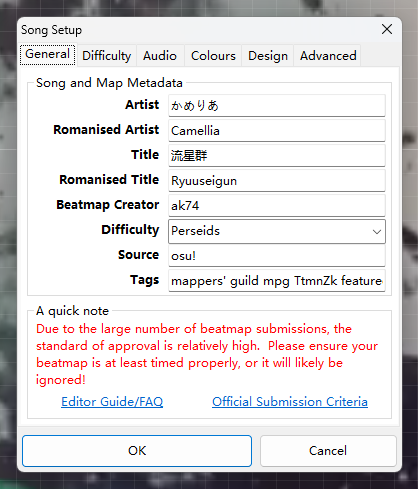
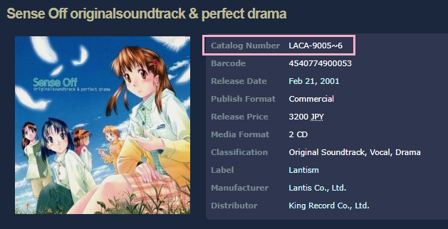
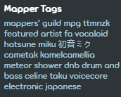

---
tags:
  - Metadata
  - tag
  - tags
---

# Finding metadata

::: infobox

:::

*For metadata fields, see: [Song setup § General](/wiki/Client/Beatmap_editor/Song_setup#general)*\
*See also: [Primary metadata source](/wiki/Beatmap/Primary_metadata_source)*

Good metadata helps players find your beatmap and helps nominators verify it quickly. In practice, fields like `Title`, `Artist`, `Source`, and `Tags` can be filled out in the [Song setup](/wiki/Client/Beatmap_editor/Song_setup) window. This guide explains how to find reliable metadata, compare sources, and fill fields in a way that matches common ranked-map practice.

Metadata keywords can be used as filters in [song select](/wiki/Client/Interface#song-select) as well as on the website's [beatmap listing](https://osu.ppy.sh/beatmapsets) page via full-text search. The more precise and descriptive your metadata is, the easier it becomes for players to find your beatmap. Below is a quick workflow:

1. Start with what you already know: title fragments, artist name, lyrics, album art, or where you found the song.
2. Confirm the core fields (`Title`, `Artist`, and when relevant, `Source`) in primary sources. Note that if various sources show different versions, the one from the primary source should always be prioritised.
3. Use distribution and database sites to cross-check, find aliases, and identify practical keywords to use as tags.
4. Verify everything against [Ranking Criteria § Metadata](/wiki/Ranking_criteria/Metadata).

## Source reliability

Use sources in the order detailed in the table below whenever possible. The goal is to confirm final values from the most authoritative source available, then use lower-priority sources for cross-checking only.

| Priority | Source type | Examples |
| :-- | :-- | :-- |
| 1 | Official/primary sources | Album liner notes and digital booklets, artist's official website and social medias like [Twitter](https://twitter.com), [Instagram](https://instagram.com), and [Facebook](https://facebook.com), official music videos and lyric videos on platforms like [YouTube](https://youtube.com) and [Niconico](https://nicovideo.jp) |
| 2 | Official distribution platforms | [Bandcamp](https://bandcamp.com), [SoundCloud](https://soundcloud.com) for global or English releases, [Ototoy](https://ototoy.jp), [Mora](http://mora.jp) for Japanese releases, [Melon](https://melon.com), [Genie](https://genie.co.kr), [Bugs](https://bugs.co.kr) for Korean releases |
| 3 | Music services/streaming platforms | [Spotify](https://open.spotify.com), [YouTube Music](https://music.youtube.com), [Apple Music](https://music.apple.com), [Amazon Music](https://music.amazon.com) |
| 4 | Metadata/community databases | [MusicBrainz](https://musicbrainz.org), [Discogs](https://www.discogs.com), [VGMdb](https://vgmdb.net) |

Existing ranked beatmaps can also be used as a reference for cross-checking. However, be cautious as they may be outdated or incorrect. Always verify against official sources when possible.

## Useful tips

### Use catalogue numbers for direct access

::: infobox

:::

Once you have identified a specific album or single, look for its [**catalog number**](https://en.wikipedia.org/wiki/Catalog_number_(music)). This is a unique identifier assigned by the record label (e.g., "SRCL-8641~2" for a Sony Music release). Catalog numbers can usually be found on metadata databases mentioned before.

Searching for this number directly (especially when combined with the label name) will often take you straight to the official product page on the label's or distributor's website.

### Navigating foreign-language sources

You can use the quick methods below when a source is not in your language:

- Try to use browser auto-translate if available.
- Use `Ctrl` + `F` / `Cmd` + `F` to find known names, titles, catalog numbers, or terms like "CD", "Music", "Tracklist", or "Discography".
- Check URLs and hover over links for recognisable English words before opening pages.

## Filling tags

When filling metadata, `Tags` is one of the most important fields for discovery. Below are some common categories of tags that are highly recommended for use, depending on the beatmap's content:

- Musical information: genres, instruments (e.g., rock, piano, vocal chop)
- Additional credits: any artists not mentioned in the `Artist` field (e.g., featured vocalists, composers, remixers)
- Contextual information: aliases, series/franchise names, character names, featured artists, album name, remix information
- Beatmap-specific information: guest mapper usernames, contest names, hitsounders, storyboarders, etc.

For example, the tags of [ak74's beatmap of *Camellia - 流星群*](https://osu.ppy.sh/beatmapsets/1188437) can be broken down into the following groups:

::: infobox

:::

- Event involved: `mappers' guild`, `mpg`
- Hitsounder: `ttmnzk`
- Featured artist tag: `featured artist`, `fa`
- Vocaloid: `vocaloid`, `hatsune miku`, `初音ミク`
- Artist alias: `cametak`, `kamelcamellia`
- Song title alias: `meteor shower`
- Genre and language: `dnb`, `drum and bass`, `electronic`, `japanese`
- Guest mappers: `celine`, `taku`, `voicecore`

### Touhou-specific conventions

Touhou metadata has widely used community conventions. The [checklist](https://docs.google.com/spreadsheets/d/e/2PACX-1vSFppuvmorrCF0N90IXbI4fXYiGJEamAc1UAD3CYrsNstsMLd_KA4Pnqc3MdsQo1NkXrT26Yfeclijz/pubhtml) can be summarised as follows:

Necessary ones:

| Tag group | Example | Notes |
| :-- | :-- | :-- |
| Media name | `touhou` |  |
| Media type | `video game` |  |
| Original song name | `Gensokyo Millenium 千年幻想郷　～ History of the Moon` |  |
| Character name | `八意 永琳 eirin yagokoro` | Add this tag if the track is a boss theme |
| Vocalist for vocal arrangements | `ランコ ranko` |  |
| Album name | `TOHO COMPLETE BOX` |  |
| Franchise alias | `東方project` |  |

Highly recommended additional ones:

| Tag group | Example(s) | Notes |
| :-- | :-- | :-- |
| Creator/label credit | `ZUN Team Shanghai Alice` |  |
| Event/convention name | `comiket c85`, `reitaisai` |  |
| Characters involved | `marisa`, `alice` | Characters appearing in the music or background |
| Fan alias | `2hu` | Short alias for "Touhou" |
| Arranger name | `パインツリー` |  |
| Game number | `th8` | Abbreviation for the edition in the series, here "Touhou 8" |
| Stage number | `st1` | Denotes the stage in which this track is used as a stage theme, e.g. here  "Stage 1" |
| Shortened game name | `in` | Abbreviation for the game name, in this case "Imperishable Night" |
| Game name in romaji text | `eiyashou` | Denotes the game's name in romaji text |

Here's an example of a Touhou tag set:

`japanese metal touhou 8 th8 video game Gensokyo Millenium 千年幻想郷　～ History of the Moon 八意 永琳 eirin yagokoro ランコ ranko TOHO COMPLETE BOX 東方project ZUN Team Shanghai Alice comiket 85 c85 2hu パインツリー in`

## Adhering to the Ranking Criteria

Please note that all metadata must comply with the detailed provisions outlined in the [Ranking Criteria](/wiki/Ranking_criteria) during the [beatmap ranking procedure](/wiki/Beatmap_ranking_procedure). The [Metadata section](/wiki/Ranking_criteria/Metadata) of the Ranking Criteria provides specific rules and guidelines, particularly for handling different versions of songs, various languages, character sets, and special symbols. It also covers edge cases such as situations where romanisations of the song's title and artist cannot be found.
