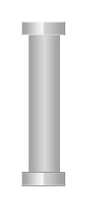
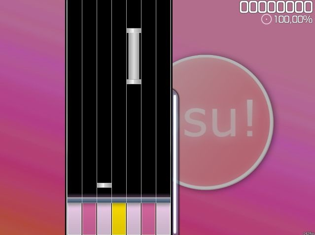

# How To Play Mania

## Почему Мания?

Причин поиграть в манию может быть много - вам не нравится стандартный геймплей, у вас плохая мышка, да и тайко вас не особо привлекает? Добро пожаловать в манию, второй азиатский геймплей в осу!

## Как вообще в это играть?

Во-первых, в мании всего (!) 2 типа нот, которые едут по "рельсам" (их может быть от 4 до 8, но мы тут рассматриваем до 7 включительно) Это обычные:

И холды:

Геймплей состоит из попеременного тыкания в обычные и удержания/отпускания холдов. Рассмотрим скриншот:

Начинать тыкать обычную ноту следует, когда она подлетает к белой линии над "кнопками". Холд же состоит фактически из двух обычных нот и хреновины, которая их соединяет. Чтобы его сыграть вам потребуется нажать (и продолжать удерживать) кнопку когда подлетит первая нота холда и отпустить кнопку ровно в тот момент, когда подлетит вторая.

"Но это же, черт возьми, так легко!", скажете вы. "Авотхрен", скажу я вам.

В отличие от других геймплеев здесь может потребоваться одновременно нажать до 6 (ШЕСТИ) нот! Причем часть из них может быть обычными, а часть - холдами.

Собственно, вот и все основы данного геймплея.
