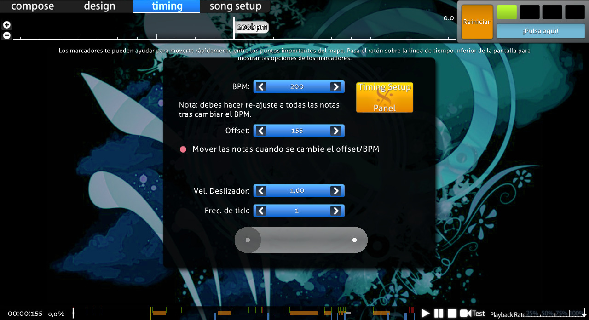
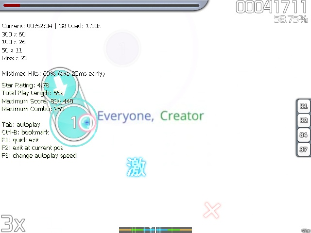

# Cómo temporizar canciones

## Introducción

Temporizar una canción no es tan complicado como puede parecer a primera vista. Solo necesitas dos cosas: sentido del ritmo y algo de destreza. No es necesario tener oído para la música ni experiencia en juegos de ritmo, pero pueden ayudar a mejorar el resultado de tu mapa.

También se supone que debes saber qué es el [BPM](/wiki/Music_theory/Tempo) y la [compensación](/wiki/Offset), y cómo establecer puntos de tiempo no heredados (a menudo llamados offsets rojos).

## Preparación del archivo .mp3

Si vas a trabajar en un beatmap y conseguir que lo clasifiquen, es necesario que un archivo de audio tenga una tasa de bits de entre 128 y 192 kbps. Esto es para garantizar que las canciones tengan una calidad aceptable y no ocupen demasiado espacio en el servidor y en el disco duro. Puedes ver la tasa de bits del audio haciendo clic derecho y seleccionando Propiedades, luego la pestaña Detalles. Si no sabes cómo reducir la tasa de bits (normalmente hasta 192 kbps), hay una [guía en la wiki](/wiki/Guides/Audio_editing) y una [clase de nuestro profesor](https://www.youtube.com/watch?v=muu3HkG38kk). Puedes preguntárselo a tus amigos o en la consola del chat. Si todo lo demás falla, busca/pregunta en los [foros](https://osu.ppy.sh/community/forums/56) o encuentra una manera por ti mismo.

Los preparativos pueden ir desde cortar hasta añadir/eliminar efectos de sonido. Todo esto **es mejor hacerlo antes de temporizar**, ya que **cualquier** edición del audio, incluida la recodificación, *cambiará la temporización*.

## Temporización única (una línea roja)

### Metas y objetivos

Casi cualquier canción tiene ritmo, que funciona de la misma manera que el esqueleto humano. Es la base sobre la que se construye toda la canción; le siguen los instrumentos musicales, y si la canción tiene voz, también la siguen. Cada música tiene su propia estructura, y nuestra tarea aquí es deducirla y recrearla.

Intenta sumergirte e imaginar la estructura de la música, puedes tener en cuenta la división habitual de las líneas (partitura de 4/4, compás estándar, etc.): estos son los lugares donde se encuentran las notas, y la distancia entre ellas viene dada por el BPM de la canción (mayor BPM = menor tiempo necesario para completar un compás). Esto se puede observar visualmente a través de la línea de tiempo en el editor en la parte superior de la pantalla. La compensación es la diferencia de tiempo entre el primer pulso del compás (compensación roja) y el tiempo del archivo .mp3. También puedes consultar [este artículo de Wikipedia](https://es.wikipedia.org/wiki/Ritmo).

Si escuchas lo suficiente, captarás el ritmo de la canción y podrás temporizarla con éxito. El editor calculará la distancia entre las notas, y antes de mapear, solo tenemos que establecer el BPM y el compás correcto.

El plan de acción en pocas palabras:

1. Encontrar el tempo aproximado (BPM) de la canción y la compensación para el archivo de audio
2. Ajustar la compensación con la mayor precisión posible a la canción
3. Ajustar el BPM
4. Establecer el compás correcto. (4/4 o 3/4, normalmente 4/4)
5. Pruébalo. Si es necesario, repite los pasos 2 y 3.

### BPM y compensación

Al buscar estas dos cosas, nos centraremos en los sonidos de fondo, es decir, el instrumento que se usa para crear el ritmo constante (tambores, normalmente). Encuéntralos intuitivamente: por ejemplo, sacude una botella con una sustancia, golpea uniformemente con los dedos sobre la mesa (como si estuvieras tocando el piano), sacude la cabeza (como si estuvieras en una discoteca) o realiza otros movimientos rítmicos (dar palmadas en el estómago como si fueras un bongó, zapatear, silbar, etc.). A veces, la música tiene poco o ningún apoyo instrumental ([como este beatmap](https://osu.ppy.sh/beatmapsets/8894)), en estos casos puedes seguir las voces.

Reproduce tu pista desde el principio y sigue escuchándola hasta que llegues a un punto en el que puedas escuchar claramente el ritmo y captarlo. En este punto, detén la canción, retrocede un poco, empieza a escuchar de nuevo y toca la tecla `T` lo más consistentemente posible (también puedes hacer clic en el botón de la esquina superior derecha que dice «¡Pulsa aquí!», pero el teclado suele dar resultados más precisos). Los parámetros (BPM, Offset) cambiarán con cada nueva pulsación que hagas, pero no te preocupes, ya los arreglarás más adelante. Dedica medio minuto a esto, un minuto como máximo.

#### Cómo encontrar la compensación correcta

Después de pulsar, tenemos una compensación aproximada. Ahora, rebobina la canción hasta el lugar donde oíste el ritmo (en ambas líneas de tiempo, ahora es posible ver una pequeña línea roja. Esa es la compensación), luego mira en la esquina inferior derecha; hay un interruptor para la velocidad de reproducción. Lo usaremos para ralentizar la pista y escuchar cuándo aparece el primer golpe. Lo que tenemos que hacer es que el metrónomo, situado en la esquina superior derecha, empiece a sonar exactamente con el primer golpe.

Elige 50 %, retrocede poco antes de la línea roja y pulsa la barra espaciadora. La canción ahora se reproduce 2 veces más lenta y puedes escuchar la diferencia un poco más fácilmente. Para mover la compensación, usa las flechas arriba y abajo junto al valor actual. Aumenta/disminuye la compensación hasta que desaparezca la diferencia entre el primer tic del metrónomo y el primer golpe de la canción. Las flechas funcionan de la siguiente manera:

- Clic normal: 2 ms
- Mayús + clic: 10 ms
- Ctrl + clic: 1 ms
  - 1000 ms = 1 segundo

Evita usar la velocidad de reproducción al 25 % (y, para ser franco, ralentizar la velocidad de reproducción en absoluto si es posible), ya que da resultados imprecisos e inestables.

#### Cómo encontrar el BPM correcto

Ahora que la compensación es correcta, puedes comprobar el BPM. Determinar correctamente la compensación es importante, ya que disminuye la posibilidad de cometer errores en el BPM más adelante en la edición. Escucha la canción completa desde el momento en que se coloca la línea roja hasta el final. Presta atención a los tics del metrónomo y ajústalo en consecuencia.

- El metrónomo no debe ser ni más lento ni más rápido que la canción. Tienes que arreglarlo si lo escuchas fuera de tiempo.
  - Si el metrónomo suena más rápido que la canción: disminuye el BPM (flecha hacia abajo), si es más lento: aumenta el BPM (flecha hacia arriba).
  - Disminuye la velocidad (75 %, 50 % más o menos si es necesario) si encuentras dificultades.
- Escucha de nuevo y comprueba los tics del metrónomo.

Para comprobar si el BPM es correcto o no, salta al medio o a algún lugar cerca del final de la pista, donde la diferencia entre el tempo de la canción y el metrónomo se acumula y es fácilmente audible. A menudo, el BPM aparecerá como un número entero (sin valores decimales), así que primero intenta establecer el BPM en los números enteros más cercanos para ver si eso te funciona. Después, podrías probar con ajustes más precisos como 101,200 y eventualmente hasta 101,238, por poner algunos ejemplos. Antes de dejar el valor del BPM en centésimas (.01) o décimas (.1), elimínalos o redondéalos y vuelve a escuchar el metrónomo. Si la diferencia es insignificante o te parece más adecuado y preciso (comprueba de nuevo el medio y el final), puedes dejarlo y darlo por terminado. Cuidado: No toda la música electrónica y sintetizada tiene un BPM completamente plano, a pesar de lo común que pueda parecer. En este caso, truncar los decimales puede provocar un problema con el BPM.

### Cómo encontrar el compás correcto

La música consta de estrofas (partes repetitivas). Esta repetición sigue el mismo patrón de sonido en un intervalo de tiempo (como «PataPataPataPon», «DonDonDonKat», «SnareSnareSnareCymbal», «TapTapTapClap» o «Hallelujah»). Esto se explica mejor usando un [metrónomo](https://www.webmetronome.com). Si lo deseas, puedes leer el [artículo sobre el compás de Wikipedia](https://es.wikipedia.org/wiki/Compás_(música)) o echar un vistazo al [hilo de Alace](https://osu.ppy.sh/community/forums/topics/20998).

Así que tenemos que encontrar en qué marco de tiempo vamos a establecer y poner en marcha el metrónomo, es decir, para encontrar un fuerte ritmo sólido llamado «tiempo fuerte» ([aquí hay otro artículo](https://es.wikipedia.org/wiki/Pulso_(música))). Es fácil de detectar; en los tiempos fuertes, los cantantes elevan la voz, la intensidad de la música aumenta y, a veces, se pueden escuchar sonidos fuertes. Si el tiempo fuerte se encuentra justo en la línea roja, entonces es bueno. Si no es así, tendremos que corregirlo moviendo nuestra compensación. Salta a la marca respectiva en la escala de tiempo (establece el divisor de ritmo en la esquina superior derecha en 1/2 o 1/4 si es necesario), luego presiona F6 para ingresar al menú de temporización. Selecciona tu compensación roja (ahí parece un punto) y pulsa el botón «Use current offset» de la izquierda. Luego, con la misma técnica, cámbialo al primer golpe de la canción, porque afecta al pulso de la osu! cookie en el menú principal y a los objetos durante el kiai time.

Lo que queda ahora es el tipo de compás, que es básicamente la cantidad de ritmos fuertes de la canción. Si está bien configurado, el primer tic del metrónomo siempre coincidirá con un tiempo fuerte, y si no es así, entra en el menú de temporización y modifica el parámetro «Time Signature».

En Time Signature, tenemos

- **4/4,** que es «cuatro cuartos» (uno fuerte tres débiles). A esto se le llama temporización común, porque la mayoría de las canciones lo usan.
- **3/4,** que es «tres cuartos» (uno fuerte dos débiles). A esto se le llama temporización de vals.
- **\#/4** (donde \# es cualquier número natural), que es una «temporización exótica». Esta temporización es *extremadamente específica* y apenas se usa en las canciones normales. No lo pruebes a menos que tengas una educación musical adecuada y puedas decir con seguridad que la música lo requiere.

### Prueba

La prueba es la fase en la que introduciremos las notas en el beatmap, de forma similar a la escritura de símbolos musicales en una partitura. Presiona `F1` o pulsa la pestaña «Compose» y coloca algunas notas en la rejilla del editor para que puedas pulsarlas con facilidad.

- Las notas no deberían comenzar inmediatamente en los primeros segundos. Date un poco de tiempo para acostumbrarte al ritmo y empieza con un slider o dos.
- Coloca las notas en las marcas blancas (divisor de ritmo en 1/1; «tiempo fuerte»), y en ningún otro sitio (no uses 1/2 o 1/4 todavía).

Después de mapear, usaremos el modo de prueba (la tecla de acceso rápido es F5), que tiene un mecanismo de información muy útil: muestra la diferencia entre el momento en que aparece una nota en el editor (según el concepto de marco temporal), y el momento en que hacemos clic en ella. Si no tienes problemas de audición, ritmo, reacción, precisión y tarjeta de sonido (o paranoia), puedes continuar. De lo contrario, evita las pruebas independientes. En su lugar, pide juegos de prueba (o por la propia temporización). Puedes recurrir a menudo al canal \#mapping para solicitudes de temporización.

Entonces, pon las notas, presiona F5 (modo de prueba) y pulsa dichas notas con la mayor precisión posible. Un par de consejos:

- Si obtienes juicios distintos a 300, *especialmente* en las dos primeras notas, detén la prueba inmediatamente y ajústala o continúa para ver si hay otros errores.
- El resultado estimado se vuelve lento cuanto más juegas. Por lo tanto, de vez en cuando (20-30 segundos), es mejor detener la prueba (F2) y ejecutarla desde ese mismo lugar (F5 de nuevo) después de descansar un poco.
- Usa hitsounds de clap, pueden ayudarte a conseguir el tempo correcto.

Además de conseguir juicios de 300, tienes que echar un vistazo a la parte izquierda de la ventana del modo de prueba. Hay una línea que se parece a esto en la imagen: **Mistimed Hits: 69% (ave 25ms late).**

- Lo primero es el porcentaje de aciertos inexactos.
  - Debes mantener este valor por debajo, digamos, del 5 %.
    - Los aciertos de 100/50 aumentan el porcentaje mientras que los de 300 lo disminuyen. Los fallos no hacen nada (supone que no estás intentando probar la nota).
- Lo segundo es la diferencia promedio general entre la temporización absoluta (temporización del beatmap) y los aciertos del jugador.
  - Early/Late significa que hacemos clic antes/después de la temporización absoluta en algunos milisegundos.
    - Mantén las lecturas lo más bajas posible (máximo 3-5 ms).
  - Después del juego de prueba, corrige la temporización absoluta en los puntos en los que se produce una mala recepción.
    - Para la temporización adelantada/atrasada, disminuye/aumenta la compensación para un número especificado (para el ejemplo de la imagen, aumenta en 25ms).

No olvides marcar la casilla «Mover las notas cuando se cambie el offset/BPM» en la pestaña timing. De lo contrario, la nota después del cambio permanecerá en la ubicación anterior, quedando desvinculada de la nueva temporización. Después de varias rondas de pruebas, la diferencia de las lecturas promedio disminuirá y se pueden ignorar valores de alrededor de 5 ms. Si tienes la posibilidad de hacerlo, no tengas miedo de aumentar la precisión de la compensación, porque una temporización precisa siempre te ayudará.

Ahora, un par de cosas para recordar sobre la fase de prueba. Primero, asegúrate de que el primer tic del metrónomo y el comienzo de la música estén sincronizados sin retrasos notables (es decir, que la compensación sea correcta). A continuación, comprobamos el BPM. Para el BPM, todas las notas deben estar sincronizadas con la música después de la introducción. Haz algunas pruebas, pero presta atención a estas tres partes:

1. Notas después de la compensación (es decir, el comienzo de la música).
2. En algún lugar a mitad de la canción (para canciones largas).
3. Cerca del final, cuando el ritmo aún es audible y se puede reproducir.

Al final del juego de prueba, comprueba los resultados. Si las notas tienen grandes errores de temporización (por ejemplo, adelantadas/atrasadas en 25 ms) y ves que el error sigue creciendo a lo largo de la prueba, aumenta/disminuye el BPM respectivamente. Cambia el valor gradualmente por décimas, centésimas, etc. (no olvides conservar los ajustes originales como reserva). Con el tiempo, después de varias pruebas y errores, el error de acierto será tan pequeño que podrá omitirse de forma segura sin tener un efecto perjudicial. El porcentaje de aciertos fuera de tiempo debe ser inferior al 5 %, la temporización no debería ser superior a 5 ms antes/después.

Si todo se hace correctamente, ahora tendrás un beatmap temporizado correctamente. A veces, es necesario volver a comprobar la temporización con otros usuarios, sobre todo si no estás muy seguro de ella. Aprende de ello y anímate a preguntar.

## Temporización múltiple (muchas líneas rojas)

### Introducción

Hay situaciones en las que una línea roja no es suficiente (algunos ejemplos serían [Bad Apple](https://osu.ppy.sh/beatmapsets/18260), [DJ Amuro's A](https://osu.ppy.sh/beatmapsets/2997) o [kemu's Ikasama Life Game](https://osu.ppy.sh/beatmapsets/59792)). Admítelo, puede ser desde hard rock, metal, cualquier composición de guitarra, conciertos en vivo, canciones con aceleración/deceleración/pausa audibles ([Black∞Hole's Pluto](https://osu.ppy.sh/beatmapsets/45074)), etc. Incluso usando el metrónomo, ciertas partes de una canción (probablemente en el clímax o en la sección final) ya no encajan con el ritmo anterior. El tempo de la canción sube/baja repentinamente, el cantante empieza a cantar de forma frenética/melódica y se apaga, y los instrumentos musicales suenan mucho/acústicamente. En este caso, desplazar o cambiar la primera línea roja para adaptarla al tempo no servirá de nada.

Puedes pedir ayuda a los demás sobre esto, pero solo hay unas pocas personas que *saben* cómo identificar y trabajar con la temporización múltiple. Además, la gente no te ayudará si no te esfuerzas en tu beatmap o no pareces merecer su tiempo. Puedes hacerlo tú mismo si tienes mucha experiencia y/o bastante precisión, y eres capaz de pulsar las notas correctamente. Esto es vital, porque tendrás que hacer muchos juegos de prueba, y los golpes fuera de tiempo harán que sea frustrante para el jugador.

### ¿Qué debo hacer?

Para empezar, escucha y encuentra todos los lugares en los que cambia el ritmo (el uso del metrónomo es opcional) y refléjalo adecuadamente en el editor, y añade nuevos puntos de tiempo no heredados con la correcta compensación y BPM cuando corresponda. Para ello, usaremos el siguiente plan:

1. Asegúrate de que los parámetros (BPM y compensación) del punto actual se muestren en la línea de tiempo.
2. Durante el juego de prueba, vigila el error de aciertos. Cuando empiece a cambiar, detente.
3. Prueba tu «mapa» varias veces cerca de ese punto. Si ves la misma imagen del error de aciertos aumentando, entonces prueba un poco más.
   - Si hay un cambio notable en el tempo y **no** es el resultado de un golpe temprano o tardío, añade una nueva compensación (también conocido como puntero de tiempo para anular la base) y cámbiala por un número apropiado de milisegundos (el error de aciertos lo dirá).
   - Si no hay ningún cambio, pero ves que el error empieza a aumentar, como si hubieras ajustado mal el BPM (excepto que estaba bien todo el tiempo antes de llegar a ese punto), añade una nueva compensación no heredada y modifica su BPM. Haz esto en la pestaña Timing. (F3) Es decir, usa el metrónomo de osu! y trata de captar un cambio, luego pruébalo como una compensación individual normal. A diferencia de las canciones tradicionales y monótonas, el nuevo valor del BPM puede diferir del promedio. Lo importante es determinarlo con la mayor precisión posible.
4. Después de hacer algunos cambios en la temporización, es necesario volver a ajustar todas las notas de acuerdo con la nueva temporización para la prueba. Esto se hace a través del menú superior: Timing → Reajustar todas las notas. Luego, tienes que comprobar manualmente todas las notas, y hacer algunos juegos de prueba para ver los errores en la colocación de las notas.
5. Prueba una vez más para asegurarte de que la temporización suena correctamente. Si surge un problema, sigue los pasos de arriba.

Estos pasos deben repetirse hasta el final de la canción. Como resultado, obtenemos la línea de tiempo con líneas rojas. Dependiendo de la canción, puede haber muchas, muchas líneas (sin embargo, «más líneas» no siempre significa una «mejor temporización»). Si se hace correctamente, entonces la temporización actual es decente para el mapeo/clasificación. Si lo deseas, puedes (¡y deberías!) solicitar la comprobación de la temporización a otras personas.

El algoritmo para determinar el aumento o la disminución de la temporización es ligeramente diferente:

1. Encuentra un lugar donde cambie el tempo de la canción. Establece una nueva compensación (si es posible, en una marca blanca). Luego, amplía la escala de la línea de tiempo (Alt + rueda hacia arriba o pulsa el botón circular «+»).
2. Coloca una nota dos pulsos por delante con algunos hitsounds (por ejemplo, un hitsound finish de un [conjunto de muestras](/wiki/Client/Beatmap_editor/Compose)) soft. Disminuye la velocidad de reproducción y escúchalo varias veces. Mantén presionada la tecla Mayús y desplaza con cuidado la nota hacia delante o hacia atrás en la línea de tiempo, luego vuelve a escucharla. Repite esto hasta que encuentres la mejor posición para la nota, donde esté sincronizada con la música.
3. Resalta una nota y haz doble clic sobre ella, asegurándote de que no se ha desplazado por accidente después de hacer clic. Ponle una nueva compensación.
4. Aumenta/disminuye el BPM de la compensación anterior, comprobando la diferencia entre la marca anterior a la nueva compensación y la compensación actual en sí. Tu objetivo es eliminar la diferencia entre estos dos ajustando solo el BPM de la primera sección, de modo que la nueva sección se sitúe exactamente en la marca de la compensación anterior.
5. Una vez que hayas terminado, regresa al paso 2.

Repite esto hasta que el BPM esté sincronizado con la ralentización. Después de eso, debes volver a ajustar las notas y hacer algunas pruebas más para fines de depuración. Aunque es probable que tengas que mover todos los puntos después de cada cambio, no temas: muy pocos de ellos cambiarán realmente, el resto solo se reajustarán y se pondrán en la última marca de las secciones anteriores.

### Mejorar el resultado

Si lo que quieres es una temporización extremadamente precisa, definitivamente aún no has terminado. Debe comprobar y eliminar compensaciones innecesarias. Para hacer esto, colocamos notas en todo el mapa (puedes asignar un solo patrón y luego copiarlo, observar solo dos notas para que no se peguen y obtengan los tics correctos) y comenzamos a reproducir. Cualquier error o inconsistencia requerirá una solución, así que arréglalos de manera apropiada, basándote en tus sensaciones, o en la respuesta de los aciertos, o en tu experiencia con la temporización, si la tienes.

Este proceso es definitivamente tedioso. Temporizar un beatmap con una temporización múltiple puede llevar *horas*, dependiendo de la cantidad de cambios y lugares complicados. Además, tendrás que probar la misma parte de las canciones varias veces para asegurarte de que no eres solo tú, probar la mitad de la canción de un tirón o saltar de una parte a otra de las mismas dos o tres partes. Sí, es absolutamente normal hacerlo; intenta anular el error de aciertos o hacerlo lo más cercano a cero posible, preferiblemente inferior a 3-5 milisegundos. Por muy intimidante que sea, no debes desanimarte. Aprende cometiendo errores.

Por último, debemos darte algunos consejos importantes:

- **Siempre haz una copia de seguridad de tu antigua temporización antes de realizar cualquier cambio.**
  - Usa marcadores, copia el archivo .osu o el código de la temporización en el Bloc de notas, o anota el par BPM/Offset en algún papel, en el caso de que un cambio imponga un error mayor.
- **Reajusta las notas después de los cambios en la temporización.**
- **Vigila los resultados de las pruebas.**
- **Confía también en otros sentidos, no uses solo el oído.** A veces, la misma parte de la canción puede percibirse de forma diferente. En resumen, debemos centrarnos en los resultados de las pruebas y no exclusivamente en tus nervios auditivos/audífonos.
- **El error de aciertos inferior a, por ejemplo, 3 ms no significa nada y puede omitirse con seguridad.** Probablemente deberías empezar a preocuparte cuando aumente a 5-6 ms o más.
- **Tómate un descanso.** Come un Kit-Kat. Órdenes del doctor.
- **No pruebes la temporización cuando estés jugando un patrón de streams o jumps; los resultados pueden ser inconsistentes incluso si eres habilidoso.** Deconstruye los patrones complejos y usa patrones sencillos para comprobar la temporización.
  - Sin embargo, asegúrate de **probarlo en el mapa en sí** y no probarlo completamente en un único conjunto de notas copiadas y pegadas.
- **Es mejor temporizar correctamente y con precisión el BPM/Offset que seguir el tipo de compás.** Esto significa que puedes poner una línea roja en cualquier momento, pero solo si es necesario. Si la línea no se coloca en un tiempo fuerte, haz un reinicio del metrónomo lo antes posible, añadiendo una nueva compensación donde debería estar el siguiente tiempo fuerte. Si las nuevas compensaciones aparecen con más frecuencia que una vez cada dos pulsos, puede no tenerse en cuenta.
- **No te apresures a crear nuevas secciones de tiempo.** Es mejor ejecutar la prueba varias veces y luego asegurarse de que realmente se necesita una nueva sección.
  - En lugar de una compensación nueva (a menos que haya un cambio efectivo), a veces es mejor intentar cambiar el BPM del punto actual; sin embargo, es necesario asegurarse de que el inicio de la sección se ha mantenido temporizado correctamente.

## Epílogo

Solo deberías ayudar con la temporización si:

- Tienes experiencia real en la temporización.
- El beatmap tiene errores de temporización significativos (tienes 175 BPM pero el beatmap es de 170 BPM).
- Sabes lo que estás haciendo. No te apresures a ayudar con la temporización múltiple, a menos que estés completamente seguro de que serás capaz de mantener y corregir (si es necesario) el resultado proporcionado al mapper durante todo el proceso de clasificación, y que dicho resultado es correcto o, al menos, más preciso.

Eso es todo lo que necesitas saber sobre la temporización de los beatmaps. Aunque esta guía está escrita para disminuir la cantidad de beatmaps temporizados incorrectamente, puede que no sea perfecta. No dudes en preguntar si tienes algún problema, ya que la temporización no es en absoluto un tema sencillo.
