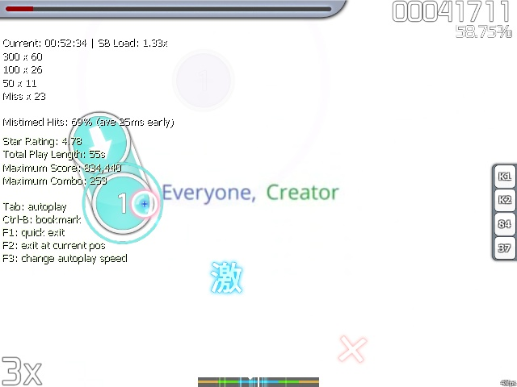

# วิธีตั้งจังหวะเพลง (How to time songs)

## บทนำ (Introduction)

ในความจริงแล้ว การตั้งจังหวะเพลงนั้นไม่ได้ซับซ้อนอย่างที่มันอาจจะดูเหมือนในตอนแรก คุณต้องการเพียงสองสิ่งเท่านั้น: ประสาทสัมผัสเรื่องจังหวะและความคล่องแคล่วบางประการ หูเทพสำหรับดนตรีและประสบการณ์การเล่นเกมจังหวะดนตรีนั้นไม่จำเป็น แต่สามารถช่วยปรับปรุงผลลัพธ์ของแผนที่ของคุณได้

คุณควรจะทราบด้วยว่า [BPM](/wiki/Music_theory/Tempo) และ [offset](/wiki/Offset) คืออะไร และวิธีตั้งค่า uninherited timing points (ที่มักจะถูกเรียกว่า red offsets)

## การเตรียมไฟล์ .mp3 (Preparing the .mp3 file)

หากคุณกำลังจะทำงานกับบีทแมพและทำให้มันได้รับการ ranked (หรือ approved) มันเป็นสิ่งจำเป็นที่ไฟล์เสียงจะต้องมีบิตเรตระหว่าง 128 และ 192 kbps (นี่คือเพื่อให้แน่ใจว่าเพลงมีคุณภาพที่ยอมรับได้และไม่กินพื้นที่บนเซิร์ฟเวอร์และฮาร์ดไดรฟ์ของคุณมากเกินไป) คุณสามารถดูบิตเรตของเสียงได้โดยการคลิกขวาที่ไฟล์และเลือก Properties จากนั้นไปที่แถบ Details หากคุณไม่ทราบวิธีลดบิตเรต (โดยปกติจะลดลงเหลือ 192 kbps) มี [หน้าวิกิ](/wiki/Guides/Audio_editing) และ [การบรรยายของศาสตราจารย์ของเราเอง {ลิงก์ตรงไปยัง YouTube}](https://www.youtube.com/watch?v=muu3HkG38kk) คุณสามารถถามเพื่อนของคุณหรือสอบถามใน Chat Console หากทุกอย่างล้มเหลว ให้ค้นหา/ถามบน [ฟอรัม](https://osu.ppy.sh/community/forums/56) หรือหาวิธีด้วยตัวคุณเอง

การเตรียมการอาจมีตั้งแต่การตัดแต่งไปจนถึงการเพิ่ม/ลบเอฟเฟกต์เสียงใดๆ ทั้งหมดนี้ **ควรทำก่อนการตั้งจังหวะจะดีที่สุด** เนื่องจากการแก้ไขเสียง **ใดๆ** รวมถึงการ re-encoding จะทำให้ *timing เปลี่ยนไป*

## การตั้งจังหวะแบบจุดเดียว (Single timing (One Red))

### เป้าหมายและวัตถุประสงค์ (Goals and Objectives)

เพลงเกือบทุกเพลงมีจังหวะ ซึ่งทำงานในลักษณะเดียวกับโครงกระดูกของมนุษย์ มันคือฐานที่เพลงทั้งเพลงถูกสร้างขึ้นมา; มันถูกติดตามโดยเครื่องดนตรี และหากเพลงมีเนื้อร้อง พวกเขาก็เดินตามมันเช่นกัน ดนตรีแต่ละชนิดมีโครงสร้างของตัวเอง และงานการตั้งจังหวะของเราที่นี่คือการอนุมานและสร้างโครงสร้างนั้นขึ้นมาใหม่

ลองพยายามจุ่มตัวคุณเองลงไปและจินตนาการถึงโครงสร้างของดนตรี คุณสามารถนำการแบ่งเส้นตามปกติ (แผ่นเพลงของ 4/4, Standard Time Signature) เข้ามาใช้ได้ — เหล่านี้คือสถานที่ที่ตัวโน้ตตั้งอยู่ และระยะห่างระหว่างพวกมันจะถูกกำหนดโดยค่า BPM ของเพลง (BPM ที่สูงขึ้น = ใช้เวลาน้อยลงในการทำหนึ่ง time signature/measure ให้เสร็จ) สิ่งนี้สามารถสังเกตได้ด้วยตาผ่าน timeline ใน editor ที่ด้านบนของหน้าจอ Offset คือความต่างของเวลาระหว่างจังหวะแรกของ time signature (red offset) และเวลาในไฟล์ .mp3 คุณยังสามารถตรวจสอบ [บทความนี้บน Wikipedia](https://en.wikipedia.org/wiki/Rhythm) ได้อีกด้วย

ฟังให้นานพอ แล้วคุณจะจับจังหวะของเพลงได้และจากนั้นก็จะตั้งจังหวะมันได้สำเร็จ ระยะห่างระหว่างตัวโน้ตจะถูกคำนวณโดยตัว editor และก่อนที่จะทำการ mapping เราเพียงแค่ต้องตั้งค่า BPM และ timing signature ให้ถูกต้องเท่านั้น

ดังนั้นแผนการดำเนินงานโดยสรุปคือ:

1. ค้นหาความเร็วโดยประมาณ (BPM) ของเพลงและ offset สำหรับไฟล์เสียง;
2. ปรับ offset ให้แม่นยำที่สุดเท่าที่จะเป็นไปได้กับตัวเพลง;
3. ปรับค่า BPM;
4. ตั้งค่า time signature ให้ถูกต้อง (4/4 หรือ 3/4, โดยปกติคือ 4/4);
5. ทดสอบมัน หากจำเป็น ให้ทำซ้ำขั้นตอนที่ 2 และ 3

### BPM และ offset

เมื่อค้นหาสองสิ่งนี้ เราจะมุ่งเน้นไปที่เสียงพื้นหลัง นั่นคือเครื่องดนตรีที่ใช้สร้างจังหวะคงที่ (โดยปกติคือกลอง) ค้นหาพวกมันด้วยสัญชาตญาณ — ตัวอย่างเช่น เขย่ากระป๋องที่มีของข้างใน, เคาะนิ้วบนโต๊ะอย่างสม่ำเสมอ (เหมือนกับเล่นเปียโน), ส่ายหัว (เหมือนกับอยู่ในดิสโก้) หรือขยับจังหวะอื่นๆ (ตบหน้าท้องเหมือนกลองบองโก, เต้นแท็ป, ผิวปาก เป็นต้น) บางครั้งดนตรีก็มีเครื่องดนตรีสนับสนุนน้อยมากหรือไม่มีเลย ([ตัวอย่างบีทแมพ](https://osu.ppy.sh/beatmapsets/8894)) และในกรณีเช่นนี้คุณสามารถเดินตามเนื้อร้องได้

เล่นเพลงของคุณตั้งแต่เริ่มต้นและฟังไปเรื่อยๆ จนกว่าคุณจะมาถึงจุดที่คุณได้ยินจังหวะชัดเจนและจับมันได้ ณ จุดนี้ ให้หยุดเพลง เลื่อนกลับไปเล็กน้อย เริ่มฟังอีกครั้งและเคาะปุ่ม `T` ให้สม่ำเสมอที่สุดเท่าที่จะเป็นไปได้ (คุณสามารถคลิกปุ่มที่มุมขวาบนที่เขียนว่า "Tap here!" ได้เช่นกัน แต่คีย์บอร์ดมักจะให้ผลลัพธ์ที่แม่นยำกว่า) พารามิเตอร์ (BPM, Offset) จะเปลี่ยนไปทุกครั้งที่คุณเคาะใหม่ แต่ไม่ต้องกังวลไป คุณจะมาปรับให้มันนิ่งในภายหลัง ใช้เวลาสักครึ่งนาทีกับเรื่องนี้ หรืออย่างมากที่สุดหนึ่งนาที

#### การหา offset

หลังจากเคาะแล้ว เราจะได้ค่า offset โดยประมาณ คราวนี้ ให้เลื่อนเพลงกลับไปยังสถานที่ที่คุณได้ยินจังหวะ (บนเส้น timeline ทั้งสอง ตอนนี้จะเห็นเส้นสีแดงเล็กๆ นั่นคือ offset) จากนั้นมองที่มุมขวาล่าง; จะมีสวิตช์ปรับความเร็วในการเล่น เราจะใช้มันเพื่อชะลอเพลงลงและฟังว่าเมื่อไหร่ที่จังหวะแรกปรากฏขึ้น สิ่งที่เราต้องทำคือทำให้เมโทรนอม ซึ่งอยู่ที่มุมขวาบน เริ่มส่งเสียงติ๊กตรงกับจังหวะแรกพอดี

เลือก 50% เลื่อนกลับไปเล็กน้อยก่อนถึงเส้นแดงแล้วกด spacebar ตอนนี้เพลงจะเล่นช้าลง 2 เท่าและคุณจะสามารถได้ยินความแตกต่างได้ง่ายขึ้นเล็กน้อย ในการเลื่อน offset ให้ใช้ลูกศรขึ้นและลงถัดจากค่าปัจจุบัน เพิ่ม/ลด offset จนกว่าความแตกต่างระหว่างเสียงติ๊กแรกของเมโทรนอมและจังหวะแรกของเพลงจะหายไป ลูกศรทำงานดังนี้:

- คลิกปกติ: 2ms
- Shift + คลิก: 10ms
- Ctrl + คลิก: 1ms
  - 1,000ms = 1 วินาที

หลีกเลี่ยงการใช้การเล่นที่ 25% (และพูดกันตามตรง คือเลี่ยงการชะลอการเล่นลงเลยหากคุณทำได้) เนื่องจากมันให้ผลลัพธ์ที่ไม่แม่นยำและไม่เสถียร

#### การหา BPM

ตอนนี้เมื่อ offset ถูกต้องแล้ว คุณสามารถตรวจสอบ BPM ได้แล้ว การกำหนด offset ให้ถูกต้องนั้นสำคัญ เนื่องจากมันจะช่วยลดโอกาสในการทำ BPM ผิดพลาดในภายหลังของการแก้ไข ฟังเพลงทั้งเพลงตั้งแต่จุดที่วางเส้นแดงไว้จนถึงตอนจบ สังเกตเสียงติ๊กของเมโทรนอมและปรับแต่งมันตามนั้น

- เมโทรนอมไม่ควรจะช้ากว่าหรือเร็วกว่าเพลง คุณต้องแก้ไขมันหากคุณได้ยินว่ามันไม่ตรง
  - หากเมโทรนอมติ๊กเร็วกว่าเพลง: ให้ลด BPM (ลูกศรลง), หากช้ากว่า: ให้เพิ่ม BPM (ลูกศรขึ้น)
  - ชะลอความเร็วลง (75%, 50% หรือประมาณนั้นหากจำเป็น) หากคุณพบความยากลำบาก
- ฟังอีกครั้งและตรวจสอบเสียงติ๊กของเมโทรนอม

เพื่อตรวจสอบว่า BPM ถูกต้องหรือไม่ ให้กระโดดไปที่ตรงกลางหรือแถวๆ ตอนจบของเพลง ซึ่งความแตกต่างระหว่างจังหวะเพลงและเมโทรนอมจะสะสมและได้ยินได้ง่าย บ่อยครั้งที่ BPM จะออกมาเป็นจำนวนเต็ม (ไม่มีค่าทศนิยม) ดังนั้นให้ลองตั้งค่า BPM เป็นจำนวนเต็มที่ใกล้ที่สุดก่อนเพื่อดูว่ามันใช้ได้สำหรับคุณไหม หลังจากนั้น คุณอาจลองปรับแต่งให้แม่นยำยิ่งขึ้น เช่น 101.200 และในที่สุดเป็น 101.238 เพื่อยกตัวอย่างสักเล็กน้อย ก่อนที่จะทิ้งค่า BPM ไว้ในหลักร้อย (.01) หรือหลักสิบ (.1) ให้ลบออกหรือปัดเศษขึ้นแล้วฟังเมโทรนอมอีกครั้ง หากความแตกต่างไม่มีนัยสำคัญหรือคุณพบว่ามันเหมาะสมและแม่นยำกว่า (ตรวจสอบตรงกลางและช่วงจบอีกครั้ง) คุณก็สามารถเก็บมันไว้และจบงานได้ ระวัง: ไม่ใช่ดนตรีอิเล็กทรอนิกส์และดนตรีสังเคราะห์ทั้งหมดจะมี BPM ที่นิ่งสนิท แม้ว่ามันจะดูเป็นเรื่องปกติแค่ไหนก็ตาม การตัดทศนิยมทิ้งอาจส่งผลให้เกิดปัญหา BPM ในกรณีนี้

### การหา time signature

ดนตรีประกอบด้วยบท (stanza - ส่วนที่ซ้ำกัน) การซ้ำกันนี้เดินตามรูปแบบเสียงเดียวกันในกรอบเวลา (เช่น "PataPataPataPon", "DonDonDonKat", "SnareSnareSnareCymbal", "TapTapTapClap" หรือ "Hallelujah") สิ่งนี้อธิบายได้ดีที่สุดโดยการใช้ [เมโทรนอม](https://webmetronome.com) หากคุณต้องการ คุณสามารถอ่าน [บทความเกี่ยวกับ Time Signature](https://en.wikipedia.org/wiki/Time_signature) หรือแอบดูที่ [กระทู้ของ Alace](https://osu.ppy.sh/community/forums/topics/20998) ได้

ดังนั้นเราต้องหาว่าในกรอบเวลาไหนที่เราจะตั้งค่าและเริ่มเมโทรนอม นั่นคือการหาจังหวะที่หนักแน่นและแข็งแกร่งที่เรียกว่า downbeat ([นี่คือบทความอื่น](https://en.wikipedia.org/wiki/Beat_%28music%29)) มันง่ายที่จะสังเกต; ในช่วง downbeat นักร้องจะยกเสียงของพวกเขาขึ้น ความเข้มข้นของดนตรีจะเพิ่มขึ้น และบางครั้งคุณจะได้ยินเสียง finish hitsounds หาก downbeat ตั้งอยู่ตรงเส้นแดงพอดี นั่นก็ถือว่าดี หากไม่เป็นเช่นนั้น เราต้องแก้ไขโดยการเลื่อน offset ของเรา กระโดดไปยังขีดจังหวะที่เกี่ยวข้องบน timeline (ตั้งค่า beat snap divisor ที่มุมขวาบนเป็น 1/2 หรือ 1/4 หากจำเป็น) จากนั้นกด F6 เพื่อเข้าสู่เมนู Timing เลือก red offset ของคุณ (มันดูเหมือนจุดในนั้น) และกดปุ่ม "Use current offset" ทางด้านซ้าย จากนั้นใช้วิธีเดิม เลื่อนมันกลับไปยังจังหวะแรกสุดของเพลง เพราะมันส่งผลต่อการเต้นของวงกลม osu! ในเมนูหลักและวัตถุที่ใช้กดในช่วง kiai times

สิ่งที่เหลืออยู่ตอนนี้คือ Time Signature ซึ่งโดยพื้นฐานแล้วคือจำนวนของจังหวะหนักของเพลง เมื่อกำหนดค่าอย่างถูกต้อง เสียงติ๊กแรกของเมโทรนอมจะตรงกับจังหวะหนักเสมอ และหากไม่ตรง ให้เข้าสู่เมนู Timing และปรับเปลี่ยนพารามิเตอร์ "Time Signature"

ภายใต้ Time Signature เรามี

- **4/4,** ซึ่งคือ "สี่ส่วนสี่" (หนึ่งหนัก สามเบา) สิ่งนี้เรียกว่า Common timing เพราะเพลงส่วนใหญ่ใช้สิ่งนี้
- **3/4,** ซึ่งคือ "สามส่วนสี่" (หนึ่งหนัก สองเบา) สิ่งนี้เรียกว่า Waltz timing
- **\#/4** (โดยที่ \# คือจำนวนนับใดๆ), ซึ่งคือ "exotic timing" จังหวะนี้มีความ *เฉพาะเจาะจงอย่างยิ่ง* และแทบจะไม่ถูกใช้ในเพลงปกติ อย่าลองสิ่งนี้เว้นแต่คุณจะมีการศึกษาด้านดนตรีที่เหมาะสมและสามารถบอกได้อย่างมั่นใจว่าดนตรีต้องการมัน

### การทดสอบ (Testing)

การทดสอบคือขั้นตอนที่เราจะวางตัวโน้ตจริงๆ ลงในบีทแมพ คล้ายกับการเขียนสัญลักษณ์ดนตรีลงในแผ่นเพลง กด `F1` หรือกดแถบ "Compose" และวางโน้ตบางส่วนลงบนตารางการทำแมพเพื่อให้คุณสามารถกดมันได้โดยง่าย

- ตัวโน้ตไม่ควรเริ่มต้นทันทีในช่วงไม่กี่วินาทีแรก ให้เวลาตัวเองในการทำความคุ้นเคยกับจังหวะและเริ่มด้วย slider สักตัวหรือสองตัว;
- วางตัวโน้ตบนขีดสีขาว (Beat Snap Divisor อยู่ที่ 1/1; "Strong beat") และไม่วางที่อื่น (ยังไม่ต้องใช้ 1/2 หรือ 1/4)

หลังจากการทำแมพ เราจะใช้ Test Mode (ปุ่มลัดคือ F5) ซึ่งมีกลไกการสะท้อนกลับที่มีประโยชน์มาก: มันแสดงความแตกต่างระหว่างเวลาที่โน้ตปรากฏใน editor (ตามแนวคิดกรอบเวลา) และจังหวะที่เราคลิกมัน หากคุณไม่มีปัญหากับการได้ยิน, จังหวะ, การตอบสนอง, ความแม่นยำ และซาวด์การ์ด (หรือความระแวง) คุณก็สามารถทำต่อไปได้ มิฉะนั้น ให้ละเว้นจากการทดสอบด้วยตนเอง ให้ร้องขอการ testplays (หรือการตั้งจังหวะเอง) แทน คุณมักจะสามารถมองหาช่อง #mapping สำหรับการร้องขอการตั้งจังหวะได้

ดังนั้น ให้วางโน้ต กด F5 (โหมดทดสอบ) และกดโน้ตดังกล่าวให้แม่นยำที่สุดเท่าที่จะเป็นไปได้ คำแนะนำเล็กน้อย:

- หากคุณได้รับ hitbursts อื่นที่นอกเหนือจาก 300 โดยเฉพาะในโน้ตสองสามตัวแรก ให้หยุดการทดสอบทันทีและปรับแต่งมัน หรือทำต่อไปเพื่อดูว่ามีข้อผิดพลาดอื่นอีกไหม
- ผลลัพธ์ที่ประเมินจะเริ่มเฉื่อยชาลงเมื่อคุณเล่นนานขึ้น ดังนั้น เป็นครั้งคราว (20 ~ 30 วินาที) จะดีกว่าถ้าหยุดการทดสอบ (F2) และรันมันจากที่เดิมนั้นอีกครั้ง (F5 อีกรอบ) หลังจากพักสักครู่;
- ใช้เสียง clap hitsounds มันสามารถช่วยให้จังหวะถูกต้องได้ (ใช้โดย "Practice mode" ของ DDR)

นอกจากการได้รับ 300 hitbursts แล้ว คุณต้องแอบดูที่ด้านซ้ายมือของหน้าต่างการทดสอบ จะมีบรรทัดหนึ่งที่ดูประมาณนี้: **Mistimed Hits: 69% (ave 25ms late).** \[อ้างอิงภาพ\]

- ตัวแรกคือเปอร์เซ็นต์ของการกดที่ไม่แม่นยำ
  - คุณต้องรักษาค่านี้ให้ต่ำกว่า เช่น 5%
    - hitbursts 100/50 จะเพิ่มเปอร์เซ็นต์ในขณะที่ 300 จะลดเปอร์เซ็นต์ การ Miss จะไม่ส่งผลอะไร (มันถือว่าคุณไม่ได้พยายามทดสอบโน้ตตัวนั้น)
- ตัวที่สองคือค่าเฉลี่ยความแตกต่างโดยรวมระหว่างจังหวะที่สมบูรณ์ (timing ของบีทแมพ) และการกดของผู้เล่น
  - Early/Late หมายความว่าเราคลิกเร็วไป/ช้าไปกว่าจังหวะที่สมบูรณ์เป็นจำนวนมิลลิวินาที
    - รักษาค่าที่อ่านได้ให้ต่ำที่สุดเท่าที่จะเป็นไปได้ (สูงสุด 3-5 ms)
  - หลังจากการ testplay ให้แก้ไขจังหวะที่สมบูรณ์ในจุดที่คุณได้รับค่าที่ไม่ดี
    - สำหรับจังหวะที่เร็วไป/ช้าไป ให้ลด/เพิ่ม offset ตามจำนวนที่ระบุ (สำหรับตัวอย่างในภาพ ให้เพิ่มไป 25ms)

อย่าลืมติ๊กถูกที่ช่องบนหน้าต่าง timing ("Move already placed notes when changing the offset/BPM") มิฉะนั้น ตัวโน้ตหลังการเลื่อนจะยังคงอยู่ที่ตำแหน่งเดิม และจะไม่ตรงกับขีดจังหวะ (unsnapped) จาก timing ใหม่ หลังจากการทดสอบหลายรอบ ความแตกต่างของค่าเฉลี่ยที่อ่านได้จะลดลง และค่าที่อยู่แถวๆ ~5ms สามารถมองข้ามได้ อย่ากลัวที่จะทำ offset ให้แม่นยำขึ้นหากคุณมีความสามารถที่จะทำได้ เพราะจังหวะที่แม่นยำจะช่วยเสมอ

คราวนี้ มีสองสามสิ่งที่ต้องจำเกี่ยวกับขั้นตอนการทดสอบ อย่างแรก ตรวจสอบให้แน่ใจว่าเสียงติ๊กแรกของเมโทรนอมและการเริ่มต้นของดนตรีนั้นประสานกันโดยไม่มีความหน่วงที่สังเกตได้ (offset ถูกต้อง) ต่อไป เราตรวจสอบ BPM สำหรับ BPM ตัวโน้ตทั้งหมดควรจะประสานกับดนตรีหลังจากช่วงนำ (intro) ทำการ testplays บางส่วน แต่ให้ความสนใจกับสามส่วนนี้:

1. ตัวโน้ตหลังจาก offset (นั่นคือช่วงเริ่มต้นของดนตรี)
2. ที่ไหนสักแห่งในช่วงกลางของเพลง (สำหรับเพลงที่ยาว)
3. ใกล้ช่วงจบ เมื่อจังหวะยังคงได้ยินได้และสามารถเล่นได้

ในตอนท้ายของ testplay ให้ตรวจสอบผลลัพธ์ หากตัวโน้ตมีข้อผิดพลาดของจังหวะที่หนักหน่วง (เช่น เร็วไป/ช้าไป 25ms) และคุณเห็นว่าข้อผิดพลาดนั้นใหญ่ขึ้นเรื่อยๆ ตลอดการทดสอบ ให้เพิ่ม/ลด BPM ตามลำดับ เปลี่ยนค่าทีละน้อยในหลักสิบ, หลักร้อย และต่อไปเรื่อยๆ (อย่าลืมเก็บการตั้งค่าเดิมไว้เป็นทางสำรอง) ในที่สุด หลังจากลองผิดลองถูกหลายครั้ง ข้อผิดพลาดในการกดจะเล็กลงจนสามารถมองข้ามได้อย่างปลอดภัยโดยไม่ส่งผลเสีย (เปอร์เซ็นต์ Mistimed hits ควรน้อยกว่า 5%, จังหวะควรไม่เร็วไป/ช้าไปเกิน ~5ms)

หากทุกอย่างทำอย่างถูกต้อง ตอนนี้คุณก็มีบีทแมพที่ตั้งจังหวะได้อย่างเหมาะสมแล้ว บางครั้ง มันจำเป็นที่จะต้องตรวจสอบจังหวะซ้ำอีกครั้งกับผู้ใช้คนอื่น โดยเฉพาะอย่างยิ่งหากคุณไม่มั่นใจเกินไปเกี่ยวกับมัน เรียนรู้จากมัน และจงกล้าที่จะถาม

## การตั้งจังหวะหลายจุด (Multitiming (Many Red))

### บทนำ (Introduction)

มีสถานการณ์ที่แถบสีแดงอันเดียวไม่เพียงพอ (ตัวอย่างบางส่วนจะเป็น [Bad Apple](https://osu.ppy.sh/beatmapsets/18260), [DJ Amuro's A](https://osu.ppy.sh/beatmapsets/2997) หรือ [kemu's Ikasama Life Game](https://osu.ppy.sh/beatmapsets/59792)) ยอมรับเถอะว่ามันสามารถมีได้ตั้งแต่ ฮาร์ดร็อก, เมทัล, บทประพันธ์กีตาร์ใดๆ, คอนเสิร์ต, การแสดงสด, เพลงที่มีการเร่ง/ผ่อน/หยุดที่ได้ยินได้ ([Black∞Hole's Pluto](https://osu.ppy.sh/beatmapsets/45074)) และอื่นๆ แม้จะใช้เมโทรนอม บางส่วนของเพลง (มักจะเป็นช่วงไคลแมกซ์หรือช่วงจบ) มันจะไม่ลงล็อคกับจังหวะก่อนหน้าอีกต่อไป ความเร็วของเพลงจู่ๆ ก็เพิ่มขึ้น/ลดลงวูบหนึ่ง, นักร้องจู่ๆ ก็เริ่มร้องอย่างบ้าคลั่ง/ไพเราะและหลุดไป, และเครื่องดนตรีถูกเล่นอย่างหนักหน่วง/อคูสติก ในสถานการณ์นี้ การเลื่อนหรือเปลี่ยนแถบสีแดงอันแรกเพื่อให้เข้ากับความเร็วจะไม่ช่วยอะไร

คุณสามารถขอความช่วยเหลือจากคนอื่นในเรื่องนี้ได้ แต่มีเพียงไม่กี่คนเท่านั้นที่ *รู้วิธี* ระบุและทำงานกับ multi-timing ยิ่งไปกว่านั้น ผู้คนจะไม่ช่วยคุณหากคุณไม่พยายามกับบีทแมพของคุณหรือดูเหมือนจะไม่คุ้มค่ากับเวลาของพวกเขา คุณสามารถทำสิ่งนี้ได้ด้วยตัวเองหากคุณมีประสบการณ์มากและ/หรือมีความแม่นยำที่ดีพอ และสามารถกดโน้ตได้อย่างถูกต้อง นี่เป็นสิ่งสำคัญมาก เพราะคุณจะต้องทำการ test plays จำนวนมาก และการกดที่ไม่ตรงจังหวะจะทำให้ผู้เล่นหงุดหงิด

### ฉันต้องทำอย่างไร? (What do I do?)

เริ่มต้นด้วยการฟังและค้นหาสถานที่ทั้งหมดที่จังหวะเปลี่ยน (การใช้เมโทรนอมเป็นทางเลือก) และสะท้อนสิ่งนี้ลงใน editor อย่างเหมาะสม และเพิ่ม uninherited timing points ใหม่พร้อม offset และ BPM ที่ถูกต้องในจุดที่เหมาะสม ในการทำเช่นนี้ เราจะใช้แผนงานต่อไปนี้:

1. ตรวจสอบให้แน่ใจว่าพารามิเตอร์ (BPM และ offset) ของจุดปัจจุบันแสดงอยู่ใน timeline;
2. ในขณะที่ทำ testplaying ให้จับตาดู hit error เมื่อมันเริ่มเปลี่ยน ให้หยุด;
3. ทดสอบ "แมพ" ของคุณหลายๆ ครั้งแถวๆ จุดนั้น หากคุณเห็นภาพเดิมของ hit error ที่เพิ่มขึ้น ให้ทดสอบต่ออีกหน่อย;
   - หากมีการเลื่อนของความเร็วที่สังเกตได้ และมัน **ไม่ใช่** ผลลัพธ์ของการกดเร็วไป/ช้าไป ให้เพิ่ม offset ใหม่ (หรือเรียกว่าตัวชี้เวลาเพื่อ override ฐานเดิม) และเลื่อนมันตามจำนวนมิลลิวินาทีที่เหมาะสม (hit error จะบอกคุณเอง);
   - หากไม่มีการเลื่อน แต่คุณเห็นว่าข้อผิดพลาดเริ่มเพิ่มขึ้น ราวกับว่าคุณตั้ง BPM ผิด (ยกเว้นว่ามันยังดีมาตลอดก่อนจะมาถึงจุดนั้น) ให้เพิ่ม uninherited offset ใหม่และเปลี่ยนค่า BPM ของมัน ทำสิ่งนี้ที่แถบ Timing (F3) นั่นคือ ใช้ osu!metronome และพยายามจับการเปลี่ยนแปลง จากนั้นทดสอบมันเหมือนกับ offset เดี่ยวปกติ ไม่เหมือนกับเพลงดั้งเดิมและเพลงที่จำเจ ค่า BPM ใหม่อาจแตกต่างจากค่าเฉลี่ย สิ่งสำคัญคือกำหนดมันให้แม่นยำที่สุดเท่าที่จะเป็นไปได้
4. หลังจากทำการเปลี่ยนแปลงจังหวะบางอย่างแล้ว คุณต้องทำการ resnap โน้ตทั้งหมดตามแผนจังหวะใหม่เพื่อการทดสอบ สิ่งนี้ทำผ่านเมนูด้านบน: Timing → Resnap All Notes จากนั้น คุณต้องตรวจสอบตัวโน้ตทั้งหมดด้วยตนเอง และทำ testplay เพื่อดูข้อผิดพลาดในการวางโน้ตผิดที่/ผิดจังหวะ;
5. ทดสอบอีกครั้งเพื่อให้แน่ใจว่าจังหวะฟังดูถูกต้อง หากปัญหาเกิดขึ้น ให้เริ่มใหม่ตั้งแต่ต้น

ขั้นตอนเหล่านี้ควรทำซ้ำไปจนจบเพลง ผลลัพธ์ที่เราได้คือ timeline ที่มีแถบสีแดงอยู่บนนั้น ขึ้นอยู่กับตัวเพลง มันอาจจะมีแถบจำนวนมาก (อย่างไรก็ตาม "แถบที่มากกว่า" ไม่ได้หมายถึง "จังหวะที่ดีกว่า" เสมอไป) หากทำถูกต้อง จังหวะปัจจุบันก็ถือว่าใช้ได้สำหรับการ mapping/ranking คุณสามารถ (และควร!) ร้องขอการตรวจสอบจังหวะจากคนอื่นหากคุณต้องการ

อัลกอริทึมสำหรับการตั้งจังหวะช่วงเร่งความเร็ว/ผ่อนความเร็วจะแตกต่างกันเล็กน้อย:

1. ค้นหาสถานที่ที่ความเร็วเพลงเปลี่ยน ตั้งค่า offset ใหม่ (หากเป็นไปได้ ให้วางบนขีดขาว) จากนั้นขยายมาตราส่วน timeline (Alt + หมุนล้อขึ้น หรือกดปุ่มวงกลม "+");
2. วางโน้ตล่วงหน้าไปสองจังหวะพร้อมเสียง hitsounds บางอย่าง (ตัวอย่างเช่น finish hitsound จาก soft [sampleset](/wiki/Client/Beatmap_editor/Compose)) ชะลอความเร็วในการเล่นลงและฟังมันสองสามครั้ง กด Shift ค้างไว้และเลื่อนโน้ตไปข้างหน้าหรือข้างหลังอย่างระมัดระวังบน timeline จากนั้นฟังมันอีกครั้ง ทำซ้ำจนกว่าคุณจะพบตำแหน่งที่ดีที่สุดสำหรับโน้ตที่มันประสานกับดนตรี;
3. เน้นที่ตัวโน้ตและดับเบิลคลิกที่มัน ตรวจสอบให้แน่ใจว่ามันไม่ได้เลื่อนโดยบังเอิญหลังจากที่คุณคลิกมัน วาง offset ใหม่ลงบนนั้นพอดี;
4. เพิ่ม/ลด BPM ของ offset ก่อนหน้า ตรวจสอบความแตกต่างระหว่างขีดจังหวะก่อน offset ใหม่และตัว offset ใหม่เอง เป้าหมายของคุณคือลบความแตกต่างระหว่างสองสิ่งนี้โดยการปรับแต่งเพียงแค่ BPM ของส่วนแรก เพื่อให้ส่วนใหม่ถูกวางลงบนขีดจังหวะของ offset ก่อนหน้าพอดี
5. หลังจากคุณทำเสร็จแล้ว ให้กลับไปที่ขั้นตอนที่ 2

ทำซ้ำไปเรื่อยๆ จนกว่า BPM จะซิงค์กับการผ่อนความเร็ว หลังจากนั้น คุณควร resnap โน้ตและทำการ testplays เพิ่มเติมเพื่อวัตถุประสงค์ในการแก้ไขข้อผิดพลาด แม้ว่าคุณอาจจะต้องเลื่อนจุดทั้งหมดหลังจากทุกการเปลี่ยนแปลง แต่อย่ากลัวไป: มีเพียงไม่กี่จุดเท่านั้นที่จะเปลี่ยนจริงๆ ที่เหลือจะเป็นเพียงการถูก resnap และวางลงบนขีดจังหวะสุดท้ายของส่วนก่อนหน้า

### การปรับปรุงผลลัพธ์ (Improving result)

หากคุณต้องการจังหวะที่แม่นยำอย่างยิ่ง มันยังไม่จบเพียงเท่านี้แน่นอน คุณต้องตรวจสอบและลบ offset ที่ไม่จำเป็นออก ในการทำเช่นนี้ เราวางโน้ตไปทั่วทั้งแมพ (คุณสามารถกำหนดรูปแบบเดียวแล้วก๊อปปี้มัน คอยดูแค่ไม่ให้โน้ตสองตัวติดกันและวางลงบนขีดที่ถูกต้อง) และเริ่มเล่น ข้อผิดพลาดและความไม่สม่ำเสมอใดๆ จะต้องมีการแก้ไข ดังนั้นให้แก้ไขพวกมันในลักษณะที่เหมาะสม ตามความรู้สึกของคุณ หรือการตอบสนองของการกด หรือประสบการณ์การตั้งจังหวะ หากคุณมี

กระบวนการนี้มันน่าเบื่ออย่างแน่นอน การตั้งจังหวะบีทแมพที่มี multitiming อาจใช้เวลาเป็น *ชั่วโมง* ขึ้นอยู่กับจำนวนของการเปลี่ยนแปลงและสถานที่ที่ยากลำบาก นอกจากนี้ คุณจะต้องทดสอบส่วนเดิมของเพลงหลายๆ ครั้งเพื่อให้แน่ใจว่ามันไม่ใช่แค่คุณที่กดพลาด ทดสอบครึ่งเพลงในการรันครั้งเดียว หรือกระโดดไปมาระหว่างส่วนเดิมสองหรือสามส่วน ใช่ มันเป็นเรื่องปกติอย่างยิ่งที่จะทำเช่นนั้น; มุ่งเป้าไปที่การทำให้ hit error เป็นศูนย์หรือทำให้มันใกล้เคียงศูนย์ที่สุดเท่าที่จะเป็นไปได้ โดยเฉพาะอย่างยิ่งน้อยกว่า 3-5 มิลลิวินาที แม้ว่ามันจะน่าหวั่นใจ แต่คุณก็ไม่ควรท้อถอย เรียนรู้จากการทำผิดพลาด

ในตอนท้าย เราควรจะบอกเคล็ดลับสำคัญบางอย่างแก่คุณ:

- **สำรอง (Backup) timing เดิมของคุณไว้เสมอก่อนจะทำการเปลี่ยนแปลงใดๆ**
  - ใช้ bookmarks, ก๊อปปี้ไฟล์ .osu หรือ timing code ลงใน Notepad หรือจดคู่ BPM/Offset ลงบนกระดาษ ในกรณีที่การเปลี่ยนแปลงทำให้เกิดข้อผิดพลาดที่ใหญ่กว่าเดิม
- **Resnap โน้ตหลังจากมีการเปลี่ยนแปลงจังหวะ**
- **คอยจับตาดูผลการทดสอบ**
- **พึ่งพาสัมผัสอื่นๆ ด้วย อย่าใช้เพียงแค่หูของคุณ** บางครั้ง ส่วนเดียวกันของเพลงสามารถรับรู้ได้แตกต่างกัน สรุปคือ เราต้องมุ่งเน้นไปที่ผลการทดสอบ และไม่ใช่แค่ประสาทหู/เครื่องช่วยฟังของคุณทั้งหมด
- **Hit error ที่น้อยกว่า เช่น 3 ms ไม่มีความหมายและสามารถมองข้ามได้อย่างปลอดภัย** คุณควรจะเริ่มกังวลเมื่อมันเพิ่มขึ้นเป็น 5-6 ms หรือมากกว่านั้น
- **พักบ้าง** กิน Kit-Kat หมอสั่ง
- **อย่าทดสอบจังหวะในขณะที่เล่นรูปแบบ stream หรือ jumps; ผลลัพธ์อาจไม่สม่ำเสมอแม้ว่าคุณจะเก่งก็ตาม** ถอดโครงสร้างรูปแบบที่ซับซ้อนและใช้รูปแบบที่เรียบง่ายสำหรับการตรวจสอบจังหวะ
  - อย่างไรก็ตาม ตรวจสอบให้แน่ใจว่าได้ **ทดสอบมันบนแมพจริงๆ** และไม่ได้ทดสอบมันบนชุดโน้ตที่ก๊อปปี้วางเพียงอย่างเดียว
- **มันดีกว่าที่จะตั้งจังหวะ BPM/Offset ให้ถูกต้องและแม่นยำมากกว่าการเดินตาม Time Signature** นี่หมายความว่าคุณสามารถวางเส้นแดงเมื่อไหร่ก็ได้ แต่เฉพาะเมื่อมันจำเป็นเท่านั้น หากเส้นไม่ได้ถูกวางลงบนจังหวะหนัก ให้ทำการรีเซ็ตเมโทรนอมโดยเร็วที่สุด โดยการเพิ่ม offset ใหม่ในจุดที่จังหวะหนักถัดไปควรจะเป็น หาก offset ใหม่ปรากฏขึ้นบ่อยกว่าหนึ่งครั้งในสองจังหวะ มันสามารถถูกมองข้ามได้
- **อย่ารีบร้อนที่จะสร้าง timing sections ใหม่** มันดีกว่าที่จะรันการทดสอบหลายๆ ครั้ง และจากนั้นค่อยแน่ใจว่า section ใหม่นั้นจำเป็นจริงๆ
  - แทนที่จะใช้ offset ใหม่ (เว้นแต่จะมีการเลื่อนความเร็วจริงๆ) บางครั้งมันดีกว่าที่จะลองเปลี่ยน BPM ของจุดปัจจุบัน; อย่างไรก็ตาม มันจำเป็นที่ต้องตรวจสอบให้แน่ใจว่าช่วงเริ่มต้นของ section นั้นยังคงถูกตั้งจังหวะอย่างถูกต้อง

## บทส่งท้าย (Epilogue)

คุณควรจะช่วยเรื่องการตั้งจังหวะก็ต่อเมื่อ:

- คุณเป็นการส่วนตัวมีประสบการณ์จริงในการตั้งจังหวะ
- บีทแมพนั้นมีข้อผิดพลาดของจังหวะที่รุนแรง (คุณได้ 175 BPM แต่บีทแมพเป็น 170 BPM)
- คุณรู้ว่าคุณกำลังทำอะไรอยู่ โปรดอย่ารีบร้อนที่จะช่วยเรื่อง multi timing เว้นแต่คุณจะมั่นใจอย่างยิ่งว่าคุณจะสามารถรักษาและแก้ไข (หากจำเป็น) ผลลัพธ์ที่มอบให้แก่ mapper ได้ตลอดกระบวนการ ranking และผลลัพธ์ดังกล่าวนั้นถูกต้องหรืออย่างน้อยก็แม่นยำกว่า

นั่นควรจะเป็นทั้งหมดที่คุณจำเป็นต้องรู้เกี่ยวกับการตั้งจังหวะบีทแมพ แม้ว่าคู่มือนี้จะถูกเขียนขึ้นเพื่อลดจำนวนบีทแมพที่ตั้งจังหวะไม่ถูกต้อง แต่มันอาจจะไม่สมบูรณ์แบบ อย่าลังเลที่จะถามไปรอบๆ หากคุณกำลังมีปัญหาใดๆ เพราะการตั้งจังหวะไม่ใช่หัวข้อที่ง่ายเลย
