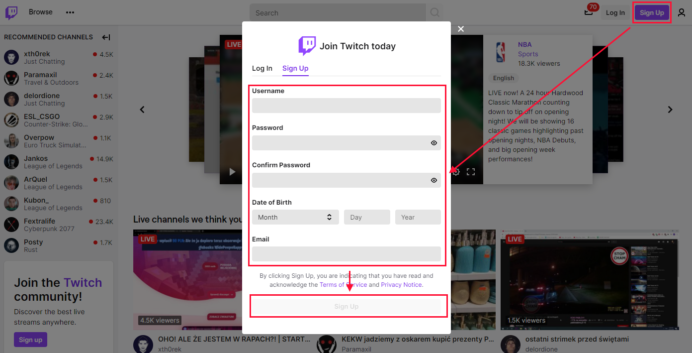

# Livestreaming osu!

In this guide, you will how to livestream osu! on Twitch using [OBS Studio](https://obsproject.com/). Doing so is a relatively simple process, although it might require a reliable computer able to both run and livestream osu!.

## Preparing Twitch for streaming

### Creating an account

Before you setup the streaming app, you will first need to create an account on Twitch. Proceed to [Twitch's website](https://twitch.tv) and click the `Sign Up` button in the top right - you will be prompted with a registration form. Fill in the fields and click `Sign Up` again.

Now you will be asked to enter a verification code that was sent on your email address. After that, your account will be accessible at `twitch.tv/<username>` and ready to go!

### Preparing your account

Now that you have a Twitch account, you will need to setup it for livestreaming osu!. From the main page, click on your avatar in the top right and select `Creator Dashboard` from the list.

Creator Dashboard is the place, where you can configure your stream information, chat moderation, profile info, and more. For now, we will focus on stream information. From the main page of the dashboard, click on the `Stream Manager` button on the left, and then choose the `Edit Stream Info` option on the right.

Now you will be prompted with an edit box of your stream's info. You are free to fill in any of these fields, but in this guide we will only cover the `Title` and `Category` boxes. The title should comprehend what will be briefly done in the stream. It should also be inviting for people visiting the list of available streams. The category must be set to the game you are playing at the moment, which we will set to `osu!`.

---

After you are finish editing you stream's information, click the `Done` button. Now click on the `Preferences` button on the left, and choose `Channel`. Look for the `Primary Stream key` option and click `Copy`. Save the copied text in a notepad - we will need it later on.

