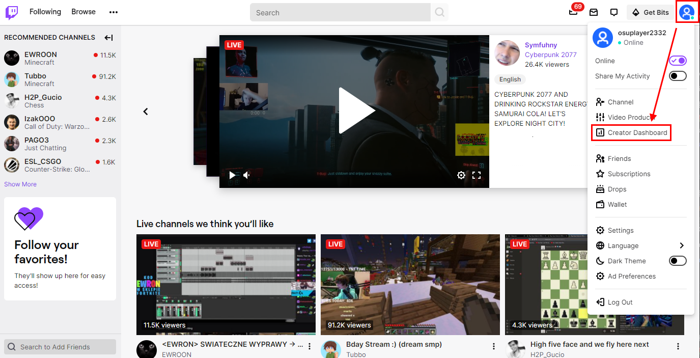
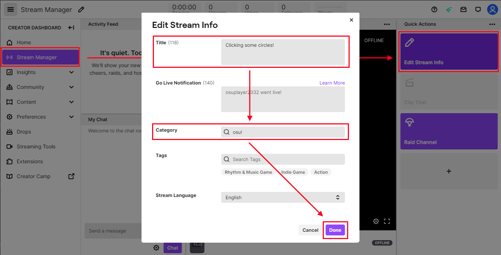
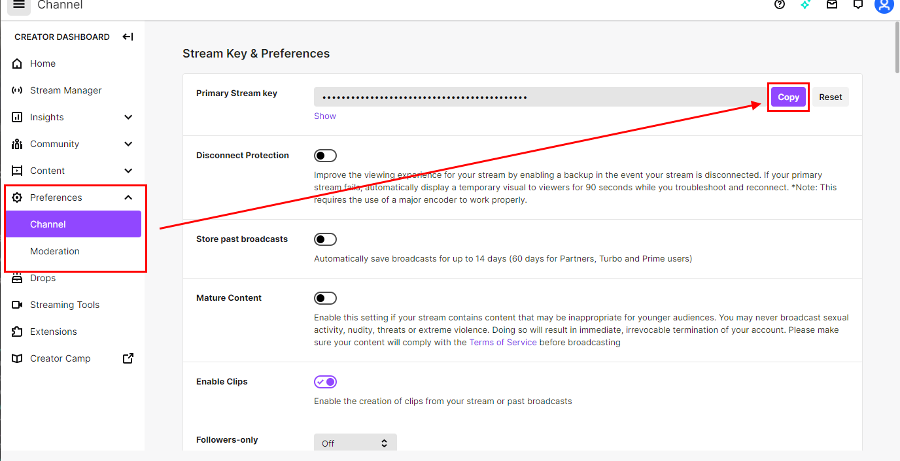
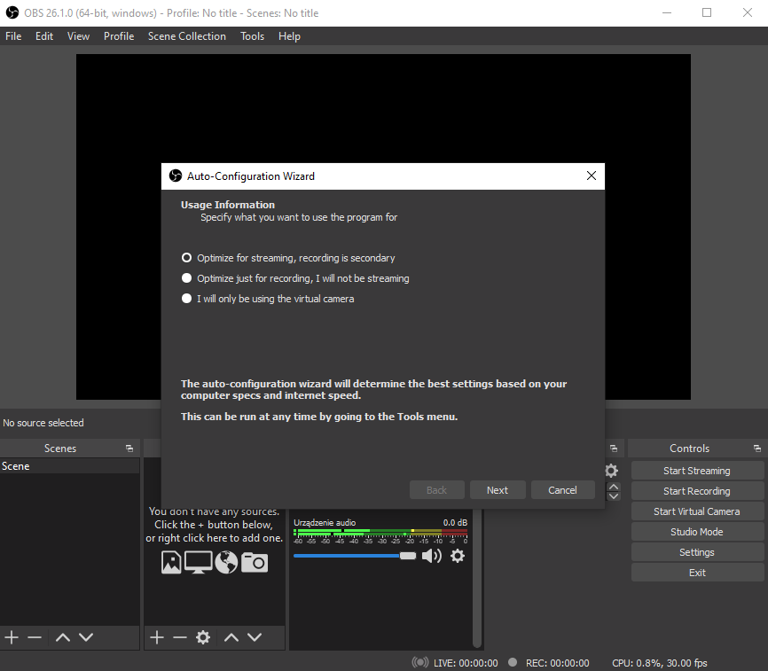
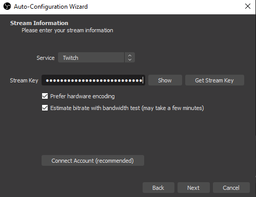
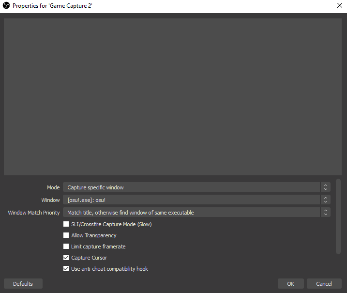
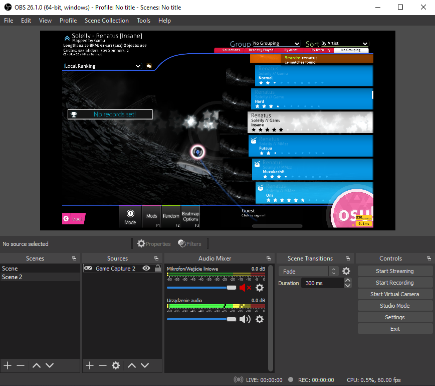

# Livestreaming osu!

This guide will show you how to livestream osu! on Twitch using [OBS Studio](https://obsproject.com/). Doing so is relatively simple, although it might require a powerful computer able to run and livestream osu! at the same time.

## Twitch

If you have not already, sign up for a [Twitch account](https://www.twitch.tv/signup).

Now you will need to setup your account for livestreaming osu!. From the main page, click on your avatar in the top right and select `Creator Dashboard` from the list.

In the Creator Dashboard, you can configure stream information, chat moderation, and profile info, among other customisations. The most important thing for getting started is configuring the stream information. From the main page of the dashboard, click on the `Stream Manager` button on the left, and then choose the `Edit Stream Info` option on the right.

A dialog will open for you to enter your stream's information. You can fill the fields however you want; however, the title should comprehend what the stream will be about and be inviting for people viewing the list of available streams. The category should also be set to the game you will be livestreaming, which is `osu!` in this case.

---

After editing your stream's information, click the `Done` button. Now click on the `Preferences` button on the left, then `Channel`. Look for the `Primary Stream key` field and click `Copy`. **Do not share this key — it allows for streaming on your behalf**. For now, paste the copied stream key in a notepad.

## OBS Studio

After you create and configure your Twitch account, the next step is to acquire a streaming app. This guide will only cover streaming with OBS Studio, but feel free to consider alternative software (e.g. [XSplit Broadcaster](https://www.xsplit.com/broadcaster)).

Proceed to [OBS Studio's website](https://obsproject.com/) and download the installer for your operating system. Open the installer and follow the steps to install the app.

### Configuring OBS Studio

When you launch OBS Studio for the first time, the auto-configuration wizard will open. Choose `Optimize for streaming, recording is secondary` and click `Next`.

The next step is to configure some video settings. Choose the resolution of your screen for the `Base (Canvas) Resolution` field (should be detected automatically), and `Either 60 or 30, but prefer 60 when possible` for the `FPS` field.

Finally, to connect the app to your Twitch channel, you will need to enter your stream information into OBS Studio. Click the `Use Stream Key` button, and enter the Primary Stream key that was copied earlier into the field. Leave other options checked as they are, and click `Next`.

After this, OBS Studio will auto-configure itself to find the best settings for your device. Click `Apply Settings` when this is completed.

### Adding a scene

The last thing you will need to start streaming is a scene containing the osu! window. To create one, right-click on the `Scenes` box from OBS Studio's main window and select `Add` to be prompted with a scene creation window. Name it "osu!", and click `OK` to continue.

Now OBS Studio needs a source to capture osu!. First, open osu!, then — in OBS Studio — right-click on the `Sources` box and select `Add` -> `Game Capture`. This will open the source selection dialog. You can name the source as "osu!", but it can be whatever you want, then click `OK`. Select `Capture specific window` from the `Mode` dropdown then select `[osu!.exe]: osu!` from the `Window` list.

If everything goes right, you should see the osu! window in the preview.

## What's next?

Now, after configuring OBS Studio and your Twitch account, click `Start Streaming` in OBS Studio to make a livestream. Your stream will appear on [Twitch](https://www.twitch.tv/directory/game/osu!) and [osu! website's livestream listing](https://osu.ppy.sh/community/livestreams) in a couple of minutes. That's all you need to know to start your journey with streaming. Of course, this guide only covers the basics of livestreaming; there are many ways to go beyond and improve your livestream. So, some important points to consider:

- **Find the best streaming settings.** The automatically configured settings provided by OBS Studio might not be perfect for your device. So, check if your livestream is working fine and, if not, what needs to be improved to provide the best experience for your viewers.
- **Build a community.** This is very challenging, as building your own community from scratch requires high levels of commitment, dedication, and time. However, it can result in the most reward for your effort.
- **Improve livestream quality.** This can include adding new overlays, camera capture, scene transition effects, osu!-specific plugins, Twitch chat display, Twitch integrity, and many more. You can also improve your channel's appearance by setting an avatar, banner, and general info.
- ...and most importantly, have fun!
