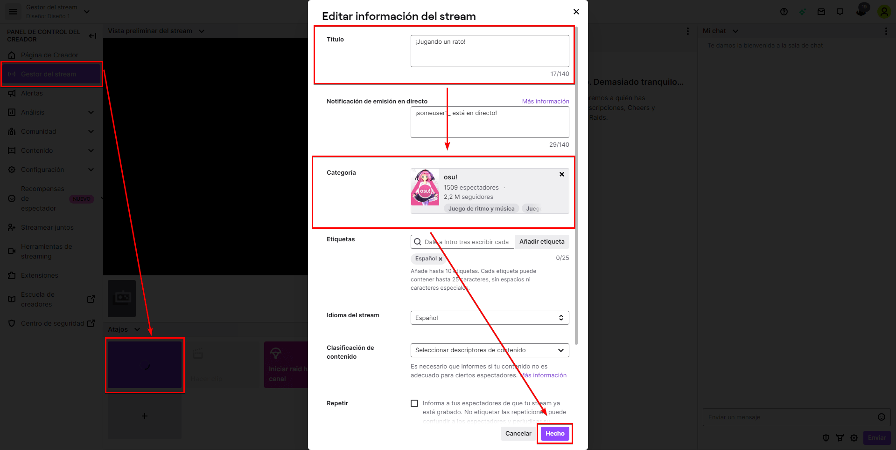
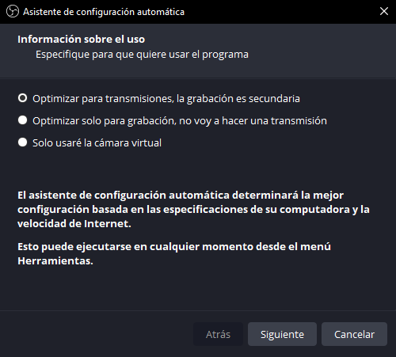

# Transmitir osu! en vivo

Esta guía te mostrará cómo transmitir osu! en Twitch usando [OBS Studio](https://obsproject.com/). Hacerlo es relativamente sencillo, aunque puede requerir un ordenador potente capaz de ejecutar y transmitir osu! al mismo tiempo.

## Twitch

Si aún no lo has hecho, regístrate para obtener una [cuenta de Twitch](https://www.twitch.tv/signup).

Ahora tendrás que configurar tu cuenta para transmitir osu!. Desde la página principal, haz clic en tu avatar en la parte superior derecha y selecciona `Panel de control del creador` de la lista.

En el panel de control del creador, puedes configurar la información del stream, la moderación del chat y la información del perfil, entre otras personalizaciones. Lo más importante para comenzar es configurar la información de la transmisión. En la página principal del panel de control, haz clic en el botón `Gestor del stream` de la izquierda, luego elige la opción `Editar información del stream` en la esquina inferior izquierda.

Se abrirá un cuadro de diálogo para que introduzcas la información de tu transmisión. Puedes rellenar los campos como quieras; sin embargo, el título debe incluir de qué tratará la transmisión y ser atractivo para las personas que vean la lista de transmisiones disponibles. La categoría también debe ser la del juego que vas a transmitir, que en este caso es `osu!`.

---

Después de editar la información de tu transmisión, haz clic en el botón `Hecho`. Ahora haz clic en el botón `Configuración` de la izquierda, luego en `Stream`. Busca el campo `Clave de la transmisión principal` y haz clic en `Copiar`. **No compartas esta clave, ya que permite el streaming en tu nombre**. Por ahora, pega la clave de la transmisión copiada en un bloc de notas.

## OBS Studio

Después de crear y configurar tu cuenta de Twitch, el siguiente paso es adquirir una aplicación de streaming. Esta guía solo cubrirá el streaming con OBS Studio, pero no dudes en considerar programas alternativos (por ejemplo, [XSplit Broadcaster](https://www.xsplit.com/broadcaster)).

Ve al [sitio web de OBS Studio](https://obsproject.com/) y descarga el instalador para tu sistema operativo. Abre el instalador y sigue los pasos para instalar la aplicación.

### Configurar OBS Studio

Cuando inicies OBS Studio por primera vez, se abrirá el asistente de configuración automática. Elige `Optimizar para transmisiones, la grabación es secundaria` y haz clic en `Siguiente`.

El siguiente paso es configurar algunos ajustes de vídeo. Elige la resolución de tu pantalla en el campo `Resolución de la base (Lienzo)` (debería detectarse automáticamente), y `60 o 30, pero usar 60 cuando sea posible` en el campo `FPS`.

Finalmente, para conectar la aplicación a tu canal de Twitch, deberás ingresar la información de tu transmisión en OBS Studio. Haz clic en el campo `Clave de retransmisión` e introduce la clave de la transmisión primaria que se copió anteriormente. Deja las demás opciones marcadas como están y haz clic en `Siguiente`.

Después de esto, OBS Studio se configurará automáticamente para encontrar la mejor configuración para tu dispositivo. Haz clic en `Aplicar configuración` cuando esto haya terminado.

### Añadir una escena

Lo último que necesitarás para iniciar la transmisión es una escena que contenga la ventana de osu!. Para crear una, haz clic con el botón derecho del ratón en el cuadro `Escenas` de la ventana principal de OBS Studio y selecciona `Agregar` para que aparezca una ventana de creación de escenas. Nómbrala «osu!», y pulsa `Aceptar` para continuar.

Ahora, OBS Studio necesita una fuente para capturar osu!. Primero, abre osu!, luego, en OBS Studio, haz clic derecho en el cuadro `Fuentes` y selecciona `Agregar` -> `Captura de juego`. Se abrirá el cuadro de diálogo para la selección de la fuente. Puedes nombrar la fuente como «osu!», pero puede ser lo que quieras, luego haz click en `Aceptar`. Selecciona `Capturar ventana específica` en el desplegable de `Modo`, luego `[osu!.exe]: osu!` en la lista de `Ventana`.

Si todo va bien, deberías ver la ventana de osu! en la vista previa.

## ¿Qué sigue?

Ahora, después de configurar OBS Studio y tu cuenta de Twitch, haz clic en el botón `Iniciar Transmisión` en OBS Studio para hacer una transmisión. Tu transmisión aparecerá en [Twitch](https://www.twitch.tv/directory/game/osu!) y [en el listado de transmisiones en vivo del sitio web de osu!](https://osu.ppy.sh/community/livestreams) en un par de minutos. Eso es todo lo que necesitas saber para empezar tu viaje con el streaming. Por supuesto, esta guía solo cubre los aspectos básicos de la transmisión en vivo; hay muchas maneras de ir más allá y mejorar tus transmisiones. Por lo tanto, algunos puntos importantes a tener en cuenta:

- **Encuentra la mejor configuración para transmitir.** Es posible que los ajustes configurados automáticamente por OBS Studio no sean perfectos para tu dispositivo. Por lo tanto, comprueba si tu transmisión funciona correctamente y, si no es así, qué debes mejorar para ofrecer la mejor experiencia a tus espectadores.
- **Construye una comunidad.** Esto es un gran desafío, ya que construir tu propia comunidad desde cero requiere altos niveles de compromiso, dedicación y tiempo. Sin embargo, puede resultar en la mejor recompensa por tu esfuerzo.
- **Mejorar la calidad de las transmisiones.** Esto puede incluir la adición de nuevos overlays, captura de cámara, efectos de transición para las escenas, plugins específicos para osu!, visualización del chat de Twitch, integridad de Twitch y mucho más. También puedes mejorar la apariencia de tu canal estableciendo un avatar, un banner e información general.
- ... y lo más importante, ¡diviértete!
