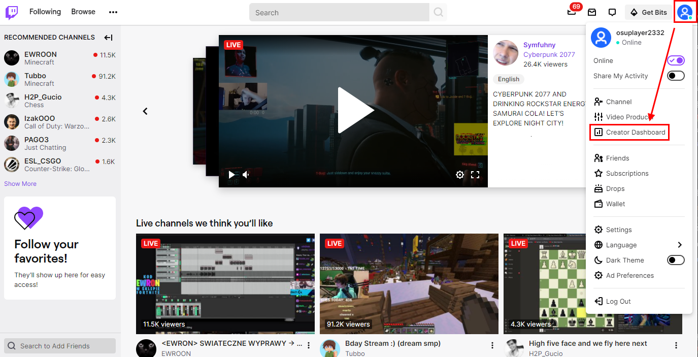
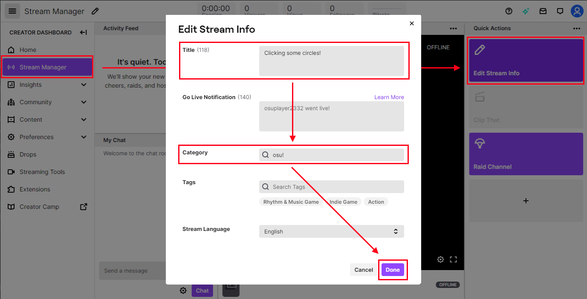
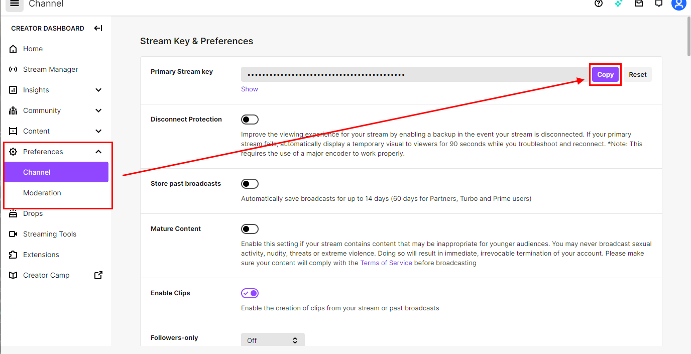
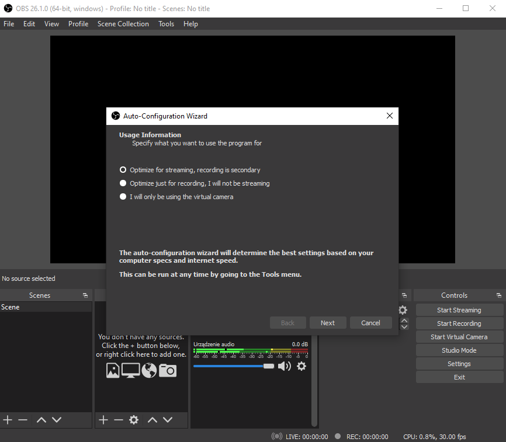
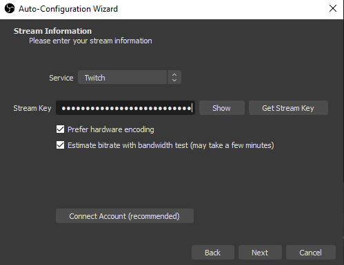
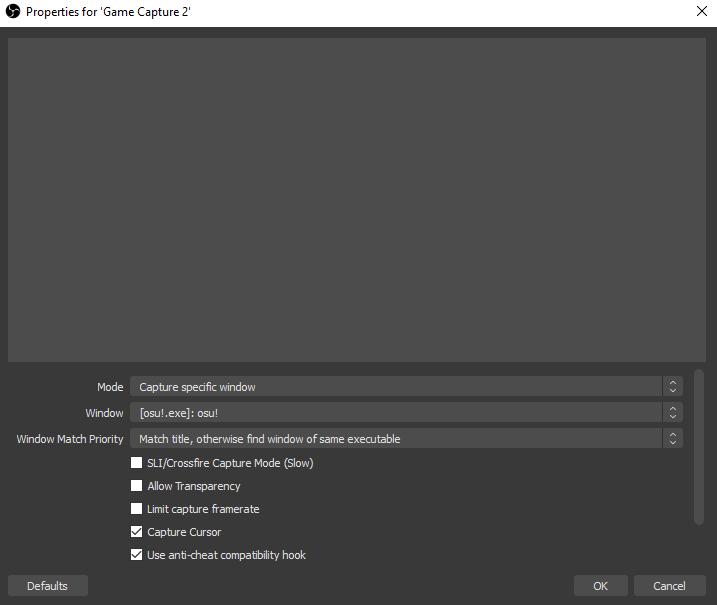
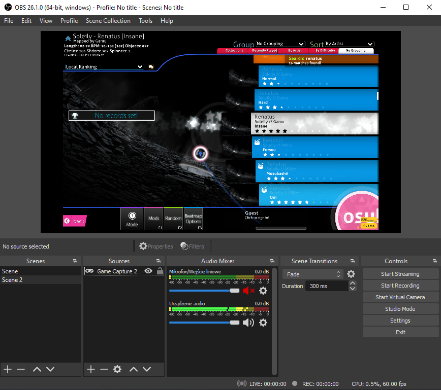

# การถ่ายทอดสด osu! (Livestreaming osu!)

คู่มือนี้จะแสดงวิธีการถ่ายทอดสด (Livestream) เกม osu! บน Twitch โดยใช้ [OBS Studio](https://obsproject.com/) การทำเช่นนี้ค่อนข้างง่าย แม้ว่าอาจจะต้องใช้คอมพิวเตอร์ที่มีประสิทธิภาพเพียงพอในการรันเกมและถ่ายทอดสดไปพร้อมๆ กัน

## Twitch

หากคุณยังไม่มีบัญชี ให้สมัคร [บัญชี Twitch](https://www.twitch.tv/signup) ก่อน

ตอนนี้คุณต้องตั้งค่าบัญชีของคุณสำหรับการถ่ายทอดสด osu! จากหน้าหลัก ให้คลิกที่รูปอวาตาร์ของคุณที่มุมขวาบน แล้วเลือก `Creator Dashboard` จากรายการ

ใน Creator Dashboard คุณสามารถกำหนดข้อมูลสตรีม, การดูแลแชท และข้อมูลโปรไฟล์ รวมถึงการปรับแต่งอื่นๆ สิ่งที่สำคัญที่สุดสำหรับการเริ่มต้นคือการกำหนดข้อมูลสตรีม จากหน้าหลักของ Dashboard ให้คลิกที่ปุ่ม `Stream Manager` ทางด้านซ้าย จากนั้นเลือกตัวเลือก `Edit Stream Info` ทางด้านขวา

หน้าต่างโต้ตอบจะเปิดขึ้นเพื่อให้คุณกรอกข้อมูลการสตรีมของคุณ คุณสามารถกรอกข้อมูลในช่องต่างๆ ได้ตามต้องการ อย่างไรก็ตาม ชื่อเรื่อง (Title) ควรครอบคลุมว่าสตรีมจะเกี่ยวกับอะไรและดึงดูดใจสำหรับผู้ที่ดูรายชื่อสตรีมที่เปิดอยู่ ส่วนหมวดหมู่ (Category) ควรตั้งค่าเป็นเกมที่คุณจะถ่ายทอดสด ซึ่งในกรณีนี้คือ `osu!`

---

หลังจากแก้ไขข้อมูลสตรีมของคุณแล้ว ให้คลิกปุ่ม `Done` ตอนนี้คลิกที่ปุ่ม `Preferences` ทางด้านซ้าย จากนั้นเลือก `Channel` มองหาช่อง `Primary Stream key` แล้วคลิก `Copy` **ห้ามแบ่งปันคีย์นี้ให้ใครเด็ดขาด — เพราะมันอนุญาตให้ผู้อื่นสตรีมในนามของคุณได้** สำหรับตอนนี้ ให้วางสตรีมคีย์ที่คัดลอกมาไว้ใน Notepad ก่อน

## OBS Studio

หลังจากที่คุณสร้างและกำหนดค่าบัญชี Twitch ของคุณแล้ว ขั้นตอนต่อไปคือการหาแอปสำหรับสตรีม คู่มือนี้จะครอบคลุมเฉพาะการสตรีมด้วย OBS Studio เท่านั้น แต่คุณสามารถพิจารณาซอฟต์แวร์ทางเลือกอื่นๆ ได้ (เช่น [XSplit Broadcaster](https://www.xsplit.com/broadcaster))

ไปที่ [เว็บไซต์ของ OBS Studio](https://obsproject.com/) และดาวน์โหลดตัวติดตั้งสำหรับระบบปฏิบัติการของคุณ เปิดตัวติดตั้งและทำตามขั้นตอนเพื่อติดตั้งแอป

### การกำหนดค่า OBS Studio (Configuring OBS Studio)

เมื่อคุณเปิด OBS Studio เป็นครั้งแรก ตัวช่วยการกำหนดค่าอัตโนมัติ (auto-configuration wizard) จะเปิดขึ้น ให้เลือก `Optimize for streaming, recording is secondary` (ปรับแต่งเพื่อการสตรีม การบันทึกเป็นเรื่องรอง) แล้วคลิก `Next`

ขั้นตอนต่อไปคือการกำหนดค่าการตั้งค่าบางอย่างสำหรับวิดีโอ เลือกความละเอียดหน้าจอของคุณในช่อง `Base (Canvas) Resolution` (ควรจะถูกตรวจพบโดยอัตโนมัติ) และเลือก `Either 60 or 30, but prefer 60 when possible` (ทั้ง 60 หรือ 30 แต่เลือก 60 หากเป็นไปได้) ในช่อง `FPS`

สุดท้าย เพื่อเชื่อมต่อแอปเข้ากับช่อง Twitch ของคุณ คุณจะต้องป้อนข้อมูลสตรีมของคุณลงใน OBS Studio คลิกปุ่ม `Use Stream Key` และป้อน Primary Stream key ที่คัดลอกไว้ก่อนหน้านี้ลงในช่อง ปล่อยตัวเลือกอื่นๆ ไว้ตามเดิม แล้วคลิก `Next`

หลังจากนี้ OBS Studio จะกำหนดค่าตัวเองโดยอัตโนมัติเพื่อค้นหาการตั้งค่าที่ดีที่สุดสำหรับอุปกรณ์ของคุณ คลิก `Apply Settings` เมื่อขั้นตอนนี้เสร็จสิ้น

### การเพิ่มซีน (Adding a scene)

สิ่งสุดท้ายที่คุณต้องทำเพื่อเริ่มการสตรีมคือการสร้างซีน (Scene) ที่มีหน้าต่างเกม osu! อยู่ ในการสร้าง ให้คลิกขวาที่กล่อง `Scenes` จากหน้าต่างหลักของ OBS Studio แล้วเลือก `Add` เพื่อให้หน้าต่างสร้างซีนปรากฏขึ้น ตั้งชื่อซีนว่า "osu!" แล้วคลิก `OK` เพื่อดำเนินการต่อ

ตอนนี้ OBS Studio ต้องการแหล่งที่มา (Source) เพื่อจับภาพหน้าจอ osu! ขั้นแรก ให้เปิดเกม osu! จากนั้น — ใน OBS Studio — ให้คลิกขวาที่กล่อง `Sources` แล้วเลือก `Add` -> `Game Capture` สิ่งนี้จะเปิดหน้าต่างเลือกแหล่งที่มา คุณสามารถตั้งชื่อแหล่งที่มาว่า "osu!" หรือชื่ออะไรก็ได้ตามต้องการ แล้วคลิก `OK` เลือก `Capture specific window` จากเมนูแบบเลื่อนลงของ `Mode` จากนั้นเลือก `[osu!.exe]: osu!` จากรายการ `Window`

หากทุกอย่างเป็นไปด้วยดี คุณควรจะเห็นหน้าต่าง osu! ปรากฏขึ้นในส่วนแสดงตัวอย่าง (Preview)

## ต่อจากนี้ทำอะไรดี? (What's next?)

ตอนนี้ หลังจากกำหนดค่า OBS Studio และบัญชี Twitch ของคุณแล้ว ให้คลิก `Start Streaming` ใน OBS Studio เพื่อเริ่มการสตรีมสด สตรีมของคุณจะปรากฏบน [Twitch](https://www.twitch.tv/directory/game/osu!) และ [รายชื่อสตรีมสดบนเว็บไซต์ osu!](https://osu.ppy.sh/community/livestreams) ภายในเวลาไม่กี่นาที นั่นคือทั้งหมดที่คุณต้องรู้เพื่อเริ่มต้นการเดินทางกับการสตรีม แน่นอนว่าคู่มือนี้ครอบคลุมเพียงพื้นฐานของการสตรีมสดเท่านั้น ยังมีอีกหลายวิธีในการพัฒนาและปรับปรุงการสตรีมสดของคุณ ดังนั้น นี่คือประเด็นสำคัญบางประการที่ควรพิจารณา:

- **ค้นหาการตั้งค่าสตรีมที่ดีที่สุด** การตั้งค่าที่กำหนดค่าโดยอัตโนมัติจาก OBS Studio อาจไม่สมบูรณ์แบบสำหรับอุปกรณ์ของคุณ ดังนั้นให้ตรวจสอบว่าการสตรีมสดของคุณทำงานได้ดีหรือไม่ และหากไม่ดี สิ่งใดที่ควรปรับปรุงเพื่อให้ผู้ชมได้รับประสบการณ์ที่ดีที่สุด
- **สร้างชุมชน (Community)** สิ่งนี้มีความท้าทายมาก เนื่องจากการสร้างชุมชนของตัวเองตั้งแต่ศูนย์ต้องใช้ความมุ่งมั่น ความทุ่มเท และเวลาในระดับสูง อย่างไรก็ตาม มันสามารถส่งผลลัพธ์ที่คุ้มค่าที่สุดสำหรับความพยายามของคุณ
- **ปรับปรุงคุณภาพการสตรีมสด** ซึ่งอาจรวมถึงการเพิ่ม Overlay ใหม่ๆ, การใช้กล้อง (Camera capture), เอฟเฟกต์การเปลี่ยนซีน (Scene transition), ปลั๊กอินเฉพาะสำหรับ osu!, การแสดงผลแชท Twitch, การเชื่อมโยงกับ Twitch และอื่นๆ อีกมากมาย คุณยังสามารถปรับปรุงลักษณะหน้าตาของช่องได้โดยการตั้งค่าอวาตาร์, แบนเนอร์ และข้อมูลทั่วไป
- ...และที่สำคัญที่สุดคือ ขอให้สนุก!
