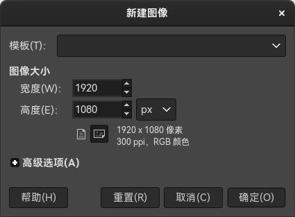
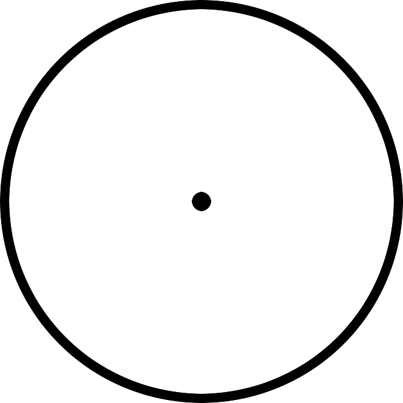
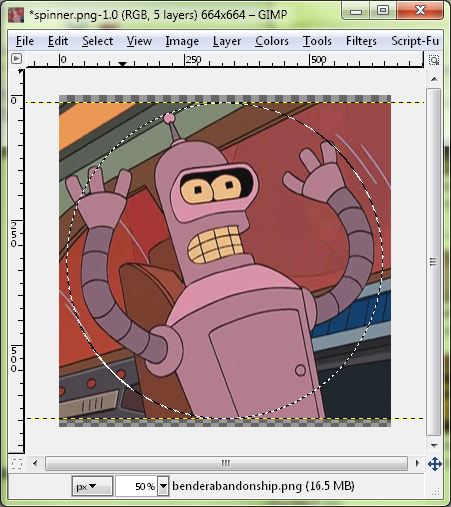
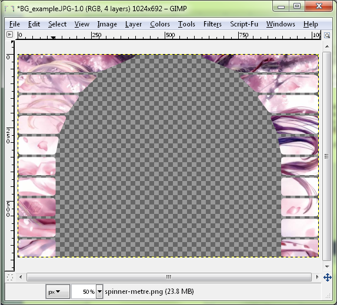
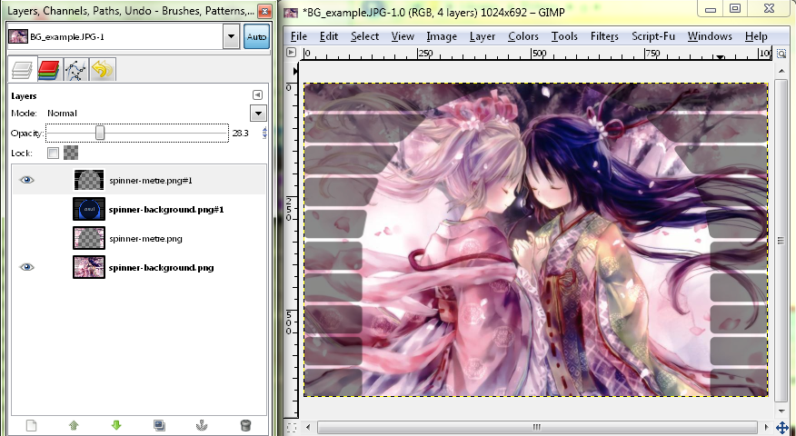
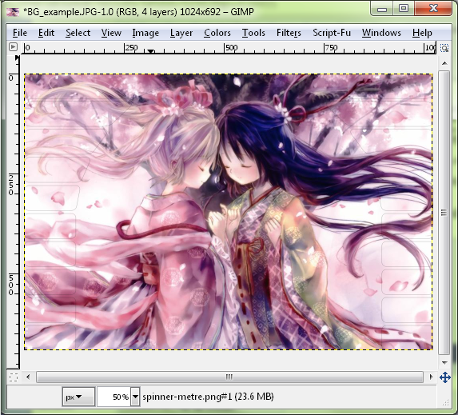

# 如何让皮肤中的转盘正确居中

[*How to make spinners symmetrical* 作者： ziin](https://osu.ppy.sh/community/forums/topics/51502)

对 gimp/photoshop 知之甚少的人可能难以理解此教程。此教程假定你知道如何（并且能）打开/关闭图层，以及自己找一些东西。如果你有问题，你可以在论坛上私信我，我会尝试帮你。其实我并不擅长制作内容，只是编辑别人的作品罢了。

## 如何制作中心对称的转盘

摇摇晃晃的转盘看起来很累人。如果你想制作转盘，请确保它完全居中。

首先，打开你的图像编辑器，在本教程中会使用 [GIMP](https://gimp.org)（因为是免费的）。

创建一个新文档。模板皮肤的大小是 666x666，尽管超出大小限制也没有问题，但**转盘在低性能电脑上会导致高度延迟，因此最好让其尺寸在限制内。**将文档大小设置为 664x664，这样当我们做完时，可以用透明色填充边缘，这样让 osu! 知道可以消除边缘锯齿，就不会让边缘太直。

### 创建新文档

### 选定圆圈

用椭圆选择工具（快捷键是 “e”）在整个文档上选出圆圈。然后创建新图层，给圆圈填色。

### 缩小选区

在此之后，使用选择 -> 收缩命令缩小选区。“收缩”命令只适合画一两个圈，因此如果要更准确地画圈，只需用椭圆选择工具重新画即可。

这里我选择缩小 15 像素，但是你也可以按个人意愿选择。创建一个新图层，将缩小后的选区涂上不同颜色，这样你就能看到它了。

### 转盘

对转盘的中心点，以及你想要的其他圆圈重复上述过程。这里我选的是缩小 300 像素。

### 给转盘添加图片

在此之后，你可以使用每个图层进行设计，或者选择透明通道来将你的图片放上去。

### 复制图片

从想要复制的图片中复制/粘贴选区：

### 设置画布尺寸

最后，你可以在转盘中间进行设计，也可以给转盘边缘上色。确保你通过Finally, you can add a design in the middle, or recolour the edges. Make sure you reset the canvas size to 666x666 by going to Image -> Canvas Size, and centre the image so you have a 1 pixel border around the image.

现在你应该有一个完美的转盘，旋转的时候不会晃来晃去了。

In this guide there won't be information how to make the edges pretty, or give it depth, that's something entirely different. I chose a very simple image and process. If you want to do that, there are guides everywhere, or you probably already know how to do that. However it seems that symmetry has escaped most of the people who make skins.

## How to make spinner backgrounds which match the beatmap background

If you want your spinner to have the same background as the actual map, it can be difficult because of a bug in osu! introduced by a gameplay change which was never fixed. First, we need to match up the background *in the game* and not *in the beatmap editor*. The beatmap puts storyboarded elements (background and video) 5 pixels higher on 1024x768 than the rest of the map.

### Don't worry if the spinner looks wrong in the editor

### Cropping the background

First, take the background at 1024x768 and crop out the top 46 pixels and bottom 30 pixels, giving you a 1024x692 image. The template image is 1023x692, but this doesn't matter; the right side is just pure black due to the nature of how spinners work.

### Use the channels tab to turn off editing the alpha channel

Technically, you are done, but if you want to make the background "fill in" with a background spinner meter, then you can use the template skin, or make it yourself. Bring in the template spinner-meter. To recolour it, turn off the alpha channel by selecting it, so you don't modify the transparency at all. Then use the bucket fill and fill the entire area with a grey colour or whatever colour you want (I used black).

### Copy/Paste into new layer, then save your spinner meter

Once you have the colour, select the entire alpha channel again (right click on the alpha channel -> channel to selection) copy and paste the spinner background so you have something to fill in for your spinner meter.

### Turn down the opacity until you get a colour your like

To add some more detail, you can turn down the opacity on the black image.

### The fully spun spinner background and meter

Then you can see how it looks filled in by turning on the old layer. Note it has a little bit of an outline. If you want to change the size of that outline, you can use the `Select` -> `Grow` or `Shrink` tool before you copy/paste to make the spinner meter.

If you do this, the transition from background to spinner will be seamless, and you won't have the background move up a few pixels.
