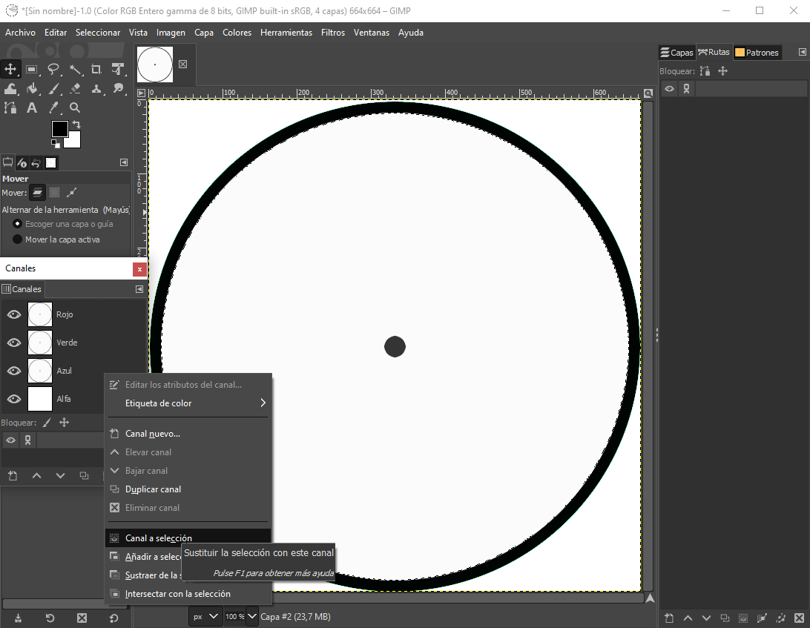
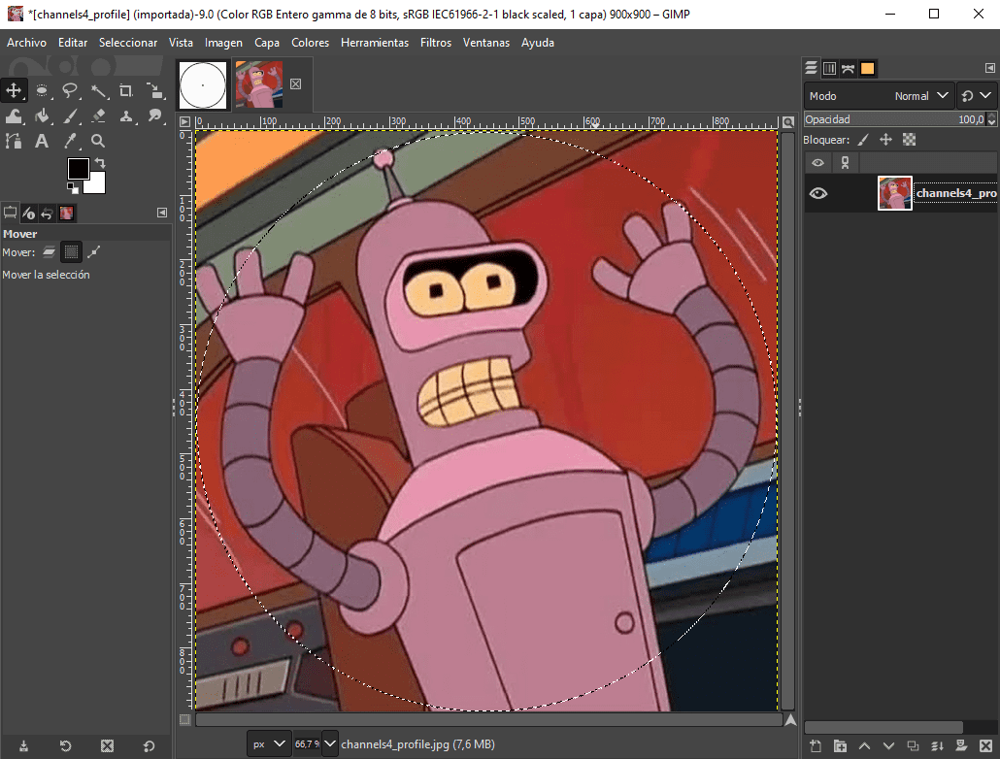

# Cómo hacer spinners correctamente centrados en las skins

[*How to make spinners symmetrical* por ziin](https://osu.ppy.sh/community/forums/topics/51502)

Esta guía probablemente sea difícil de entender para las personas con poca experiencia con GIMP/Photoshop. Esta guía asume que sabes cómo (y eres capaz de) activar/desactivar capas, así como encontrar algunas cosas por tu cuenta.

## Cómo hacer spinners simétricos

Cansa ver spinners tambaleantes. Por favor, si quieres hacer un spinner, asegúrate de que esté perfectamente centrado.

Primero abre tu editor de imágenes, en esta guía se usará [GIMP](https://gimp.org/), ya que es gratuito.

Crea un nuevo documento. La plantilla de la skin es de 666x666, y aunque es seguro sobrepasar ese límite, los **spinners pueden causar mucho lag en ordenadores lentos, así que es mejor hacerlo por debajo de ese límite**. Haz el documento 664x664, para que cuando terminemos, podamos rellenar los bordes con transparencia, lo que permite a osu! saber que puede suavizar el borde, en lugar de convertirlo en un borde recto.

### Crear un nuevo documento

### Selecciona tu círculo

Usa la herramienta elipse (el atajo es «e») y haz un círculo en todo el documento. Crea una nueva capa y rellénala con un color.

### Reduce la selección

A continuación, reduce la selección seleccionando Seleccionar -> Encoger. Para círculos más precisos, basta con volver a dibujarlos con la herramienta elipse, ya que «encoger» solo sirve para uno o dos círculos.

Aquí se eligen 15, pero puedes elegir la cantidad que quieras. Crea una nueva capa y rellena la selección más pequeña con un color diferente para que puedas verla.

### El spinner

Repite el proceso también para el punto central, o cualquier otro círculo que desees. Yo elegí 300.

### Añadir una imagen al spinner

A continuación, puedes usar cada capa para hacer diseños, o poner tu imagen sobre ella seleccionando el canal alfa de esa capa

### Copiar la imagen

Copia/pega la selección de la imagen que quieres copiar:

### Establecer el tamaño del lienzo

Por último, puedes añadir un diseño en el centro o volver a colorear los bordes. Asegúrate de restablecer el tamaño del lienzo a 666x666 yendo a Imagen -> Tamaño del lienzo, y centra la imagen para que tengas un borde de 1 píxel alrededor de la imagen.

Ahora deberías tener un spinner perfecto que no se tambalee cuando lo hagas girar.

En esta guía no habrá información sobre cómo hacer bonitos los bordes, o darle profundidad, eso es algo totalmente diferente. Elegí una imagen y un proceso muy sencillos. Si quieres hacerlo, hay guías por todas partes, o probablemente ya sepas cómo hacerlo. Sin embargo, parece que la simetría se le ha escapado a la mayoría de los que hacen skins.

## Cómo hacer que los fondos de los spinners coincidan con el fondo del beatmap

Si quieres que tu spinner tenga el mismo fondo que el mapa, puede ser difícil debido a un error en osu! introducido por un cambio en el juego que nunca se solucionó. En primer lugar, tenemos que hacer coincidir el fondo *en el juego* y no *en el editor de beatmaps*. El beatmap coloca los elementos del storyboard (fondo y vídeo) 5 píxeles más arriba en 1024x768 que el resto del mapa.

### No te preocupes si el spinner se ve mal en el editor

### Cortar el fondo

Primero, toma el fondo a 1024x768 y corta los 46 píxeles superiores y los 30 inferiores, con lo que obtendrás una imagen de 1024x692. La imagen de la plantilla es de 1023x692, pero esto no importa; el lado derecho es negro puro debido a la naturaleza de cómo funcionan los spinners.

### Usa la pestaña de canales para desactivar la edición del canal alfa

Técnicamente, ya has terminado, pero si quieres hacer que el fondo se «rellene» con un medidor de fondo, entonces puedes usar el de la plantilla de la skin, o hacerlo tú mismo. Trae la plantilla del spinner-meter. Para recolorearlo, desactiva el canal alfa seleccionándolo, de modo que no modifiques en absoluto la transparencia. Luego usa el relleno de cubeta y llena toda el área con un color gris o el color que quieras.

### Copia/pega en una nueva capa, luego guarda tu medidor

Una vez que tengas el color, selecciona todo el canal alfa de nuevo (clic derecho en el canal alfa -> canal a selección), copia y pega el fondo del spinner para que tengas algo que rellenar para tu medidor.

### Reduce la opacidad hasta que obtengas un color que te guste

Para añadir más detalle, puedes bajar la opacidad de la imagen negra.

### El fondo y el medidor totalmente completados

Luego puedes ver cómo queda rellenado activando la capa antigua. Ten en cuenta que tiene un poco de contorno. Si quieres cambiar el tamaño de ese contorno, puedes usar la herramienta `Seleccionar` -> `Agrandar` o `Encoger` antes de copiar/pegar para que el spinner mida.

Si haces esto, la transición del fondo al spinner será perfecta, y no tendrás el fondo desplazándose unos píxeles hacia arriba.
