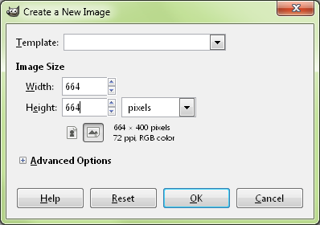
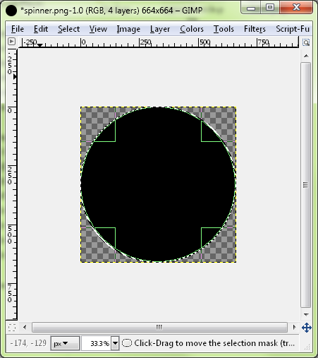
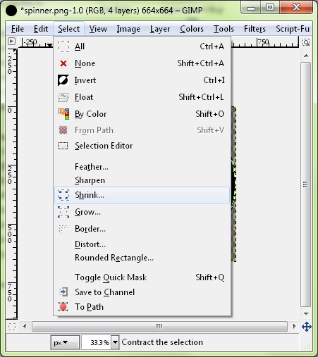
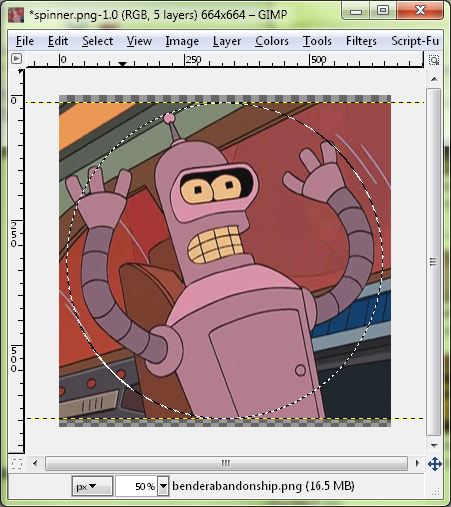
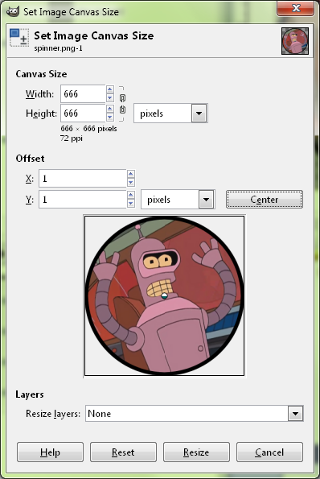
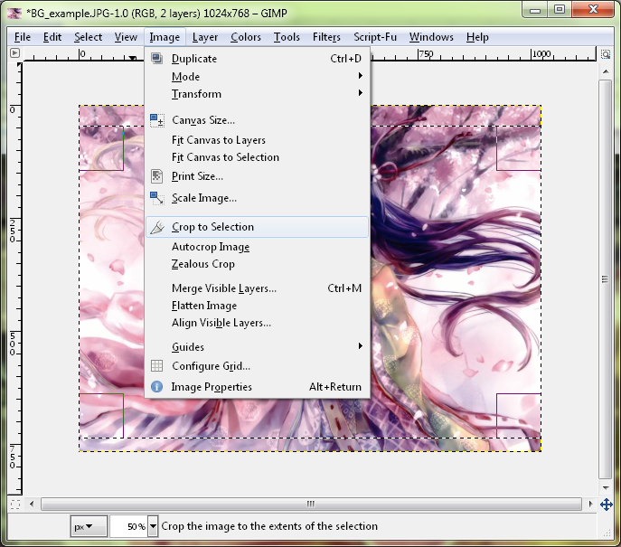
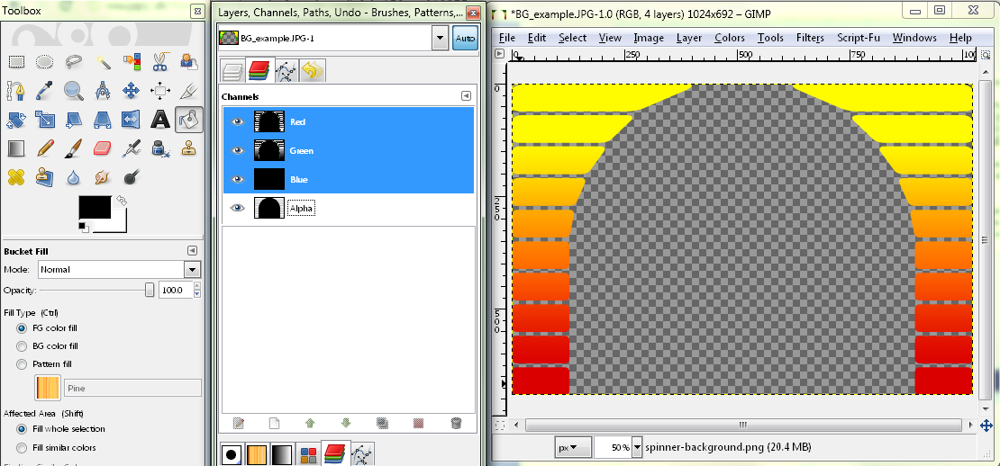
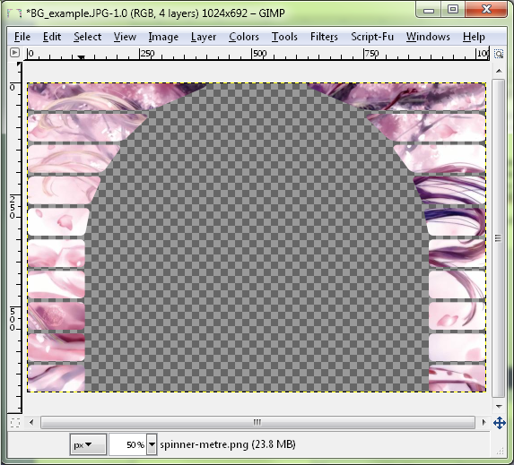
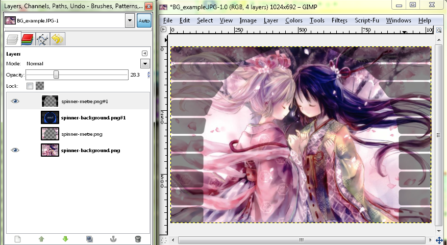
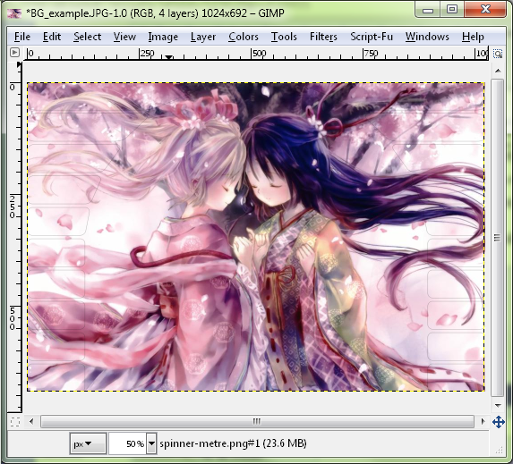

# Comment faire des spinners correctement centrés dans les skins

[*How to make spinners symmetrical* par : ziin](https://osu.ppy.sh/community/forums/topics/51502)

Ce guide est probablement difficile à comprendre pour les personnes ayant peu d'expérience avec GIMP/Photoshop. Ce guide suppose que vous savez (et êtes capable) d'activer/désactiver les calques, ainsi que de trouver certaines choses par vous-même.

## Comment créer des spinners symétriques

C'est fatiguant de voir des spinner bancales. S'il vous plaît, si vous voulez faire un spinner, assurez-vous qu'il soit parfaitement centré.

Ouvrez d'abord votre éditeur d'images. Dans ce guide, nous utiliserons [GIMP](https://gimp.org/), car il est gratuit.

Créez un nouveau document. L'apparence du modèle est de 666x666, et bien qu'il soit possible de dépasser cette limite, les **spinners peuvent causer beaucoup de retard sur les ordinateurs lents, il est donc préférable de ne pas dépasser cette limite**. Faites le document 664x664, de sorte que lorsque nous aurons terminé, nous pourrons remplir les bords avec de la transparence, ce qui permet à osu! de savoir qu'il peut anti-aliaser le bord, plutôt que de le faire avec un bord droit.

### Créer un nouveau document

### Sélectionnez votre cercle

Utilisez l'outil ellipse (le raccourci est "e") et faites un cercle sur l'ensemble du document. Créez un nouveau calque et remplissez-le d'une couleur.

### Réduire la sélection

Ensuite, rétrécissez la sélection en allant dans Sélectionner -> Rétrécir. Pour des cercles plus précis, il suffit de les redessiner avec l'outil ellipse, car le "rétrécissement" n'est bon que pour un ou deux cercles.

Voici la sélection 15, mais vous pouvez en choisir autant que vous voulez. Créez un nouveau calque et remplissez la plus petite sélection avec une couleur différente pour que vous puissiez la voir.

### Le spinner

Répétez le processus pour le point central également, ou tout autre cercle que vous voulez. Nous avons choisi 300.

### Ajout d'une image au spinner

Vous pouvez ensuite utiliser chaque couche pour réaliser des dessins, ou mettre votre image dessus en sélectionnant le canal alpha de cette couche.

### Copier l'image

Et copier/coller la sélection de l'image que vous voulez copier :

### Définir la taille du canvas

Enfin, vous pouvez ajouter un motif au milieu, ou recolorer les bords. Assurez-vous de réinitialiser la taille du canvas à 666x666 en allant dans Image -> Taille du canvas, et centrez l'image de façon à avoir une bordure de 1 pixel autour de l'image.

Vous devriez maintenant avoir un spinner parfait qui ne vacille pas lorsque vous le faite tourner.

Dans ce guide, il n'y aura pas d'informations sur la façon de rendre les bords jolis, ou de donner de la profondeur, c'est quelque chose de complètement différent. Nous avons choisi une image et un processus très simples. Si vous voulez faire cela, il y a des guides partout, ou vous savez probablement déjà comment le faire. Cependant, il semble que la symétrie ait échappé à la plupart des personnes qui créent des skins.

## Comment créer des fonds de spinner qui correspondent au fond de la beatmap ?

Si vous voulez que votre spinner ait le même fond que la beatmap réelle, cela peut être difficile à cause d'un bug dans osu! introduit par un changement de gameplay qui n'a jamais été corrigé. Tout d'abord, nous devons faire correspondre le fond *dans le jeu* et non *dans l'éditeur de beatmap*. La beatmap place les éléments scénarisés (fond et vidéo) 5 pixels plus haut sur 1024x768 que le reste de la beatmap.

### Ne vous inquiétez pas si le spinner ne semble pas correct dans l'éditeur

### Recadrage de l'arrière-plan

Tout d'abord, prenez l'arrière-plan à 1024x768 et enlevez les 46 pixels supérieurs et les 30 pixels inférieurs, ce qui vous donne une image de 1024x692. L'image du modèle est de 1023x692, mais cela n'a pas d'importance ; le côté droit est tout simplement noir pur en raison de la nature du fonctionnement des spinners.

### Utilisez l'onglet des canaux pour désactiver l'édition du canal alpha

Techniquement, vous avez terminé, mais si vous voulez faire en sorte que l'arrière-plan soit "rempli" avec un compteur de rotation d'arrière-plan, vous pouvez utiliser le modèle de skin, ou le faire vous-même. Introduisez le compteur de rotation du modèle. Pour le recolorer, désactivez le canal alpha en le sélectionnant, afin de ne pas modifier la transparence du tout. Ensuite, utilisez le remplissage du seau et remplissez toute la zone avec une couleur grise ou la couleur que vous voulez (nous avons utilisé du noir).

### Copiez/collez dans un nouveau calque, puis enregistrez votre compteur de rotation

Une fois que vous avez la couleur, sélectionnez à nouveau l'ensemble du canal alpha (clic droit sur le canal alpha -> canal vers la sélection), copiez et collez l'arrière-plan du spinner afin d'avoir quelque chose à remplir pour votre compteur de rotation.

### Réduisez l'opacité jusqu'à ce que vous obteniez une couleur qui vous plaise

Pour ajouter un peu plus de détails, vous pouvez réduire l'opacité de l'image noire.

### L'arrière-plan du spinner et du compteur de rotation

Ensuite, vous pouvez voir comment il est rempli en activant l'ancien calque. Notez qu'il y a un peu de contour. Si vous voulez changer la taille de ce contour, vous pouvez utiliser l'outil `Select` -> `Grow` ou `Shrink` avant de copier/coller pour faire le compteur de rotation.

Si vous faites cela, la transition entre l'arrière-plan et le spinner sera transparente, et vous n'aurez pas à déplacer l'arrière-plan de quelques pixels.
