# วิธีสร้าง Spinner ให้กึ่งกลางอย่างถูกต้องในสกิน (How to make properly centred spinners in skins)

[*วิธีทำให้ Spinner มีความสมมาตร* โดย: ziin](https://osu.ppy.sh/community/forums/topics/51502)

คู่มือนี้อาจจะเข้าใจยากเล็กน้อยสำหรับผู้ที่มีประสบการณ์การใช้ GIMP/Photoshop น้อย คู่มือนี้สันนิษฐานว่าคุณรู้วิธีการ (และสามารถ) เปิด/ปิด เลเยอร์ (Layers) รวมถึงสามารถค้นหาสิ่งต่างๆ ด้วยตนเองได้

## วิธีทำให้ Spinner มีความสมมาตร

มันน่ารำคาญใจที่ต้องเห็น Spinner ส่ายไปมา ดังนั้นหากคุณต้องการสร้าง Spinner โปรดตรวจสอบให้แน่ใจว่ามันอยู่กึ่งกลางอย่างสมบูรณ์

อันดับแรก ให้เปิดโปรแกรมแก้ไขรูปภาพของคุณ ในคู่มือนี้จะใช้ [GIMP](https://gimp.org/) เนื่องจากเป็นโปรแกรมฟรี

สร้างเอกสารใหม่ เทมเพลตของสกินคือ 666x666 และแม้ว่าการทำเกินขีดจำกัดนั้นจะปลอดภัย **แต่ Spinner สามารถทำให้คอมพิวเตอร์ที่ช้าเกิดอาการแลค (Lag) ได้มาก ดังนั้นจึงเป็นการดีที่สุดที่จะสร้างให้ต่ำกว่าขีดจำกัดนั้น** ให้สร้างเอกสารขนาด 664x664 เพื่อที่เมื่อเราทำเสร็จแล้ว เราจะได้เติมขอบด้วยความโปร่งใส (Transparency) ซึ่งจะทำให้ osu! ทราบว่ามันสามารถทำ anti-alias ที่ขอบได้ แทนที่จะทำให้มันเป็นขอบตัดตรง

### สร้างเอกสารใหม่ (Make a new document)

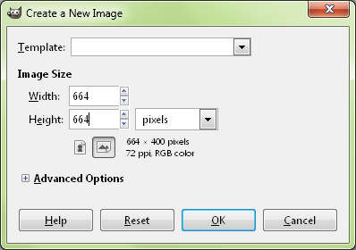

### เลือกวงกลมของคุณ (Select your circle)

ใช้เครื่องมือ Ellipse tool (ปุ่มลัดคือ "e") และสร้างวงกลมให้เต็มขนาดเอกสาร สร้างเลเยอร์ใหม่และเติมสีลงไป

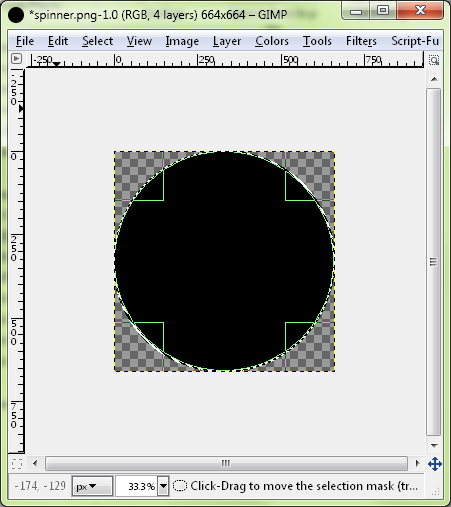

### ย่อส่วนที่เลือก (Shrink the selection)

จากนั้นย่อส่วนที่เลือกโดยไปที่ Select -> Shrink สำหรับวงกลมที่ต้องการความแม่นยำมากกว่านี้ ให้วาดพวกมันใหม่ด้วย Ellipse tool แทน เนื่องจากคำสั่ง "shrink" นั้นดีสำหรับวงกลมเพียงหนึ่งหรือสองวงเท่านั้น

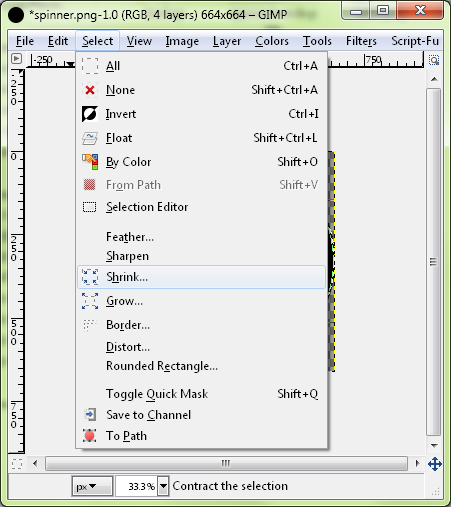

ในที่นี้เลือกไว้ที่ 15 แต่คุณสามารถเลือกได้ตามต้องการ สร้างเลเยอร์ใหม่และเติมสีที่ต่างออกไปลงในส่วนที่เลือกซึ่งเล็กลงเพื่อให้คุณมองเห็นมันได้

### ตัว Spinner

ทำซ้ำกระบวนการเดิมสำหรับจุดกึ่งกลางหรือวงกลมอื่นๆ ที่คุณต้องการ ผมเลือกไว้ที่ 300

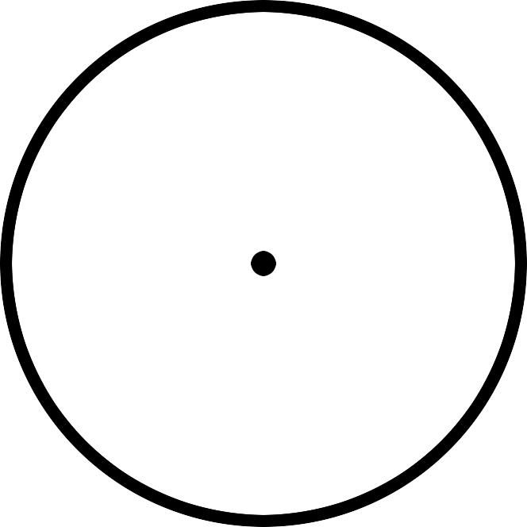

### การเพิ่มรูปภาพลงใน Spinner (Adding an image to the spinner)

จากนั้นคุณสามารถใช้แต่ละเลเยอร์เพื่อสร้างดีไซน์ หรือใส่รูปภาพของคุณลงไปโดยการเลือก alpha channel ของเลเยอร์นั้น

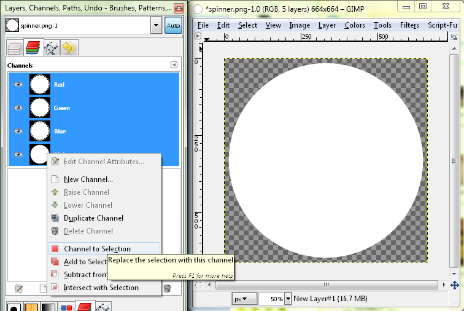

### การคัดลอกรูปภาพ (Copying the image)

และทำการคัดลอก/วางส่วนที่เลือกจากรูปภาพที่คุณต้องการคัดลอก:

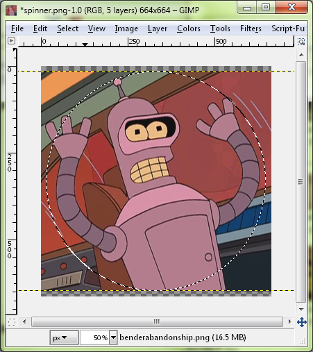

### ตั้งค่าขนาดแคนวาส (Set canvas size)

สุดท้าย คุณสามารถเพิ่มดีไซน์ไว้ตรงกลาง หรือเปลี่ยนสีที่ขอบ ตรวจสอบให้แน่ใจว่าคุณได้รีเซ็ตขนาดแคนวาสเป็น 666x666 โดยไปที่ Image -> Canvas Size และจัดรูปภาพให้อยู่กึ่งกลางเพื่อให้คุณมีขอบขนาด 1 พิกเซลรอบรูปภาพ

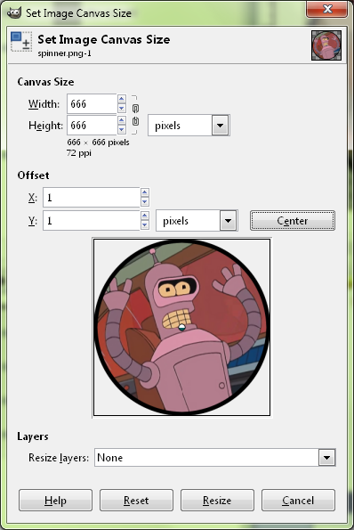

ตอนนี้คุณควรจะได้ Spinner ที่สมบูรณ์แบบซึ่งไม่ส่ายไปมาเมื่อคุณหมุนมัน

ในคู่มือนี้จะไม่มีข้อมูลเกี่ยวกับวิธีทำให้ขอบดูสวยงามหรือการให้มิติความลึก นั่นเป็นเรื่องที่แตกต่างกันอย่างสิ้นเชิง ผมเลือกรูปภาพและกระบวนการที่เรียบง่ายมาก หากคุณต้องการทำเช่นนั้น มีคู่มืออยู่ทั่วไป หรือคุณอาจรู้วิธีทำอยู่แล้ว อย่างไรก็ตาม ดูเหมือนว่าความสมมาตรจะเป็นสิ่งที่หลุดรอดสายตาของผู้คนส่วนใหญ่ที่ทำสกินไป

## วิธีสร้างพื้นหลัง Spinner ให้ตรงกับพื้นหลังของบีทแมพ

หากคุณต้องการให้ Spinner ของคุณมีพื้นหลังเดียวกับแผนที่จริง มันอาจจะเป็นเรื่องยากเนื่องจากบั๊ก (Bug) ใน osu! ที่เกิดจากการเปลี่ยนแปลงเกมเพลย์ซึ่งไม่เคยได้รับการแก้ไข อันดับแรก เราต้องทำให้พื้นหลังตรงกัน *ในตัวเกม* ไม่ใช่ *ใน beatmap editor* ตัวบีทแมพจะวางองค์ประกอบของ Storyboard (พื้นหลังและวิดีโอ) สูงกว่าส่วนที่เหลือของแผนที่อยู่ 5 พิกเซลบนความละเอียด 1024x768

### ไม่ต้องกังวลหาก Spinner ดูผิดเพี้ยนใน Editor

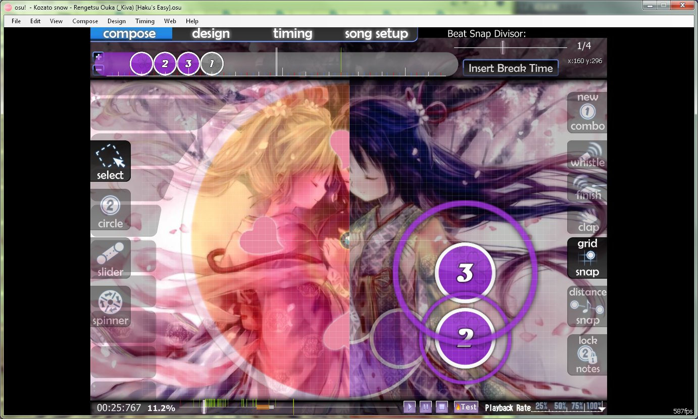

### การตัดขอบพื้นหลัง (Cropping the background)

อันดับแรก นำภาพพื้นหลังที่ขนาด 1024x768 มาตัดขอบด้านบนออก 46 พิกเซล และด้านล่างออก 30 พิกเซล ซึ่งจะได้ภาพขนาด 1024x692 ภาพเทมเพลตคือ 1023x692 แต่นี่ไม่สำคัญ ด้านขวาจะเป็นสีดำสนิทเนื่องจากธรรมชาติของการทำงานของ Spinner

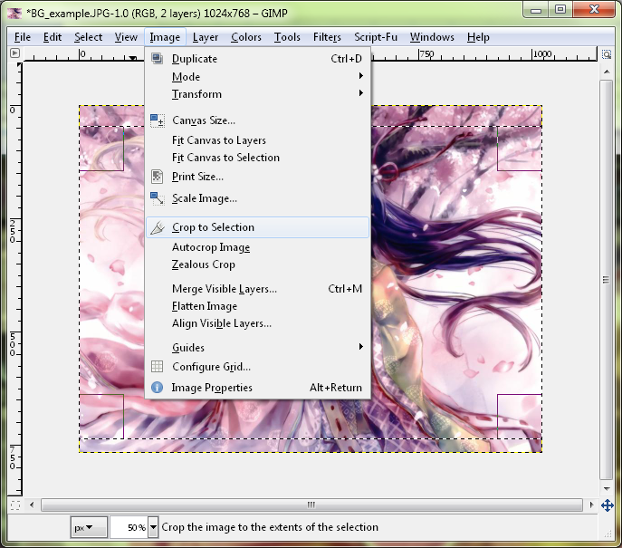

### ใช้แถบ Channels เพื่อปิดการแก้ไข Alpha Channel

ในทางเทคนิคถือว่าคุณทำเสร็จแล้ว แต่ถ้าคุณต้องการทำให้พื้นหลัง "เติมเต็ม" ด้วยเกจวัดของ Spinner (spinner-meter) คุณสามารถใช้เทมเพลตสกินหรือสร้างเองก็ได้ นำภาพ spinner-meter จากเทมเพลตเข้ามา ในการเปลี่ยนสี ให้ปิดการใช้งาน alpha channel โดยการเลือกมันไว้ เพื่อที่คุณจะได้ไม่ไปแก้ไขความโปร่งใสเลย จากนั้นใช้ถังสี (bucket fill) และเทสีเทาหรือสีใดก็ได้ที่คุณต้องการลงไปในพื้นที่ทั้งหมด (ผมใช้สีดำ)

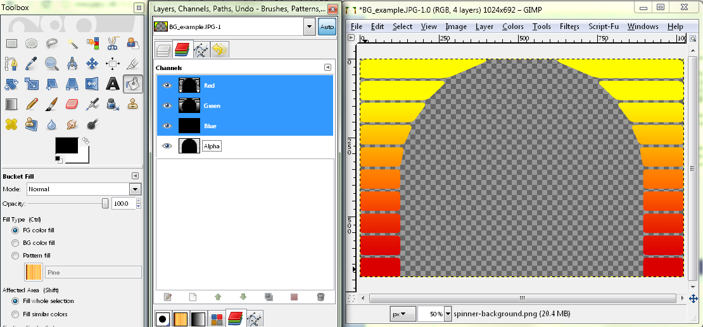

### คัดลอก/วางลงในเลเยอร์ใหม่ จากนั้นบันทึก Spinner Meter ของคุณ

เมื่อคุณได้สีที่ต้องการแล้ว ให้เลือก alpha channel ทั้งหมดอีกครั้ง (คลิกขวาที่ alpha channel -> channel to selection) คัดลอกและวางพื้นหลัง Spinner เพื่อให้คุณมีบางอย่างสำหรับเติมลงไปใน spinner meter ของคุณ

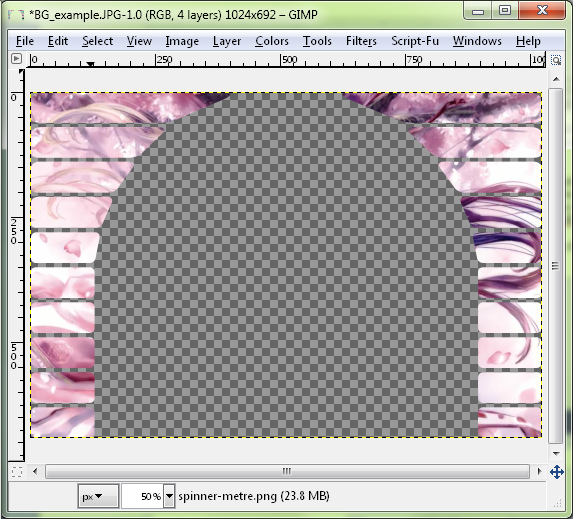

### ลดค่า Opacity ลงจนกว่าจะได้สีที่คุณชอบ

เพื่อเพิ่มรายละเอียดมากขึ้น คุณสามารถลดค่า opacity ของรูปภาพสีดำลงได้

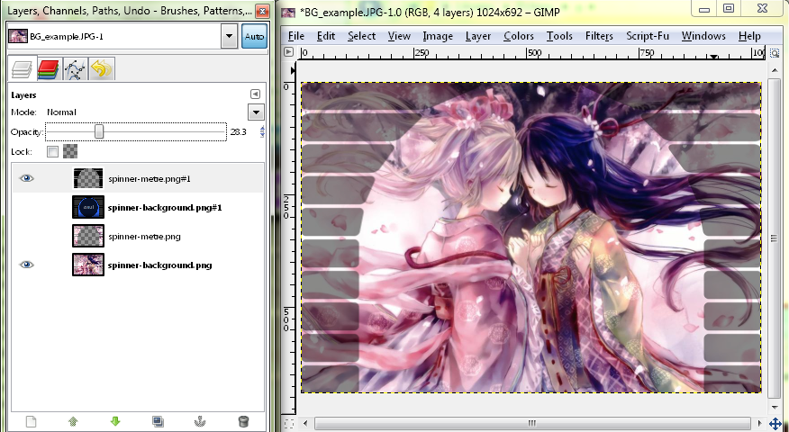

### พื้นหลังและเกจวัดของ Spinner ที่หมุนจนเต็มแล้ว

จากนั้นคุณสามารถดูว่ามันเป็นอย่างไรเมื่อถูกเติมจนเต็มโดยการเปิดเลเยอร์เก่าขึ้นมา สังเกตว่ามันจะมีเส้นขอบอยู่เล็กน้อย หากคุณต้องการเปลี่ยนขนาดของเส้นขอบนั้น คุณสามารถใช้เครื่องมือ `Select` -> `Grow` หรือ `Shrink` ก่อนที่คุณจะคัดลอก/วางเพื่อสร้าง spinner meter

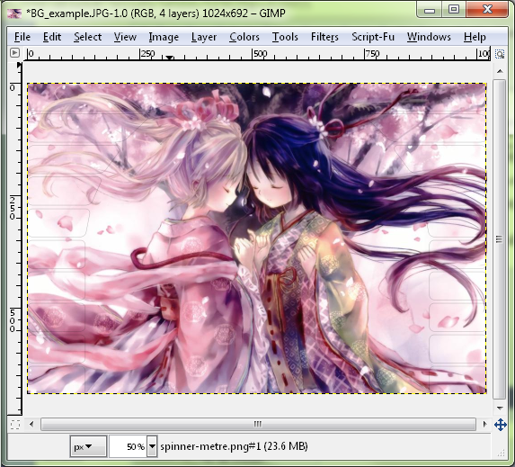

หากคุณทำตามนี้ การเปลี่ยนผ่านจากพื้นหลังไปสู่ Spinner จะไร้รอยต่อ และคุณจะไม่เจอปัญหาพื้นหลังขยับขึ้นไปไม่กี่พิกเซล
