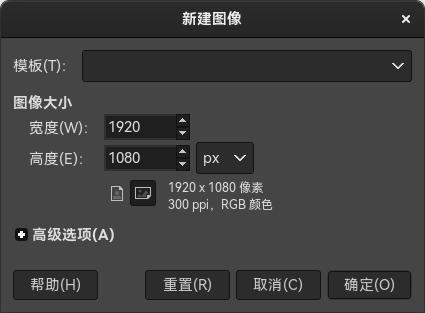
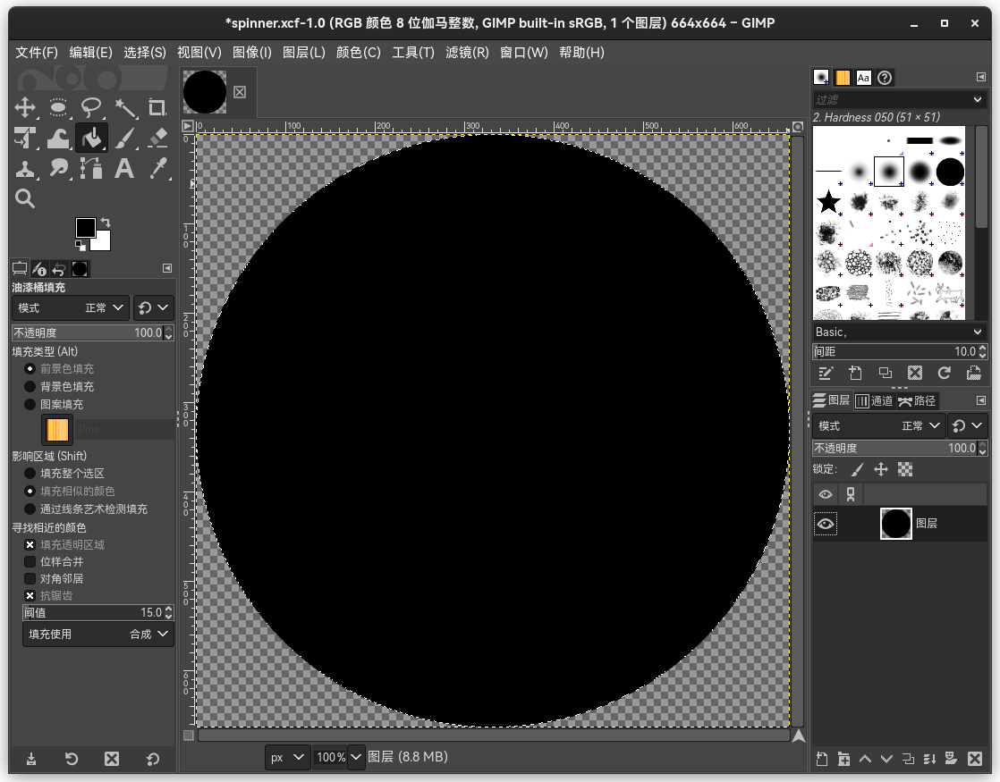
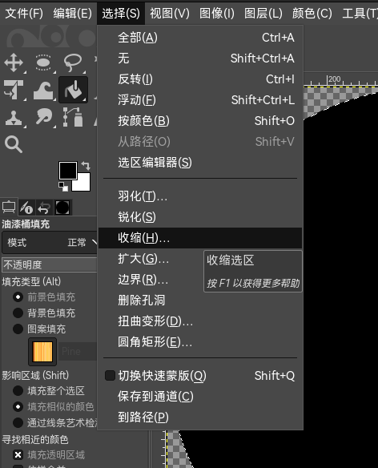
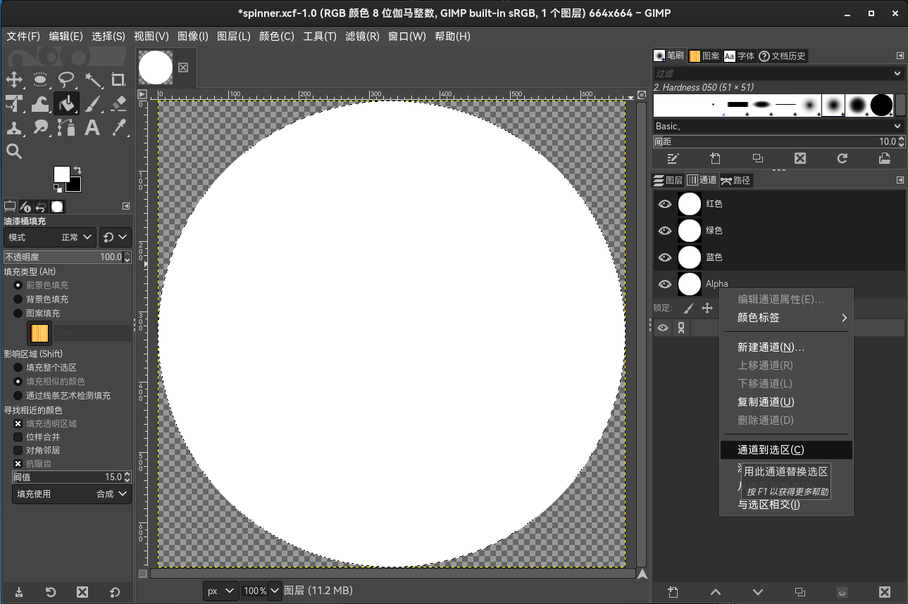
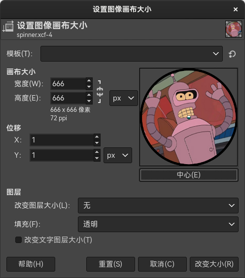
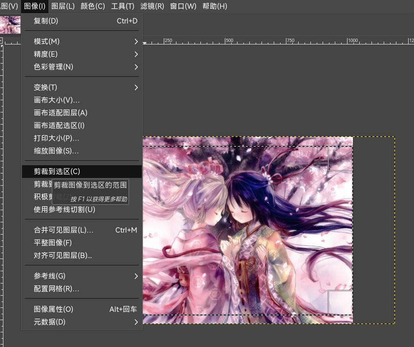

# 如何让皮肤中的转盘正确居中

[*How to make spinners symmetrical* 作者： ziin](https://osu.ppy.sh/community/forums/topics/51502)

对 GIMP/Photoshop 知之甚少的人可能难以理解此教程。此教程假定你知道如何（并且能）打开/关闭图层，以及自己找一些东西。

## 如何制作中心对称的转盘

摇摇晃晃的转盘看起来很累人。如果你想制作转盘，请确保它完全居中。

首先，打开你的图像编辑器，在本教程中会使用 [GIMP](https://gimp.org/)（因为是免费的）。

创建一个新文档。模板皮肤的大小是 666x666，尽管超出大小限制也没有问题，但**转盘在低性能电脑上会导致高度延迟，因此最好让其尺寸在限制内。**将文档大小设置为 664x664，这样当我们做完时，可以用透明色填充边缘，这样让 osu! 知道可以消除边缘锯齿，就不会让边缘太直。

### 创建新文档

### 选定圆圈

用椭圆选择工具（快捷键是 “e”）在整个文档上选出圆圈。然后创建新图层，给圆圈填色。

### 缩小选区

在此之后，使用选择 -> 收缩命令缩小选区。“收缩”命令只适合画一两个圈，因此如果要更准确地画圈，只需用椭圆选择工具重新画即可。

这里我选择缩小 15 像素，但是你也可以按个人意愿选择。创建一个新图层，将缩小后的选区涂上不同颜色，这样你就能看到它了。

### 转盘

对转盘的中心点，以及你想要的其他圆圈重复上述过程。这里我选的是缩小 300 像素。

### 给转盘添加图片

在此之后，你可以使用每个图层进行设计，或者选择透明通道来将你的图片放上去。

### 复制图片

从想要复制的图片中复制/粘贴选区：

### 设置画布尺寸

最后，你可以在转盘中间进行设计，也可以给转盘边缘着色。确保你通过图像 -> 画布大小将画布大小重设为了 666x666，并且将图像置于画布中央，这样图像四周就有 1 像素的边界了。

现在你应该有一个完美的转盘，旋转的时候不会晃来晃去了。

在本教程中不会提及让转盘边缘好看、设置深度这样的事情，这是完全不同的东西。我选了张很简单的图像与过程。如果你想那么做，这样的教程到处都是，亦或你可能已经知道怎么做了。然而，大多数制作皮肤的人似乎都忽略了对称性。

## 如何制作契合谱面背景的转盘背景

由于 osu! 通过游玩改变引入的一个从未被修复的 bug，让转盘的背景与实际谱面一致会是很困难的。首先，我们需要让转盘*在游玩过程中*而非在*谱面编辑器中*契合背景。在 1024x768 的区域中，与谱面其他元素相比，谱面将故事板元素（背景图像和视频）向上移动了 5 像素。

### 如果转盘在编辑器里看起来不对，别担心

### 剪裁背景

首先，将背景图像大小设置为 1024x768，剪裁下顶部的 46 像素与底部的 30 像素，这样就剪出了大小为 1024x692 的图像。模板图像大小是 1023x692，但是没关系；出于转盘的工作原理，图像右边缘就是纯黑色的。

### 用通道标签页避免编辑 alpha 通道

从技术上来说已经完成了，但如果你想要让背景图片“填入”转盘指示器中，那就可以使用模板皮肤，也可以自己做一个。导入转盘指示器的模板文件，选中并关闭 alpha 通道来给它重新着色，这样就完全不会修改透明度。然后使用填充桶工具，用灰色或任何你想要的颜色填充整个区域（我用的是黑色）。

### 复制/粘贴到新图层，然后保存转盘指示器图像

在你上好颜色后，再次选择整个 alpha 通道（右击 alpha 通道 -> 通道到选区）。复制并粘贴转盘背景，这样就可以用它填充你的转盘指示器了。

### 调低透明度，直到得到喜爱的颜色

如果想多加点细节，你可以调低黑色图像的透明度。

### 转完的转盘背景和指示器图像

在此之后，你就可以通过打开旧图层，看看背景是如何契合进去的。请注意，可能会出现一点点轮廓线。如果想要改变其大小，可以在复制/粘贴之前使用`选择` -> `扩大`或`缩小`工具来制作转盘指示器。

如果你这样做了，背景图像到转盘就会实现无缝过渡，背景图像也不会向上移动几个像素了。
