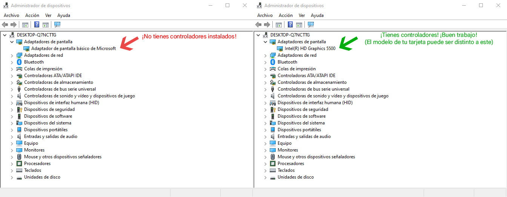

# Problemas de compatibilidad con OpenGL

La próxima gran versión de osu! (prevista para agosto-septiembre de 2015) eliminará la compatibilidad con DirectX para simplificar la infraestructura. Si estás viendo esta página, significa que es probable que no puedas jugar a osu! en tu sistema actual cuando salga la nueva versión. Esta página tiene soluciones comunes para problemas que hemos encontrado. ¡Léelos y pruébalos!

## Controladores antiguos o faltantes

Si no tienes instalados los controladores gráficos correctos, Windows usará un controlador alternativo «Adaptador de pantalla básico de Microsoft», que **funciona** para juegos DirectX pero es muy lento. No funciona en absoluto para OpenGL, así que tendremos que asegurarnos de que tienes los controladores correctos.

En primer lugar, comprobemos si esto se aplica a tu caso:

- Haz clic con el botón derecho en «Este equipo» y selecciona «Propiedades» en el menú desplegable, o presiona la tecla `Windows` + `Inter` en el teclado.
- Selecciona el administrador de dispositivos a la derecha.

Comprueba si estás usando el adaptador de pantalla básico de Microsoft según el siguiente diagrama:

Busca los controladores para tu tarjeta en el sitio web del fabricante. Aquí hay algunos enlaces comunes:

- [AMD / ATI](https://amd.com/es/support)
- [NVIDIA](https://nvidia.com/Download/index.aspx?lang=es)
- [Intel](https://downloadcenter.intel.com/product/81500/Intel-HD-Graphics-3000)

## Profundidad de bits incorrecta

Es posible que los controladores estén instalados correctamente, pero que la profundidad de bits del color sea incorrecta. Windows recurrirá a controladores genéricos [cuando la profundidad de bits del color no sea de 32 bpp](https://opengl.org/discussion_boards/showthread.php/145008-Why-my-OpenGL-program-uses-Microsoft-GDI-renderer-instead-of-my-GeForce-5200). Cambiar [la profundidad de bits del color a 32 bpp solucionará este problema](https://windows.microsoft.com/en-us/windows/getting-best-display-monitor#getting-best-display-monitor&section_2).

## Ayuda adicional

Si tu problema no se soluciona con las soluciones anteriores, abre un hilo en el [foro de ayuda](https://osu.ppy.sh/community/forums/5) con los resultados de [este programa](http://realtech-vr.com/home/glview) y tu gl\_info.txt si estás en la versión Cutting Edge.
