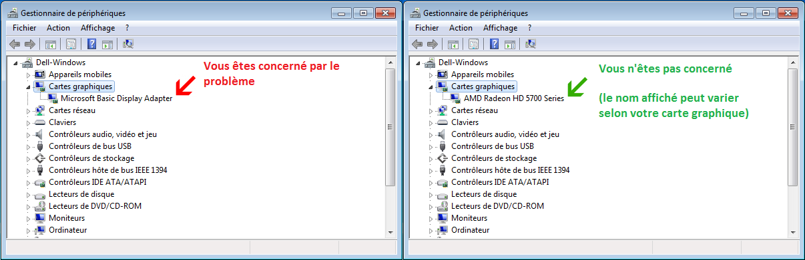

# Problèmes de prise en charge d'OpenGL

La version d'osu! (20151016.7) à supprimer le support de DirectX afin de simplifier notre framework. Si vous voyez cette page, cela signifie que vous ne pouvez pas jouer à osu! sur votre système actuel. Cette page contient des solutions communes aux problèmes que nous avons rencontrés. Lisez-la et essayez-les !

## Pilotes manquants ou anciens

Si vous n'avez pas installé les bons pilotes graphiques, Windows utilisera un pilote de repli nommé "Basic Display Adapter", qui **fonctionne** pour les jeux DirectX mais est très lent. Il ne fonctionne pas du tout pour OpenGL, nous devons donc nous assurer que vous disposez des bons pilotes.

Tout d'abord, vérifions si cela s'applique à vous :

- Cliquez avec le bouton droit de la souris sur le logo Windows et choisissez `Gestionnaire de périphériques`.
- Ou cliquez avec le bouton droit de la souris sur Ce PC et choisissez Propriétés dans la liste déroulante, ou appuyez sur Windows+Pause sur votre clavier.
- Choisissez Gestionnaire de périphériques sur la gauche.

Vérifiez si vous utilisez Microsoft Basic Display Adapter comme indiqué dans le diagramme suivant :

Veuillez trouver les pilotes pour votre carte sur le site Web du fabricant. Voici quelques liens courants :

- [AMD/ATI](https://www.amd.com/fr/support)
- [NVIDIA](https://www.nvidia.fr/Download/index.aspx?lang=fr)
- [Intel](https://www.intel.fr/content/www/fr/fr/support/products/80939/graphics.html)

## Mauvaise profondeur de bit

Il se peut que vos pilotes soient correctement installés mais que la profondeur des bits de couleur soit incorrecte. Windows se rabat sur des pilotes génériques [lorsque la profondeur de couleur n'est pas de 32bpp](https://community.khronos.org/t/why-my-opengl-program-uses-microsoft-gdi-renderer-instead-of-my-geforce-5200/35018). La modification de la [profondeur des bits de couleur à 32bpp résoudra ce problème](https://support.microsoft.com/fr-fr/windows/obtention-du-meilleur-affichage-sur-votre-moniteur-c7e01f63-9b51-2b23-0a0f-6b965af015a9#getting-best-display-monitor&section_2).

## Aide supplémentaire

Si votre problème n'est pas résolu par les solutions ci-dessus, veuillez ouvrir un fil de discussion dans le [forum Help](https://osu.ppy.sh/community/forums/5) avec la sortie de [ce programme](http://realtech-vr.com/home/glview) et votre gl_info.txt si vous êtes sur la version Cutting Edge.
