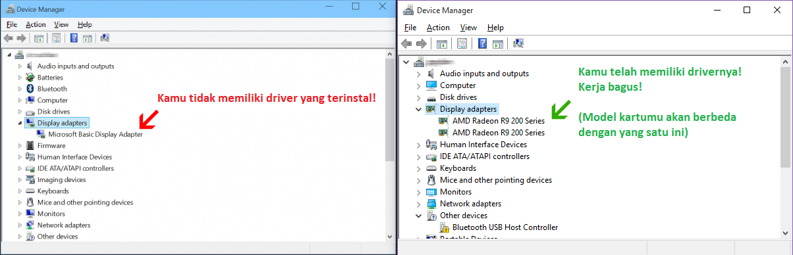

# Masalah Dukungan OpenGL

Perilisan besar-besaran osu! selanjutnya menghilangkan dukungan DirectX dalam rangka untuk menyederhanakan framework kita. Jika kamu melihat halaman ini, itu berarti kamu tidak dapat bermain osu! pada sistemmu yang sekarang ketika rilis terbaru muncul. Halaman ini memiliki solusi umum untuk masalah yang telah kita temukan. Baca dan cobalah!

## Driver yang Kuno atau Hilang

 pada System Properties (Properti Sistem)")

Jika kamu tidak mempunyai driver grafik yang terinstal, Windows akan menggunakan sebuah driver "Basic Display Adapter" secara otomatis, yang mana **bekerja** pada permainan DirectX akan tetapi sangat lambat. Ini tidak bekerja sama sekali pada OpenGL, karena itulah kami harus memastikan kamu mempunyai driver yang benar.

Pertama, cobalah cek jika ini juga terjadi padamu:

- Klik kanan pada My Computer dan pilih Properties dari menu yang muncul, atau tekan WinKey+Break pada keyboardmu.
- Pilihlah Device Manager (Pengelola Perangkat) pada sebelah kiri (lihat gambar di samping)

Pastikan jika kamu menggunakan Microsoft Basic Display Adapter seperti gambar berikut:

Carilah driver untuk kartu grafikmu dari halaman web pabrikannya. Berikut beberapa tautan umum:

- [AMD / ATI](https://amd.com/en/support)
- [NVIDIA](https://nvidia.com/Download/index.aspx?lang=en-us)
- [Intel](https://downloadcenter.intel.com/product/81500/Intel-HD-Graphics-3000)

## Kesalahan pada kedalaman bit warna

Drivermu mungkin telah terinstal dengan baik tapi kedalaman bit warnamu mungkin saja salah. Windows akan menggunakan driver generik secara otomatis [jika kedalaman bit warna bukan 32bpp](https://opengl.org/discussion_boards/showthread.php/145008-Why-my-OpenGL-program-uses-Microsoft-GDI-renderer-instead-of-my-GeForce-5200). Prosedur untuk memperbaiki masalahnya (diterjemahkan dari halaman [ini](https://windows.microsoft.com/en-us/windows/getting-best-display-monitor#getting-best-display-monitor&section_2)):

- Klik kanan pada desktop kemudian pilih **Resolusi Layar**
- Klik **Pengaturan tingkat lanjut** kemudian pilih tab **Monitor**
- Di bagian **Warna**, pilih **True Color (32 bit)**, kemudian klik **OK**.

## Bantuan Tambahan

Jika masalahmu tidak dapat diperbaiki berdasarkan solusi di atas, bukalah sebuah thread pada [forum bantuan](https://osu.ppy.sh/community/forums/5) dengan hasil dari [program ini](http://realtech-vr.com/home/glview) dan gl\_info.txt kamu jika kamu menggunakan versi Cutting Edge (berkas gl\_info.txt berada pada direktori instalasi osu!mu). Gunakan bahasa Inggris agar para pengembang dapat memahami dan membantu menyelesaikan permasalahanmu.
