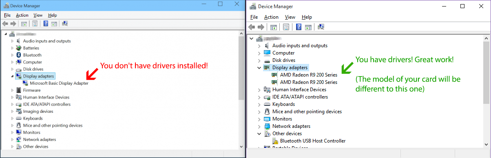

# ปัญหาการรองรับ OpenGL (OpenGL support issues)

การปล่อยตัวเกมเวอร์ชันใหญ่ครั้งถัดไปของ osu! (จะมีขึ้นในเดือนสิงหาคม-กันยายน ปี 2015) จะทำการถอดการรองรับ DirectX ออกเพื่อทำให้เฟรมเวิร์ก (Framework) ของเราเรียบง่ายขึ้น หากคุณกำลังเห็นหน้านี้ นั่นหมายความว่าคุณมีแนวโน้มที่จะไม่สามารถเล่น osu! บนระบบปัจจุบันของคุณได้เมื่อตัวเกมเวอร์ชันใหม่เปิดใช้งาน หน้านี้มีวิธีแก้ไขปัญหาทั่วไปที่เราได้รวบรวมไว้ โปรดอ่านและลองนำไปปฏิบัติตาม!

## ไดรเวอร์หายหรือล้าสมัย (Missing or old Drivers)

หากคุณไม่ได้ติดตั้งไดรเวอร์กราฟิกที่ถูกต้อง Windows จะใช้ไดรเวอร์สำรองที่เรียกว่า "Microsoft Basic Display Adapter" ซึ่ง**ใช้งานได้**สำหรับเกมที่ใช้ DirectX แต่จะช้ามาก และมันจะไม่ทำงานเลยสำหรับ OpenGL ดังนั้นเราจึงต้องแน่ใจว่าคุณมีไดรเวอร์ที่ถูกต้อง

อันดับแรก มาตรวจสอบกันว่าสิ่งนี้เกิดขึ้นกับคุณหรือไม่:

- คลิกขวาที่ My Computer แล้วเลือก Properties จากเมนูที่แสดงขึ้นมา หรือกดปุ่ม WinKey+Break บนคีย์บอร์ดของคุณ
- เลือก Device Manager ทางด้านซ้าย

ตรวจสอบว่าคุณกำลังใช้งาน Microsoft Basic Display Adapter ตามรูปภาพด้านล่างนี้หรือไม่:

โปรดค้นหาไดรเวอร์สำหรับคาร์ดจอของคุณจากเว็บไซต์ของผู้ผลิต นี่คือลิงก์ทั่วไปบางส่วน:

- [AMD / ATI](https://amd.com/en/support)
- [NVIDIA](https://nvidia.com/Download/index.aspx?lang=en-us)
- [Intel](https://downloadcenter.intel.com/product/81500/Intel-HD-Graphics-3000)

## การตั้งค่า Bit depth ผิดพลาด (Wrong bit depth)

ไดรเวอร์ของคุณอาจจะติดตั้งอย่างถูกต้องแล้ว แต่ค่าความละเอียดสี (Colour bit depth) ของคุณอาจจะไม่ถูกต้อง Windows จะย้อนกลับไปใช้ไดรเวอร์พื้นฐาน [เมื่อค่าความละเอียดสีไม่ได้อยู่ที่ 32bpp](https://opengl.org/discussion_boards/showthread.php/145008-Why-my-OpenGL-program-uses-Microsoft-GDI-renderer-instead-of-my-GeForce-5200) การเปลี่ยน [ความละเอียดสีเป็น 32bpp จะช่วยแก้ไขปัญหานี้ได้](https://windows.microsoft.com/en-us/windows/getting-best-display-monitor#getting-best-display-monitor&section_2)

## ความช่วยเหลือเพิ่มเติม (Additional Help)

หากปัญหาของคุณยังไม่ได้รับการแก้ไขด้วยวิธีข้างต้น โปรดตั้งกระทู้ใน [ฟอรัมช่วยเหลือ (Help forum)](https://osu.ppy.sh/community/forums/5) พร้อมแนบข้อมูลที่ได้จาก [โปรแกรมนี้](http://realtech-vr.com/home/glview) และไฟล์ gl\_info.txt ของคุณหากคุณใช้งานตัวเกมเวอร์ชัน Cutting Edge