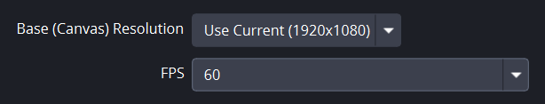
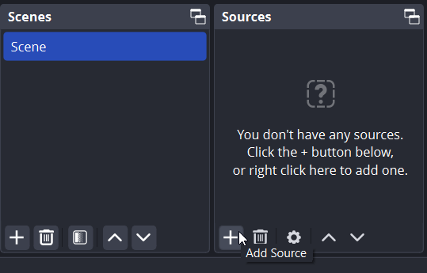
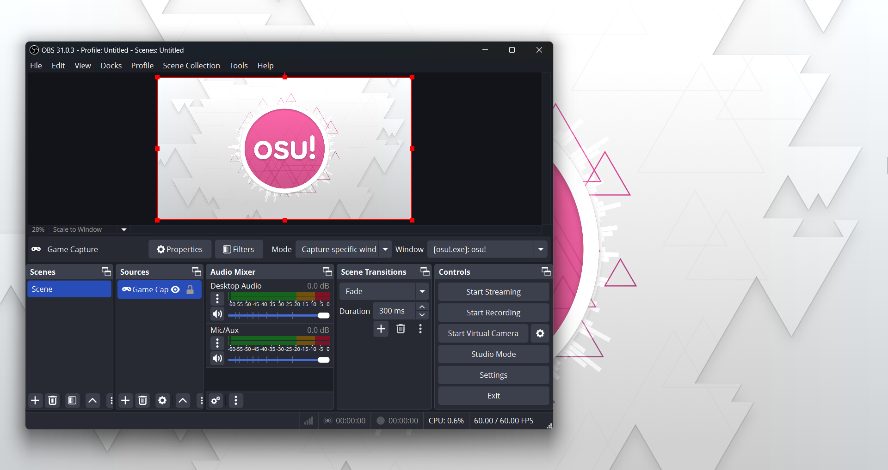

# How to record videos of osu!

*See also: [Livestreaming osu!](/wiki/en/Guides/Livestreaming_osu!)*

While there are countless ways to **record videos of osu!**, this guide will cover one of the simplest options using [OBS Studio](https://obsproject.com/).

## Settings

### Auto-Configuration wizard

When you launch OBS Studio for the first time, the auto-configuration wizard will open. 

On the `Usage Information` screen, choose `Optimize for recording, streaming is secondary` and click `Next`.

On the `Video Settings` screen, set `Base (Canvas) Reesolution` to your monitor's native resolution, and set `FPS` to `60`. You can also use `Either 60 or 30, but prefer 60 when possible`, but if your computer struggles to maintain 60 FPS, you likely will struggle to record high quality osu! videos.

On the `Final Results` screen, OBS Studio will list automatically selected settings based on your computer's specs. Click `Apply Settings` to continue.

### Additional settings

By default, OBS Studio outputs `.mkv` files. While this is ideal if OBS unexpectedly crashes or you use separate audio channels, many video editing programs don't handle `.mkv` files, so changing output to `.mp4` is recommended.

In `Settings`, go to the `Output` tab on the left, change `Output Mode` from `Simple` to `Advanced`, then click the `Recording` tab on the top. From here, change `Recording Format` from `Matroska Video (.mkv)` to `MPEG-4 (.mp4)`.

Screen recording is a balance of performance and output quality. While this depends on your hardware, below are some things to consider:

- `Video Encoder` has a big impact on performance and output quality. Experiment with these to see which works best for your setup.
- `Bitrate` loosely equates to recording quality. Setting this number higher will make output quality higher and increase performance strain.
- If your recording settings are more intense than your computer can handle, a warning will be shown in the bottom left of OBS Studio. In this case, you'll also likely be able to see lag during video playback.

## Recording

On OBS Studio's main screen, you'll see a `Scenes` box and a `Sources` box. Any scene can be composed of multiple sources, but for the sake of this tutorial, only one source will be added: your osu! window.

An empty scene is created by default. To add to the scene, click the `+` icon in the `Sources` section, then select `Game Capture`. You can also use `Display Capture`, but this can cause latency issues, so it's not recommended.

In the `Create/Select Source` popup, select `Create new` and click `OK`. On the following screen titled `Properties for 'Game Capture'`:

- If you run osu! fullscreen, set `Mode` to `Capture any fullscreen window`
- If you run osu! borderless or windowed, change `Mode` to `Capture specific window`, then open the game and find `[osu!.exe]: osu!` in the `Window` dropdown.

If you see a black box instead of osu! in the preview window, right click the `Game Capture` source and try to adjust the window settings.

If your goal is to only record osu! gameplay, you'll likely want to mute the `Mic/Aux` section of the `Audio Mixer` by clicking the sound icon.

OBS Studio's other default settings are adequate for recording osu! gameplay, so once this is done, OBS Studio should be ready to go!