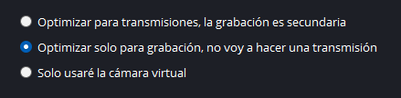
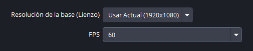
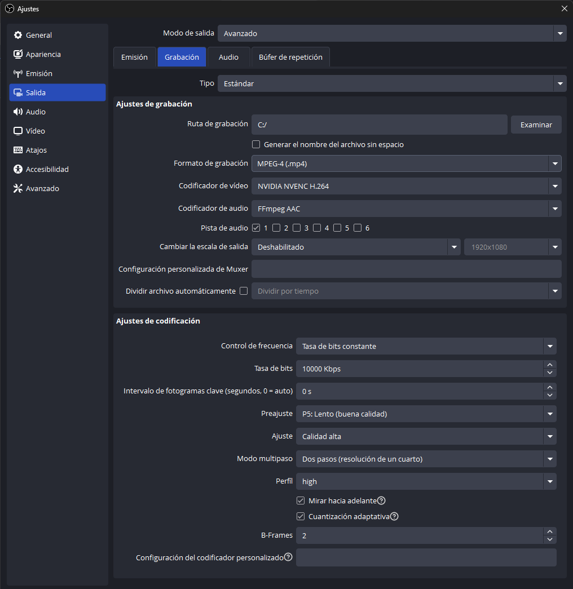
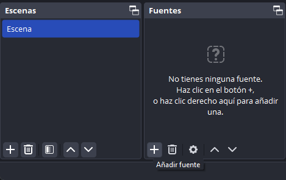
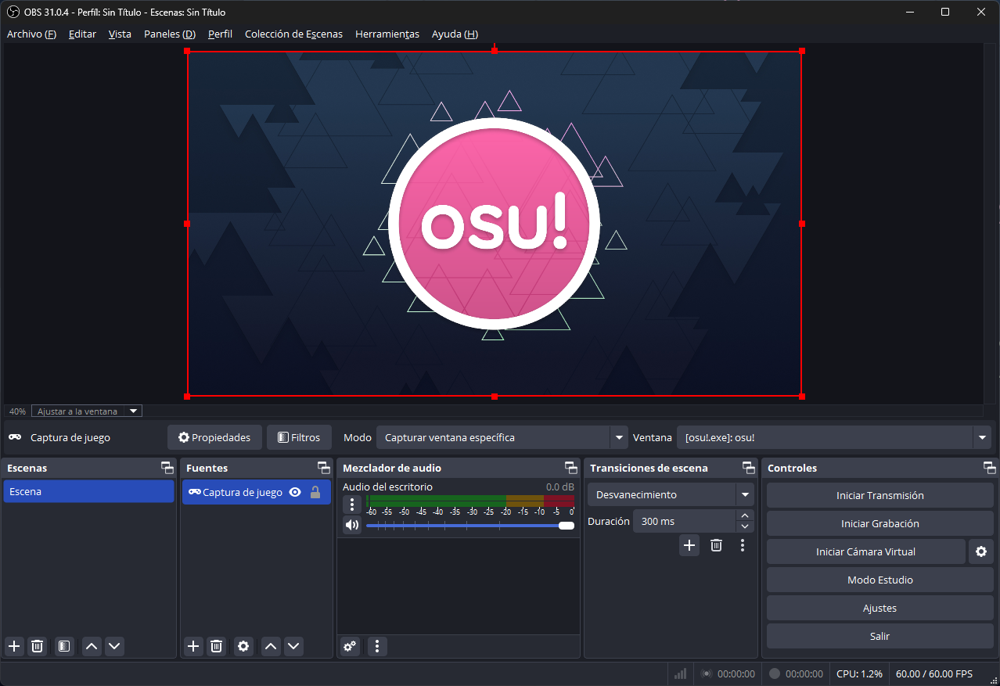
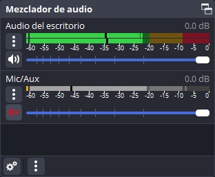

# Cómo grabar vídeos de osu!

*Véase también: [Transmitir osu! en vivo](/wiki/Guides/Livestreaming_osu!)*

Si bien existen innumerables formas de **grabar vídeos de osu!**, esta guía cubrirá una de las opciones más sencillas usando [OBS Studio](https://obsproject.com/).

## Ajustes

### Asistente de configuración automática

Cuando inicies OBS Studio por primera vez, se abrirá el asistente de configuración automática.

En el panel `Información sobre el uso`, elige `Optimizar solo para grabación, no voy a hacer una transmisión` y haz clic en `Siguiente`.

En el panel `Ajustes de vídeo`, establece la `Resolución de la base (Lienzo)` en la resolución nativa de tu monitor, y establece `FPS` en `60`. También puedes usar `60 o 30, pero usar 60 cuando sea posible`, pero si tu ordenador tiene problemas para mantener 60 FPS, es probable que tengas dificultades para grabar vídeos de alta calidad.

En el panel `Resultado final`, OBS Studio mostrará una lista con los ajustes seleccionados automáticamente según las especificaciones de tu ordenador. Haz clic en `Aplicar configuración` para continuar.

### Ajustes adicionales

De forma predeterminada, OBS Studio genera archivos `.mkv`. Si bien esto es ideal si OBS se cierra inesperadamente o si usas canales de audio separados, muchos programas de edición de vídeo no procesan archivos `.mkv`, por lo que se recomienda cambiar la salida a `.mp4`.

En `Ajustes`, ve a la pestaña `Salida` de la izquierda, cambia `Modo de salida` de `Sencillo` a `Avanzado` y haz clic en la pestaña `Grabación` de la parte superior. Desde aquí, cambia el `Formato de grabación` de `Video Matroska (.mkv)` a `MPEG-4 (.mp4)`.

La grabación de pantalla es un equilibrio entre rendimiento y calidad de salida. Aunque esto depende de tu equipo, a continuación te indicamos algunos aspectos a tener en cuenta:

- El `Codificador de vídeo` tiene un gran impacto en el rendimiento y la calidad de salida. Experimenta con ellos para ver cuál se adapta mejor a tu equipo.
- La `Tasa de bits` equivale a la calidad de grabación. Si se cambia este número a uno extremadamente alto, la calidad de salida será mayor, pero también aumentará la tensión de rendimiento de tu dispositivo.
- Si los ajustes de grabación son más intensos de lo que puede soportar tu ordenador, aparecerá una advertencia en la parte inferior izquierda de OBS Studio. En este caso, también es probable que notes *lag* durante la reproducción del vídeo.

## Grabación

En la pantalla principal de OBS Studio, verás un cuadro de `Escenas` y otro de `Fuentes`. Cualquier escena puede estar compuesta de múltiples fuentes, pero para el bien de este tutorial, solo se añadirá una fuente: tu ventana de osu!.

De forma predeterminada se crea una escena vacía. Para añadirla a la escena, haz clic en el icono `+` de la sección `Fuentes` y selecciona `Captura de juego`. También puedes usar `Captura de pantalla`, pero esto puede causar problemas de latencia, así que no se recomienda.

En la ventana `Crear/seleccionar fuente`, selecciona `Crear nuevo` y haz clic en `Aceptar`. En la siguiente ventana titulada `Propiedades para 'Captura de juego'`:

- Si ejecutas osu! a pantalla completa, establece `Modo` en `Capturar cualquier aplicación de pantalla completa`.
- Si ejecutas osu! sin bordes o en ventana, cambia `Modo` a `Capturar ventana específica`, luego abre el juego y busca `[osu!.exe]: osu!` en el desplegable de `Ventana`.

Si ves un cuadro negro en lugar de osu! en la ventana de previsualización, haz clic con el botón derecho del ratón en la fuente `Captura de juego` e intenta ajustar la configuración de la ventana.

Si tu objetivo es grabar solo las partidas de osu!, probablemente quieras silenciar la sección `Mic/Aux` del `Mezclador de audio` haciendo clic en el icono de sonido.

Los demás ajustes predeterminados de OBS Studio son adecuados para grabar partidas de osu!, así que una vez hecho esto, ¡OBS Studio debería estar listo para funcionar!
