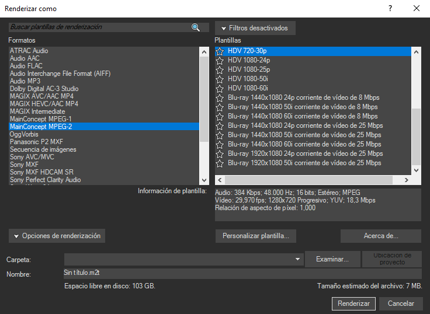

# Cómo grabar vídeos de osu!

[¿Quieres usar Virtualdub en lugar de Sony Vegas? ¡Haz clic aquí](https://osu.ppy.sh/community/forums/posts/252802)

¿Siempre has querido hacer un vídeo para YouTube sobre osu!, pero nunca has encontrado la manera de hacerlo? En esta guía te explico cómo puedes hacerlo. **Ten en cuenta que hay más formas de hacerlo, esta es solo la mía.** [Ve el resultado de este tutorial aquí (¡míralo en HD y a pantalla completa!)](https://youtube.com/watch?v=JRGhQh69geI).

## Requisitos

- Software de grabación
  - [OBS](https://obsproject.com/)
  - [Fraps](https://fraps.com/)
  - [Action!](https://actionrecorder.com/)
  - [Bandicam](https://www.bandicam.com/)
- Software de edición/renderización (nunca uses Windows Moviemaker, ¡bajará drásticamente la calidad del vídeo!)
  - [Sony Vegas](https://www.vegascreativesoftware.com/us/vegas-pro/)
  - [Adobe Premier](https://www.adobe.com/products/premiere.html)
  - [AVS Video Editor](https://www.avs4you.com/avs-video-editor.aspx)
  - [DaVinci Resolve](https://www.blackmagicdesign.com/products/davinciresolve)

### Configurar Fraps

Abre Fraps, y vamos a jugar con los ajustes.

Asegúrate de que:

- Haces que la tecla rápida de captura de vídeo sea una tecla que no estorbe.
- Si obtienes un vídeo de salida que tiene una velocidad de fotogramas elevada, limita la velocidad de fotogramas a 30. Si este no es el caso, simplemente usa 60 FPS.
- Si obtienes un vídeo de salida que tiene una velocidad de fotogramas baja, graba en «half-size». El vídeo tendrá la mitad de la resolución con la que se grabó (alternativamente: puedes ejecutar osu! en una resolución más baja al grabar).
- Te queda suficiente espacio libre en tu disco duro. Si no, el vídeo terminará antes de tiempo cuando ya no quede espacio para almacenar.
- La opción `Hide mouse cursor in video` está marcada.
- ¡ESTÁS GRABANDO EL SONIDO! No hay nada peor que los vídeos de osu! con música añadida después.

## Grabar tu juego

Abre osu! mientras Fraps está en ejecución. Si todo va bien (y si no has desactivado esta función), verás un contador de FPS amarillo en una esquina de la pantalla.

Ahora, ve a lo que quieras grabar. Por ejemplo: ¡una repetición de cómo consigues una puntuación! Cuando estés en la parte en la que quieres empezar la grabación, presiona la tecla de acceso rápido de captura de vídeo. El contador de FPS puede bajar y debe ponerse en rojo. Ahora estás grabando. Mira durante un minuto si la tasa de FPS no cambia mucho. Si es así, prueba algunos de los consejos anteriores.

Presiona de nuevo la tecla rápida de captura de vídeo para detener la grabación.

## Editar el vídeo

Arrastra y suelta el vídeo en la línea de tiempo de Vegas. Si hay varios archivos, Vegas los añadirá al final de la parte anterior automáticamente.

Ahora puedes hacer alguna edición opcional.

## Renderizar el vídeo

Ahora que has terminado de editar el vídeo, ve a «Archivo» y haz clic en «Renderizar como». Usa las siguientes opciones (dependiendo de tu versión de Vegas):

Pulsa el botón de renderizar y tu vídeo estará listo en un par de minutos. ¡Ya está listo para YouTube! Ten en cuenta que el vídeo tardará algún tiempo en estar disponible en alta resolución en YouTube, ¡ten paciencia!

**Ahora, ve a hacer videos y difunde osu!.** Guía realizada por [Remco32](https://osu.ppy.sh/users/9199), hilo original [aquí](https://osu.ppy.sh/community/forums/topics/18112).
