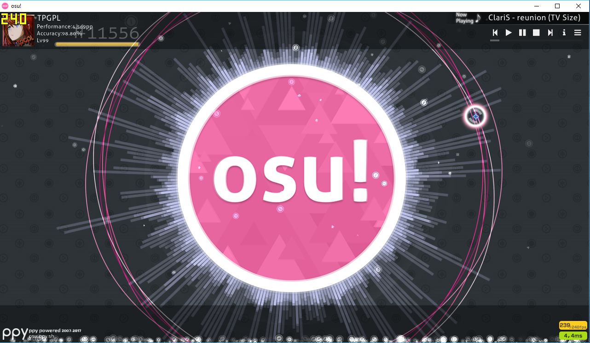
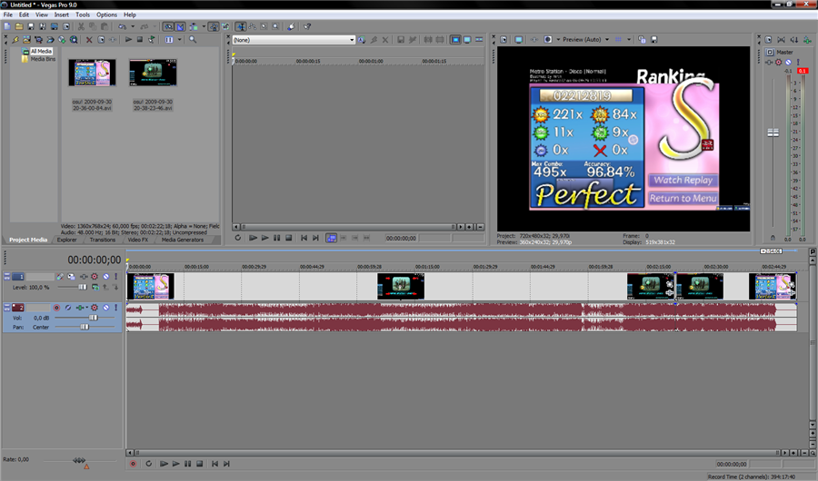

# Faire des enregistrements d'osu!

[Vous voulez utiliser Virtualdub au lieu de Sony Vegas ? Cliquez ici!](https://osu.ppy.sh/forum/viewtopic.php?p=252802#p252802)

Vous avez toujours voulu faire une vidéo pour YouTube sur osu!, mais vous n'avez jamais trouver une bonne façon de le faire ? Je vous expliquerais dans cet article comment vous pouvez le faire.
**Notez qu'il y a d'autres moyens de le faire, c'est juste ma façon de faire.**
[Voyez le résultat de ce tutoriel ici (Regardez en HD et en plein écran !)](http://youtube.com/watch?v=JRGhQh69geI)

## Prérequis

-   Logiciel d'enregistrement 
    - OBS
    - Fraps
    - Action!
    - Bandicam
-   Logiciel d'édition/de rendu (N'utilisez jamais Windows Moviemaker, cela baissera la qualité de la vidéo drastiquement !)
    - Sony Vegas
    - Adobe Premier
    - AVS Video Editor

### Configurer Fraps

Ouvrez Fraps, et regardez les options.

Soyez sûr que :

-   Le hotkey de capture vidéo ne sera pas gênant;
-   Si vous obtenez une vidéo de sortie avec un framerate excessif, limitez-le à 30. Si ce n'est pas le cas, utilisez 60 FPS;
-   Si vous obtenez une vidéo de sortie dont le framerate est faible, enregistrez le «en demi-taille». La vidéo correspondra à la moitié de la résolution à partir de laquelle elle a été enregistrée (vous pouvez également utiliser une résolution inférieure lors de l’enregistrement);
-   Vous avez asser d'espace libre sur votre disque. Sinon, la vidéo finira plus tôt s'il n'y a pas asser d'espace pour la stocker;
-   Le curseur n'apparait pas. 
-   VOUS ENREGISTREZ LE SON ! Ce n'est pas gênant d'ajouter la musique après l'enregistrement de vidéos d'osu!.

## Enregistrez votre gameplay

Ouvrez osu! quand Fraps est ouvert. Si tout fonctionne correctement (et si vous n'avez pas désactiver ce paramètre), vous verrez une compteur de FPS jaune dans un coin de l'écran.

Maintenant, allez à ce que vous voulez enregistrer. exemple : un replay d'un de vos highscores ! Quand vous voulez commencer l'enregistrement, pressez votre raccourci clavier pour la capture vidéo. Le compteur de FPS va devenir rouge. Vous êtes en train d'enregistrer. Regardez vite fait si votre FPS rate n'a pas beaucoup changer. S'il a beaucoup changé, essayer quelques quelques astuces listés ci-dessous.

Pressez le raccourci clavier pour la capture vidéo de nouveau pour arrêter d'enregistrer.

## Montage de votre vidéo

Glissez déposer votre vidéo dans une timeline de Vegas. Si vous avez plusieurs fichiers, Vegas les ajoutera automatiquement à la fin de la vidéo précédente.

Vous pouvez faire des éditions facultatives maintenant.

## Rendu de votre vidéo

Maintenant que vous avez fait quelques éditions à votre vidéo, allez dans 'Fichier', puis cliquer sur 'Rendre comme' 
Utilisez les options suivantes (dépendant de votre version de Vegas) : 

Pressez le bouton de sauvegarde, et votre vidéo sera prête dans quelques minutes. Elle est maintenant prête pour YouTube ! 
Notez que cela prend du temps avant que votre vidéo soit disponible en haute résolution sur Youtube, soyez patients ! 

**Faites des vidéos et propagez osu!**
Ce guide à été fait par [Remco32](https://osu.ppy.sh/users/9199), sujet original [ici](https://osu.ppy.sh/community/forums/topics/18112)
