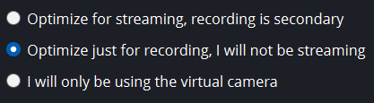
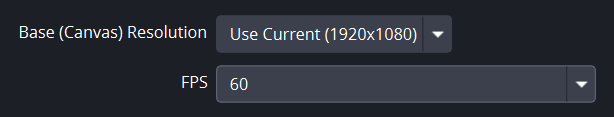
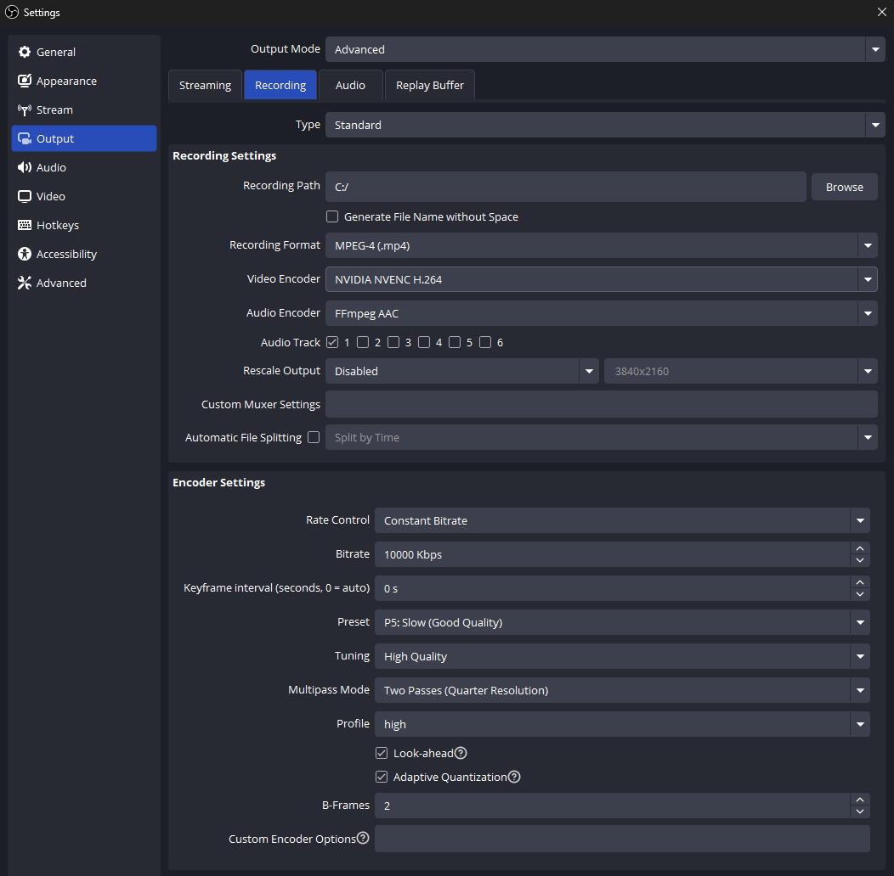
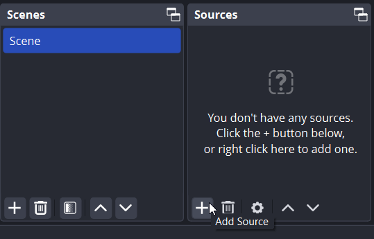
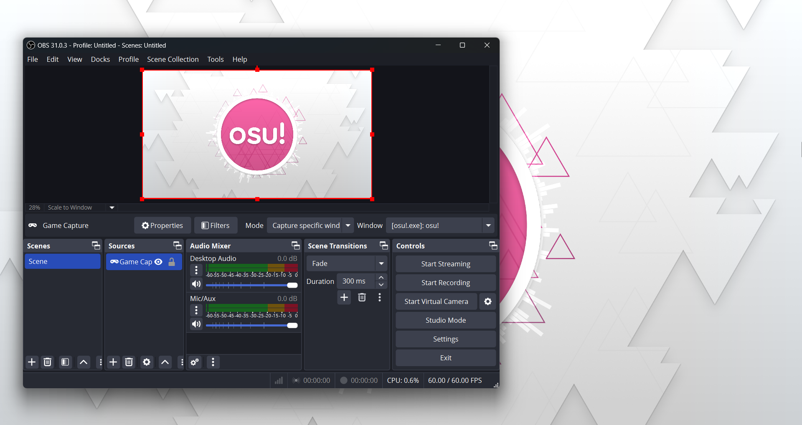
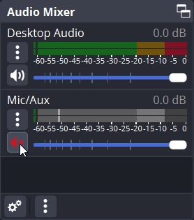

# Cara merekam video osu!

*Lihat juga: [Menyiarkan osu! secara langsung](/wiki/Guides/Livestreaming_osu!)*

Terdapat banyak cara yang dapat digunakan untuk **merekam video osu!**. Panduan ini akan membahas salah satu cara merekam yang paling sederhana, yaitu dengan menggunakan [OBS Studio](https://obsproject.com/).

## Pengaturan

### Panduan konfigurasi otomatis

Pada saat kamu meluncurkan OBS Studio untuk pertama kalinya, kamu akan dihadapkan dengan layar panduan konfigurasi otomatis (*auto-configuration wizard*).

Pada layar `Usage Information`, pilih `Optimize for recording, streaming is secondary` dan klik `Next`.

Pada layar `Video Settings`, sesuaikan nilai `Base (Canvas) Resolution` dengan resolusi bawaan monitor kamu dan atur nilai `FPS` ke `60`. Kamu juga dapat menggunakan `Either 60 or 30, but prefer 60 when possible`, namun apabila komputer kamu tidak dapat berjalan stabil pada 60 FPS, kamu kemungkinan akan sulit untuk merekam video osu! dengan kualitas tinggi.

Pada layar `Final Results`, OBS Studio akan memunculkan daftar pengaturan yang dipilih secara otomatis berdasarkan spesifikasi komputermu. Klik `Apply Settings` untuk menerapkan pengaturan ini dan melanjutkan ke tahap berikutnya.

### Pengaturan tambahan

Secara bawaan, OBS Studio merekam video dalam format `.mkv`. Walaupun format ini ideal untuk mencegah hilangnya berkas rekaman apabila OBS mengalami crash secara tiba-tiba (atau apabila kamu menggunakan saluran audio yang terpisah), sebagian besar program penyunting video tidak mendukung format `.mkv`. Oleh karenanya, kamu disarankan untuk mengubah format keluaran ini menjadi `.mp4`.

Pada `Settings`, tuju tab `Output` di sisi kiri layar, ubah `Output Mode` dari `Simple` ke `Advanced`, dan lalu klik tab `Recording` pada bagian atas. Dari sini, ubah `Recording Format` dari `Matroska Video (.mkv)` ke `MPEG-4 (.mp4)`.

Kualitas rekaman yang dihasilkan akan didasari oleh performa komputermu dan kualitas keluaran yang dipilih. Walaupun kualitas ini sebagian besarnya bergantung pada kemampuan hardware kamu, terdapat beberapa hal yang dapat kamu pertimbangkan:

- Pengaturan `Video Encoder` memiliki dampak yang besar terhadap performa dan kualitas rekaman. Cobalah untuk mengutak-atik pengaturan ini untuk melihat enkoder video mana yang terbaik untuk perangkatmu.
- Nilai `Bitrate` secara tidak langsung mencerminkan kualitas rekaman. Memasang nilai bitrate yang lebih tinggi akan membuat rekamanmu lebih halus, namun juga akan menambah beban kinerja perangkatmu.
- Apabila pengaturan rekamanmu melebihi apa yang komputer kamu dapat tangani, sebuah peringatan akan muncul pada sisi kiri bawah layar OBS Studio. Dalam situasi yang demikian, kamu kemungkinan akan menemui lag pada saat kamu memutar ulang hasil rekamanmu.

## Merekam

Pada layar utama OBS Studio, kamu akan melihat boks `Scenes` dan `Sources`. Satu scene dapat terdiri dari banyak source, namun untuk tutorial ini, kita hanya akan menambahkan satu source: jendela osu! kamu.

Secara bawaan, OBS Studio sudah akan menyediakan scene yang kosong. Untuk menambahkan sesuatu ke scene ini, klik ikon `+` pada bagian `Sources`, lalu pilih `Game Capture`. Kamu juga dapat menggunakan `Display Capture`, namun pilihan ini tidak disarankan karena dapat mengakibatkan permasalahan latensi.

Pada pop-up `Create/Select Source`, pilih `Create new` dan klik `OK`. Setelah itu, pada layar selanjutnya yang berjudul `Properties for 'Game Capture'`:

- Apabila kamu menjalankan osu! pada mode fullscreen, atur `Mode` ke `Capture any fullscreen window`.
- Apabila kamu menjalankan osu! pada mode borderless atau windowed, ubah `Mode` ke `Capture specific window`, lalu buka permainan kamu dan temukan `[osu!.exe]: osu!` pada dropdown `Window`.

Apabila kamu melihat kotak hitam alih-alih layar osu! pada jendela pratinjau, klik kanan source `Game Capture` dan cobalah untuk mengatur pengaturan jendelamu.

Apabila kamu hanya ingin merekam permainan osu!, kamu dapat membisukan bagian `Mic/Aux` yang ada pada `Audio Mixer` dengan mengeklik ikon suara.

Berhubung pengaturan bawaan OBS Studio lainnya sudah dapat merekam osu! secara memadai, setelah kamu mengatur segala sesuatunya yang ada pada halaman ini, OBS Studio kamu akan siap untuk digunakan!
