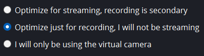
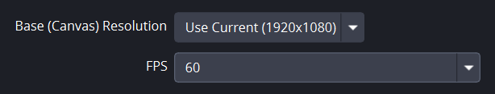
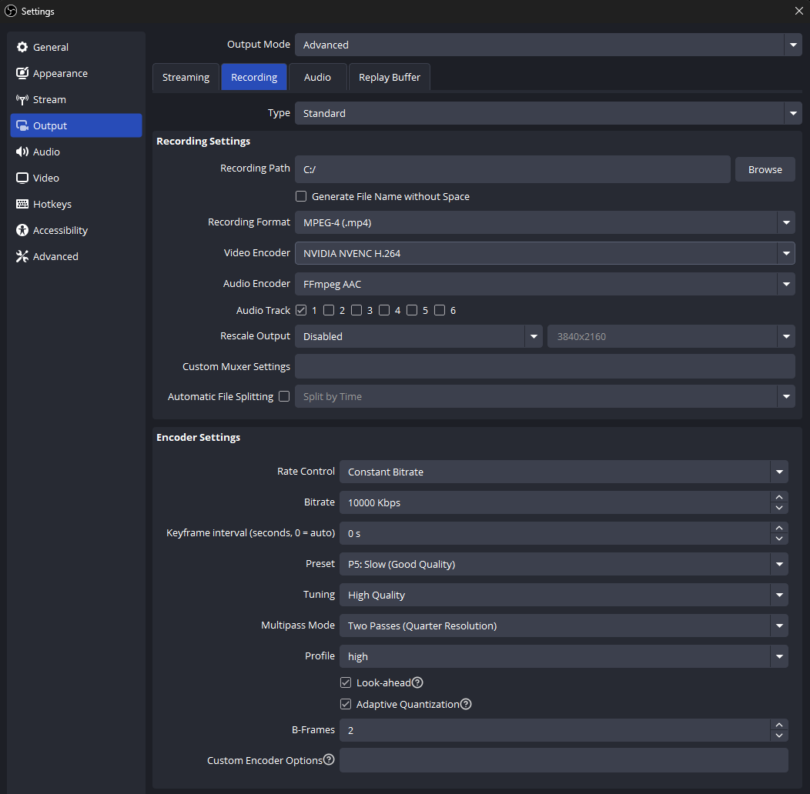
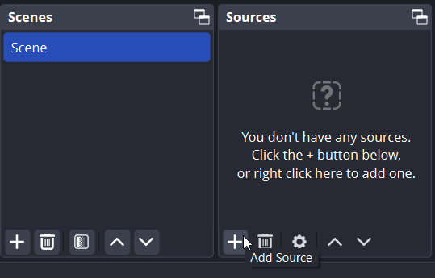
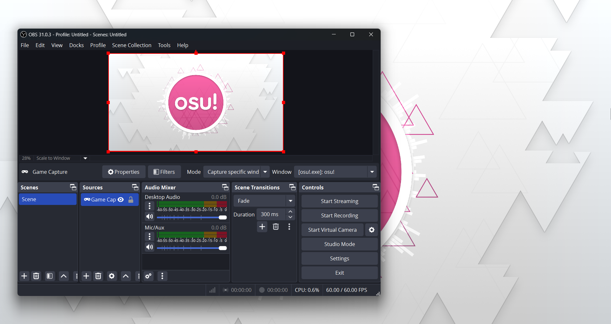
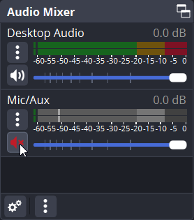

# วิธีบันทึกวิดีโอเกม osu! (How to record videos of osu!)

*ดูเพิ่มเติมที่: [การถ่ายทอดสด osu! (Livestreaming osu!)](/wiki/Guides/Livestreaming_osu!)*

แม้ว่าจะมีวิธีนับไม่ถ้วนในการ **บันทึกวิดีโอเกม osu!** แต่คู่มือนี้จะครอบคลุมหนึ่งในตัวเลือกที่ง่ายที่สุดโดยใช้ [OBS Studio](https://obsproject.com/)

## การตั้งค่า (Settings)

### ตัวช่วยกำหนดค่าอัตโนมัติ (Auto-configuration wizard)

เมื่อคุณเปิดใช้งาน OBS Studio เป็นครั้งแรก ตัวช่วยกำหนดค่าอัตโนมัติจะเปิดขึ้นมา

ในหน้าจอ `Usage Information` ให้เลือก `Optimize for recording, streaming is secondary` (ปรับแต่งเพื่อการบันทึก การสตรีมเป็นเรื่องรอง) แล้วคลิก `Next`

ในหน้าจอ `Video Settings` ให้ตั้งค่า `Base (Canvas) Resolution` เป็นความละเอียดดั้งเดิมของจอภาพของคุณ และตั้งค่า `FPS` เป็น `60` คุณสามารถเลือกใช้ `Either 60 or 30, but prefer 60 when possible` (60 หรือ 30 ก็ได้ แต่เลือก 60 หากเป็นไปได้) ได้เช่นกัน แต่หากคอมพิวเตอร์ของคุณมีปัญหาในการรักษาเฟรมเรตที่ 60 FPS คุณก็น่าจะมีปัญหาในการบันทึกวิดีโอ osu! ที่มีคุณภาพสูงด้วยเช่นกัน

ในหน้าจอ `Final Results` โปรแกรม OBS Studio จะแสดงรายการการตั้งค่าที่เลือกให้โดยอัตโนมัติโดยอิงจากสเปกคอมพิวเตอร์ของคุณ ให้คลิก `Apply Settings` เพื่อดำเนินการต่อ

### การตั้งค่าเพิ่มเติม (Additional settings)

โดยค่าเริ่มต้น OBS Studio จะส่งออกไฟล์เป็นนามสกุล `.mkv` แม้ว่าสิ่งนี้จะเหมาะอย่างยิ่งในกรณีที่ OBS เกิดค้างกะทันหันหรือคุณใช้ช่องสัญญาณเสียงแยกกัน แต่โปรแกรมตัดต่อวิดีโอหลายโปรแกรมไม่รองรับไฟล์ `.mkv` ดังนั้นจึงแนะนำให้เปลี่ยนรูปแบบการส่งออกเป็น `.mp4`

ในส่วน `Settings` ให้ไปที่แถบ `Output` ทางด้านซ้าย เปลี่ยน `Output Mode` จาก `Simple` เป็น `Advanced` จากนั้นคลิกแถบ `Recording` ด้านบน จากที่นี่ ให้เปลี่ยน `Recording Format` จาก `Matroska Video (.mkv)` เป็น `MPEG-4 (.mp4)`

การบันทึกหน้าจอคือความสมดุลระหว่างประสิทธิภาพและคุณภาพของผลลัพธ์ แม้ว่าสิ่งนี้จะขึ้นอยู่กับฮาร์ดแวร์ของคุณ แต่ด้านล่างนี้คือบางสิ่งที่คุณควรพิจารณา:

- `Video Encoder` มีผลกระทบอย่างมากต่อประสิทธิภาพและคุณภาพของผลลัพธ์ ให้ลองทดสอบดูว่าตัวเลือกไหนทำงานได้ดีที่สุดสำหรับเครื่องของคุณ
- `Bitrate` เทียบได้กับคุณภาพของการบันทึก การตั้งค่าตัวเลขนี้ให้สูงขึ้นจะทำให้คุณภาพผลลัพธ์สูงขึ้น แต่ก็จะเพิ่มภาระการทำงานของอุปกรณ์คุณด้วยเช่นกัน
- หากการตั้งค่าการบันทึกของคุณหนักเกินกว่าที่คอมพิวเตอร์จะรับไหว คำเตือนจะแสดงขึ้นที่มุมซ้ายล่างของ OBS Studio ในกรณีนี้ คุณก็น่าจะเห็นอาการแลค (lag) ระหว่างการเล่นวิดีโอด้วย

## การบันทึก (Recording)

บนหน้าจอหลักของ OBS Studio คุณจะเห็นกล่อง `Scenes` และกล่อง `Sources` ทุกซีน (Scene) สามารถประกอบขึ้นจากแหล่งที่มา (Sources) ได้หลายอย่าง แต่สำหรับบทเรียนนี้ จะมีการเพิ่มเพียงแหล่งที่มาเดียวเท่านั้น นั่นคือหน้าต่างเกม osu! ของคุณ

ซีนที่ว่างเปล่าจะถูกสร้างขึ้นโดยค่าเริ่มต้น ในการเพิ่มข้อมูลลงในซีน ให้คลิกไอคอน `+` ในส่วน `Sources` จากนั้นเลือก `Game Capture` คุณสามารถเลือกใช้ `Display Capture` ได้เช่นกัน แต่นั่นอาจทำให้เกิดปัญหาความหน่วง (Latency) ดังนั้นจึงไม่แนะนำ

ในหน้าต่างป๊อปอัป `Create/Select Source` ให้เลือก `Create new` และคลิก `OK` ในหน้าจอถัดไปที่ชื่อว่า `Properties for 'Game Capture'`:

- หากคุณรันเกม osu! แบบเต็มหน้าจอ (fullscreen) ให้ตั้งค่า `Mode` เป็น `Capture any fullscreen window`
- หากคุณรันเกม osu! แบบไร้ขอบ (borderless) หรือแบบหน้าต่าง (windowed) ให้เปลี่ยน `Mode` เป็น `Capture specific window` จากนั้นเปิดเกมและเลือก `[osu!.exe]: osu!` ในเมนูแบบเลื่อนลงของ `Window`

หากคุณเห็นกล่องสีดำแทนที่จะเป็นหน้าเกม osu! ในหน้าต่างแสดงตัวอย่าง ให้คลิกขวาที่แหล่งที่มา `Game Capture` และพยายามปรับการตั้งค่าหน้าต่างใหม่

หากเป้าหมายของคุณคือการบันทึกเฉพาะเกมเพลย์ของ osu! คุณอาจต้องการปิดเสียงในส่วน `Mic/Aux` ของ `Audio Mixer` โดยการคลิกไอคอนรูปเสียง

การตั้งค่าเริ่มต้นอื่นๆ ของ OBS Studio นั้นเพียงพอสำหรับการบันทึกเกมเพลย์ของ osu! แล้ว ดังนั้นเมื่อทำตามขั้นตอนเหล่านี้เสร็จสิ้น OBS Studio ก็ควรจะพร้อมใช้งานได้ทันที!
