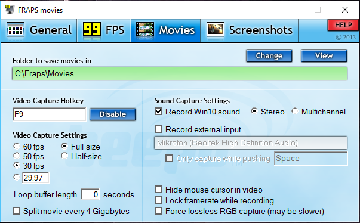
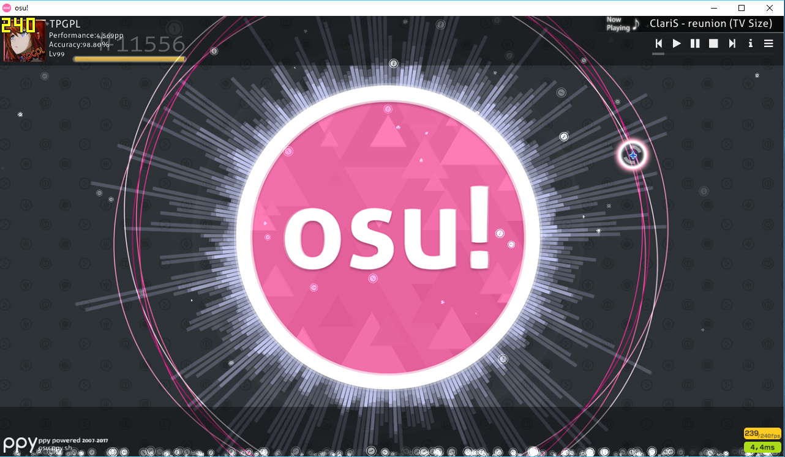
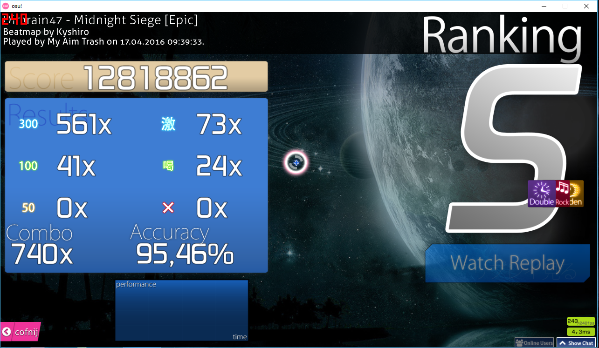
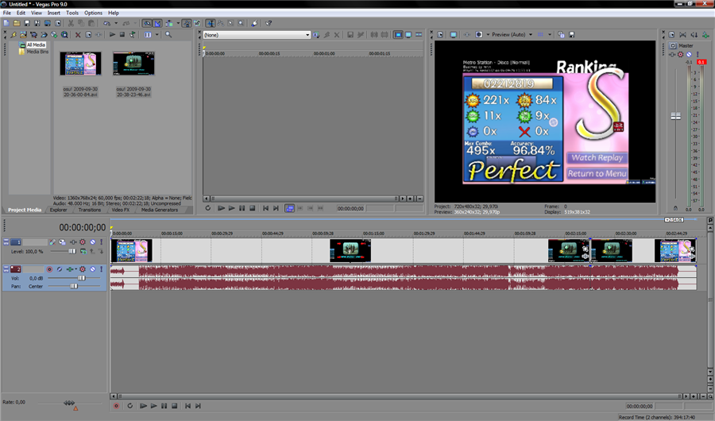
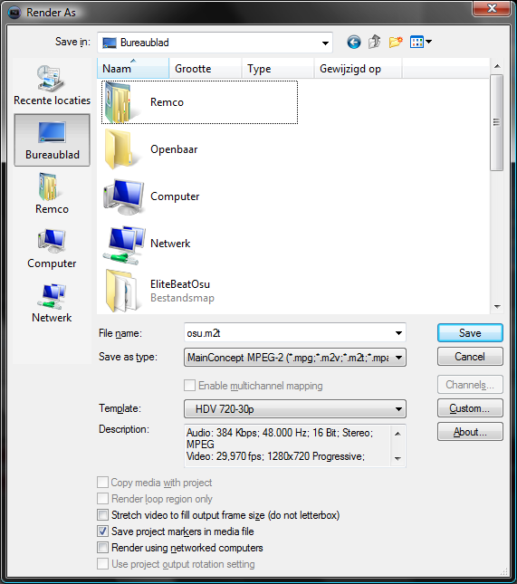
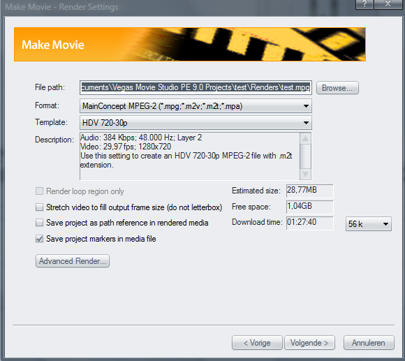

# 如何录制 osu! 的视频

[想要用 Virtualdub 替代 Sony Vegas 吗？点击这里！](https://osu.ppy.sh/community/forums/posts/252802)

想要在 YouTube 上发布关于 osu! 的视频，但却不知道该怎么做？这个帖子会解释如何做到这一点。**请注意，有很多方法可以做到，这只是其中的一种。**[在这里查看这个教程的最终效果（用 HD 和全屏观看！）](https://youtube.com/watch?v=JRGhQh69geI)。

## 必要条件

- 录制软件
  - [OBS](https://obsproject.com/)
  - [Fraps](https://fraps.com/)
  - [Action!](https://actionrecorder.com/)
  - [Bandicam](https://www.bandicam.com/)
- 编辑/渲染软件（不要使用 Windows Moviemaker，它会严重降低视频画质！ ）
  - [Sony Vegas](https://www.vegascreativesoftware.com/us/vegas-pro/)
  - [Adobe Premier](https://www.adobe.com/products/premiere.html)
  - [AVS Video Editor](https://www.avs4you.com/avs-video-editor.aspx)
  - [DaVinci Resolve](https://www.blackmagicdesign.com/products/davinciresolve)

### 配置 Fraps

打开 Fraps，让我们来调整一下设置。

请确保：

- 视频录制快捷键不会与其它应用冲突；
- 如果输出的视频存在跳帧，请将帧率设置为 30。否则，使用 60 FPS；
- 如果输出视频帧率低，那么可能录制了大小减半（Half-size）的视频。这种视频的清晰度只有原来的一半。（你可以在录制时将 osu! 运行清晰度调低）；
- 确保你的硬盘有足够的空间。如果没有，那么当存储空间不足时，视频录制会提前结束；
- “不录制光标”已经勾选
- 确保录制声音！没有什么比后期添加音乐的 osu! 视频更糟了。

## 录制游戏

当 Fraps 运行时，打开 osu!。如果一切正常（并且你没有关闭这个功能），那么你会在界面边角看到一个黄色的帧率指示器。

现在，打开你想要录制的内容。例如：你取得高分的回放！当你想要开始录制时，按下视频录制快捷键。帧率指示器会变红，并且帧率可能下降。现在录制已经启动。在一分钟内，观察帧率是否大幅变化。如果大幅改变，尝试一下前面的配置方法。

再次按下视频录制快捷键来停止录制。

## 编辑你的视频输出

将视频拖放到 Vegas 的时间线。如果有多个文件，Vegas 会将它们自动添加到前一部分的后面。

现在你可以做一些可选的剪辑。

## 渲染视频

既然剪辑已经完成，现在打开“文件”（'File'）菜单，然后点击“渲染为”（'Render As'）。使用下面的设置（这取决于你的 Vegas 版本）：

点击保存，然后你的视频就会在几分钟内生成。现在就可以上传至 YouTube 了！请注意，在 YouTube 上出现高清晰度的视频前，可能需要等待几分钟。请耐心等待！

**现在，去制作视频并宣传 osu! 吧。** 本教程由 [Remco32](https://osu.ppy.sh/users/9199) 撰写。原文[链接](https://osu.ppy.sh/community/forums/topics/18112)
