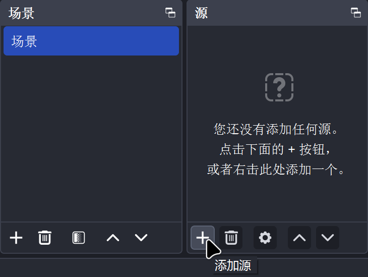

# 如何录制 osu! 的视频

*另见：[直播 osu!](/wiki/Guides/Livestreaming_osu!)*

**录制 osu! 视频**的方式不计其数，本文将讲述其中一种最简单的方法，该方法使用 [OBS Studio](https://obsproject.com/) 进行录制。

## 配置

### 自动配置向导

首次启动 OBS Studio 时，会显示自动配置向导。

在`使用场景`页面，选择`仅优化录制，将不会优化直播`，然后点击`下一步`。

在`视频设置`界面，将`基础（画布）分辨率`设置为显示器的原生分辨率，并将 `FPS` 设置为 `60`。你也可以选择 `60 或 30 均可，优先选择 60`，但如果电脑很难将录制帧率保持在 60 FPS，则也不太可能获得高质量的 osu! 录制视频。

在`最终结果`界面，OBS Studio 会结合你的电脑配置，列出自动选择的配置。点击`应用设置`继续。

### 附加设置

默认情况下，OBS Studio 会输出 `.mkv` 文件。这种视频格式能够避免 OBS 意外崩溃（从而丢失视频），并允许分开录制多条音频轨道。但许多视频编辑器无法处理它，因此推荐将输出格式切换为 `.mp4`。

在`设置`中，选择左侧的`输出`标签页，将`输出模式`从`简单`改成`高级`，然后点击顶部的`录制`标签页，将`录像格式`从 `Matroska 视频 (.mkv)` 改成 `MPEG-4 (.mp4)`。

屏幕录制需要达成性能与输出质量间的平衡。这取决于硬件配置，但也要考虑下列的因素：

- `视频编码器`对性能与输出质量影响很大。可以尝试选择不同的编码器，找出最适合你的配置使用的。
- `码率`基本等同于录制质量。增大该数值时，输出质量会提升，但同时也会增加设备的性能负载。
- 如果你的录制配置超出了电脑的承受能力，OBS Studio 的左下角会显示警告。在这种情况下，视频回放时很有可能会出现卡顿和延迟。

## 录制

在 OBS Studio 的主界面有`场景`与`源`两个框。一个场景可以由多个源组成，但出于本教程考虑，只需要添加用于显示你的 osu! 窗口的一个源。

默认情况下会创建一个空场景。要向场景添加源，可点击`源`部分的 `+` 图标，然后选择`游戏采集`。你也可以使用`显示器采集`，但会导致延迟问题，因此不推荐这么做。

在`创建或选择源`对话框中，选择`新建`并点击`确定`。接下来会弹出名为`设置 "游戏采集"`的窗口:

- 全屏运行 osu! 时，将`模式`更改为`采集全屏应用程序`.
- 在无边框或窗口模式下运行 osu! 时将`模式`更改为`采集特定窗口`，然后启动游戏，在`窗口`下拉框中找到 `[osu!.exe]: osu!`。

如果预览窗口全黑，osu! 并没有出现，则需右键点击`游戏采集`源、尝试调整窗口设置。

如果你只要录制 osu! 游戏本身，则可能需要在`混音器`中，点击`麦克风/Aux` 一栏的喇叭图标，将麦克风输入静音。

OBS Studio 中的其他默认设置很适合录制 osu! 游戏，上面的步骤都完成后，OBS Studio 就该准备就绪了！
