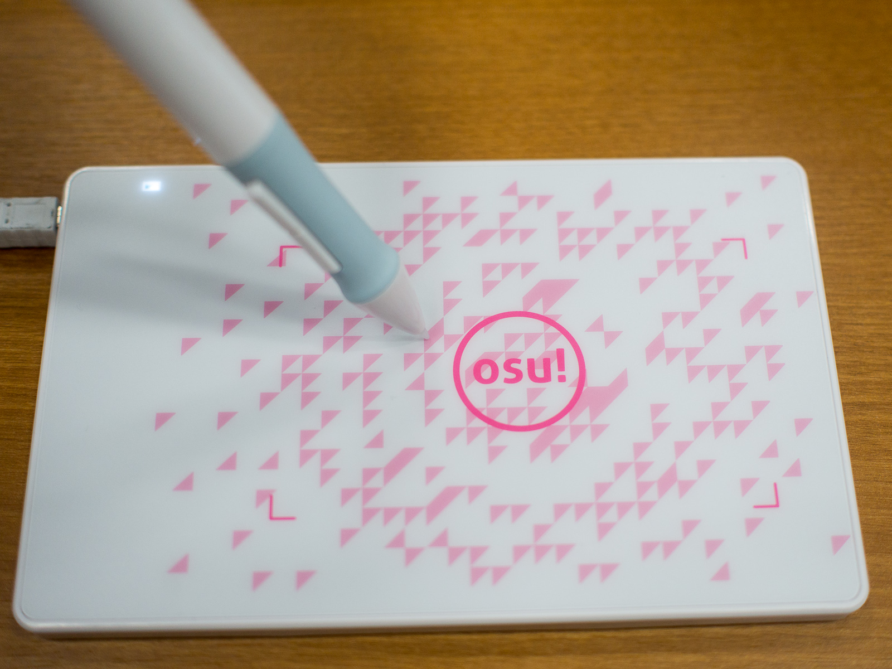
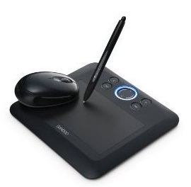

# 数位板购买指南

如果你在玩 osu! 并且与其它玩家交流，你一定听说过那些叫做数位板（tablets）的东西，以及它们对于游戏玩法的影响。数位板与数位笔共同使用，并连接到你的电脑。当你的笔在平板上移动，鼠标指针也随之移动，而落笔相当于鼠标点击。你可以把数位板之于 osu! 的作用，看作街机摇杆之于格斗游戏的作用。它不是必须的，但是一些玩家倾向于使用它。

## 为何选择数位板？

数位板最初被用来给数字艺术提供更加精确的控制。用户可以像使用铅笔或画笔一样，在电脑上作画。与鼠标相比，数位板最大的不同之处在于它的**绝对坐标追踪**，这意味着数位板上的每一个点都对应屏幕上的特定位置。如果你将笔抬起，离开感应区间，然后让它落到数位板的另一处，那么光标就会“跳”到那个位置。这与鼠标相反，它依赖于**相对坐标追踪**。

对 osu! 来说，这种绝对坐标追踪就是数位板的最大卖点。其它的参数（例如压感等级，倾斜灵敏度，画笔旋转等）对于 osu! 游戏玩法并没有效果。这些功能是为数字艺术而生的，比如数位板可以通过感知压力，来作出颜色更深的笔迹。唯一能影响 osu! 游玩的是每英寸行数（LPI，即 lines per inch）。

LPI 就是数位板表面的“分辨率”，即能使数位板检测到的，笔移动的最小距离。如果一个数位板有 100 LPI，那么你最少需要移动笔 1/100 英寸才能触发移动。但是，即使是最低的 LPI 也应该比你正在使用的游玩显示器高得多。因此，LPI 的高低对于游玩的影响并不显著。

简而言之，数位板是能够让你以另一种方式游玩的可选设备。它们最初是用于数字艺术的，但却被偶然发现对于玩 osu! 很有帮助。大部分规格对于 osu! 没什么影响。

## 数位板供应商

### osu! 商店（osu!store）

*注意: **osu! 商店不再售卖 osu! 数位板。*** 在这个时候，[peppy 发推](https://twitter.com/ppy/status/846190638873767936)声明如果你想要试试这种输入方式，你应该选择其它替代品。

为了让玩家们以低价试试这种输入方式，osu! 商店曾经以 osu! 数位板为特色。它由 Huion 制造，由 flyte 设计。在 2013 年的第一版外观为白色，有一支带笔尖的笔和三个替换笔尖，但需要一节五号电池（AA battery）为笔供电（出厂包含，但会为笔增加重量）。在 2016 年的第二版外观为黑色，有一支带笔尖的笔和三个替换笔芯，但笔需要通过 USB 充电（出厂包含充电线）。

### Huion

Huion 是 osu! 数位板的供应商。他们以比 Wacom 价格低很多而为人们所知，但是一部分用户认为他们的数位板更轻薄，触感更加像纸（一部分人认为，Wacom 的数位板相比于它，更像在玻璃上书写）。他们的数位笔需要电池或者需要充电，并且他们的笔尖比 Wacom 的笔尖需要更频繁地更换。除了这些，Wacom 和 Huion 的数位板确实没有什么显著的区别。

HUION H430P (4096) 与 osu! 数位板相似（实际上，它的目标用户就是 osu! 玩家）。

### Wacom

Wacom 是数位板行业的标杆。他们制作的数位板由于质量和可靠性，被艺术家们广泛采用。一些人会推荐 Wacom 数位板，是因为其高质量的产品，以及作为数位板行业领头羊的名声。他们有三个主要产品线：

- Cintiq - “直接在屏幕上绘画”的数位板，它们用于高端专业的领域，并且价格较高。
- Intuos - 专业的数位板产品线，它们比 Bamboo 系列产品拥有更多的功能，但缺少屏幕。
- Bamboo - 普通消费级别的数位板，拥有兴趣使然开始绘画的所有功能。

Wacom 还有其它产品线，例如 Graphire 或 Volito 数位板，但它们已经不再沿用，而被上述产品线所取代。

对于 osu!，你应该不太应该需要 Cintiq 或 Intuos，这是因为这两条产品线迎合的是图形设计与插画领域的专业人士，并且相比 Bamboo 花费更多。它们有更高的压感灵敏度，更完善的图形软件，以及例如笔旋转和倾斜灵敏度的高级功能。这些对于 osu! 没有任何用处，所以仅当你计划在 osu! 之外，用你的数位板做一些图形设计工作时，才需要购买它们。

在写作这篇文章的时候，Bamboo 有三种版本，都以一种困惑的方式共用 Bamboo 命名（Intuos 产品线由数字所区分，在撰写本文时最新产品是 Intuos5）。一些用户会推荐购买第二代或第三代的 Bamboo，因为第一代的附加按键在数位板顶部而非边上，导致打起来很难受。

请不要选择 Bamboo Touch 系列的数位板，因为它们并没有用笔输入的功能，它们只是为电脑设计的多点触控触控板。坦诚地说，[苹果做的更好](https://www.apple.com/shop/product/MK2D3AM/A/magic-trackpad)。

Bamboo 产品有两种规格，通常是小和大。对于第二代，Bamboo Touch，Pen 和 Pen and Touch 是“小”的产品，而 Fun 和 Craft 是“大”的产品。对于第三代，Connect 和 Capture 是“小”的产品，而 Create 是“大”的产品。

对于 osu!，你很可能需要寻找“小”号的数位板，因为这样可以减小游玩区域，让你在游玩时不需要移动手臂。但是，选择数位板区域的大小取决于个人偏好，而如果你有数字艺术需求，最好考虑“大”的规格。这是因为在更大的数位板上作画舒适得多。

最后，CTL-480 数位板可能在二手市场（如 eBay 和 Amazon）上卖得很便宜，尽管因为不再生产而很难找到。如果你可以找到一个，且价格合理，那么它们非常值得购买（特别是当你同时是一个数字艺术家时）。除了备受 osu! 玩家青睐的 Wacom CTL-480，还有 CTL-470 系列产品（例如 470，471 和 472 型号）, 以及最新的 CTL-4100 系列，它们能够提供相同的质量，甚至比 CTL-480 更好。

对于 osu!，Intuos 和 Bamboo 产品线的区别是微不足道的，它们真正的区别在于 Intuos 产品线有比 Bamboo 更多的大小规格可选。

### 其它数位板厂家

除了 Wacom 和 Huion，市场上也有其它竞争者。他们也为艺术家甚至 osu! 玩家制造很不错的数位板。

一部分厂家是：

- Gaomon（以 Gaomon S620 数位板闻名）
- XP-Pen（以 XP-PEN G640 Rev A 数位板闻名）
- VEIKK（以 VEIKK S640 数位板闻名）

所有这些提到的数位板都有不错的质量，并且通常比 Wacom 的数位板花费更少，这使得它们成为了经济型的方案。

总之，大多数专业 osu! 玩家都推荐 Wacom 数位板。Cintiq 和 Intuos 数位板过于昂贵，并且相比于 Bamboo，在 osu! 中不会带来真正的优势。

## 推荐

这里是购买最新型号的一些链接。

- [Amazon - One by Wacom Tablet (small version) (CTL472)](https://www.amazon.com/dp/B07S1RR3FR)
- [Amazon - Wacom Bamboo Splash Pen Tablet (CTL471)](https://a.co/fCXqteP)
- [Amazon - Wacom Bamboo Capture Pen and Touch Tablet (CTH470)](https://a.co/b4GpKXt)
- [Huion - HUION H430P (4096)](https://store.huion.com/products/inspiroy-h430p)
  - [Amazon - Huion Inspiroy H430P Graphics Drawing Tablet for OSU](https://a.co/6uDGhXL)

## 结论

这些只是推荐。尽管肯定存在比 Wacom 数位板更便宜，或者比 Huion 数位板更好的其它品牌，但大多数人会说，一分价钱一分货。

## 琐事

- 论坛原文：[Tablet Purchase Guide for osu!](https://osu.ppy.sh/community/forums/topics/71895)，由 [Daru](https://osu.ppy.sh/users/32480) 撰写
