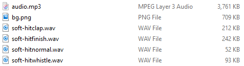
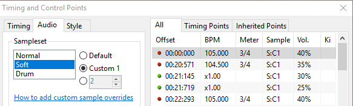
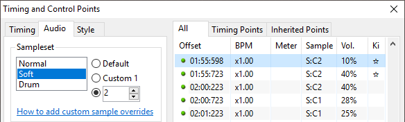

# Utilisation de hitsounds personnalisés

Dans ce guide, vous apprendrez à utiliser des [hitsounds](/wiki/Beatmapping/Hitsound) personnalisés dans vos [beatmaps](/wiki/Beatmap).

## Obtenir des hitsounds personnalisés

Afin d'utiliser des hitsounds personnalisés dans votre beatmap, vous devez d'abord en avoir ! La [bibliothèque de sons personnalisés](/wiki/Guides/Custom_hitsound_library) est une excellente ressource pour obtenir des échantillons de sons, notamment des cymbales, des tambours, des cloches, des sifflets, etc. Sinon, si vous ne trouvez pas ce que vous cherchez, vous pouvez créer vos propres échantillons !

Les hitsounds doivent être au format `.wav` ou `.ogg`, car ils n'ont pas de retard de lecture et bouclent correctement. Les fichiers sonores au format `.mp3` ont de légers retards et peuvent ne pas correspondre exactement à la musique que vous essayez de faire résonner. Cependant, ils peuvent encore être utilisés pour certains effets sonores tels que des applaudissements ou des bruits d'ambiance, pour lesquels la taille des fichiers `.wav` ou `.ogg` peut être prohibitive.

## Ajouter des hitsounds personnalisés

Une fois que vous avez les fichiers sonores souhaités, déplacez-les dans le dossier de la beatmap dans lequel vous souhaitez les utiliser. Si vous ne savez pas où se trouve ce dossier, suivez ces instructions :

1. Ouvrez osu!.
2. Sélectionnez l'option `Éditer`.
3. Naviguez jusqu'à votre beatmap et ouvrez-la.
4. Cliquez sur `Fichier` (l'option la plus à gauche du menu de navigation).
5. Cliquez sur `Ouvrir le dossier Songs`.
6. Collez vos fichiers ici.

Si vous exécutez osu! sur macOS, vous devrez peut-être adopter une approche légèrement différente :

1. Faites un clic droit sur l'icône de l'application osu! et sélectionnez `Show Package Contents`.
2. Localisez le dossier de votre beatmap dans `drive_c -> osu ! -> Songs` (trier par `Dernière modification` pourrait être utile).
3. Collez vos fichiers ici.

Une fois que les fichiers sonores sont placés dans le dossier de la beatmap, ils doivent être nommés de manière appropriée afin qu'osu! les reconnaisse comme des hitsounds.

Il existe trois catégories de sons de base dans osu!, appelées *jeu d'échantillons* : Normal (N), Soft (S), et Drum (D). Chaque jeu d'échantillons peut être subdivisé en différents sons. Les plus courants sont : "hitnormal", "hitclap", "hitwhistle", et "hitfinish". Il existe également des sons plus spécialisés, comme ceux qui sont joués pendant un slider ("sliderlide", "slidertick") ou un spinner ("spinnerspin").

*Pour une liste complète des hitsounds qui peuvent être modifiés, veuillez vous référer à l'[entrée de skinning sur les hitsounds](/wiki/Skinning/Sounds#hitsounds).*

Les fichiers hitsound sont nommés pour refléter ces deux propriétés du jeu d'échantillons et du type de son comme suit :

`<sampleset>-<sound>.wav`

Où `<sampleset>` est soit "normal", "soft" ou "drum", et `<sound>` est un des ajouts mentionnés ci-dessus (par exemple "hitclap").

Dans l'image ci-dessus, le premier son listé est nommé `soft-hitclap.wav`, et remplacera le hitsound par défaut qui joue lorsqu'un [objet](/wiki/Gameplay/Hit_object) avec le jeu d'échantillon Soft et l'ajout "hitclap" est frappée avec succès. Notez que cela ne sera joué que sur le *jeu d'échantillon sélectionné*. Si votre beatmap utilise d'autres jeu d'échantillons, ils nécessiteront des fichiers hitsound supplémentaires (même si vous avez l'intention d'utiliser exactement le même échantillon sonore), par exemple en ajoutant un `normal-hitclap.wav` tout en utilisant le jeu d'échantillon Normal.

## Appliquer des hitsounds

Pour qu'osu! joue correctement vos hitsounds personnalisés, assurez-vous de cocher la deuxième option, "Custom 1", comme dans l'image ci-dessus. Les jeu d'échantillons personnalisés par défaut sont abrégés en `<SS>:C1`, où `<SS>` est la première lettre du groupe de jeu d'échantillons, soit N (Normal), S (Soft), ou D (Drum).

Notez que vous n'avez pas besoin d'ajouter un hitsound pour chaque son dans un jeu d'échantillons. Vous remarquerez dans la première image qu'aucune instance de `soft-slidertick.wav` n'est présente, et dans ce cas, osu! continuera à utiliser le son par défaut pour toutes les frappes réussies slider tick régulier lorsque le jeu d'échantillons Soft est utilisé.

## Travailler avec plusieurs sets de hitsounds

Parfois, une musique peut avoir plusieurs sections avec des styles musicaux très différents, et un groupe de hitsounds ne conviendra pas à toutes ces sections. Dans ce cas, il est souvent utile d'utiliser un hitsound (ou un groupe de hitsounds) entièrement différent. Ceci peut être réalisé en ajoutant un numéro à la fin du nom du fichier hitsound comme suit :

`<sampleset>-<sound><#>.wav`

Où `<#>` peut être un nombre quelconque de votre choix. L'éditeur d'osu! supporte nativement des valeurs entre 2 et 100, mais des valeurs supérieures peuvent être obtenues en éditant le fichier `.osu` si nécessaire. Notez que le premier groupe de hitsounds n'a pas besoin d'être étiqueté avec le nombre "1" même si plusieurs groupes de hitsounds sont utilisés. Par conséquent, `soft-hitclap1.wav` ne fonctionnera pas, et `soft-hitclap.wav` sera utilisé à la place.

Afin de s'assurer que des hitsounds ou des groupes de hitsounds de numéros différents soient joués correctement, vous devrez ajouter un point de timing hérité (ligne verte) et changer le jeu d'échantillon de "Custom 1" à l'option immédiatement inférieure, comme indiqué dans l'image ci-dessous. Ici, vous pouvez entrer le numéro du groupe de hitsound que vous voulez utiliser.

Lorsque le jeu d'échantillons d'un point de synchronisation hérité est réglé sur `S:C2` comme dans l'image ci-dessus, tous les hitsounds par défaut et les ajouts de hitsounds seront remplacés par des hitsounds personnalisés nommés de manière appropriée, tels que `soft-hitclap2.wav` lorsqu'ils sont présents. Ceux-ci continueront à prendre effet jusqu'à ce qu'un point de timing hérité avec un sampleset différent soit rencontré - dans cette image à `02:00:723`, quand le sampleset repasse à `S:C1`.

## Sources externes

- [réponse du forum *how to add custom hitsound?*](https://osu.ppy.sh/community/forums/posts/3215699) par [neonat](https://osu.ppy.sh/users/1561995)
