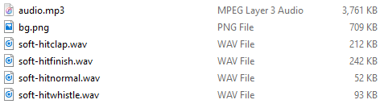
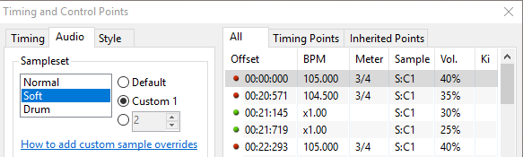
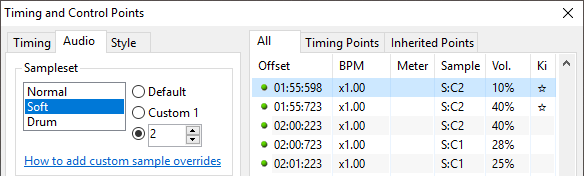

# การใช้งาน Custom hitsound (Using custom hitsounds)

ในคู่มือนี้ คุณจะได้เรียนรู้วิธีการใช้ [hitsounds](/wiki/Beatmapping/Hitsound) แบบกำหนดเองใน [บีทแมพ (beatmap)](/wiki/Beatmap) ของคุณ

## การหา Custom hitsound (Getting custom hitsounds)

ในการที่จะใช้ custom hitsounds ในบีทแมพของคุณ อันดับแรกคุณจำเป็นต้องมีพวกมันก่อน! [คลังข้อมูล custom hitsound](/wiki/Guides/Custom_hitsound_library) เป็นแหล่งข้อมูลที่ยอดเยี่ยมสำหรับการหาตัวอย่างเสียง รวมถึงเสียงฉาบ, กลอง, กระดิ่ง, นกหวีด และอื่นๆ อีกทางเลือกหนึ่ง หากคุณไม่พบสิ่งที่กำลังมองหา คุณสามารถสร้างตัวอย่างเสียงของคุณเองได้!

Hitsounds ควรอยู่ในรูปแบบไฟล์ `.wav` หรือ `.ogg` เนื่องจากไฟล์เหล่านี้ไม่มีความล่าช้าในการเล่นและสามารถวนลูปได้อย่างถูกต้อง ไฟล์เสียงในรูปแบบ `.mp3` จะมีความล่าช้าเล็กน้อยและอาจจะไม่ตรงกับเพลงที่คุณพยายามจะใส่ hitsound อย่างแม่นยำ อย่างไรก็ตาม พวกมันอาจยังคงใช้งานได้สำหรับเอฟเฟกต์เสียงบางอย่าง เช่น เสียงปรบมือหรือเสียงบรรยากาศ ซึ่งขนาดของไฟล์ `.wav` หรือ `.ogg` อาจจะใหญ่เกินไปจนเป็นอุปสรรค

## การเพิ่ม Custom hitsound (Adding custom hitsounds)

เมื่อคุณได้ไฟล์เสียงที่ต้องการแล้ว ให้ย้ายพวกมันเข้าไปในโฟลเดอร์ของบีทแมพที่คุณต้องการจะใช้งาน หากคุณไม่ทราบว่าโฟลเดอร์นั้นตั้งอยู่ที่ไหน ให้ทำตามคำแนะนำเหล่านี้:

1. เปิด osu!
2. เลือกตัวเลือก `Edit`
3. ไปยังบีทแมพของคุณและเปิดมันขึ้นมา
4. คลิก `File` (ตัวเลือกซ้ายสุดของเมนูนำทาง)
5. คลิก `Open Song Folder`
6. วางไฟล์ของคุณที่นี่

หากคุณใช้งาน osu! บน macOS คุณอาจต้องใช้วิธีที่แตกต่างออกไปเล็กน้อย:

1. คลิกขวาที่ไอคอนแอปพลิเคชัน osu! แล้วเลือก `Show Package Contents`
2. ค้นหาโฟลเดอร์บีทแมพของคุณใน `drive_c -> osu! -> Songs` (การเรียงลำดับตาม `Last Modified` อาจจะช่วยได้)
3. วางไฟล์ของคุณที่นี่

เมื่อไฟล์เสียงถูกวางไว้ในโฟลเดอร์ของบีทแมพแล้ว พวกมันจะต้องถูกตั้งชื่ออย่างเหมาะสมเพื่อให้ osu! จดจำพวกมันว่าเป็น hitsounds ได้

หมวดหมู่พื้นฐานสามประเภทของ hitsounds ที่ถูกอ้างถึงในฐานะ *samplesets* มีอยู่ใน osu! ได้แก่: Normal (N), Soft (S) และ Drum (D) แต่ละ sampleset สามารถถูกแบ่งย่อยลงไปเป็นเสียงต่างๆ ได้อีก เสียงที่พบบ่อยที่สุดคือ: "hitnormal", "hitclap", "hitwhistle" และ "hitfinish" นอกจากนี้ยังมีเสียงที่เฉพาะเจาะจงมากขึ้น เช่น เสียงที่เล่นระหว่าง slider ("sliderslide", "slidertick") หรือ spinner ("spinnerspin")

*สำหรับรายการ hitsounds ทั้งหมดที่สามารถแก้ไขได้ โปรดอ้างอิงจาก [หัวข้อสกินเกี่ยวกับ hitsounds](/wiki/Skinning/Sounds#hitsounds)*

ไฟล์ Hitsound จะถูกตั้งชื่อเพื่อสะท้อนถึงคุณสมบัติสองประการนี้ คือ sampleset และประเภทของเสียง ดังนี้:

`<sampleset>-<sound>.wav`

โดยที่ `<sampleset>` คือ "normal", "soft" หรือ "drum" และ `<sound>` คือหนึ่งในส่วนเสริมที่กล่าวถึงข้างต้น (เช่น "hitclap")

ในภาพที่แสดงด้านบน เสียงแรกที่อยู่ในรายการมีชื่อว่า `soft-hitclap.wav` และมันจะไปแทนที่ hitsound เริ่มต้นที่จะเล่นเมื่อ [วัตถุ (hit object)](/wiki/Gameplay/Hit_object) ที่ใช้ชุดเสียง Soft และมีส่วนเสริม "hitclap" ถูกกดได้สำเร็จ โปรดทราบว่าสิ่งนี้จะเล่นเฉพาะใน *sampleset ที่เลือกไว้* เท่านั้น หากบีทแมพของคุณใช้ sampleset อื่นๆ พวกมันจะต้องการไฟล์ hitsound เพิ่มเติม (แม้ว่าคุณจะตั้งใจใช้ตัวอย่างเสียงเดียวกันเป๊ะๆ ก็ตาม) เช่น การเพิ่ม `normal-hitclap.wav` ในขณะที่ใช้ชุดเสียง Normal

## การประยุกต์ใช้ Custom hitsound (Applying custom hitsounds)

เพื่อให้ osu! เล่น custom hitsounds ของคุณได้อย่างถูกต้อง ตรวจสอบให้แน่ใจว่าได้เลือกตัวเลือกที่สอง "Custom 1" ดังในภาพที่แสดงด้านบน ชุดเสียง custom เริ่มต้นจะถูกย่อเป็น `<SS>:C1` โดยที่ `<SS>` คือตัวอักษรตัวแรกของกลุ่ม sampleset ไม่ว่าจะเป็น N (Normal), S (Soft) หรือ D (Drum)

โปรดทราบว่าคุณไม่จำเป็นต้องเพิ่ม custom hitsound สำหรับทุกๆ เสียงในหนึ่ง sampleset คุณจะสังเกตเห็นในภาพแรกว่าไม่มีไฟล์ `soft-slidertick.wav` ปรากฏอยู่ และในกรณีนี้ osu! จะยังคงใช้เสียงเริ่มต้นสำหรับการกด slider tick ปกติที่สำเร็จทั้งหมดเมื่อมีการใช้ชุดเสียง Soft

## การทำงานกับ Custom hitsound หลายชุด (Working with multiple custom hitsound sets)

บางครั้ง เพลงอาจจะมีหลายส่วนที่มีสไตล์ดนตรีที่แตกต่างกันมาก และกลุ่มของ hitsound เพียงกลุ่มเดียวจะไม่สามารถเข้ากับทุกส่วนได้ ในกรณีนี้ มักจะเป็นประโยชน์หากจะใช้งาน hitsound อื่น (หรือกลุ่มของ hitsounds) แยกต่างหากไปเลย สิ่งนี้สามารถทำได้โดยการเพิ่มตัวเลขลงไปที่ส่วนท้ายของชื่อไฟล์ hitsound ดังนี้:

`<sampleset>-<sound><#>.wav`

โดยที่ `<#>` สามารถเป็นตัวเลขใดก็ได้ตามที่คุณเลือก ตัว editor ของ osu! รองรับค่าระหว่าง 2 ถึง 100 โดยกำเนิด แต่ค่าที่มากกว่านั้นสามารถทำได้ผ่านการแก้ไขไฟล์ `.osu` หากจำเป็น โปรดทราบว่า hitsound กลุ่มแรกไม่จำเป็นต้องถูกติดป้ายกำกับด้วยหมายเลข "1" แม้ว่าจะมีการใช้กลุ่ม hitsound หลายกลุ่มก็ตาม ดังนั้น `soft-hitclap1.wav` จะใช้งานไม่ได้ และจะมีการใช้ `soft-hitclap.wav` แทน

เพื่อให้แน่ใจว่า hitsound หรือกลุ่ม hitsound ที่มีหมายเลขแตกต่างกันเล่นได้อย่างถูกต้อง คุณจะต้องเพิ่มจุด timing แบบสืบทอด (inherited timing point หรือเส้นเขียว) และเปลี่ยน sampleset จาก "Custom 1" เป็นตัวเลือกที่อยู่ถัดลงมาด้านล่างทันที ดังที่แสดงในภาพด้านล่าง ที่นี่คุณสามารถป้อนหมายเลขของกลุ่ม hitsound ที่คุณต้องการจะใช้งานได้

เมื่อ sampleset ของจุด timing แบบสืบทอดถูกตั้งค่าเป็น `S:C2` ดังในภาพด้านบน hitsounds เริ่มต้นและส่วนเสริม hitsound ทั้งหมดจะถูกแทนที่ด้วย custom hitsounds ที่ตั้งชื่อไว้อย่างเหมาะสม เช่น `soft-hitclap2.wav` ในจุดที่มีไฟล์อยู่ สิ่งเหล่านี้จะมีผลต่อไปเรื่อยๆ จนกว่าจะพบจุด timing แบบสืบทอดที่มี sampleset แตกต่างออกไป — ในภาพนี้คือที่เวลา `02:00:723` เมื่อ sampleset สลับกลับไปเป็น `S:C1`

## แหล่งข้อมูลภายนอก (External sources)

- [คำตอบในฟอรัมเรื่อง *วิธีการเพิ่ม custom hitsound?*](https://osu.ppy.sh/community/forums/posts/3215699) โดย [neonat](https://osu.ppy.sh/users/1561995)